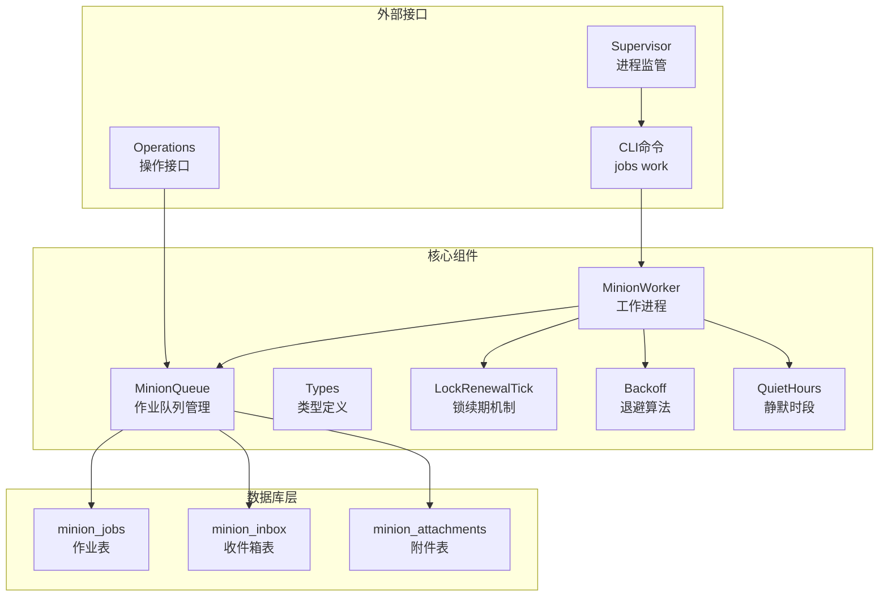
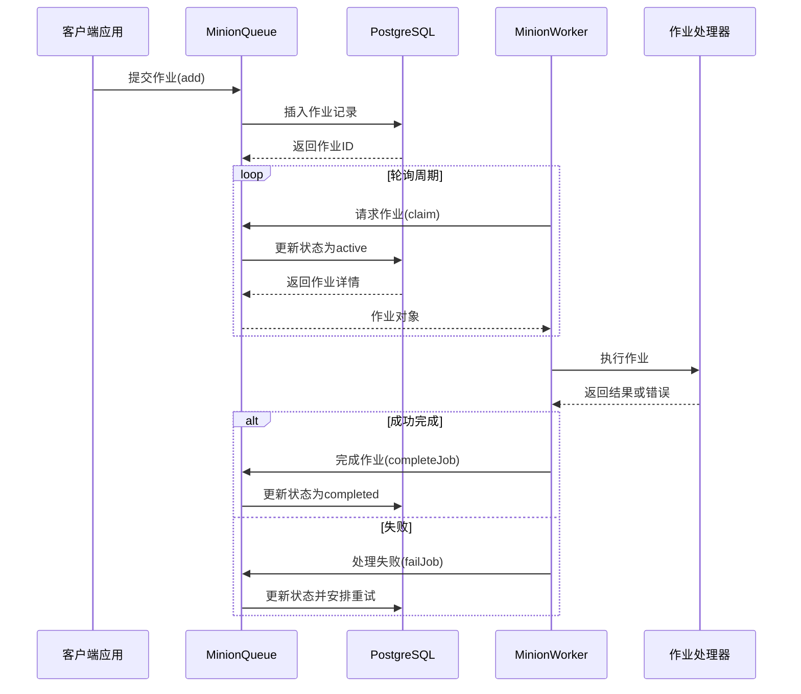
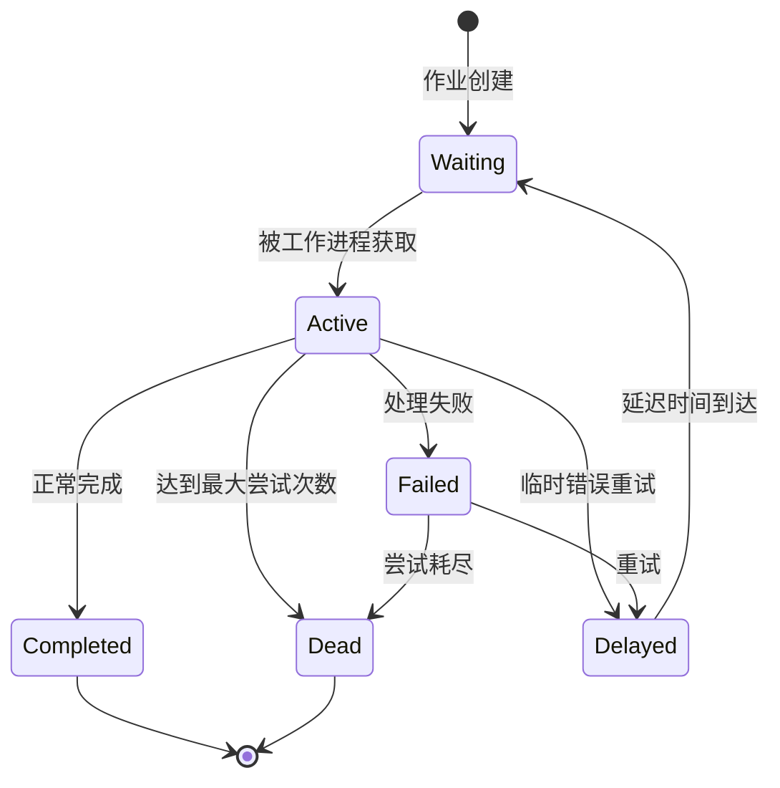
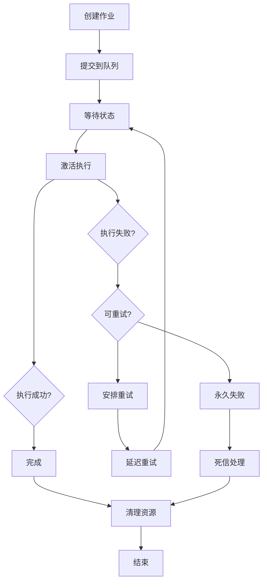
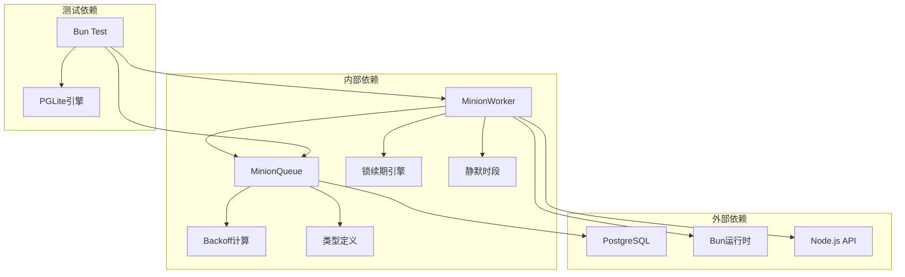

# Minions作业队列

<cite>
**本文档引用的文件**
- [queue.ts](file://src/core/minions/queue.ts)
- [worker.ts](file://src/core/minions/worker.ts)
- [types.ts](file://src/core/minions/types.ts)
- [backoff.ts](file://src/core/minions/backoff.ts)
- [lock-renewal-tick.ts](file://src/core/minions/lock-renewal-tick.ts)
- [quiet-hours.ts](file://src/core/minions/quiet-hours.ts)
- [minions.test.ts](file://test/minions.test.ts)
- [minions-lease-full-retry.test.ts](file://test/minions-lease-full-retry.test.ts)
- [minions-resilience.test.ts](file://test/e2e/minions-resilience.test.ts)
- [minions-deployment.md](file://docs/guides/minions-deployment.md)
- [operations.ts](file://src/core/operations.ts)
</cite>

## 目录
1. [简介](#简介)
2. [项目结构](#项目结构)
3. [核心组件](#核心组件)
4. [架构概览](#架构概览)
5. [详细组件分析](#详细组件分析)
6. [依赖关系分析](#依赖关系分析)
7. [性能考虑](#性能考虑)
8. [故障排除指南](#故障排除指南)
9. [结论](#结论)
10. [附录](#附录)

## 简介

GBrain Minions作业队列是一个基于PostgreSQL的高性能后台任务处理系统，灵感来源于BullMQ。该系统提供了可靠的作业调度、持久化存储、崩溃恢复和并发控制机制，专门用于处理各种后台任务，包括数据同步、嵌入生成、子代理循环等。

系统采用PostgreSQL作为唯一的数据存储，通过原生SQL实现作业状态管理和分布式锁机制，确保在高并发场景下的数据一致性和可靠性。Minions队列支持复杂的作业依赖关系、优先级管理、重试策略和超时处理，为GBrain平台的各种功能模块提供强大的后台任务支持。

## 项目结构

Minions作业队列系统主要由以下核心组件构成：

**图表来源**
- [queue.ts:1-1465](file://src/core/minions/queue.ts#L1-L1465)
- [worker.ts:1-1118](file://src/core/minions/worker.ts#L1-L1118)
- [types.ts:1-584](file://src/core/minions/types.ts#L1-L584)

**章节来源**
- [queue.ts:1-800](file://src/core/minions/queue.ts#L1-L800)
- [worker.ts:1-800](file://src/core/minions/worker.ts#L1-L800)
- [types.ts:1-394](file://src/core/minions/types.ts#L1-L394)

## 核心组件

### MinionQueue - 作业队列管理器

MinionQueue是整个系统的核心，负责作业的提交、状态管理和生命周期控制。它提供了完整的CRUD操作和复杂的状态转换逻辑。

**主要功能特性：**
- 作业提交和去重（基于idempotency_key）
- 作业状态管理（waiting、active、completed、failed、delayed、dead、cancelled、waiting-children、paused）
- 作业依赖关系管理（父子作业）
- 并发控制和背压机制
- 持久化存储和事务保证

**章节来源**
- [queue.ts:77-323](file://src/core/minions/queue.ts#L77-L323)
- [queue.ts:807-1033](file://src/core/minions/queue.ts#L807-L1033)

### MinionWorker - 工作进程

MinionWorker实现了并发作业执行，支持多线程处理和优雅的关闭机制。每个工作进程都具备自愈能力，能够处理连接中断、锁丢失等异常情况。

**核心机制：**
- 基于Promise池的并发控制
- 锁续期心跳机制
- 自动健康检查和故障检测
- 内存使用监控和保护
- 优雅关闭和强制驱逐机制

**章节来源**
- [worker.ts:151-600](file://src/core/minions/worker.ts#L151-L600)
- [worker.ts:769-1118](file://src/core/minions/worker.ts#L769-L1118)

### 类型系统 - 统一的数据模型

系统提供了完整的类型定义，确保编译时的安全性和开发体验。

**关键类型：**
- MinionJob - 作业实体定义
- MinionJobStatus - 作业状态枚举
- MinionWorkerOpts - 工作进程配置
- BackoffType - 退避策略类型
- ChildFailPolicy - 子作业失败策略

**章节来源**
- [types.ts:18-93](file://src/core/minions/types.ts#L18-L93)
- [types.ts:148-192](file://src/core/minions/types.ts#L148-L192)

## 架构概览

Minions系统采用了分层架构设计，确保了高内聚低耦合的代码组织：

**图表来源**
- [queue.ts:605-633](file://src/core/minions/queue.ts#L605-L633)
- [worker.ts:924-1116](file://src/core/minions/worker.ts#L924-L1116)

## 详细组件分析

### Durable子代理机制

Durable子代理机制是Minions系统的核心特性之一，它允许长时间运行的子代理作业在系统重启后自动恢复。

**关键实现细节：**
- 锁续期心跳机制防止作业被误判为过期
- 事务性状态转换确保数据一致性
- 支持作业超时和墙钟超时双重保护
- 自动处理作业依赖关系

**章节来源**
- [worker.ts:804-842](file://src/core/minions/worker.ts#L804-L842)
- [queue.ts:1154-1189](file://src/core/minions/queue.ts#L1154-L1189)

### 作业调度策略

系统实现了多种调度策略以适应不同的业务需求：

#### 优先级调度
- 支持数值优先级排序（数字越小优先级越高）
- 同优先级下按创建时间排序
- 队列隔离确保不同队列间的公平性

#### 背压控制
- 基于作业名称的等待队列限制
- 事务级锁确保并发安全
- 可配置的最大等待数量

#### 静默时段管理
- 支持基于时区的工作时段控制
- 可配置的跳过或延迟策略
- 在作业声明时而非派发时评估

**章节来源**
- [queue.ts:163-200](file://src/core/minions/queue.ts#L163-L200)
- [quiet-hours.ts:48-64](file://src/core/minions/quiet-hours.ts#L48-L64)

### 持久化存储和崩溃恢复

系统的所有状态信息都持久化存储在PostgreSQL中，确保了极高的可靠性：

#### 数据库设计
- **minion_jobs**: 主要作业表，包含所有作业元数据
- **minion_inbox**: 作业间通信的收件箱机制
- **minion_attachments**: 作业附件存储

#### 崩溃恢复机制
- 锁续期失败自动触发作业重新排队
- 连接中断后的自动重连和状态恢复
- 作业超时检测和死信处理
- 内存使用监控和保护性关闭

**章节来源**
- [queue.ts:1117-1140](file://src/core/minions/queue.ts#L1117-L1140)
- [worker.ts:325-330](file://src/core/minions/worker.ts#L325-L330)

### 并发控制和资源分配

系统提供了精细的并发控制机制：

#### 并发模型
- 基于Promise池的异步并发控制
- 每个作业独立的AbortController
- 可配置的锁续期间隔和超时时间

#### 资源保护
- RSS内存使用监控和保护
- 数据库连接池健康检查
- 作业令牌计数统计
- 自定义环境变量配置

**章节来源**
- [worker.ts:187-227](file://src/core/minions/worker.ts#L187-L227)
- [worker.ts:664-710](file://src/core/minions/worker.ts#L664-L710)

### 作业生命周期管理

作业从创建到销毁的完整生命周期：

**图表来源**
- [queue.ts:807-1033](file://src/core/minions/queue.ts#L807-L1033)

### 优先级管理

系统支持灵活的优先级管理策略：

#### 优先级类型
- **数值优先级**: 数字越小优先级越高
- **队列隔离**: 不同队列间优先级独立
- **动态调整**: 运行时可调整作业优先级

#### 退避策略
- **指数退避**: 2^(尝试次数-1) × 基础延迟
- **固定退避**: 固定延迟时间
- **抖动控制**: 随机抖动避免雪崩效应

**章节来源**
- [backoff.ts:10-26](file://src/core/minions/backoff.ts#L10-L26)
- [queue.ts:1092-1103](file://src/core/minions/queue.ts#L1092-L1103)

### 重试策略和超时处理

系统实现了多层次的错误处理和恢复机制：

#### 重试策略
- **最大尝试次数**: 默认3次，可配置
- **退避算法**: 支持固定和指数两种模式
- **错误分类**: 区分可恢复和不可恢复错误
- **租约压力处理**: 特殊的租约满载重试路径

#### 超时处理
- **作业级超时**: 每个作业可设置独立超时
- **墙钟超时**: 不依赖锁状态的全局超时
- **锁续期超时**: 锁续期失败的自动处理
- **强制驱逐**: 30秒强制清理无响应作业

**章节来源**
- [worker.ts:884-892](file://src/core/minions/worker.ts#L884-L892)
- [queue.ts:729-790](file://src/core/minions/queue.ts#L729-L790)

## 依赖关系分析

**图表来源**
- [queue.ts:11-28](file://src/core/minions/queue.ts#L11-L28)
- [worker.ts:14-32](file://src/core/minions/worker.ts#L14-L32)

**章节来源**
- [operations.ts:3015-3044](file://src/core/operations.ts#L3015-L3044)

## 性能考虑

### 数据库优化

系统通过多种方式优化数据库性能：

#### 查询优化
- 使用FOR UPDATE SKIP LOCKED避免阻塞
- 事务级锁确保并发安全
- 原子性状态转换减少往返次数
- 适当的索引设计支持高频查询

#### 连接管理
- 会话模式连接用于锁续期
- 连接池重连机制
- 事务模式池化避免连接回收问题

### 内存和CPU优化

#### 内存管理
- RSS监控防止内存泄漏
- 80%软警告提前预警
- 作业结果的及时清理
- 附件的流式处理

#### CPU优化
- 优雅降级的nice值支持
- 可调节的并发度
- 智能的轮询间隔
- 避免不必要的日志输出

## 故障排除指南

### 常见问题诊断

#### 作业卡死问题
**症状**: 作业长时间保持active状态
**排查步骤**:
1. 检查锁续期是否正常
2. 查看数据库连接状态
3. 分析作业处理器日志
4. 检查内存使用情况

#### 重试风暴问题
**症状**: 作业频繁重试导致系统负载过高
**解决方案**:
1. 调整退避参数
2. 设置合理的最大尝试次数
3. 实施租约压力监控
4. 优化作业处理器性能

#### 内存泄漏问题
**症状**: 工作进程内存持续增长
**解决方法**:
1. 检查作业处理器的资源释放
2. 调整RSS阈值
3. 实施更严格的内存监控
4. 优化大对象处理

### 监控和告警

系统提供了全面的监控指标：

#### 关键指标
- **队列健康**: waiting、active、stalled作业数量
- **性能指标**: 平均处理时间、吞吐量
- **错误率**: 失败率、死信率
- **资源使用**: CPU、内存、数据库连接

#### 告警配置
- 队列停滞告警
- 内存使用告警
- 数据库连接告警
- 作业超时告警

**章节来源**
- [minions-deployment.md:1-360](file://docs/guides/minions-deployment.md#L1-L360)

## 结论

GBRain Minions作业队列系统通过精心设计的架构和实现，为后台任务处理提供了高度可靠和高性能的解决方案。系统的主要优势包括：

1. **可靠性**: 基于PostgreSQL的持久化存储和事务保证
2. **可扩展性**: 支持水平扩展和动态资源配置
3. **可观测性**: 全面的监控指标和日志记录
4. **易用性**: 简洁的API和丰富的配置选项
5. **安全性**: 完善的权限控制和审计机制

通过合理配置和监控，Minions系统能够稳定地处理各种后台任务，为GBrain平台提供强大的技术支持。

## 附录

### 配置参数参考

#### MinionQueue配置
- `maxSpawnDepth`: 最大作业深度（默认5）
- `maxAttachmentBytes`: 附件最大大小（默认5MB）

#### MinionWorker配置
- `concurrency`: 并发度（默认1）
- `lockDuration`: 锁持续时间（默认30000ms）
- `maxRssMb`: RSS内存上限（默认0禁用）
- `healthCheckInterval`: 健康检查间隔（默认60000ms）

#### 作业配置
- `priority`: 优先级（数字越小越高）
- `max_attempts`: 最大尝试次数（默认3）
- `backoff_type`: 退避类型（fixed/exponential）
- `timeout_ms`: 作业超时时间

### 性能调优建议

1. **数据库层面**
   - 确保适当的索引覆盖常用查询
   - 监控查询执行计划
   - 调整PostgreSQL参数

2. **应用层面**
   - 根据硬件配置调整并发度
   - 实施合适的缓存策略
   - 优化作业处理器性能

3. **运维层面**
   - 建立完善的监控体系
   - 制定应急响应流程
   - 定期进行性能基准测试