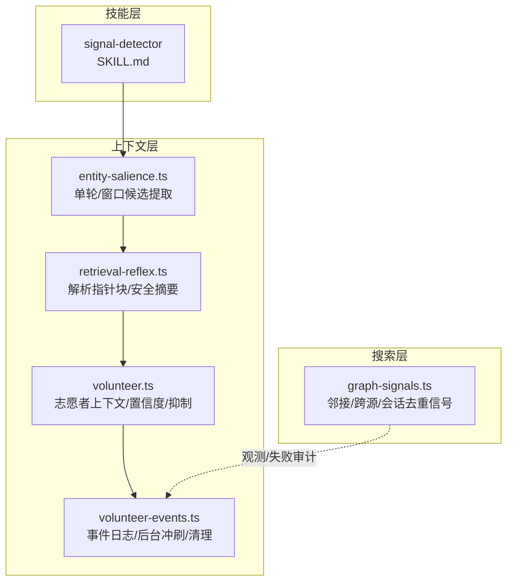
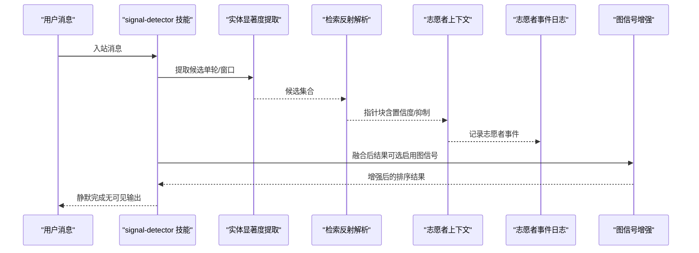
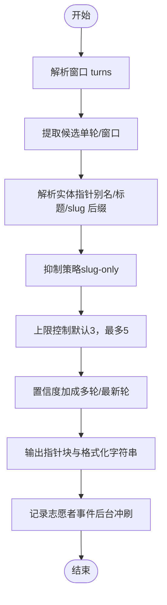
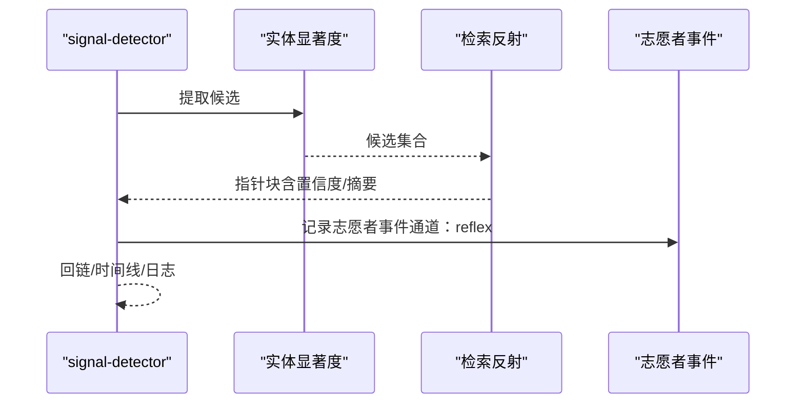
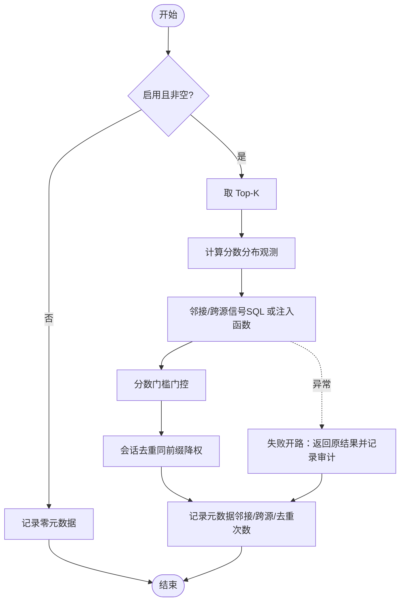
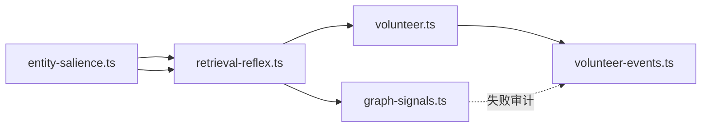

# 信号检测机制

<cite>
**本文引用的文件**
- [skills/signal-detector/SKILL.md](file://skills/signal-detector/SKILL.md)
- [src/core/search/graph-signals.ts](file://src/core/search/graph-signals.ts)
- [src/core/context/entity-salience.ts](file://src/core/context/entity-salience.ts)
- [src/core/context/retrieval-reflex.ts](file://src/core/context/retrieval-reflex.ts)
- [src/core/context/volunteer.ts](file://src/core/context/volunteer.ts)
- [src/core/context/volunteer-events.ts](file://src/core/context/volunteer-events.ts)
- [test/retrieval-reflex.test.ts](file://test/retrieval-reflex.test.ts)
- [test/search/graph-signals.test.ts](file://test/search/graph-signals.test.ts)
- [test/e2e/graph-signals-eval.test.ts](file://test/e2e/graph-signals-eval.test.ts)
- [test/fixtures/openclaw-reference-minimal/skills/signal-detector/SKILL.md](file://test/fixtures/openclaw-reference-minimal/skills/signal-detector/SKILL.md)
</cite>

## 目录
1. [简介](#简介)
2. [项目结构](#项目结构)
3. [核心组件](#核心组件)
4. [架构总览](#架构总览)
5. [详细组件分析](#详细组件分析)
6. [依赖关系分析](#依赖关系分析)
7. [性能考量](#性能考量)
8. [故障排除指南](#故障排除指南)
9. [结论](#结论)
10. [附录](#附录)

## 简介
本技术文档聚焦于 GBrain 的信号检测系统，系统通过“志愿者上下文检测”“反射式信号捕获”和“自动触发机制”三大支柱，实现对知识库中关键变化的智能识别与响应。文档深入解释以下内容：
- 志愿者上下文检测：在对话窗口内提取高显著度实体候选，基于置信度阈值与抑制策略进行推送，形成“主动上下文”的反馈闭环。
- 反射式信号捕获：在每条入站消息上触发轻量子代理，同时进行“原创思维”与“实体提及”的双重捕获，并自动回链与时间线记录。
- 自动触发机制：以技能清单与触发器定义驱动，确保在不阻塞主响应的前提下并行执行信号检测。

此外，文档还覆盖信号类型分类（思想类、概念类、产品/业务类）、检测精度优化（置信度模型、抑制规则、会话去重）、误报处理（失败开路、审计写入、统计口径）以及配置示例、性能监控指标与故障排除建议。

## 项目结构
围绕信号检测的关键代码分布在以下模块：
- 技能层：signal-detector 技能定义与触发策略
- 上下文层：实体显著度提取、检索反射解析、志愿者上下文推送与事件日志
- 搜索层：图信号增强（邻接、跨源、会话去重），并提供可观测性与失败审计

图表来源
- [skills/signal-detector/SKILL.md:1-113](file://skills/signal-detector/SKILL.md#L1-L113)
- [src/core/context/entity-salience.ts:1-258](file://src/core/context/entity-salience.ts#L1-L258)
- [src/core/context/retrieval-reflex.ts:1-368](file://src/core/context/retrieval-reflex.ts#L1-L368)
- [src/core/context/volunteer.ts:1-269](file://src/core/context/volunteer.ts#L1-L269)
- [src/core/context/volunteer-events.ts:1-187](file://src/core/context/volunteer-events.ts#L1-L187)
- [src/core/search/graph-signals.ts:1-419](file://src/core/search/graph-signals.ts#L1-L419)

章节来源
- [skills/signal-detector/SKILL.md:1-113](file://skills/signal-detector/SKILL.md#L1-L113)
- [src/core/context/entity-salience.ts:1-258](file://src/core/context/entity-salience.ts#L1-L258)
- [src/core/context/retrieval-reflex.ts:1-368](file://src/core/context/retrieval-reflex.ts#L1-L368)
- [src/core/context/volunteer.ts:1-269](file://src/core/context/volunteer.ts#L1-L269)
- [src/core/context/volunteer-events.ts:1-187](file://src/core/context/volunteer-events.ts#L1-L187)
- [src/core/search/graph-signals.ts:1-419](file://src/core/search/graph-signals.ts#L1-L419)

## 核心组件
- 志愿者上下文检测（volunteer）
  - 基于滚动窗口解析用户与助手发言，提取候选并按显著度加权排序，结合置信度门控与抑制策略，输出可注入提示词的指针块。
  - 关键参数：最大页面数、最小置信度、会话去重前缀判定、抑制模式（slug-only 用于多轮窗口）。
- 反射式信号捕获（retrieval-reflex + signal-detector）
  - 在每条入站消息上触发，优先解析别名命中（最高置信度），再匹配标题或 slug 后缀；生成安全摘要与指针文本，支持日志记录与回链。
  - signal-detector 技能保证“每次消息触发、并行运行、精确捕获、强制回链与时间线记录”。
- 图信号增强（graph-signals）
  - 对融合后结果应用三类选择性信号：同集邻接、跨源邻接、会话去重，均受分数门槛保护，失败时采用“失败开路”策略，保留原结果并记录审计事件。

章节来源
- [src/core/context/volunteer.ts:1-269](file://src/core/context/volunteer.ts#L1-L269)
- [src/core/context/retrieval-reflex.ts:1-368](file://src/core/context/retrieval-reflex.ts#L1-L368)
- [skills/signal-detector/SKILL.md:1-113](file://skills/signal-detector/SKILL.md#L1-L113)
- [src/core/search/graph-signals.ts:1-419](file://src/core/search/graph-signals.ts#L1-L419)

## 架构总览
信号检测贯穿“输入感知—候选提取—解析指针—上下文推送—事件审计—图信号增强”的完整链路，形成“主动上下文 + 结果增强 + 统计反馈”的闭环。

图表来源
- [skills/signal-detector/SKILL.md:1-113](file://skills/signal-detector/SKILL.md#L1-L113)
- [src/core/context/entity-salience.ts:1-258](file://src/core/context/entity-salience.ts#L1-L258)
- [src/core/context/retrieval-reflex.ts:1-368](file://src/core/context/retrieval-reflex.ts#L1-L368)
- [src/core/context/volunteer.ts:1-269](file://src/core/context/volunteer.ts#L1-L269)
- [src/core/context/volunteer-events.ts:1-187](file://src/core/context/volunteer-events.ts#L1-L187)
- [src/core/search/graph-signals.ts:1-419](file://src/core/search/graph-signals.ts#L1-L419)

## 详细组件分析

### 志愿者上下文检测（volunteer）
- 输入：对话窗口文本（支持带前缀的多轮对话）
- 处理流程：
  - 解析窗口为 turns，提取候选（单轮/窗口两种路径）
  - 解析实体指针，计算置信度（含多轮/最新轮次加成）
  - 应用抑制策略（slug-only 用于窗口化）与上限控制
  - 输出指针块与格式化字符串，供系统提示词注入
- 关键点：
  - 置信度门控默认 0.7，最大页面数默认 3（上限 5）
  - 会话去重前缀仅对“聊天/会话/日期锚定”的路径生效，避免实体搜索被错误去重
  - 使用“志愿者事件表”记录推送行为，支持近 90 天保留与使用统计

图表来源
- [src/core/context/volunteer.ts:1-269](file://src/core/context/volunteer.ts#L1-L269)
- [src/core/context/retrieval-reflex.ts:1-368](file://src/core/context/retrieval-reflex.ts#L1-L368)
- [src/core/context/entity-salience.ts:1-258](file://src/core/context/entity-salience.ts#L1-L258)
- [src/core/context/volunteer-events.ts:1-187](file://src/core/context/volunteer-events.ts#L1-L187)

章节来源
- [src/core/context/volunteer.ts:1-269](file://src/core/context/volunteer.ts#L1-L269)
- [src/core/context/retrieval-reflex.ts:1-368](file://src/core/context/retrieval-reflex.ts#L1-L368)
- [src/core/context/entity-salience.ts:1-258](file://src/core/context/entity-salience.ts#L1-L258)
- [src/core/context/volunteer-events.ts:1-187](file://src/core/context/volunteer-events.ts#L1-L187)

### 反射式信号捕获（retrieval-reflex + signal-detector）
- 检测目标：
  - 原创思维：用户的原创观点、观察、理论框架等
  - 实体提及：人名、公司、媒体标题等
- 处理流程：
  - 单轮/窗口显著度提取候选
  - 别名命中优先（最高置信度），其次标题或 slug 后缀
  - 安全摘要（strip fence + 首句），渲染指针块
  - 记录志愿者事件（通道：reflex），用于统计与反馈
- signal-detector 技能：
  - 每条消息触发，子代理并行运行
  - 强制回链与时间线记录，保证“断链即坏脑”
  - 工具链：search/query/get_page/put_page/add_link/add_timeline_entry

图表来源
- [skills/signal-detector/SKILL.md:1-113](file://skills/signal-detector/SKILL.md#L1-L113)
- [src/core/context/entity-salience.ts:1-258](file://src/core/context/entity-salience.ts#L1-L258)
- [src/core/context/retrieval-reflex.ts:1-368](file://src/core/context/retrieval-reflex.ts#L1-L368)
- [src/core/context/volunteer-events.ts:1-187](file://src/core/context/volunteer-events.ts#L1-L187)

章节来源
- [skills/signal-detector/SKILL.md:1-113](file://skills/signal-detector/SKILL.md#L1-L113)
- [src/core/context/retrieval-reflex.ts:1-368](file://src/core/context/retrieval-reflex.ts#L1-L368)
- [src/core/context/entity-salience.ts:1-258](file://src/core/context/entity-salience.ts#L1-L258)
- [src/core/context/volunteer-events.ts:1-187](file://src/core/context/volunteer-events.ts#L1-L187)

### 图信号增强（graph-signals）
- 三类信号叠加（保守幅度）：
  - 同集邻接：Top-K 中被≥2 个其他 Top-K 页面链接，小幅度提升
  - 跨源邻接：从≥2 个不同源链接，稍大提升；单源脑上无效
  - 会话去重：同一会话前缀下的多结果，仅保留最高分，其余降权
- 保护机制：
  - 分数门槛门控：低于阈值的结果不参与信号
  - 失败开路：引擎调用异常时返回原结果，记录审计事件
  - 观测性：输出分数分布与元数据，支撑后续校准

图表来源
- [src/core/search/graph-signals.ts:1-419](file://src/core/search/graph-signals.ts#L1-L419)

章节来源
- [src/core/search/graph-signals.ts:1-419](file://src/core/search/graph-signals.ts#L1-L419)
- [test/search/graph-signals.test.ts:341-376](file://test/search/graph-signals.test.ts#L341-L376)
- [test/e2e/graph-signals-eval.test.ts:199-230](file://test/e2e/graph-signals-eval.test.ts#L199-L230)

### 信号类型分类与自动触发
- 信号类型：
  - 原创思维：原创观点/观察/理论框架
  - 实体提及：人名/公司/媒体标题
  - 概念与产品/业务：概念页/想法页
- 自动触发：
  - signal-detector 技能以“每条入站消息”为触发条件，保证持续捕获
  - 并行执行，不阻塞主响应路径

章节来源
- [skills/signal-detector/SKILL.md:1-113](file://skills/signal-detector/SKILL.md#L1-L113)
- [test/fixtures/openclaw-reference-minimal/skills/signal-detector/SKILL.md:1-11](file://test/fixtures/openclaw-reference-minimal/skills/signal-detector/SKILL.md#L1-L11)

## 依赖关系分析
- 模块耦合与协作：
  - entity-salience.ts 为上游候选提取，retrieval-reflex.ts 进行解析与摘要，volunteer.ts 将其转化为置信度驱动的推送，volunteer-events.ts 记录反馈事件
  - graph-signals.ts 作为下游增强阶段，对融合后结果进行信号增强，失败时不影响主流程
- 外部依赖与集成点：
  - 通过 BrainEngine 执行 SQL 查询（别名解析、邻接统计、页面加载）
  - 事件日志写入数据库，支持清理与统计查询

图表来源
- [src/core/context/entity-salience.ts:1-258](file://src/core/context/entity-salience.ts#L1-L258)
- [src/core/context/retrieval-reflex.ts:1-368](file://src/core/context/retrieval-reflex.ts#L1-L368)
- [src/core/context/volunteer.ts:1-269](file://src/core/context/volunteer.ts#L1-L269)
- [src/core/context/volunteer-events.ts:1-187](file://src/core/context/volunteer-events.ts#L1-L187)
- [src/core/search/graph-signals.ts:1-419](file://src/core/search/graph-signals.ts#L1-L419)

章节来源
- [src/core/context/entity-salience.ts:1-258](file://src/core/context/entity-salience.ts#L1-L258)
- [src/core/context/retrieval-reflex.ts:1-368](file://src/core/context/retrieval-reflex.ts#L1-L368)
- [src/core/context/volunteer.ts:1-269](file://src/core/context/volunteer.ts#L1-L269)
- [src/core/context/volunteer-events.ts:1-187](file://src/core/context/volunteer-events.ts#L1-L187)
- [src/core/search/graph-signals.ts:1-419](file://src/core/search/graph-signals.ts#L1-L419)

## 性能考量
- 并行与非阻塞
  - signal-detector 子代理并行运行，不阻塞主响应
  - 志愿者事件批量插入，后台冲刷，避免热路径阻塞
- 代价控制
  - 候选上限与指针上限，降低下游解析成本
  - 会话去重仅对特定路径生效，避免实体搜索被错误降权
- 观测与校准
  - graph-signals 输出分数分布与元数据，支撑后续校准
  - 志愿者使用统计（近似）反映反馈闭环效果

[本节为通用性能讨论，无需具体文件分析]

## 故障排除指南
- graph-signals 失败开路
  - 现象：邻接统计调用异常，结果保持不变
  - 排查：检查引擎可用性与权限，查看审计写入
  - 参考测试：[test/search/graph-signals.test.ts:365-376](file://test/search/graph-signals.test.ts#L365-L376)
- 志愿者事件未落盘
  - 现象：CLI 退出时仍有挂起写入
  - 排查：确认后台冲刷已注册，等待 drain 或检查超时
  - 参考：awaitPendingVolunteerEventWrites 的超时与清理逻辑
- 信号评估门禁
  - 现象：开启 graph_signals 后召回下降
  - 排查：参考评估测试的门禁逻辑与统计指标
  - 参考：[test/e2e/graph-signals-eval.test.ts:199-230](file://test/e2e/graph-signals-eval.test.ts#L199-L230)
- 反射式解析未记录
  - 现象：指针块未计入志愿者统计
  - 排查：确认仅在“交付侧”记录（成功注入提示词后），避免客户端超时导致的误计
  - 参考：logDeliveredReflexPointers 的注释说明

章节来源
- [test/search/graph-signals.test.ts:365-376](file://test/search/graph-signals.test.ts#L365-L376)
- [src/core/context/volunteer-events.ts:121-142](file://src/core/context/volunteer-events.ts#L121-L142)
- [test/e2e/graph-signals-eval.test.ts:199-230](file://test/e2e/graph-signals-eval.test.ts#L199-L230)
- [src/core/context/retrieval-reflex.ts:342-367](file://src/core/context/retrieval-reflex.ts#L342-L367)

## 结论
GBrain 的信号检测系统通过“志愿者上下文检测 + 反射式信号捕获 + 图信号增强”，实现了对知识库关键变化的高精度、低误报、可观测的智能响应。系统强调：
- 精度优先的候选提取与解析
- 置信度门控与抑制策略
- 失败开路与审计写入保障稳定性
- 统计反馈与评估门禁驱动持续优化

## 附录

### 信号检测配置示例
- 志愿者上下文
  - 最大页面数：默认 3，上限 5
  - 最小置信度：默认 0.7
  - 抑制模式：窗口化场景使用 “slug-only”
  - 会话去重：基于会话前缀（聊天/会话/日期锚定）
- graph-signals
  - 启用开关：enabled
  - Top-K：默认 20
  - 分数门槛：继承自融合阶段的门限
  - 观测回调：onMeta/onScoreDistribution
- signal-detector 技能
  - 触发：每条入站消息
  - 工具：search/query/get_page/put_page/add_link/add_timeline_entry
  - 约定：强制回链、时间线记录、静默输出

章节来源
- [src/core/context/volunteer.ts:40-71](file://src/core/context/volunteer.ts#L40-L71)
- [src/core/search/graph-signals.ts:101-122](file://src/core/search/graph-signals.ts#L101-L122)
- [skills/signal-detector/SKILL.md:1-113](file://skills/signal-detector/SKILL.md#L1-L113)

### 性能监控指标
- graph-signals
  - 元数据：邻接触发次数、跨源触发次数、会话去重次数、耗时、是否出错
  - 分数分布：Top-K 最小/中位/四分位/最大、重排带宽
- 志愿者使用统计（近似）
  - 按 arm/channel 统计“推送次数/使用次数/精度”
  - 统计周期：可配置天数，默认 30 天
- 评估门禁
  - Gate 1：开启 graph_signals 不显著恶化
  - Gate 2a：平均 Jaccard@5 ≥ 0.5

章节来源
- [src/core/search/graph-signals.ts:79-99](file://src/core/search/graph-signals.ts#L79-L99)
- [src/core/context/volunteer.ts:195-269](file://src/core/context/volunteer.ts#L195-L269)
- [test/e2e/graph-signals-eval.test.ts:199-230](file://test/e2e/graph-signals-eval.test.ts#L199-L230)