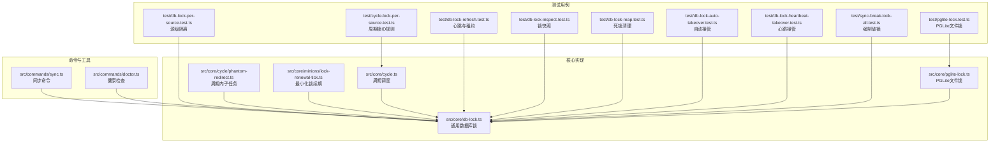
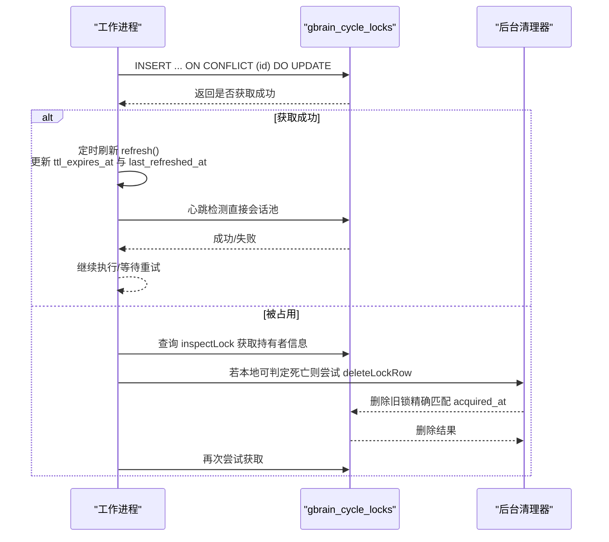
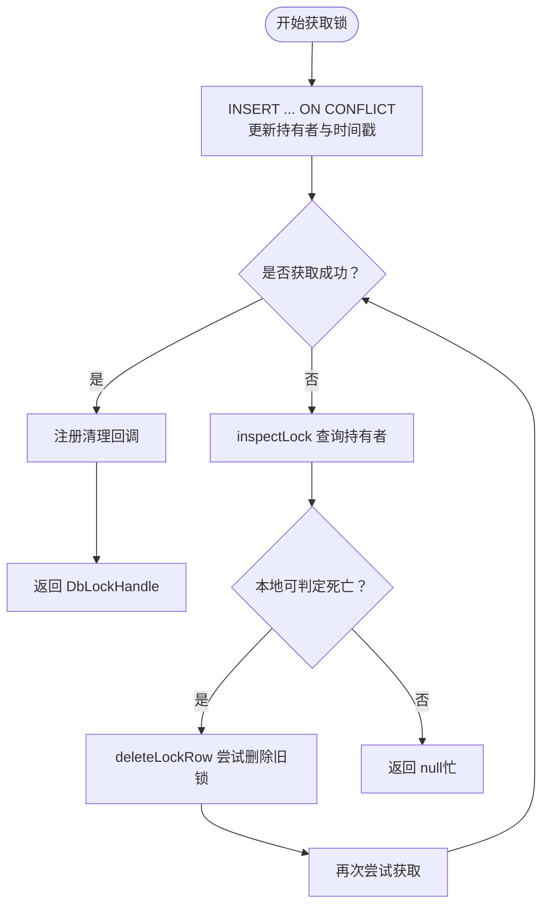
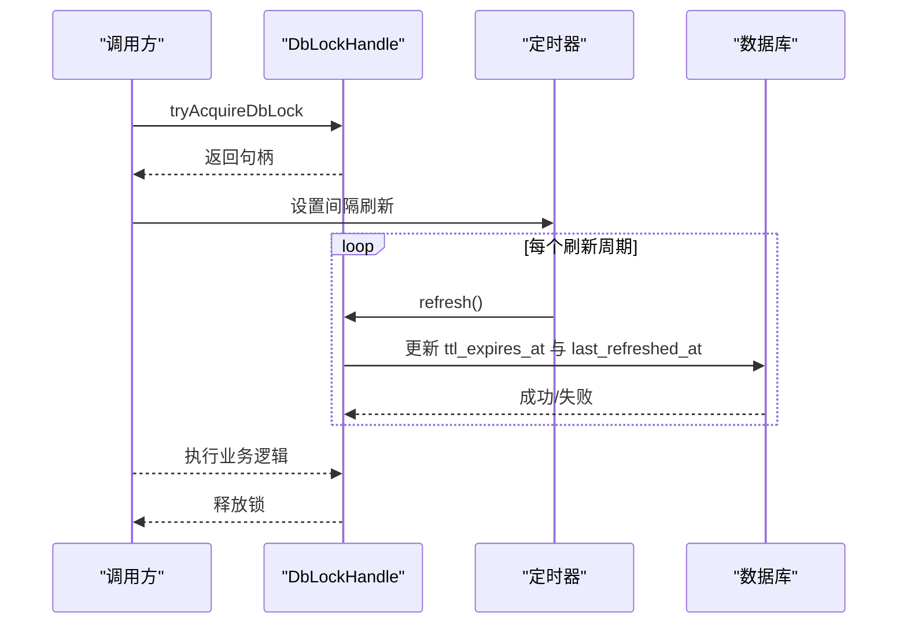
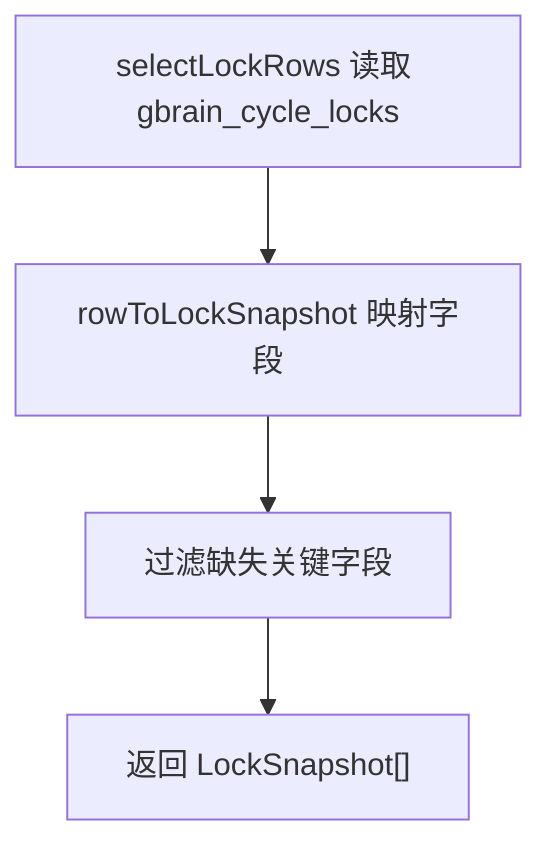
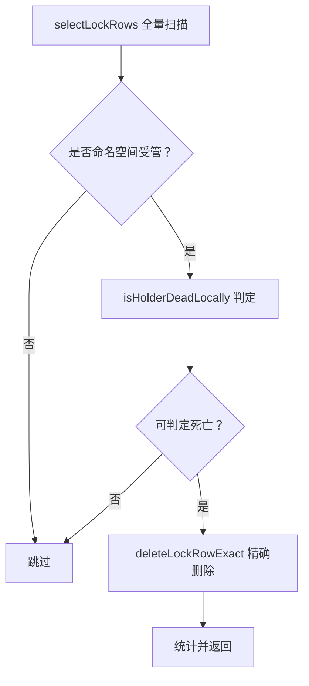
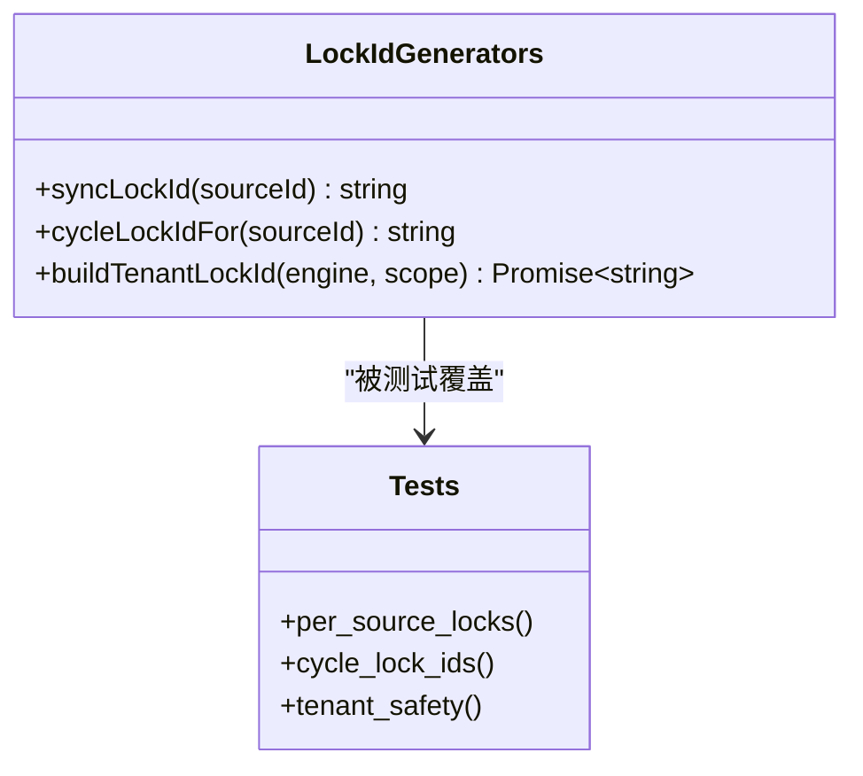
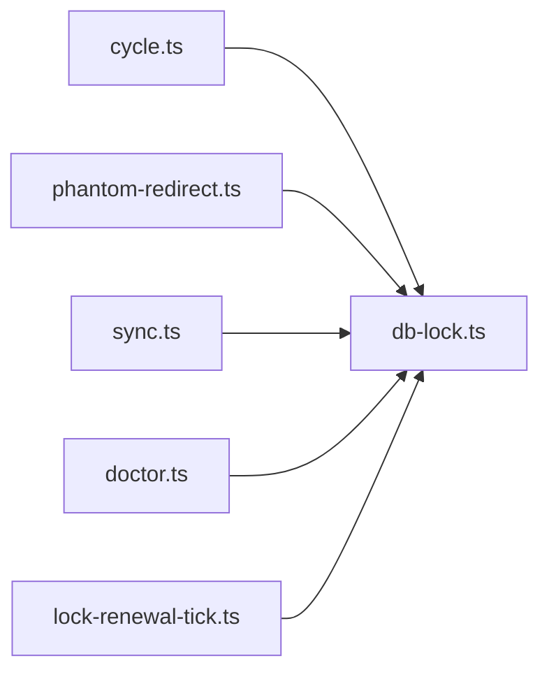

# 循环锁定机制

<cite>
**本文档引用的文件**
- [src/core/db-lock.ts](file://src/core/db-lock.ts)
- [test/db-lock-per-source.test.ts](file://test/db-lock-per-source.test.ts)
- [test/cycle-lock-per-source.test.ts](file://test/cycle-lock-per-source.test.ts)
- [test/db-lock-refresh.test.ts](file://test/db-lock-refresh.test.ts)
- [test/db-lock-inspect.test.ts](file://test/db-lock-inspect.test.ts)
- [test/db-lock-reap.test.ts](file://test/db-lock-reap.test.ts)
- [test/db-lock-auto-takeover.test.ts](file://test/db-lock-auto-takeover.test.ts)
- [test/db-lock-heartbeat-takeover.test.ts](file://test/db-lock-heartbeat-takeover.test.ts)
- [test/sync-break-lock-all.test.ts](file://test/sync-break-lock-all.test.ts)
- [test/pglite-lock.test.ts](file://test/pglite-lock.test.ts)
- [src/commands/sync.ts](file://src/commands/sync.ts)
- [src/core/cycle.ts](file://src/core/cycle.ts)
- [src/core/cycle/phantom-redirect.ts](file://src/core/cycle/phantom-redirect.ts)
- [src/core/minions/lock-renewal-tick.ts](file://src/core/minions/lock-renewal-tick.ts)
- [src/core/pglite-lock.ts](file://src/core/pglite-lock.ts)
- [src/commands/doctor.ts](file://src/commands/doctor.ts)
</cite>

## 目录
1. [简介](#简介)
2. [项目结构](#项目结构)
3. [核心组件](#核心组件)
4. [架构概览](#架构概览)
5. [详细组件分析](#详细组件分析)
6. [依赖关系分析](#依赖关系分析)
7. [性能考虑](#性能考虑)
8. [故障排查指南](#故障排查指南)
9. [结论](#结论)
10. [附录](#附录)

## 简介
本文件系统性阐述 GBrain 的循环锁定机制，覆盖数据库行级锁与文件锁的实现原理、锁粒度控制、死锁预防策略，以及锁 ID 生成、TTL 管理、自动刷新与清理流程。文档还包含锁竞争处理、性能影响分析与监控指标，提供配置参数说明、故障诊断方法与优化建议，确保循环执行的一致性与可靠性。

## 项目结构
循环锁定机制主要由以下模块构成：
- 核心数据库锁实现：统一的行级锁抽象，支持 PostgreSQL 与 PGLite 双引擎
- 周期性循环锁：用于序列化每个周期内的操作，避免并发冲突
- 源级同步锁：按源隔离的写入窗口锁，提升并行度
- 自动接管与清理：基于心跳与 TTL 的自动回收机制
- 工具与命令：doctor、sync 等命令对锁状态进行检查与干预

**图表来源**
- [src/core/db-lock.ts:172-327](file://src/core/db-lock.ts#L172-L327)
- [src/core/cycle.ts:51-560](file://src/core/cycle.ts#L51-L560)
- [src/core/cycle/phantom-redirect.ts:55-535](file://src/core/cycle/phantom-redirect.ts#L55-L535)
- [src/core/minions/lock-renewal-tick.ts:53-114](file://src/core/minions/lock-renewal-tick.ts#L53-L114)
- [src/core/pglite-lock.ts:1-200](file://src/core/pglite-lock.ts#L1-L200)
- [src/commands/sync.ts:787-1364](file://src/commands/sync.ts#L787-L1364)
- [src/commands/doctor.ts:2409-4474](file://src/commands/doctor.ts#L2409-L4474)

**章节来源**
- [src/core/db-lock.ts:1-929](file://src/core/db-lock.ts#L1-L929)
- [src/core/cycle.ts:51-560](file://src/core/cycle.ts#L51-L560)
- [src/core/cycle/phantom-redirect.ts:55-535](file://src/core/cycle/phantom-redirect.ts#L55-L535)
- [src/core/minions/lock-renewal-tick.ts:53-114](file://src/core/minions/lock-renewal-tick.ts#L53-L114)
- [src/core/pglite-lock.ts:1-200](file://src/core/pglite-lock.ts#L1-L200)
- [src/commands/sync.ts:787-1364](file://src/commands/sync.ts#L787-L1364)
- [src/commands/doctor.ts:2409-4474](file://src/commands/doctor.ts#L2409-L4474)

## 核心组件
- 通用数据库锁（tryAcquireDbLock）：通过 gbrain_cycle_locks 表实现行级互斥，支持 PostgreSQL 与 PGLite；在冲突时可自动接管或返回空
- 刷新锁（withRefreshingLock）：长任务自动刷新 TTL 并进行心跳检测，防止被误判为死锁
- 锁快照与检查（inspectLock/listStaleLocks）：读取当前持有者信息与过期锁列表
- 死锁清理（reapDeadHolderLocks/deleteLockRow/deleteLockRowIfStale）：基于进程存活与心跳时间的清理策略
- 源级隔离（syncLockId/cycleLockIdFor）：按源生成独立锁键，避免跨源串扰
- 多租户安全（buildTenantLockId）：在共享数据库中区分不同实例

**章节来源**
- [src/core/db-lock.ts:172-327](file://src/core/db-lock.ts#L172-L327)
- [src/core/db-lock.ts:807-864](file://src/core/db-lock.ts#L807-L864)
- [src/core/db-lock.ts:455-468](file://src/core/db-lock.ts#L455-L468)
- [src/core/db-lock.ts:684-699](file://src/core/db-lock.ts#L684-L699)
- [src/core/db-lock.ts:722-730](file://src/core/db-lock.ts#L722-L730)
- [src/core/db-lock.ts:916-928](file://src/core/db-lock.ts#L916-L928)

## 架构概览
循环锁定机制采用“表驱动 + 心跳保护”的双层保障：
- 表驱动：以 gbrain_cycle_locks 作为唯一真相来源，所有竞争通过 INSERT/ON CONFLICT 实现原子抢占
- 心跳保护：last_refreshed_at 记录每次刷新时间，结合 TTL 与接管宽限期，既防死锁也防误杀

**图表来源**
- [src/core/db-lock.ts:172-327](file://src/core/db-lock.ts#L172-L327)
- [src/core/db-lock.ts:231-251](file://src/core/db-lock.ts#L231-L251)
- [src/core/db-lock.ts:483-512](file://src/core/db-lock.ts#L483-L512)
- [src/core/db-lock.ts:616-650](file://src/core/db-lock.ts#L616-L650)

## 详细组件分析

### 数据库锁实现（tryAcquireDbLock）
- 锁粒度：按 lockId 唯一行级锁，支持多租户与源级隔离
- 冲突处理：INSERT/ON CONFLICT 原子抢占；仅当现有锁过期且心跳足够陈旧时才允许接管
- 自动清理：注册进程退出回调，异常终止也能释放锁
- 引擎适配：PostgreSQL 使用 sql 模板，PGLite 使用 db.query，行为一致

**图表来源**
- [src/core/db-lock.ts:172-327](file://src/core/db-lock.ts#L172-L327)
- [src/core/db-lock.ts:455-458](file://src/core/db-lock.ts#L455-L458)
- [src/core/db-lock.ts:483-512](file://src/core/db-lock.ts#L483-L512)

**章节来源**
- [src/core/db-lock.ts:172-327](file://src/core/db-lock.ts#L172-L327)

### 刷新锁（withRefreshingLock）
- 自动刷新：每 TTL/6 周期刷新一次，确保长任务不会因超时被误判
- 心跳检测：refresh 同时承担心跳职责，使用直连会话池，避免连接池耗尽导致的心跳中断
- 失败处理：心跳失败不立即终止，但会在最终输出健康状态提示

**图表来源**
- [src/core/db-lock.ts:807-864](file://src/core/db-lock.ts#L807-L864)
- [src/core/db-lock.ts:231-251](file://src/core/db-lock.ts#L231-L251)

**章节来源**
- [src/core/db-lock.ts:807-864](file://src/core/db-lock.ts#L807-L864)

### 锁快照与检查（inspectLock/listStaleLocks）
- inspectLock：读取单条锁记录并计算年龄、TTL 过期状态与心跳间隔
- listStaleLocks：列出所有 TTL 已过期的锁，供 doctor 等工具使用

**图表来源**
- [src/core/db-lock.ts:421-453](file://src/core/db-lock.ts#L421-L453)
- [src/core/db-lock.ts:387-405](file://src/core/db-lock.ts#L387-L405)

**章节来源**
- [src/core/db-lock.ts:421-453](file://src/core/db-lock.ts#L421-L453)
- [src/core/db-lock.ts:387-405](file://src/core/db-lock.ts#L387-L405)

### 死锁清理（reapDeadHolderLocks/deleteLockRow/deleteLockRowIfStale）
- 基于主机范围的扫描：仅清理 gbrain-sync 与 gbrain-cycle 命名空间的锁
- 进程存活判定：同主机 + ESRCH + 年龄超过接管宽限（默认 60 秒）才删除
- 精确匹配删除：deleteLockRowExact 使用 acquired_at 截断到毫秒，避免 PID 复用导致的误删

**图表来源**
- [src/core/db-lock.ts:684-699](file://src/core/db-lock.ts#L684-L699)
- [src/core/db-lock.ts:616-650](file://src/core/db-lock.ts#L616-L650)

**章节来源**
- [src/core/db-lock.ts:684-699](file://src/core/db-lock.ts#L684-L699)
- [src/core/db-lock.ts:616-650](file://src/core/db-lock.ts#L616-L650)

### 锁 ID 生成策略与隔离
- 源级隔离：syncLockId(sourceId) 生成 gbrain-sync:<sourceId>，不同源互不干扰
- 周期锁隔离：cycleLockIdFor(sourceId) 支持 legacy 与 per-source 两种形式，避免部署窗口冲突
- 多租户安全：buildTenantLockId 在 PostgreSQL 下附加 current_database()，避免共享数据库中的误冲突

**图表来源**
- [src/core/db-lock.ts:722-730](file://src/core/db-lock.ts#L722-L730)
- [src/core/db-lock.ts:916-928](file://src/core/db-lock.ts#L916-L928)
- [test/db-lock-per-source.test.ts:35-86](file://test/db-lock-per-source.test.ts#L35-L86)
- [test/cycle-lock-per-source.test.ts:16-93](file://test/cycle-lock-per-source.test.ts#L16-L93)

**章节来源**
- [src/core/db-lock.ts:722-730](file://src/core/db-lock.ts#L722-L730)
- [src/core/db-lock.ts:916-928](file://src/core/db-lock.ts#L916-L928)
- [test/db-lock-per-source.test.ts:35-86](file://test/db-lock-per-source.test.ts#L35-L86)
- [test/cycle-lock-per-source.test.ts:16-93](file://test/cycle-lock-per-source.test.ts#L16-L93)

### 文件锁（PGLite）
- 作用域：PGLite 场景下的文件锁目录 .gbrain-lock，用于进程间互斥
- 行为：写入持有者信息（pid/acquired_at/refreshed_at/command），竞争超时或被接管时清理
- 测试覆盖：验证新鲜心跳不会被误夺、陈旧心跳会被清理等场景

**章节来源**
- [test/pglite-lock.test.ts:108-137](file://test/pglite-lock.test.ts#L108-L137)

## 依赖关系分析
- 周期调度依赖数据库锁：确保单次周期内全局串行，同时允许 per-source 并行
- 同步命令依赖源级锁：在 performSync 写入窗口内独占，避免并发写入
- doctor 命令依赖检查接口：列出过期锁并提供安全破锁能力
- 最小化锁续期：在高并发场景下降低锁竞争频率

**图表来源**
- [src/core/cycle.ts:51-560](file://src/core/cycle.ts#L51-L560)
- [src/core/cycle/phantom-redirect.ts:55-535](file://src/core/cycle/phantom-redirect.ts#L55-L535)
- [src/commands/sync.ts:787-1364](file://src/commands/sync.ts#L787-L1364)
- [src/commands/doctor.ts:2409-4474](file://src/commands/doctor.ts#L2409-L4474)
- [src/core/minions/lock-renewal-tick.ts:53-114](file://src/core/minions/lock-renewal-tick.ts#L53-L114)

**章节来源**
- [src/core/cycle.ts:51-560](file://src/core/cycle.ts#L51-L560)
- [src/core/cycle/phantom-redirect.ts:55-535](file://src/core/cycle/phantom-redirect.ts#L55-L535)
- [src/commands/sync.ts:787-1364](file://src/commands/sync.ts#L787-L1364)
- [src/commands/doctor.ts:2409-4474](file://src/commands/doctor.ts#L2409-L4474)
- [src/core/minions/lock-renewal-tick.ts:53-114](file://src/core/minions/lock-renewal-tick.ts#L53-L114)

## 性能考虑
- 刷新频率：每 TTL/6 周期刷新一次，兼顾低开销与高可靠性
- 连接池策略：心跳通过直连会话池执行，避免事务池耗尽导致的心跳失败
- 清理策略：后台扫描仅针对受控命名空间，减少全表扫描成本
- 并发度：周期锁全局串行，源级锁并行，最大化吞吐同时保证一致性

[本节为通用性能讨论，无需具体文件分析]

## 故障排查指南
- 锁未释放：确认进程清理回调是否注册，必要时使用 doctor 或 sync 的破锁功能
- 长时间无心跳：withRefreshingLock 会在最终输出健康状态提示，检查后端连接与事件循环
- 死锁清理无效：确认锁命名空间是否受控，主机是否一致，进程是否真正死亡
- PGLite 文件锁残留：检查 .gbrain-lock 目录是否存在，必要时手动清理

**章节来源**
- [src/commands/doctor.ts:2409-4474](file://src/commands/doctor.ts#L2409-L4474)
- [src/commands/sync.ts:787-1364](file://src/commands/sync.ts#L787-L1364)
- [test/sync-break-lock-all.test.ts:48-61](file://test/sync-break-lock-all.test.ts#L48-L61)

## 结论
GBrain 的循环锁定机制通过“表驱动 + 心跳保护”实现了高可靠、可诊断、可扩展的并发控制。其设计在保证循环执行一致性的同时，提供了灵活的锁粒度控制与完善的清理策略，适用于复杂多源、多租户的生产环境。

[本节为总结性内容，无需具体文件分析]

## 附录

### 配置参数与环境变量
- GBRAIN_LOCK_STEAL_GRACE_SECONDS：心跳接管宽限期（秒），默认约 2×刷新周期，最小 60
- GBRAIN_LOCK_RENEWAL_MAX_FAILURES：最小化锁续期最大失败次数
- GBRAIN_LOCK_RENEWAL_CALL_TIMEOUT_MS：续期调用超时（毫秒），默认为锁时长的 1/3
- GBRAIN_LOCK_RENEWAL_SAFETY_MARGIN_MS：续期安全余量（毫秒），默认为锁时长的 1/6
- GBRAIN_PGLITE_LOCK_STEAL_GRACE_SECONDS：PGLite 文件锁接管宽限期（秒）

**章节来源**
- [src/core/db-lock.ts:58-67](file://src/core/db-lock.ts#L58-L67)
- [src/core/minions/lock-renewal-tick.ts:53-114](file://src/core/minions/lock-renewal-tick.ts#L53-L114)
- [src/core/pglite-lock.ts:34-34](file://src/core/pglite-lock.ts#L34-L34)

### 监控指标建议
- 活跃锁数量：gbrain_cycle_locks 行数
- 过期锁比例：listStaleLocks 占比
- 接管成功率：自动接管次数 / 争用次数
- 心跳失败率：withRefreshingLock 心跳失败计数
- 清理命中率：reapDeadHolderLocks 删除命中数 / 扫描数

**章节来源**
- [src/core/db-lock.ts:466-468](file://src/core/db-lock.ts#L466-L468)
- [src/core/db-lock.ts:684-699](file://src/core/db-lock.ts#L684-L699)