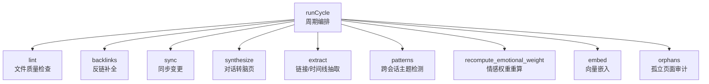
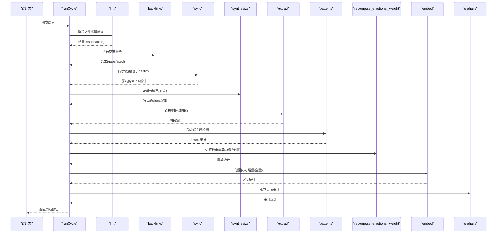
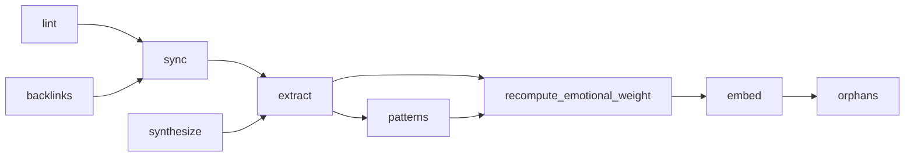

# 循环阶段总览

<cite>
**本文引用的文件**
- [src/core/cycle.ts](file://src/core/cycle.ts)
- [src/core/sync.ts](file://src/core/sync.ts)
- [src/core/cycle/synthesize.ts](file://src/core/cycle/synthesize.ts)
- [src/core/cycle/patterns.ts](file://src/core/cycle/patterns.ts)
- [src/core/cycle/recompute-emotional-weight.ts](file://src/core/cycle/recompute-emotional-weight.ts)
- [src/commands/lint.ts](file://src/commands/lint.ts)
- [src/commands/backlinks.ts](file://src/commands/backlinks.ts)
- [test/e2e/dream-cycle-phase-order-pglite.test.ts](file://test/e2e/dream-cycle-phase-order-pglite.test.ts)
</cite>

## 目录
1. [简介](#简介)
2. [项目结构](#项目结构)
3. [核心组件](#核心组件)
4. [架构总览](#架构总览)
5. [详细组件分析](#详细组件分析)
6. [依赖分析](#依赖分析)
7. [性能考虑](#性能考虑)
8. [故障排查指南](#故障排查指南)
9. [结论](#结论)
10. [附录](#附录)

## 简介
本文件面向GBrain“循环阶段系统”，系统性梳理并解释九个核心循环阶段（lint、backlinks、sync、synthesize、extract、patterns、recompute_emotional_weight、embed、orphans）的执行顺序、作用机制与相互关系。文档覆盖每个阶段的功能职责、输入输出、依赖关系、执行条件、配置参数、性能特征与最佳实践，并通过流程图与序列图展示阶段间的协作与数据流，帮助读者在理解整体设计的同时掌握落地实施要点。

## 项目结构
- 核心循环编排位于 src/core/cycle.ts，定义了所有阶段的顺序、范围与锁策略；各阶段的实现分别位于 src/core/cycle/* 以及 src/commands/*。
- 阶段间的数据与控制流通过统一的周期报告（CycleReport）与进度上报（ProgressReporter）进行追踪与可观测。
- 测试用例 test/e2e/dream-cycle-phase-order-pglite.test.ts 对当前阶段顺序进行了端到端验证，确保未来迁移不破坏既定顺序。

图表来源
- [src/core/cycle.ts:101-186](file://src/core/cycle.ts#L101-L186)

章节来源
- [src/core/cycle.ts:1-186](file://src/core/cycle.ts#L1-L186)
- [test/e2e/dream-cycle-phase-order-pglite.test.ts:99-121](file://test/e2e/dream-cycle-phase-order-pglite.test.ts#L99-L121)

## 核心组件
- 周期编排 runCycle：负责按顺序调度各阶段、处理中断信号、协调锁与保活、收集阶段结果并生成周期报告。
- 锁与保活：支持数据库锁与文件锁两种形态，周期内通过构建的保活闭包在长阶段中刷新锁TTL并协同外部作业锁。
- 阶段类型与范围：ALL_PHASES 定义阶段顺序，PHASE_SCOPE 标注 source/global/mixed 范围，NEEDS_LOCK_PHASES 标注需要协调写入的阶段集合。
- 报告模型：CycleReport 汇总状态、原因、耗时与各类统计指标，便于自动化与观测。

章节来源
- [src/core/cycle.ts:101-186](file://src/core/cycle.ts#L101-L186)
- [src/core/cycle.ts:210-243](file://src/core/cycle.ts#L210-L243)
- [src/core/cycle.ts:272-308](file://src/core/cycle.ts#L272-L308)
- [src/core/cycle.ts:336-407](file://src/core/cycle.ts#L336-L407)

## 架构总览
下图展示了九个核心阶段在一次完整周期中的执行顺序与依赖关系。阶段顺序由 ALL_PHASES 决定，且严格遵循“先修复文件、再索引”的语义：lint/backlinks 先于 sync，sync/合成产出先于 extract，extract 后于 patterns，patterns 后于情感权重重算，情感权重重算后于嵌入，嵌入后于孤立审计。

图表来源
- [src/core/cycle.ts:101-186](file://src/core/cycle.ts#L101-L186)
- [src/core/cycle.ts:1676-1715](file://src/core/cycle.ts#L1676-L1715)
- [src/core/cycle.ts:1933-1947](file://src/core/cycle.ts#L1933-L1947)

章节来源
- [src/core/cycle.ts:13-28](file://src/core/cycle.ts#L13-L28)
- [src/core/cycle.ts:101-186](file://src/core/cycle.ts#L101-L186)

## 详细组件分析

### 阶段一：lint（文件质量检查）
- 作用机制：扫描脑页目录，执行内容规则校验（如前言、占位符、空段落、LLM前言等），支持自动修复与预演。
- 输入输出：
  - 输入：目标目录或单文件路径、是否dry-run、是否fix、引擎实例（复用以避免连接抖动）。
  - 输出：问题总数、已修复数、扫描页数、摘要与详情。
- 依赖关系：使用内容健全度评估器与操作者字面量，支持从文件/环境/数据库多源加载配置。
- 执行条件：文件系统阶段，无数据库依赖；支持AbortSignal用于长扫描的协作式中断。
- 性能特征：按页迭代，每200页yield一次以响应中断；对大仓库采用心跳提示。
- 最佳实践：建议在周期早期运行，以便后续阶段基于干净页工作；结合 --dry-run 预览修复影响。

章节来源
- [src/commands/lint.ts:434-491](file://src/commands/lint.ts#L434-L491)
- [src/commands/lint.ts:529-567](file://src/commands/lint.ts#L529-L567)
- [src/core/cycle.ts:741-778](file://src/core/cycle.ts#L741-L778)

### 阶段二：backlinks（反链补全）
- 作用机制：基于实体引用提取，扫描目标页的提及并为目标实体页追加“被引用”时间线条目。
- 输入输出：
  - 输入：脑页目录、dry-run标志。
  - 输出：缺失反链数量、修复数量、受影响页数。
- 依赖关系：仅文件系统，无需数据库；对people/companies两类目录生效。
- 执行条件：文件系统阶段；扫描过程带心跳，避免长时间阻塞。
- 性能特征：双遍历扫描，复杂度与页数成正比；对大仓库采用批处理写入减少IO。
- 最佳实践：与lint配合，确保知识网络完整性；对大仓库建议分批运行或启用dry-run演练。

章节来源
- [src/commands/backlinks.ts:209-236](file://src/commands/backlinks.ts#L209-L236)
- [src/commands/backlinks.ts:238-285](file://src/commands/backlinks.ts#L238-L285)
- [src/core/cycle.ts:780-800](file://src/core/cycle.ts#L780-L800)

### 阶段三：sync（同步变更）
- 作用机制：解析git diff，过滤可同步文件，计算slug，生成增删改重命名清单，驱动数据库侧的新增/更新/删除。
- 输入输出：
  - 输入：git diff输出、策略（markdown/code/auto）、包含/排除模式、是否拉取。
  - 输出：added/modified/deleted/renamed清单、不可同步原因分类、影响的slugs。
- 依赖关系：依赖路径到slug映射、策略判定与目录剪枝；支持多源仓库与子模块识别。
- 执行条件：需要数据库连接；当未配置脑目录时跳过（无数据库场景仍可运行其他阶段）。
- 性能特征：通过PRUNE_DIR_NAMES与glob匹配快速剪枝；支持多源并发（受锁与范围约束）。
- 最佳实践：合理设置include/exclude与策略，避免将非页面文件纳入索引；注意metafile保留策略。

章节来源
- [src/core/sync.ts:105-142](file://src/core/sync.ts#L105-L142)
- [src/core/sync.ts:366-382](file://src/core/sync.ts#L366-L382)
- [src/core/sync.ts:449-481](file://src/core/sync.ts#L449-L481)
- [src/core/cycle.ts:1692-1715](file://src/core/cycle.ts#L1692-L1715)

### 阶段四：synthesize（对话转脑页）
- 作用机制：发现对话素材，先用轻量模型做显著性判断，再对值得处理的素材提交子代理进行结构化生成，最后将DB结果反写为本地文件。
- 输入输出：
  - 输入：脑目录、dry-run、可选输入文件/日期范围、是否绕过自消费保护。
  - 输出：发现/处理/写出的素材数量、子代理结果、摘要页slug、写回页数。
- 依赖关系：依赖子代理队列、网关聊天接口、允许写入的slug前缀清单。
- 执行条件：需启用并配置语料目录；有冷却窗口限制；支持多块拆分与幂等键。
- 性能特征：显著性判断缓存；按块预算切分；超限跳过并记录；成功后写入冷却时间戳。
- 最佳实践：合理设置最大块数与上下文预算；谨慎开启自消费保护绕过；关注冷却时间对成本的影响。

章节来源
- [src/core/cycle/synthesize.ts:247-569](file://src/core/cycle/synthesize.ts#L247-L569)
- [src/core/cycle/synthesize.ts:598-662](file://src/core/cycle/synthesize.ts#L598-L662)
- [src/core/cycle.ts:1676-1686](file://src/core/cycle.ts#L1676-L1686)

### 阶段五：extract（链接/时间线抽取）
- 作用机制：基于sync与synthesize的产出，抽取链接与时间线信息，形成图谱边与时间线节点。
- 输入输出：
  - 输入：脑目录、dry-run、上一轮sync影响的slugs（增量）。
  - 输出：抽取统计、受影响页数。
- 依赖关系：依赖数据库状态（需sync/合成产出已入库）；支持增量模式。
- 执行条件：需要数据库连接；若无数据库则跳过。
- 性能特征：增量模式优先；失败时安全回退至全量扫描。
- 最佳实践：确保sync/合成阶段成功后再运行；对大仓库可利用增量以降低开销。

章节来源
- [src/core/cycle.ts:1692-1715](file://src/core/cycle.ts#L1692-L1715)

### 阶段六：patterns（跨会话主题检测）
- 作用机制：从近期反思页中聚合证据，提交子代理识别跨会话重复主题，生成/更新主题页。
- 输入输出：
  - 输入：脑目录、dry-run。
  - 输出：考虑的反思数量、写出的主题页数量、子代理结果。
- 依赖关系：依赖子代理队列与允许写入的slug前缀清单；需API密钥。
- 执行条件：需启用并配置模型；无API密钥时跳过。
- 性能特征：单次子代理作业；按最小证据阈值决定是否执行。
- 最佳实践：确保反思页结构一致；合理设置lookback与最小证据阈值。

章节来源
- [src/core/cycle/patterns.ts:37-129](file://src/core/cycle/patterns.ts#L37-L129)
- [src/core/cycle/patterns.ts:140-159](file://src/core/cycle/patterns.ts#L140-L159)

### 阶段七：recompute_emotional_weight（情感权重重算）
- 作用机制：基于标签与事实（takes）状态，批量重算每页的情感权重；支持增量（传入受影响slugs）与全量。
- 输入输出：
  - 输入：dry-run、受影响slugs数组、配置覆盖（高情感标签、用户持有者）。
  - 输出：重算页数、模式（全量/增量）。
- 依赖关系：纯SQL两轮往返，避免N×M行膨胀；按(页slug, source_id)幂等更新。
- 执行条件：需要数据库连接；空增量数组视为零工作量。
- 性能特征：目标预算：<5s（1000页）、<60s（50K页）；异常返回fail不影响后续阶段。
- 最佳实践：首次升级或大规模变更后建议全量重算；日常周期使用增量以降低成本。

章节来源
- [src/core/cycle/recompute-emotional-weight.ts:45-117](file://src/core/cycle/recompute-emotional-weight.ts#L45-L117)

### 阶段八：embed（向量嵌入）
- 作用机制：对页面内容进行向量化嵌入，支持增量与全量模式；通常在情感权重重算之后运行，确保新事实与标签已反映在嵌入中。
- 输入输出：
  - 输入：脑目录、dry-run、增量/全量模式。
  - 输出：嵌入统计、耗时。
- 依赖关系：依赖嵌入提供方与批次处理；与情感权重重算顺序相关。
- 执行条件：需要数据库连接；可配置多模态开关。
- 性能特征：批次化处理；根据配置控制预算与并发。
- 最佳实践：在合成/抽取/情感权重重算完成后运行；监控嵌入成本与延迟。

章节来源
- [src/core/cycle.ts:1717-1715](file://src/core/cycle.ts#L1717-L1715)

### 阶段九：orphans（孤立页面审计）
- 作用机制：扫描并报告孤立页面（无外链引用），用于知识库健康度审计。
- 输入输出：
  - 输入：无（只读）。
  - 输出：孤立页面数量、审计统计。
- 依赖关系：数据库只读扫描。
- 执行条件：数据库可用即可运行。
- 性能特征：只读扫描，开销低。
- 最佳实践：作为周期末尾的健康检查；定期审查审计日志并清理无效页面。

章节来源
- [src/core/cycle.ts:1717-1715](file://src/core/cycle.ts#L1717-L1715)

## 依赖分析
- 阶段顺序依赖：lint/backlinks → sync → synthesize → extract → patterns → recompute_emotional_weight → embed → orphans。
- 数据依赖：sync/合成产出是extract/patterns的基础；情感权重重算依赖最新标签/事实；嵌入依赖最终的页面状态。
- 并发与锁：PHASE_SCOPE区分source/global/mixed；NEEDS_LOCK_PHASES标注写入阶段；周期锁保障并发一致性。
- 外部依赖：子代理队列、网关聊天接口、嵌入提供方、Git命令行工具。

图表来源
- [src/core/cycle.ts:101-186](file://src/core/cycle.ts#L101-L186)
- [src/core/cycle.ts:210-243](file://src/core/cycle.ts#L210-L243)
- [src/core/cycle.ts:272-308](file://src/core/cycle.ts#L272-L308)

章节来源
- [src/core/cycle.ts:101-186](file://src/core/cycle.ts#L101-L186)
- [src/core/cycle.ts:210-243](file://src/core/cycle.ts#L210-L243)
- [src/core/cycle.ts:272-308](file://src/core/cycle.ts#L272-L308)

## 性能考虑
- 增量优先：尽量使用增量模式（如sync/extract/patterns/情感权重/嵌入），减少全量扫描与写入。
- 批处理与预算：子代理与嵌入均支持批次与预算控制；合理设置最大块数与上下文预算。
- 中断与保活：长阶段通过保活闭包刷新周期锁与外部作业锁，避免因锁过期导致的重试风暴。
- I/O优化：剪枝目录与glob匹配减少无关文件访问；批处理写入降低磁盘压力。
- 成本控制：显著性判断缓存、冷却窗口、多模态开关与预算上限共同控制LLM与嵌入成本。

## 故障排查指南
- 周期跳过：若锁被占用或无数据库连接，部分阶段会跳过并返回reason；检查锁状态与数据库连通性。
- 阶段失败：阶段返回fail不影响后续阶段；查看PhaseError.class/code/message定位根因。
- 中断与超时：AbortSignal触发后周期会在阶段间中止；检查worker超时与锁竞争。
- 配置问题：API密钥缺失、模型配置错误、路径权限不足等常见问题可通过阶段日志与错误码定位。

章节来源
- [src/core/cycle.ts:350-357](file://src/core/cycle.ts#L350-L357)
- [src/core/cycle.ts:723-730](file://src/core/cycle.ts#L723-L730)

## 结论
九个核心循环阶段构成了GBrain知识库维护的“修复—索引—审计”闭环：先以lint/backlinks保证文件质量与链接完整性，再通过sync/extract/patterns构建图谱与主题，随后以情感权重重算与嵌入完善检索与推理能力，最后以孤立审计收尾。通过明确的阶段顺序、范围与锁策略，系统在保证一致性的同时兼顾性能与可观测性。建议在生产环境中启用增量模式、合理设置预算与冷却窗口，并结合周期报告持续优化。

## 附录
- 阶段顺序验证：端到端测试覆盖当前顺序，确保未来迁移不破坏既定顺序。
- 配置参数参考：各阶段均有独立配置入口（如合成的语料目录、冷却窗口、最大块数；主题检测的lookback与最小证据；情感权重的高情感标签与用户持有者等）。

章节来源
- [test/e2e/dream-cycle-phase-order-pglite.test.ts:99-121](file://test/e2e/dream-cycle-phase-order-pglite.test.ts#L99-L121)