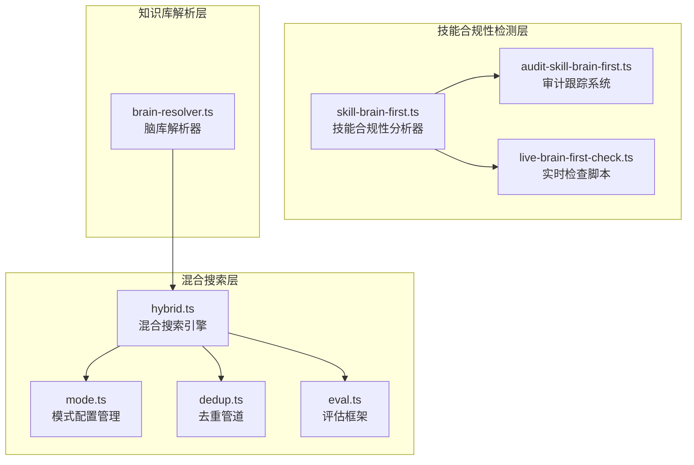
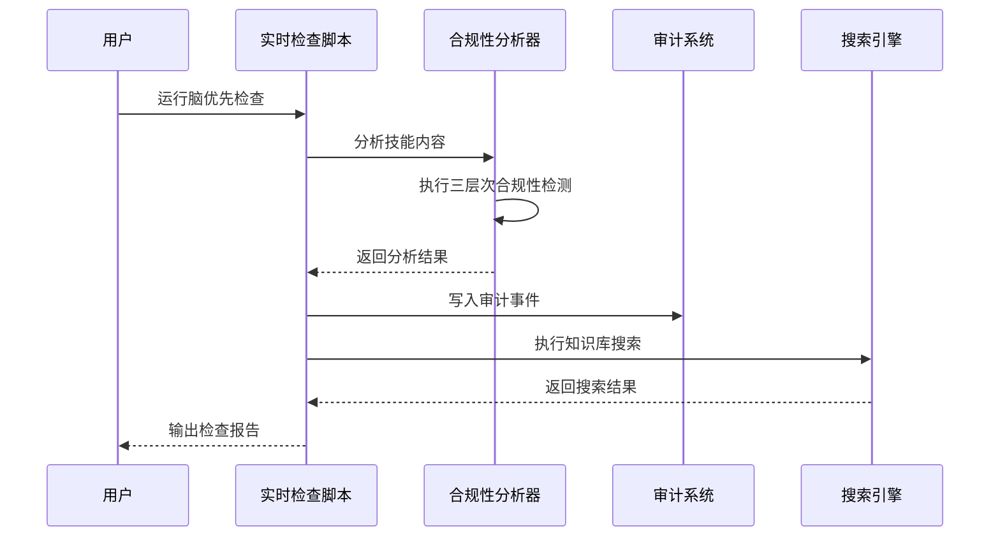
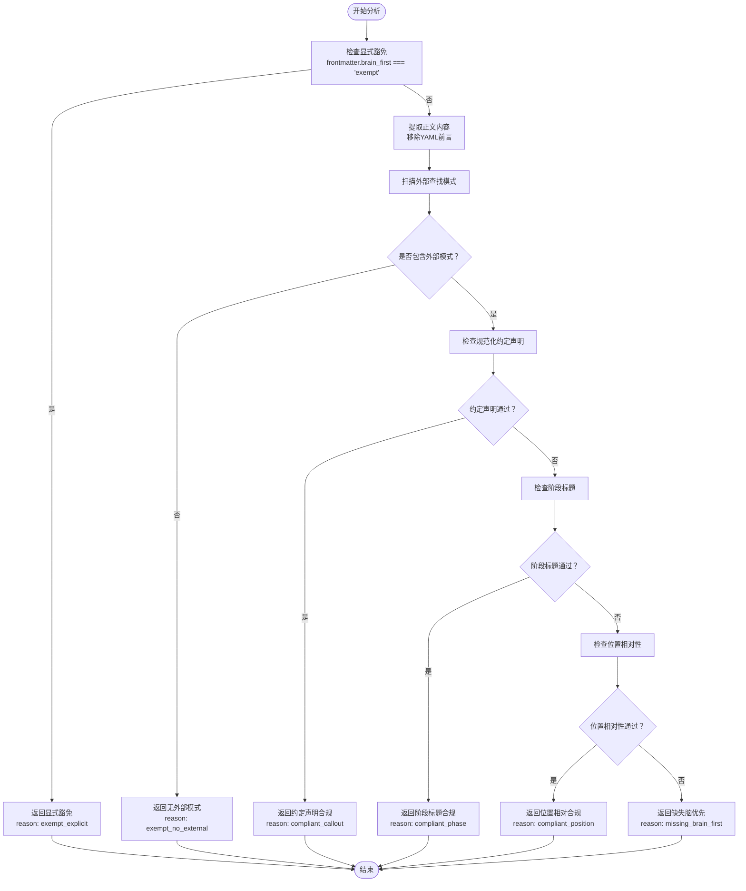
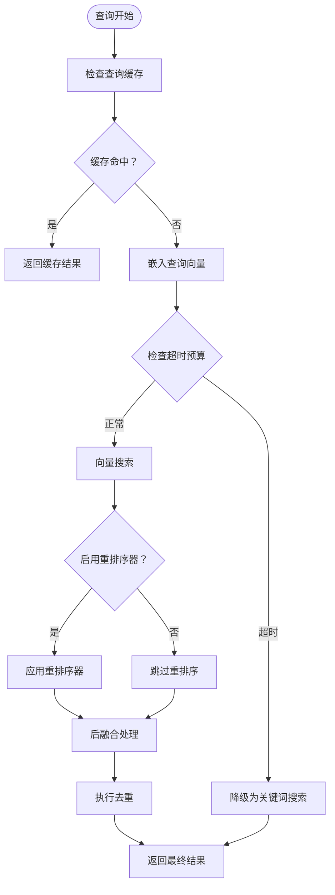
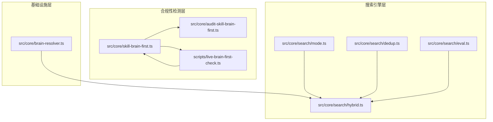

# 脑优先查找机制

<cite>
**本文档引用的文件**
- [skill-brain-first.ts](file://src/core/skill-brain-first.ts)
- [audit-skill-brain-first.ts](file://src/core/audit-skill-brain-first.ts)
- [live-brain-first-check.ts](file://scripts/live-brain-first-check.ts)
- [brain-resolver.ts](file://src/core/brain-resolver.ts)
- [hybrid.ts](file://src/core/search/hybrid.ts)
- [mode.ts](file://src/core/search/mode.ts)
- [dedup.ts](file://src/core/search/dedup.ts)
- [eval.ts](file://src/core/search/eval.ts)
</cite>

## 目录
1. [引言](#引言)
2. [项目结构](#项目结构)
3. [核心组件](#核心组件)
4. [架构概览](#架构概览)
5. [详细组件分析](#详细组件分析)
6. [依赖关系分析](#依赖关系分析)
7. [性能考虑](#性能考虑)
8. [故障排除指南](#故障排除指南)
9. [结论](#结论)
10. [附录](#附录)

## 引言

GBrain脑优先查找机制是一个综合性的知识检索系统，旨在确保在执行任何外部API调用之前，系统会优先检查内部知识库中的相关信息。该机制通过三个层面的合规性检测来实现：规范化的约定声明、明确的阶段标题标识，以及基于位置的参考顺序验证。

该系统的核心目标是在保持高召回率的同时，确保所有外部查询都经过内部知识库的优先检查，从而避免重复工作并提高整体效率。通过严格的合规性检测和审计跟踪，系统能够维护知识库的完整性和一致性。

## 项目结构

GBRain系统的脑优先查找机制分布在多个核心模块中，形成了一个完整的查找生态系统：

**图表来源**
- [skill-brain-first.ts:1-400](file://src/core/skill-brain-first.ts#L1-L400)
- [audit-skill-brain-first.ts:1-313](file://src/core/audit-skill-brain-first.ts#L1-L313)
- [brain-resolver.ts:1-134](file://src/core/brain-resolver.ts#L1-L134)
- [hybrid.ts:1-800](file://src/core/search/hybrid.ts#L1-L800)

**章节来源**
- [skill-brain-first.ts:1-400](file://src/core/skill-brain-first.ts#L1-L400)
- [audit-skill-brain-first.ts:1-313](file://src/core/audit-skill-brain-first.ts#L1-L313)
- [brain-resolver.ts:1-134](file://src/core/brain-resolver.ts#L1-L134)

## 核心组件

### 技能合规性分析器

技能合规性分析器是整个脑优先机制的核心，它实现了三层次的合规性检测逻辑：

**豁免优先级规则：**
1. 明确的声明豁免（frontmatter中的brain_first: exempt）
2. 无外部查找模式（正文未包含任何外部工具模式）
3. 合规性检测（三种合规路径任一满足）

**合规性检测路径：**
- 规范化约定声明：检测> **Convention:** ... brain-first ... callout
- 明确阶段标题：## Phase 1或## Step 0 brain heading
- 位置相对性：第一个脑引用出现在第一个外部引用之前

**章节来源**
- [skill-brain-first.ts:18-325](file://src/core/skill-brain-first.ts#L18-L325)

### 审计跟踪系统

审计跟踪系统采用快照+差异对比的方式，避免了传统审计方法产生的噪声数据：

**快照管理策略：**
- 使用原子性写入（mkstemp风格临时文件 + rename）
- ISO周格式命名（skill-brain-first-YYYY-Www.jsonl）
- 最后写入获胜的并发处理语义

**事件类型：**
- detected：新违规技能检测
- resolved：违规状态解决
- fixed：自动修复应用

**章节来源**
- [audit-skill-brain-first.ts:40-253](file://src/core/audit-skill-brain-first.ts#L40-L253)

### 实时检查脚本

实时检查脚本提供了手动验证功能，支持多种输出模式：

**功能特性：**
- 支持JSON和人类可读两种输出格式
- 提供--fix-preview预览功能
- 集成干修复（dry-fix）提案生成

**章节来源**
- [live-brain-first-check.ts:40-176](file://scripts/live-brain-first-check.ts#L40-L176)

## 架构概览

GBRain的脑优先查找机制采用分层架构设计，确保每个组件都有明确的职责分工：

**图表来源**
- [live-brain-first-check.ts:63-149](file://scripts/live-brain-first-check.ts#L63-L149)
- [skill-brain-first.ts:226-325](file://src/core/skill-brain-first.ts#L226-L325)
- [audit-skill-brain-first.ts:232-253](file://src/core/audit-skill-brain-first.ts#L232-L253)

## 详细组件分析

### 技能合规性检测算法

技能合规性检测算法实现了复杂的文本匹配和位置分析逻辑：

**图表来源**
- [skill-brain-first.ts:236-325](file://src/core/skill-brain-first.ts#L236-L325)

**章节来源**
- [skill-brain-first.ts:226-325](file://src/core/skill-brain-first.ts#L226-L325)

### 混合搜索引擎

混合搜索引擎实现了多层去重和优化策略：

**去重管道五层架构：**
1. 按来源保留每页最高分的3个片段
2. 基于文本相似度去除重复片段（Jaccard相似度>0.85）
3. 确保页面类型多样性（每种类型不超过60%）
4. 限制每页最大片段数（默认2个）
5. 编译真相保证：每页至少保留1个compiled_truth片段

**章节来源**
- [dedup.ts:37-209](file://src/core/search/dedup.ts#L37-L209)

### 模式配置管理系统

模式配置管理系统提供了灵活的搜索参数配置：

**三种模式配置：**
- **conservative**：成本敏感模式，禁用重排序器，限制搜索上限为10
- **balanced**：平衡模式，默认启用重排序器，搜索上限25
- **tokenmax**：高性能模式，启用扩展查询和重排序器，搜索上限50

**章节来源**
- [mode.ts:285-439](file://src/core/search/mode.ts#L285-L439)

### 超时处理和回退机制

混合搜索引擎实现了完善的超时处理和回退机制：

**图表来源**
- [hybrid.ts:772-800](file://src/core/search/hybrid.ts#L772-L800)
- [hybrid.ts:748-770](file://src/core/search/hybrid.ts#L748-L770)

**章节来源**
- [hybrid.ts:707-770](file://src/core/search/hybrid.ts#L707-L770)

## 依赖关系分析

GBRain脑优先查找机制的依赖关系体现了清晰的分层设计：

**图表来源**
- [skill-brain-first.ts:1-400](file://src/core/skill-brain-first.ts#L1-L400)
- [audit-skill-brain-first.ts:1-313](file://src/core/audit-skill-brain-first.ts#L1-L313)
- [live-brain-first-check.ts:1-176](file://scripts/live-brain-first-check.ts#L1-L176)
- [brain-resolver.ts:1-134](file://src/core/brain-resolver.ts#L1-L134)
- [hybrid.ts:1-800](file://src/core/search/hybrid.ts#L1-L800)
- [mode.ts:1-800](file://src/core/search/mode.ts#L1-L800)
- [dedup.ts:1-209](file://src/core/search/dedup.ts#L1-L209)
- [eval.ts:1-293](file://src/core/search/eval.ts#L1-L293)

**章节来源**
- [skill-brain-first.ts:1-400](file://src/core/skill-brain-first.ts#L1-L400)
- [audit-skill-brain-first.ts:1-313](file://src/core/audit-skill-brain-first.ts#L1-L313)
- [live-brain-first-check.ts:1-176](file://scripts/live-brain-first-check.ts#L1-L176)
- [brain-resolver.ts:1-134](file://src/core/brain-resolver.ts#L1-L134)
- [hybrid.ts:1-800](file://src/core/search/hybrid.ts#L1-L800)
- [mode.ts:1-800](file://src/core/search/mode.ts#L1-L800)
- [dedup.ts:1-209](file://src/core/search/dedup.ts#L1-L209)
- [eval.ts:1-293](file://src/core/search/eval.ts#L1-L293)

## 性能考虑

### 并发控制策略

系统采用了多种并发控制机制来确保数据一致性和性能：

**审计系统的并发处理：**
- 使用原子性写入避免竞态条件
- 最后写入获胜的语义简化了并发控制
- 快照文件的唯一后缀确保写入隔离

**搜索缓存的并发处理：**
- 使用Set跟踪待完成的缓存写入
- 注册后台工作清理器确保进程退出时的资源清理
- 超时机制防止长时间挂起的缓存操作

### 性能优化技术

**查询缓存优化：**
- 基于knobs哈希的跨模式隔离
- 可配置的相似度阈值和TTL
- 支持不同嵌入列和模型的缓存隔离

**搜索算法优化：**
- Reciprocal Rank Fusion (RRF)减少过度优化
- 自适应返回策略根据查询意图调整结果数量
- 多层去重确保结果质量同时保持性能

**内存管理优化：**
- 流式处理大量结果集
- 智能的垃圾回收和内存释放
- 避免不必要的数据复制

## 故障排除指南

### 常见问题诊断

**技能合规性检测失败：**
1. 检查frontmatter中的brain_first字段拼写
2. 验证约定声明的格式是否正确
3. 确认阶段标题的命名规范
4. 检查位置相对性检测逻辑

**审计系统问题：**
1. 检查审计目录的权限设置
2. 验证ISO周格式文件名的生成
3. 确认快照文件的原子性写入
4. 检查并发写入的竞争条件

**搜索性能问题：**
1. 调整查询缓存配置参数
2. 检查嵌入模型的性能
3. 优化去重参数设置
4. 监控内存使用情况

**章节来源**
- [audit-skill-brain-first.ts:173-194](file://src/core/audit-skill-brain-first.ts#L173-L194)
- [hybrid.ts:85-103](file://src/core/search/hybrid.ts#L85-L103)

### 调试工具和监控

**实时检查工具：**
- 提供详细的合规性分析报告
- 支持干修复预览功能
- 包含JSON格式的机器可读输出

**性能监控指标：**
- 查询响应时间统计
- 缓存命中率监控
- 去重效果评估
- 搜索质量指标

**章节来源**
- [live-brain-first-check.ts:106-170](file://scripts/live-brain-first-check.ts#L106-L170)

## 结论

GBRain脑优先查找机制通过多层次的设计实现了高效的脑优先策略。该系统不仅确保了知识库的优先利用，还提供了完善的合规性检测、审计跟踪和性能优化机制。

**主要优势：**
1. **严格的合规性检测**：三层次检测确保所有外部查询都经过内部检查
2. **智能的审计系统**：快照+差异对比避免了噪声数据
3. **灵活的配置管理**：支持多种搜索模式以适应不同场景需求
4. **完善的性能优化**：多层去重和缓存机制确保高效运行
5. **强大的故障恢复**：超时处理和回退机制保证系统稳定性

该机制为构建可靠的AI代理提供了坚实的基础，确保在追求外部信息获取的同时，不会忽略内部知识库的价值。

## 附录

### 配置参数参考

**搜索模式配置：**
- `search.mode`：选择conservative、balanced或tokenmax模式
- `search.cache_enabled`：启用/禁用查询缓存
- `search.reranker_enabled`：启用/禁用重排序器
- `search.tokenBudget`：设置令牌预算限制

**合规性检测配置：**
- `brain_first.exempt`：显式豁免声明
- `EXTERNAL_LOOKUP_PATTERNS`：外部查找工具模式列表
- `BRAIN_REFERENCE_PATTERNS`：脑引用模式列表

**章节来源**
- [mode.ts:441-492](file://src/core/search/mode.ts#L441-L492)
- [skill-brain-first.ts:100-121](file://src/core/skill-brain-first.ts#L100-L121)