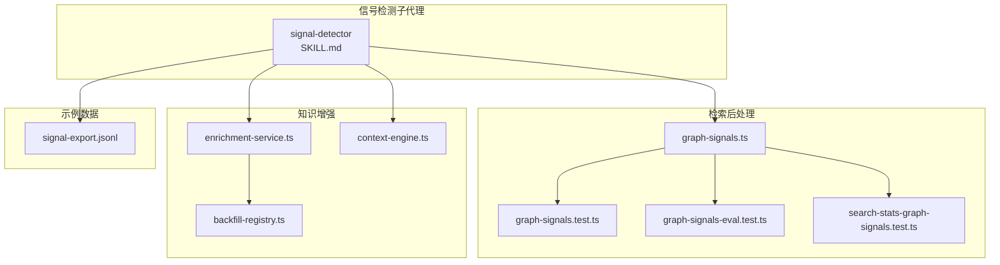
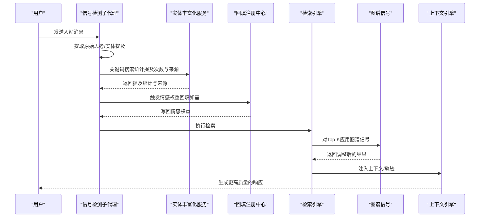
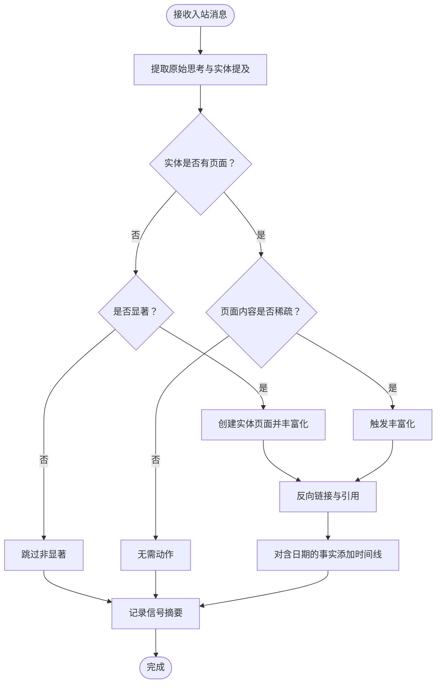
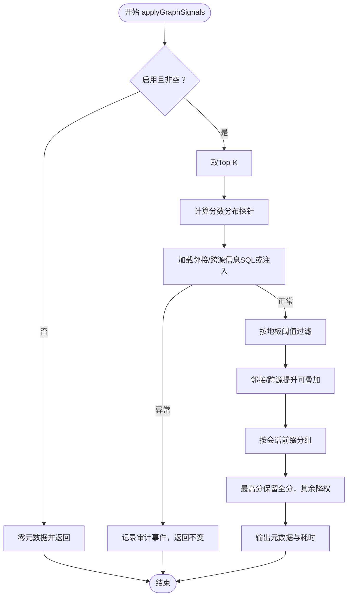
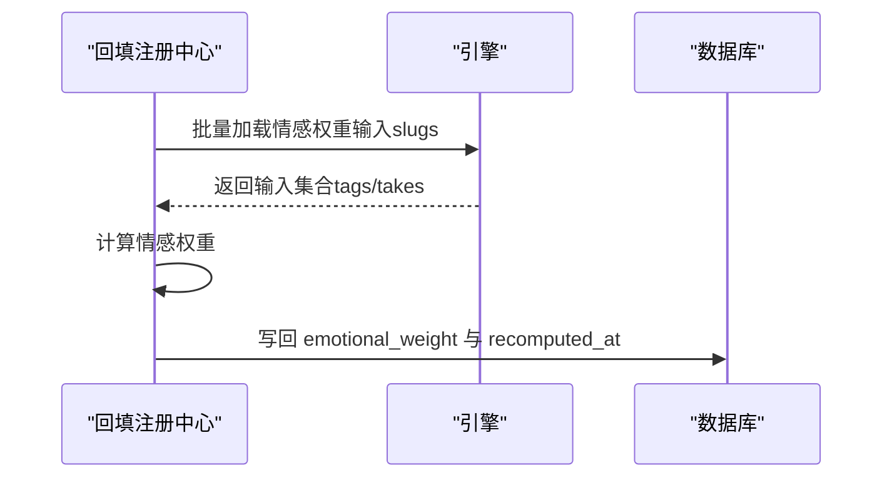
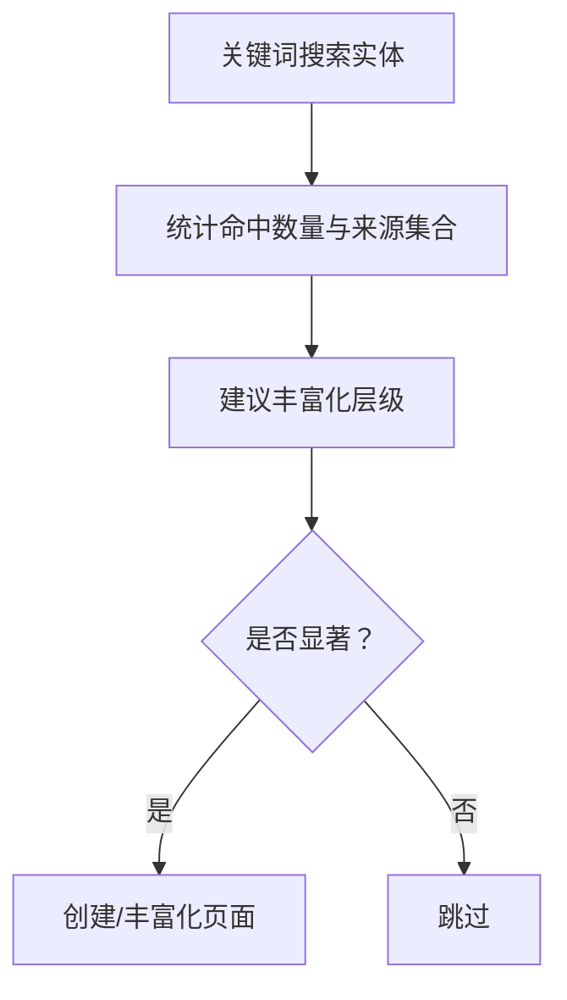
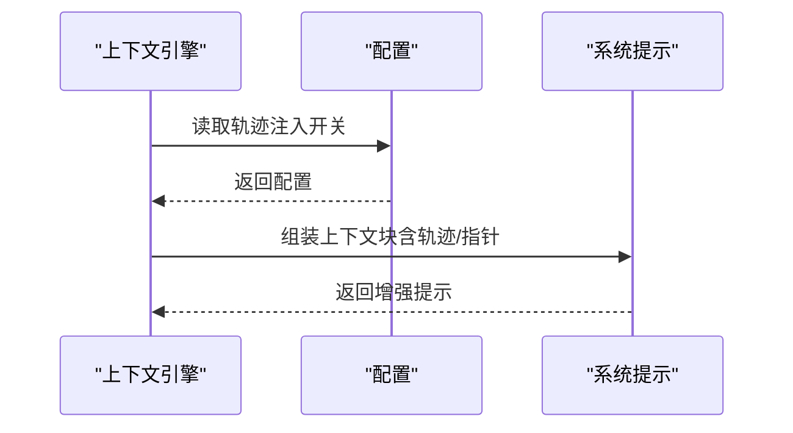
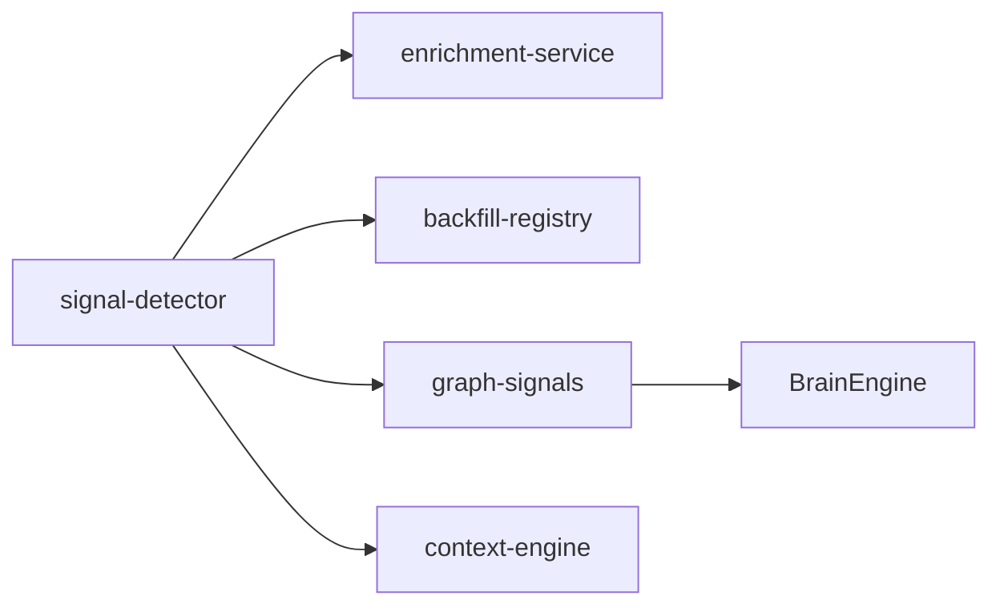

# 信号检测系统

<cite>
**本文引用的文件**
- [SKILL.md](file://skills/signal-detector/SKILL.md)
- [graph-signals.ts](file://src/core/search/graph-signals.ts)
- [graph-signals.test.ts](file://test/search/graph-signals.test.ts)
- [graph-signals-eval.test.ts](file://test/e2e/graph-signals-eval.test.ts)
- [search-stats-graph-signals.test.ts](file://test/search/search-stats-graph-signals.test.ts)
- [backfill-registry.ts](file://src/core/backfill-registry.ts)
- [enrichment-service.ts](file://src/core/enrichment-service.ts)
- [context-engine.ts](file://src/core/context-engine.ts)
- [signal-export.jsonl](file://test/fixtures/conversation-formats/signal-export.jsonl)
</cite>

## 目录
1. [引言](#引言)
2. [项目结构](#项目结构)
3. [核心组件](#核心组件)
4. [架构总览](#架构总览)
5. [详细组件分析](#详细组件分析)
6. [依赖关系分析](#依赖关系分析)
7. [性能考量](#性能考量)
8. [故障排查指南](#故障排查指南)
9. [结论](#结论)
10. [附录](#附录)

## 引言
本技术文档聚焦于GBrain的“信号检测系统”，系统以轻量子代理的形式在每次入站消息到达时自动触发，旨在从消息中提取两类等价重要的“信号”：
- 原始思考（Original Thinking）：用户的原创观点、观察、论点与框架，强调保留用户原话，避免转述。
- 实体提及（Entity Mentions）：人名、公司、媒体标题等，用于构建与增强脑页，并建立反向链接。

系统同时内建“图谱信号”（Graph Signals）后处理阶段，对Top-K结果进行邻接提升、跨源提升与会话去重，确保检索质量与多样性；并提供情感权重（Emotional Weight）与重要性评分（基于置信度与上下文注入）的计算与回填能力，支撑后续“脑优先查找”与“知识增强”。

## 项目结构
围绕信号检测的关键模块与文件如下：
- 技能契约与行为规范：skills/signal-detector/SKILL.md
- 图谱信号后处理：src/core/search/graph-signals.ts 及其单元/端到端测试
- 情感权重回填：src/core/backfill-registry.ts 中的 emotional_weight 回填注册
- 实体计数与丰富化建议：src/core/enrichment-service.ts
- 上下文注入与轨迹注入：src/core/context-engine.ts
- 示例对话格式（信号导出样例）：test/fixtures/conversation-formats/signal-export.jsonl

**图表来源**
- [SKILL.md:1-113](file://skills/signal-detector/SKILL.md#L1-L113)
- [graph-signals.ts:1-419](file://src/core/search/graph-signals.ts#L1-L419)
- [graph-signals.test.ts:1-200](file://test/search/graph-signals.test.ts#L1-L200)
- [graph-signals-eval.test.ts:199-230](file://test/e2e/graph-signals-eval.test.ts#L199-L230)
- [search-stats-graph-signals.test.ts:100-183](file://test/search/search-stats-graph-signals.test.ts#L100-L183)
- [backfill-registry.ts:117-173](file://src/core/backfill-registry.ts#L117-L173)
- [enrichment-service.ts:196-222](file://src/core/enrichment-service.ts#L196-L222)
- [context-engine.ts:79-109](file://src/core/context-engine.ts#L79-L109)
- [signal-export.jsonl:1-2](file://test/fixtures/conversation-formats/signal-export.jsonl#L1-L2)

**章节来源**
- [SKILL.md:1-113](file://skills/signal-detector/SKILL.md#L1-L113)
- [graph-signals.ts:1-419](file://src/core/search/graph-signals.ts#L1-L419)
- [graph-signals.test.ts:1-200](file://test/search/graph-signals.test.ts#L1-L200)
- [graph-signals-eval.test.ts:199-230](file://test/e2e/graph-signals-eval.test.ts#L199-L230)
- [search-stats-graph-signals.test.ts:100-183](file://test/search/search-stats-graph-signals.test.ts#L100-L183)
- [backfill-registry.ts:117-173](file://src/core/backfill-registry.ts#L117-L173)
- [enrichment-service.ts:196-222](file://src/core/enrichment-service.ts#L196-L222)
- [context-engine.ts:79-109](file://src/core/context-engine.ts#L79-L109)
- [signal-export.jsonl:1-2](file://test/fixtures/conversation-formats/signal-export.jsonl#L1-L2)

## 核心组件
- 信号检测子代理（signal-detector）
  - 行为契约：每条入站消息均触发；并行执行；捕获原始思考与实体提及；记录单行摘要日志；强制反向链接与事实引用。
  - 输出：无声运行，仅产生脑页与信号日志。
- 图谱信号后处理（Graph Signals）
  - 在混合检索的第四阶段应用，对Top-K结果进行三类加性信号：
    - 邻接提升（Adjacency Within Top-K）：Top-K内互相链接的页面获得小幅提升。
    - 跨源邻接提升（Cross-Source Adjacency）：来自不同源的链接使页面获得更大提升。
    - 会话去重（Session Diversification）：同一会话内的多条结果按分数去重，保留最高分。
  - 保护机制：地板阈值门禁（floor-gate），弱结果即使为枢纽也不会压过强结果；失败开路（fail-open），SQL异常时返回不变并记录审计事件。
- 情感权重与重要性评分
  - 情感权重回填：通过 backfill-registry 注册的 emotional_weight 回填任务，批量计算并写回 pages 表。
  - 置信度与上下文注入：结合检索上下文、轨迹注入与上下文引擎，形成“重要性评分”的综合输入。
- 实体提及与丰富化
  - 使用关键词搜索统计实体提及次数与来源，建议丰富化层级，避免对非显著实体的过度索引。

**章节来源**
- [SKILL.md:25-113](file://skills/signal-detector/SKILL.md#L25-L113)
- [graph-signals.ts:1-419](file://src/core/search/graph-signals.ts#L1-L419)
- [backfill-registry.ts:117-173](file://src/core/backfill-registry.ts#L117-L173)
- [enrichment-service.ts:196-222](file://src/core/enrichment-service.ts#L196-L222)

## 架构总览
信号检测贯穿“入站消息—原始思考/实体提取—图谱信号—情感权重—上下文注入—后续脑优先查找”的闭环：

**图表来源**
- [SKILL.md:25-113](file://skills/signal-detector/SKILL.md#L25-L113)
- [graph-signals.ts:289-419](file://src/core/search/graph-signals.ts#L289-L419)
- [backfill-registry.ts:117-173](file://src/core/backfill-registry.ts#L117-L173)
- [enrichment-service.ts:196-222](file://src/core/enrichment-service.ts#L196-L222)
- [context-engine.ts:79-109](file://src/core/context-engine.ts#L79-L109)

## 详细组件分析

### 组件A：信号检测子代理（signal-detector）
职责与流程：
- 原始思考检测：在用户表达原创观点或框架时，创建/更新 originals 或 concepts/ideas 页面，保留用户原话，禁止转述。
- 实体检测：提取人名、公司、媒体标题；若无页面则按显著性判断是否创建；若存在但内容稀疏则触发丰富化；对含具体日期的事实调用时间线记录工具。
- 反向链接与引用：强制从实体页反链至新写入页面；每个事实附带引用；记录单行信号摘要。

**图表来源**
- [SKILL.md:55-95](file://skills/signal-detector/SKILL.md#L55-L95)

**章节来源**
- [SKILL.md:25-113](file://skills/signal-detector/SKILL.md#L25-L113)

### 组件B：图谱信号（Graph Signals）
功能与保护机制：
- 邻接提升：当Top-K内某页面被≥2个其他Top-K页面反链，则乘以小幅度倍增系数。
- 跨源邻接提升：当来自≥2个不同源的链接命中该页面，叠加更大倍增系数。
- 会话去重：对具有会话特征（聊天标记或日期段）的结果按会话前缀分组，最高分保留全分，其余按小于1的系数降权。
- 地板阈值门禁：低于阈值的结果不参与任何提升，防止弱枢纽压过强非枢纽。
- 失败开路：SQL查询异常时返回不变，并记录审计事件，保证检索继续。

**图表来源**
- [graph-signals.ts:289-419](file://src/core/search/graph-signals.ts#L289-L419)

**章节来源**
- [graph-signals.ts:1-419](file://src/core/search/graph-signals.ts#L1-L419)
- [graph-signals.test.ts:120-200](file://test/search/graph-signals.test.ts#L120-L200)
- [graph-signals-eval.test.ts:199-230](file://test/e2e/graph-signals-eval.test.ts#L199-L230)
- [search-stats-graph-signals.test.ts:100-183](file://test/search/search-stats-graph-signals.test.ts#L100-L183)

### 组件C：情感权重与重要性评分
- 情感权重回填：通过 backfill-registry 注册 emotional_weight 回填任务，批量读取实体输入（标签与行动项），计算情感权重并写回 pages 表，同时记录重新计算时间戳。
- 重要性评分：结合检索上下文、轨迹注入与上下文引擎，形成“重要性评分”的综合输入，用于后续排序与优先级决策。

**图表来源**
- [backfill-registry.ts:117-173](file://src/core/backfill-registry.ts#L117-L173)

**章节来源**
- [backfill-registry.ts:117-173](file://src/core/backfill-registry.ts#L117-L173)
- [context-engine.ts:79-109](file://src/core/context-engine.ts#L79-L109)

### 组件D：实体提及与丰富化建议
- 基于关键词搜索统计实体提及次数与来源，推断丰富化层级，避免对低频或非显著实体的过度索引。
- 依据来源类别（人物/公司/会议/媒体/想法/语音笔记/运营）给出丰富化策略。

**图表来源**
- [enrichment-service.ts:196-222](file://src/core/enrichment-service.ts#L196-L222)

**章节来源**
- [enrichment-service.ts:196-222](file://src/core/enrichment-service.ts#L196-L222)

### 组件E：上下文注入与轨迹注入
- 上下文引擎负责在推理前组装系统提示，注入“已知轨迹”、“当前轮次指针”等上下文信息，提升回答质量与一致性。
- 轨迹注入开关与配置项可控制是否注入已知轨迹，避免对非时间敏感意图的误注入。

**图表来源**
- [context-engine.ts:79-109](file://src/core/context-engine.ts#L79-L109)

**章节来源**
- [context-engine.ts:79-109](file://src/core/context-engine.ts#L79-L109)

## 依赖关系分析
- 信号检测子代理依赖实体丰富化服务与回填注册中心，以确保实体页面的及时创建与情感权重的更新。
- 图谱信号作为检索后处理阶段的一部分，依赖引擎提供的邻接/跨源信息，并通过地板阈值门禁与失败开路保障稳定性。
- 上下文引擎与轨迹注入为信号检测提供语境支持，影响最终响应的质量与相关性。

**图表来源**
- [SKILL.md:25-113](file://skills/signal-detector/SKILL.md#L25-L113)
- [graph-signals.ts:289-419](file://src/core/search/graph-signals.ts#L289-L419)
- [backfill-registry.ts:117-173](file://src/core/backfill-registry.ts#L117-L173)
- [enrichment-service.ts:196-222](file://src/core/enrichment-service.ts#L196-L222)
- [context-engine.ts:79-109](file://src/core/context-engine.ts#L79-L109)

**章节来源**
- [graph-signals.ts:289-419](file://src/core/search/graph-signals.ts#L289-L419)
- [backfill-registry.ts:117-173](file://src/core/backfill-registry.ts#L117-L173)
- [enrichment-service.ts:196-222](file://src/core/enrichment-service.ts#L196-L222)
- [context-engine.ts:79-109](file://src/core/context-engine.ts#L79-L109)

## 性能考量
- 并行化与非阻塞：信号检测子代理以子代理形式并行触发，不阻塞主响应路径。
- 批量处理优化：
  - 回填注册中心对情感权重回填提供批量接口与估算吞吐，减少逐行写入开销。
  - 图谱信号在Top-K上进行一次性邻接/跨源查询，避免重复扫描。
- 保护与失败开路：地板阈值门禁与失败开路确保在异常情况下仍保持检索稳定。
- 会话去重：单次遍历分组与一次排序，降低复杂度并避免“弱片段竞争令牌预算”的结构性错误。

[本节为通用性能讨论，不直接分析具体文件]

## 故障排查指南
- 图谱信号失败审计：
  - 当邻接/跨源查询抛错时，系统记录失败审计事件，可通过 doctor 与 search stats 查看失败率与原因。
- 单测与端到端验证：
  - 单元测试覆盖禁用、空结果、邻接/跨源提升、会话去重、地板阈值门禁与失败开路等场景。
  - 端到端评估使用 Bootstrap 检验对比开启/关闭图谱信号的召回变化，确保开启不会显著降低效果。
- 审计与可观测性：
  - 启用搜索统计命令可查看图谱信号的启用状态、失败计数与失败原因分布。

**章节来源**
- [graph-signals.ts:128-157](file://src/core/search/graph-signals.ts#L128-L157)
- [graph-signals.test.ts:120-200](file://test/search/graph-signals.test.ts#L120-L200)
- [graph-signals-eval.test.ts:199-230](file://test/e2e/graph-signals-eval.test.ts#L199-L230)
- [search-stats-graph-signals.test.ts:100-183](file://test/search/search-stats-graph-signals.test.ts#L100-L183)

## 结论
GBrain的信号检测系统通过“原始思考与实体提及”的双轨采集、图谱信号的稳健后处理、情感权重的批量回填以及上下文/轨迹注入，形成了从消息到知识增强再到后续脑优先查找的完整闭环。系统在稳定性（失败开路）、公平性（地板阈值门禁）与多样性（会话去重）方面做了周密设计，适合在高并发与多样化消息场景中持续产出高质量信号。

[本节为总结性内容，不直接分析具体文件]

## 附录
- 实际应用示例参考：对话格式样例文件可用于验证信号导出与解析流程。

**章节来源**
- [signal-export.jsonl:1-2](file://test/fixtures/conversation-formats/signal-export.jsonl#L1-L2)