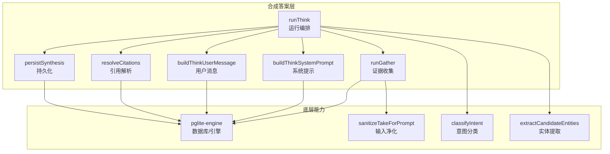
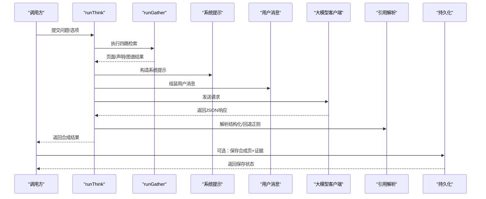
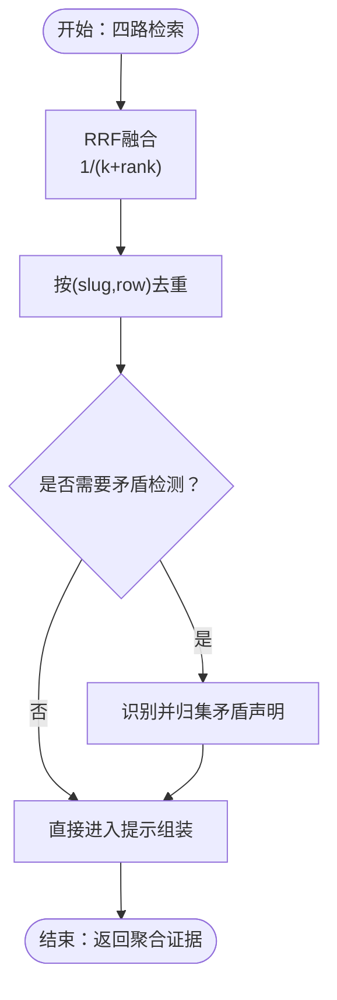
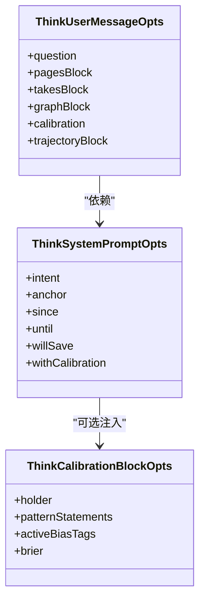
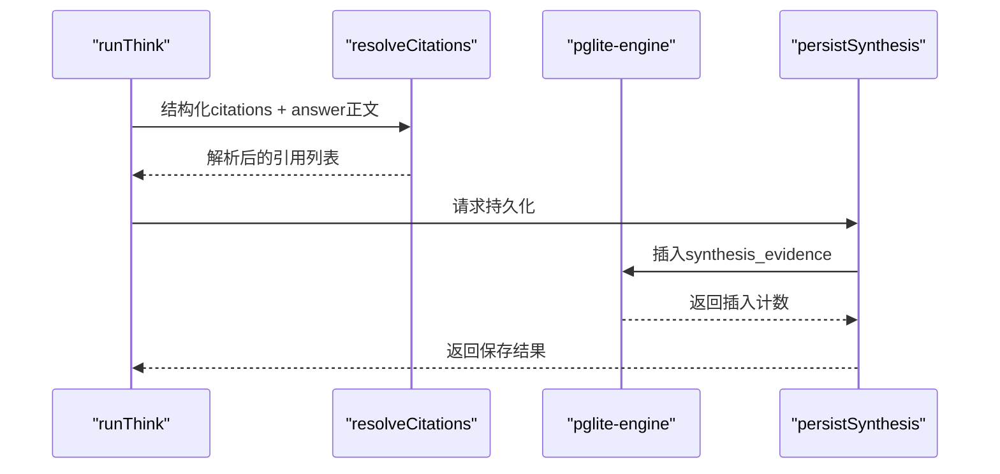
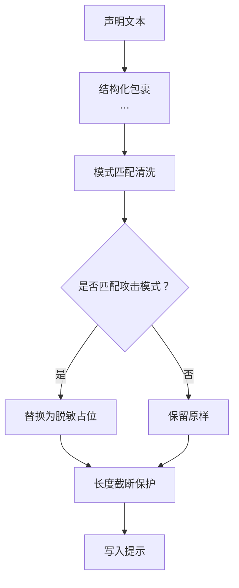
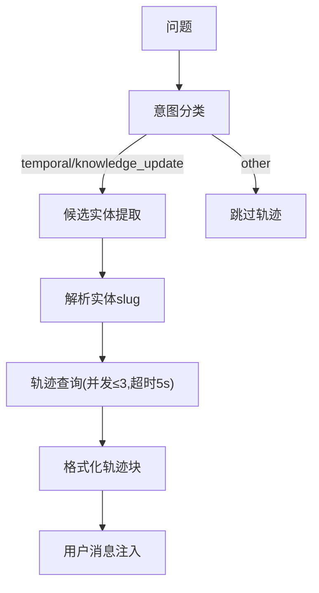
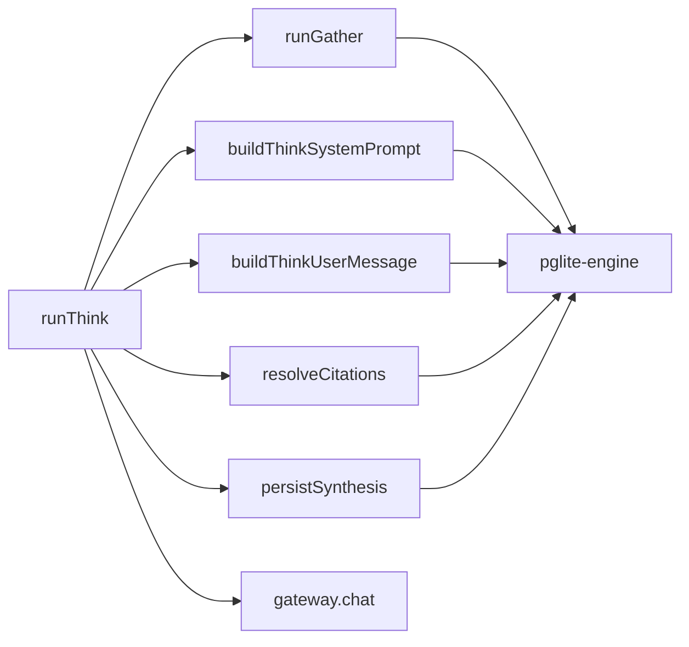

# 合成答案层

<cite>
**本文档引用的文件**
- [src/core/think/index.ts](file://src/core/think/index.ts)
- [src/core/think/gather.ts](file://src/core/think/gather.ts)
- [src/core/think/prompt.ts](file://src/core/think/prompt.ts)
- [src/core/think/cite-render.ts](file://src/core/think/cite-render.ts)
- [src/core/think/sanitize.ts](file://src/core/think/sanitize.ts)
- [src/core/think/intent.ts](file://src/core/think/intent.ts)
- [src/core/think/entity-extract.ts](file://src/core/think/entity-extract.ts)
- [src/core/pglite-engine.ts](file://src/core/pglite-engine.ts)
- [test/think-pipeline.serial.test.ts](file://test/think-pipeline.serial.test.ts)
- [test/takes-engine.test.ts](file://test/takes-engine.test.ts)
- [test/search/evidence.test.ts](file://test/search/evidence.test.ts)
</cite>

## 目录
1. [简介](#简介)
2. [项目结构](#项目结构)
3. [核心组件](#核心组件)
4. [架构总览](#架构总览)
5. [详细组件分析](#详细组件分析)
6. [依赖关系分析](#依赖关系分析)
7. [性能考量](#性能考量)
8. [故障排查指南](#故障排查指南)
9. [结论](#结论)
10. [附录](#附录)

## 简介
本文件系统化阐述 GBrain 合成答案层（Synthesis Layer）的设计与实现，聚焦于如何将检索到的多源页面与声明（takes）综合为连贯、可溯源、可解释的答案。合成层通过“意图识别—证据收集—结构化解析—引用标注—持久化”的闭环流程，实现以下目标：
- 将页面级检索结果与声明级证据统一建模，进行加权融合与矛盾检测
- 基于结构化输出与内联标记实现可追溯的引用标注
- 提供缺口分析（gaps）以支持迭代追问与增量检索
- 通过校准注入与轨迹增强提升时间性与知识更新类问题的回答质量
- 以安全的提示工程与输入净化抵御注入风险

合成层相较传统搜索的根本性改进在于：从“返回若干片段”升级为“生成结构化解释”，并以证据持久化与引用追踪确保可审计性。

## 项目结构
合成答案层位于核心引擎的 think 子系统中，围绕以下模块协同工作：
- 运行入口与编排：runThink、persistSynthesis
- 检索与证据融合：runGather、Reciprocal Rank Fusion
- 提示工程与输出规范：buildThinkSystemPrompt、buildThinkUserMessage
- 引用解析与内联标记：resolveCitations、parseInlineCitations
- 输入净化与安全：sanitizeTakeForPrompt、INJECTION_PATTERNS
- 意图分类与轨迹注入：classifyIntent、extractCandidateEntities
- 引用持久化：addSynthesisEvidence、synthesis_evidence 表

**图表来源**
- [src/core/think/index.ts:226-521](file://src/core/think/index.ts#L226-L521)
- [src/core/think/gather.ts:97-177](file://src/core/think/gather.ts#L97-L177)
- [src/core/think/prompt.ts:72-226](file://src/core/think/prompt.ts#L72-L226)
- [src/core/think/cite-render.ts:112-123](file://src/core/think/cite-render.ts#L112-L123)
- [src/core/think/sanitize.ts:58-106](file://src/core/think/sanitize.ts#L58-L106)
- [src/core/think/intent.ts:69-74](file://src/core/think/intent.ts#L69-L74)
- [src/core/think/entity-extract.ts:114-173](file://src/core/think/entity-extract.ts#L114-L173)
- [src/core/pglite-engine.ts:4579-4586](file://src/core/pglite-engine.ts#L4579-L4586)

**章节来源**
- [src/core/think/index.ts:1-768](file://src/core/think/index.ts#L1-L768)
- [src/core/think/gather.ts:1-214](file://src/core/think/gather.ts#L1-L214)
- [src/core/think/prompt.ts:1-227](file://src/core/think/prompt.ts#L1-L227)
- [src/core/think/cite-render.ts:1-124](file://src/core/think/cite-render.ts#L1-L124)
- [src/core/think/sanitize.ts:1-107](file://src/core/think/sanitize.ts#L1-L107)
- [src/core/think/intent.ts:1-75](file://src/core/think/intent.ts#L1-L75)
- [src/core/think/entity-extract.ts:1-197](file://src/core/think/entity-extract.ts#L1-L197)
- [src/core/pglite-engine.ts:4579-4586](file://src/core/pglite-engine.ts#L4579-L4586)

## 核心组件
- 运行编排（runThink）
  - 负责模型解析、检索、提示构造、结构化解析、引用解析与持久化决策
  - 支持显式模型校验、校准注入、轨迹注入、回合循环等高级特性
- 证据收集（runGather）
  - 并行执行四路检索：混合页面检索、关键词/向量声明检索、图谱遍历
  - 使用 RRF 融合不同来源的排序，并按 slug/row 去重
- 提示工程（buildThinkSystemPrompt、buildThinkUserMessage）
  - 明确输出模式（JSON）、引用规则、矛盾披露、缺口说明
  - 支持校准块与轨迹块的条件注入
- 引用解析（resolveCitations）
  - 结构化优先，回退正则；保证引用稳定与可持久化
- 输入净化（sanitizeTakeForPrompt）
  - 针对声明内容的指令注入防护与长度限制
- 意图与轨迹（classifyIntent、extractCandidateEntities）
  - 识别时间性/知识更新意图，提取候选实体并注入已知轨迹

**章节来源**
- [src/core/think/index.ts:226-521](file://src/core/think/index.ts#L226-L521)
- [src/core/think/gather.ts:97-177](file://src/core/think/gather.ts#L97-L177)
- [src/core/think/prompt.ts:72-226](file://src/core/think/prompt.ts#L72-L226)
- [src/core/think/cite-render.ts:112-123](file://src/core/think/cite-render.ts#L112-L123)
- [src/core/think/sanitize.ts:58-106](file://src/core/think/sanitize.ts#L58-L106)
- [src/core/think/intent.ts:69-74](file://src/core/think/intent.ts#L69-L74)
- [src/core/think/entity-extract.ts:114-173](file://src/core/think/entity-extract.ts#L114-L173)

## 架构总览
合成答案层采用“分而治之”的流水线设计，各阶段职责清晰、边界明确，便于测试与演进。

**图表来源**
- [src/core/think/index.ts:226-521](file://src/core/think/index.ts#L226-L521)
- [src/core/think/gather.ts:97-177](file://src/core/think/gather.ts#L97-L177)
- [src/core/think/prompt.ts:72-226](file://src/core/think/prompt.ts#L72-L226)
- [src/core/think/cite-render.ts:112-123](file://src/core/think/cite-render.ts#L112-L123)

## 详细组件分析

### 组件A：证据聚合与矛盾检测（RRF融合与去重）
- 聚合策略
  - 四路检索并行：混合页面、关键词声明、向量声明、图谱遍历
  - RRF 融合：对每个来源的排名应用 1/(k+rank)，k=60，合并后降序排序
  - 去重键：(slug, row_num?)，避免重复证据进入提示
- 矛盾检测
  - 系统提示要求在“冲突”部分披露相互矛盾的声明，不进行单边选择
- 输出
  - 分离的 pages 与 takes 块，便于后续渲染与净化

**图表来源**
- [src/core/think/gather.ts:68-90](file://src/core/think/gather.ts#L68-L90)
- [src/core/think/gather.ts:159-177](file://src/core/think/gather.ts#L159-L177)
- [src/core/think/prompt.ts:53-56](file://src/core/think/prompt.ts#L53-L56)

**章节来源**
- [src/core/think/gather.ts:56-90](file://src/core/think/gather.ts#L56-L90)
- [src/core/think/gather.ts:97-177](file://src/core/think/gather.ts#L97-L177)
- [src/core/think/prompt.ts:53-56](file://src/core/think/prompt.ts#L53-L56)

### 组件B：提示工程与输出格式化
- 系统提示要点
  - 明确输出为 JSON，字段包括 answer、citations、gaps
  - 引用规则：[slug#row]（声明）、[slug]（页面），并要求内联标注
  - 对低置信或假设性声明进行标注（如权重<0.5或类型为hunch）
  - 矛盾必须披露，不得隐匿
- 用户消息结构
  - 默认路径：问题 → 页面块 → 声明块 → 图谱块 → 已知轨迹 → 输出指令
  - 校准路径：页面/声明/图谱 → 校准块 → 已知轨迹 → 问题 → 输出指令
- 输出格式
  - answer：Markdown 正文，包含“答案/冲突/缺口/校准”等小节
  - citations：结构化数组，含 page_slug、row_num、citation_index
  - gaps：缺失数据点清单

**图表来源**
- [src/core/think/prompt.ts:20-38](file://src/core/think/prompt.ts#L20-L38)
- [src/core/think/prompt.ts:106-130](file://src/core/think/prompt.ts#L106-L130)
- [src/core/think/prompt.ts:155-226](file://src/core/think/prompt.ts#L155-L226)

**章节来源**
- [src/core/think/prompt.ts:40-98](file://src/core/think/prompt.ts#L40-L98)
- [src/core/think/prompt.ts:132-226](file://src/core/think/prompt.ts#L132-L226)

### 组件C：引用标注与缺口分析
- 引用解析
  - 优先使用结构化 citations 字段；若缺失则回退到 answer 内联标记 [slug#row]/[slug]
  - 对无效条目发出警告并过滤
- 缺口分析
  - gaps 字段用于记录“缺乏相关数据”的具体缺失项，支持后续追问与检索
- 引用持久化
  - 通过 addSynthesisEvidence 将引用映射为 synthesis_evidence 记录，建立合成页与声明的关联

**图表来源**
- [src/core/think/index.ts:185-220](file://src/core/think/index.ts#L185-L220)
- [src/core/think/index.ts:527-573](file://src/core/think/index.ts#L527-L573)
- [src/core/think/cite-render.ts:112-123](file://src/core/think/cite-render.ts#L112-L123)
- [src/core/pglite-engine.ts:4579-4586](file://src/core/pglite-engine.ts#L4579-L4586)

**章节来源**
- [src/core/think/cite-render.ts:112-123](file://src/core/think/cite-render.ts#L112-L123)
- [src/core/think/index.ts:185-220](file://src/core/think/index.ts#L185-L220)
- [src/core/think/index.ts:527-573](file://src/core/think/index.ts#L527-L573)
- [src/core/pglite-engine.ts:4579-4586](file://src/core/pglite-engine.ts#L4579-L4586)

### 组件D：输入净化与安全
- 净化策略
  - 结构化包裹：<take>…</take> 明确指示模型将其中内容视为数据
  - 模式清洗：覆盖指令覆盖、标签注入、XML 属性注入、输出泄露、代码执行等常见攻击模式
  - 长度上限：超过阈值截断，防止提示预算被单一异常样本占用
- 安全边界
  - 在提示组装前对声明文本进行净化，降低注入风险
  - 对轨迹块同样实施标签清洗，确保新 XML 表面不被利用

**图表来源**
- [src/core/think/sanitize.ts:22-52](file://src/core/think/sanitize.ts#L22-L52)
- [src/core/think/sanitize.ts:58-74](file://src/core/think/sanitize.ts#L58-L74)
- [src/core/think/sanitize.ts:92-106](file://src/core/think/sanitize.ts#L92-L106)

**章节来源**
- [src/core/think/sanitize.ts:1-107](file://src/core/think/sanitize.ts#L1-L107)

### 组件E：意图识别与轨迹注入
- 意图分类
  - temporal：时间性问题（何时、多久以前、日期相关）
  - knowledge_update：知识更新/替代（改变、切换、不再…）
  - other：其他（不注入轨迹）
- 实体提取
  - 来自检索结果的实体前缀（people/companies/…）优先
  - 其次从问题中抽取名词短语，去除停用词与引导动词
  - 最终限制候选数量，避免轨迹查询膨胀
- 轨迹注入
  - 对每个候选实体执行轨迹查询，最多 100 点，拼接为 <trajectory> 块
  - 注入位置遵循“校准路径/默认路径”的约束，避免第三种顺序

**图表来源**
- [src/core/think/intent.ts:69-74](file://src/core/think/intent.ts#L69-L74)
- [src/core/think/entity-extract.ts:114-173](file://src/core/think/entity-extract.ts#L114-L173)
- [src/core/think/index.ts:320-398](file://src/core/think/index.ts#L320-L398)

**章节来源**
- [src/core/think/intent.ts:1-75](file://src/core/think/intent.ts#L1-L75)
- [src/core/think/entity-extract.ts:1-197](file://src/core/think/entity-extract.ts#L1-L197)
- [src/core/think/index.ts:315-398](file://src/core/think/index.ts#L315-L398)

## 依赖关系分析
- 组件耦合
  - runThink 是中枢，依赖 gather、prompt、cite-render、sanitize、intent、entity-extract
  - gather 依赖引擎接口与检索工具，输出标准化证据
  - prompt 与 cite-render 与引擎无直接耦合，纯函数式
- 外部依赖
  - 大模型网关（gateway.chat）作为统一适配层，屏蔽提供商差异
  - 数据库引擎负责合成页与证据持久化

**图表来源**
- [src/core/think/index.ts:226-521](file://src/core/think/index.ts#L226-L521)
- [src/core/think/gather.ts:97-177](file://src/core/think/gather.ts#L97-L177)
- [src/core/think/prompt.ts:72-226](file://src/core/think/prompt.ts#L72-L226)
- [src/core/think/cite-render.ts:112-123](file://src/core/think/cite-render.ts#L112-L123)
- [src/core/pglite-engine.ts:4579-4586](file://src/core/pglite-engine.ts#L4579-L4586)

**章节来源**
- [src/core/think/index.ts:226-521](file://src/core/think/index.ts#L226-L521)
- [src/core/think/gather.ts:97-177](file://src/core/think/gather.ts#L97-L177)
- [src/core/think/prompt.ts:72-226](file://src/core/think/prompt.ts#L72-L226)
- [src/core/think/cite-render.ts:112-123](file://src/core/think/cite-render.ts#L112-L123)
- [src/core/pglite-engine.ts:4579-4586](file://src/core/pglite-engine.ts#L4579-L4586)

## 性能考量
- 并行检索与限流
  - 四路检索并行执行，失败隔离（每路独立 try/catch），保证部分成功仍可合成
  - 轨迹查询并发上限 3，单个 5 秒超时，避免长尾阻塞
- 排序与融合
  - RRF 融合参数固定，避免额外超参开销；去重键稳定，减少重复处理
- 提示长度控制
  - 声明净化与长度截断，避免异常样本占用过多令牌
- 持久化成本
  - 引用持久化批量插入，避免逐条往返

[本节为通用指导，无需特定文件引用]

## 故障排查指南
- “未找到可用的大模型”
  - 现象：返回“no LLM available”或 synthesisOk=false
  - 排查：检查网关配置、环境变量、模型可用性探测
  - 参考：适配器逻辑与 graceful 降级
- “输出非JSON”
  - 现象：LLM_OUTPUT_NOT_JSON 警告，answer 为原始文本
  - 排查：确认系统提示输出 schema、模型输出稳定性
- “引用未持久化”
  - 现象：synthesis_evidence 插入计数为 0 或警告 CITATION_PAGE_NOT_IN_BRAIN
  - 排查：确认 slug 存在、row_num 有效、页面存在
- “证据安全策略”
  - 现象：弱证据不应触发“新建”动作
  - 排查：参考证据分级与 create_safety 规则

**章节来源**
- [src/core/think/index.ts:440-463](file://src/core/think/index.ts#L440-L463)
- [src/core/think/index.ts:472-485](file://src/core/think/index.ts#L472-L485)
- [src/core/think/index.ts:185-220](file://src/core/think/index.ts#L185-L220)
- [test/search/evidence.test.ts:38-50](file://test/search/evidence.test.ts#L38-L50)
- [test/takes-engine.test.ts:338-366](file://test/takes-engine.test.ts#L338-L366)

## 结论
合成答案层通过严格的证据聚合、结构化解析与安全净化，实现了从“检索片段”到“结构化解释”的跃迁。其关键优势包括：
- 可追溯的引用标注与缺口分析，支撑持续追问与增量检索
- 矛盾披露机制，提升回答透明度与可信度
- 轨迹注入与校准注入，显著改善时间性与知识更新类问题
- 完整的持久化与安全策略，保障可审计与抗注入

相较传统搜索，合成层不仅提升了答案质量，更建立了“证据—解释—引用—持久化”的闭环，为后续的智能体协作与知识治理奠定基础。

[本节为总结性内容，无需特定文件引用]

## 附录

### 合成答案的质量评估标准
- 正确性
  - 引用覆盖率：answer 中的主张是否均有对应引用
  - 矛盾披露率：相互矛盾的声明是否被完整呈现
- 完备性
  - 缺口完整性：gaps 是否覆盖所有缺失的关键信息
  - 结构完整性：answer 是否包含“答案/冲突/缺口/校准”等必要小节
- 可靠性
  - 引用稳定性：citations 的 page_slug/row_num 是否稳定
  - 安全性：是否存在注入风险或异常样本占用提示预算

### 优化策略
- 检索优化
  - 动态调整 gather_limit/takes_limit，平衡召回与提示长度
  - 引入更细粒度的证据分级（如证据强度、来源权威度）
- 提示优化
  - 增强校准注入与轨迹注入的条件判断，减少无关信息
  - 引入“反事实推理”提示，提升对不确定性表达的鲁棒性
- 持久化优化
  - 批量插入与去重策略优化，降低写放大
  - 引用索引与查询缓存，加速后续检索与回溯

[本节为通用指导，无需特定文件引用]