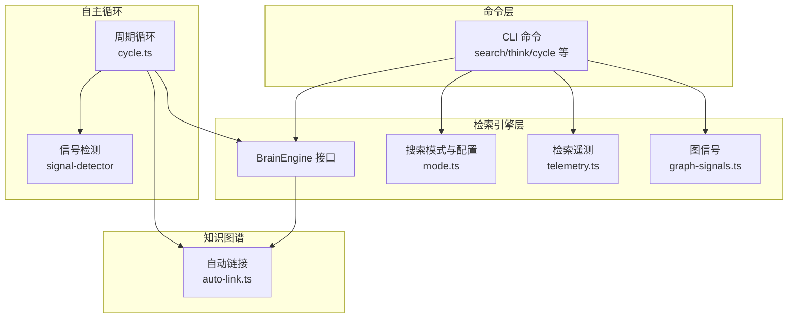
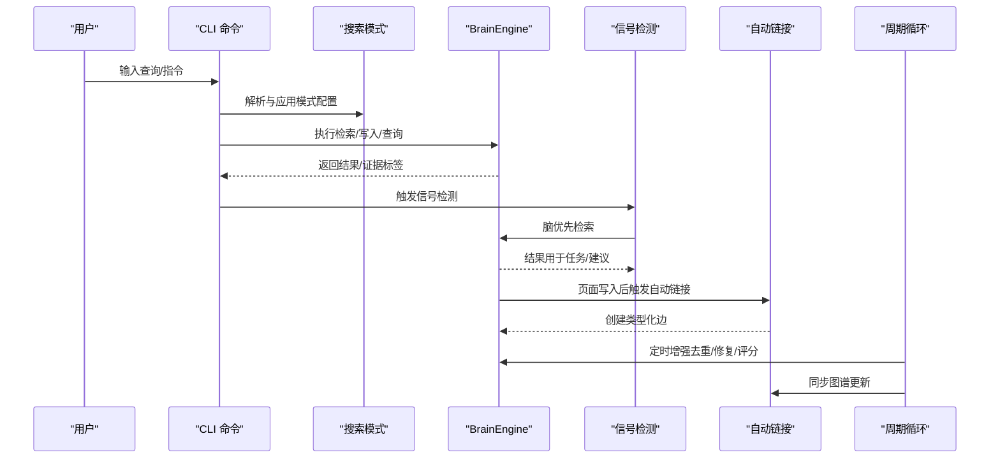
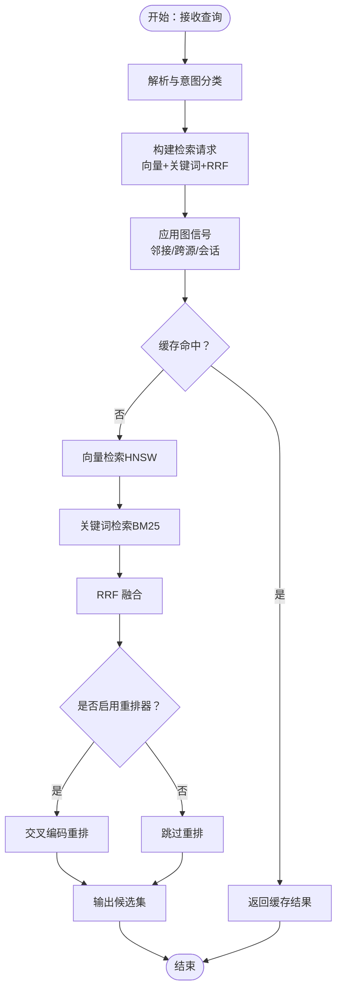
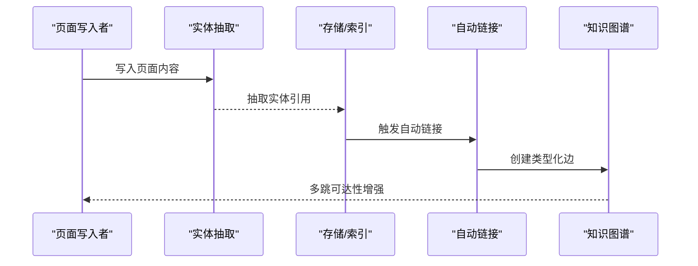
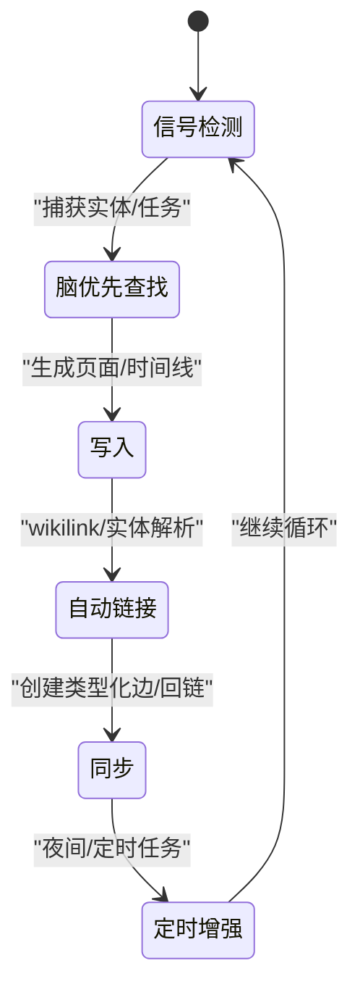
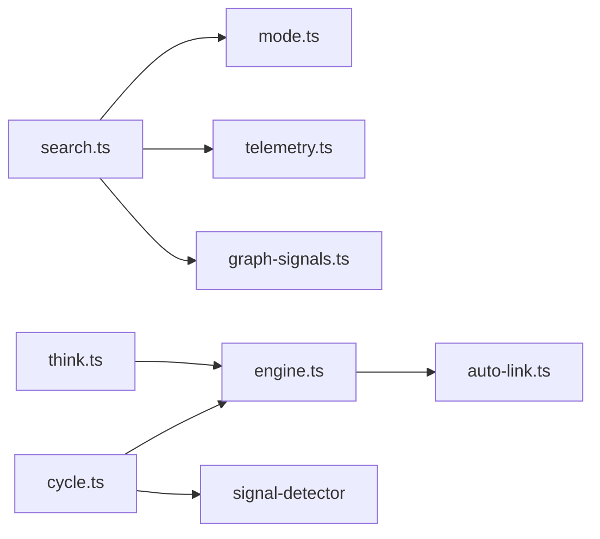

# 核心功能特性

<cite>
**本文引用的文件**
- [README.md](file://README.md)
- [search.ts](file://src/commands/search.ts)
- [think.ts](file://src/commands/think.ts)
- [cycle.ts](file://src/core/cycle.ts)
- [signal-detector](file://skills/signal-detector)
- [auto-link](file://src/core/auto-link.ts)
- [graph-signals.ts](file://src/core/search/graph-signals.ts)
- [mode.ts](file://src/core/search/mode.ts)
- [telemetry.ts](file://src/core/search/telemetry.ts)
- [engine.ts](file://src/core/engine.ts)
- [schema-pack](file://docs/architecture/schema-packs.md)
- [topologies.md](file://docs/architecture/topologies.md)
- [RETRIEVAL.md](file://docs/architecture/RETRIEVAL.md)
- [INSTALL.md](file://docs/INSTALL.md)
- [CLAUDE.md](file://CLAUDE.md)
- [AGENTS.md](file://AGENTS.md)
- [mcp/](file://docs/mcp/)
- [integrations/](file://docs/integrations/)
- [eval/](file://docs/eval/)
- [test/](file://test/)
</cite>

## 目录
1. [引言](#引言)
2. [项目结构](#项目结构)
3. [核心组件](#核心组件)
4. [架构总览](#架构总览)
5. [详细组件分析](#详细组件分析)
6. [依赖关系分析](#依赖关系分析)
7. [性能考量](#性能考量)
8. [故障排查指南](#故障排查指南)
9. [结论](#结论)
10. [附录](#附录)

## 引言
本文件聚焦于GBrain的核心功能特性：混合检索（向量+关键词+RRF融合）、自连接知识图谱的自动实体抽取与类型化边创建、以及24/7自主循环（信号检测、脑优先查找、自动链接、定时增强）。文档在不直接粘贴代码的前提下，基于仓库中的设计文档与命令实现，系统阐述这些能力的工作原理、数据流、处理逻辑、性能特征与使用场景，并提供可操作的查询示例与结果对比说明。

## 项目结构
- 命令层：CLI命令入口负责解析用户输入并调度到具体子系统，如搜索、思考、模式管理等。
- 检索引擎层：统一的BrainEngine接口抽象了不同后端（PGLite/Postgres/pgvector），保证上层检索逻辑一致。
- 搜索子系统：包含模式配置、图信号、缓存、重排器、统计与调优等模块。
- 自主循环：周期性任务驱动的“信号检测—脑优先检索—写入—自动链接—同步”闭环。
- 知识图谱：页面写入时自动抽取实体引用并建立类型化边，支持多跳遍历与查询。
- 集成与部署：MCP、安装、评估框架、Schema Pack等支撑材料。

图表来源
- [engine.ts](file://src/core/engine.ts)
- [mode.ts](file://src/core/search/mode.ts)
- [telemetry.ts](file://src/core/search/telemetry.ts)
- [graph-signals.ts](file://src/core/search/graph-signals.ts)
- [auto-link.ts](file://src/core/auto-link.ts)
- [cycle.ts](file://src/core/cycle.ts)
- [signal-detector](file://skills/signal-detector)

章节来源
- [README.md:280-289](file://README.md#L280-L289)
- [INSTALL.md](file://docs/INSTALL.md)
- [CLAUDE.md](file://CLAUDE.md)
- [AGENTS.md](file://AGENTS.md)

## 核心组件
- 混合检索与RRF融合：向量（HNSW/pgvector）+ 关键词（BM25）+ 反倒数排名融合（RRF）+ 来源层级加权 + 意图感知查询改写；支持三种模式（保守/平衡/令牌最大化）与动态调优。
- 自连接知识图谱：页面写入时自动抽取实体引用并创建类型化边（如 attended、works_at、invested_in 等），无LLM调用；支持多跳遍历查询。
- 24/7自主循环：信号检测捕获实体与任务；脑优先检索（先查脑内信息再外部API）；写入与自动链接；定时增强（去重、修复引用、评分、矛盾检测、任务准备）。
- 模式与可观测性：搜索模式仪表盘、统计与推荐调优；图信号覆盖度检查与失败事件追踪；缓存命中率、预算丢弃、意图分布等指标。
- 引擎与拓扑：统一BrainEngine接口，支持PGLite与Postgres/pgvector两种部署形态；脑与源的双轴组织；检索理论与图的重要性。

章节来源
- [README.md:253-268](file://README.md#L253-L268)
- [README.md:238-252](file://README.md#L238-L252)
- [README.md:280-289](file://README.md#L280-L289)

## 架构总览
下图展示了从命令到检索、图谱与循环的整体交互路径，体现“命令—模式—引擎—图谱—循环”的分层关系。

图表来源
- [search.ts](file://src/commands/search.ts)
- [think.ts](file://src/commands/think.ts)
- [mode.ts](file://src/core/search/mode.ts)
- [engine.ts](file://src/core/engine.ts)
- [signal-detector](file://skills/signal-detector)
- [auto-link.ts](file://src/core/auto-link.ts)
- [cycle.ts](file://src/core/cycle.ts)

## 详细组件分析

### 组件A：混合检索与RRF融合
- 设计要点
  - 向量检索：HNSW索引（pgvector），按页取最佳块，避免弱块淹没强证据。
  - 关键词检索：BM25匹配标题短语与别名，标题短语与别名命中获得页面级提升。
  - RRF融合：文本分支与图像分支（若启用）分别计算RRF权重，统一多模态分支。
  - 图信号：邻接枢纽、跨源枢纽、会话多样化等选择性图信号在元回调中应用，提升相关性。
  - 重排器：默认ZeroEntropy reranker（tokenmax模式下），可配置模型与超参。
  - 缓存：语义缓存命中复用，降低重复查询成本；可设置相似度阈值与TTL。
  - 模式与调优：三种模式（保守/平衡/令牌最大化）封装关键参数；统计面板提供缓存命中率、预算丢弃、意图分布等；推荐引擎给出配置建议。
- 性能与优势
  - 多层加权与信号注入，显著提升P@5/R@5等指标；相比仅向量或仅关键词检索有明显增益。
  - 语义缓存与重排器结合，兼顾速度与质量；图信号fail-open保障稳定性。
- 使用场景
  - 快速获取高质量候选（search）与合成答案（think）；跨模态检索（图文混合）；团队协作场景下的跨源一致性。

图表来源
- [mode.ts](file://src/core/search/mode.ts)
- [graph-signals.ts](file://src/core/search/graph-signals.ts)
- [telemetry.ts](file://src/core/search/telemetry.ts)
- [search.ts](file://src/commands/search.ts)

章节来源
- [README.md:255-256](file://README.md#L255-L256)
- [search.ts:43-77](file://src/commands/search.ts#L43-L77)
- [search.ts:206-287](file://src/commands/search.ts#L206-L287)
- [search.ts:368-498](file://src/commands/search.ts#L368-L498)

### 组件B：自连接知识图谱与自动实体抽取
- 设计要点
  - 页面写入时自动抽取实体引用，创建类型化边（如 attended、works_at、invested_in、founded、advises 等）。
  - 支持Obsidian风格的wikilink解析（可选全局basename解析），提升跨目录引用的连通性。
  - 提供多跳遍历查询（graph-query），以图的结构性弥补向量检索的语义局限。
- 性能与优势
  - 无需LLM调用即可建立图谱，零开销扩展；相比向量-only RAG在P@5/R@5上有显著增益。
  - 自动链接与回链（backlinks）持续完善图谱完整性。
- 使用场景
  - “谁在Acme工作？”“Bob本季度投资了什么？”等事实性问题；跨页面引用与关系推理。

图表来源
- [README.md:257-258](file://README.md#L257-L258)
- [engine.ts](file://src/core/engine.ts)
- [auto-link.ts](file://src/core/auto-link.ts)

章节来源
- [README.md:257-258](file://README.md#L257-L258)

### 组件C：24/7自主循环（信号检测—脑优先查找—自动链接—定时增强）
- 设计要点
  - 信号检测：对每条消息运行，捕获想法、实体提及、时间敏感待办、名称、链接等。
  - 脑优先查找：在任何外部API调用前，优先从脑内检索，确保最个人、最快、最便宜的信息来源。
  - 自动链接：每次页面写入后触发，纯模式匹配创建wikilink与实体页面，图谱自动增长。
  - 定时增强：夜间/定时任务执行去重、修复引用、评分、发现矛盾、准备次日任务等。
- 性能与优势
  - 循环持续优化知识库，减少外部依赖与噪声；图谱与检索协同提升回答质量。
  - 与MCP/薄客户端配合，可在远程部署中保持一致体验。
- 使用场景
  - 团队共享知识库的自治维护；个人知识库的持续整理与提炼。

图表来源
- [README.md:246-249](file://README.md#L246-L249)
- [topologies.md](file://docs/architecture/topologies.md)
- [signal-detector](file://skills/signal-detector)
- [auto-link.ts](file://src/core/auto-link.ts)
- [cycle.ts](file://src/core/cycle.ts)

章节来源
- [README.md:238-252](file://README.md#L238-L252)
- [topologies.md](file://docs/architecture/topologies.md)

### 组件D：思考（Synthesis）与合成答案
- 设计要点
  - 在检索基础上合成答案，提供明确引用与“未知缺口”分析，强调“合成而非列表”。
  - 与find_trajectory等工具组合，可一次性回答复杂问题（指标变化、团队现状、承诺与记录、最近会面、价值主张等）。
- 使用场景
  - 会议准备、专家路由、报告生成、跨源一致性校验。

章节来源
- [README.md:165-169](file://README.md#L165-L169)
- [think.ts](file://src/commands/think.ts)

### 组件E：模式、统计与调优
- 模式与配置
  - 三种模式（保守/平衡/令牌最大化）封装关键参数，支持按需覆盖与重置。
  - 搜索模式仪表盘显示每个旋钮来源与描述；支持JSON输出与干运行重置。
- 统计与可观测性
  - 搜索统计包括缓存命中率、平均返回结果数、平均投递token数、预算丢弃总数、模式分布、意图分布等。
  - 图信号状态与失败事件追踪，便于定位异常。
- 推荐调优
  - 基于统计与模式配置，给出缓存相似度阈值、预算、模式切换等建议；支持一键应用与反向命令。

章节来源
- [search.ts:79-132](file://src/commands/search.ts#L79-L132)
- [search.ts:206-287](file://src/commands/search.ts#L206-L287)
- [search.ts:368-498](file://src/commands/search.ts#L368-L498)

## 依赖关系分析
- 命令层依赖模式与遥测模块，以提供配置解析、统计读取与推荐调优。
- 检索引擎层依赖BrainEngine接口，实现跨后端一致性。
- 自动链接与图谱模块依赖引擎提供的写入与索引能力。
- 自主循环依赖信号检测、引擎与自动链接，形成闭环。

图表来源
- [search.ts](file://src/commands/search.ts)
- [think.ts](file://src/commands/think.ts)
- [mode.ts](file://src/core/search/mode.ts)
- [telemetry.ts](file://src/core/search/telemetry.ts)
- [graph-signals.ts](file://src/core/search/graph-signals.ts)
- [engine.ts](file://src/core/engine.ts)
- [auto-link.ts](file://src/core/auto-link.ts)
- [cycle.ts](file://src/core/cycle.ts)
- [signal-detector](file://skills/signal-detector)

章节来源
- [README.md:280-289](file://README.md#L280-L289)

## 性能考量
- 检索性能
  - 向量检索池化每页最佳块，避免弱块淹没强证据；标题短语与别名命中提升页面级相关性。
  - RRF融合与图信号在不显著增加延迟的情况下提升排序质量。
  - 语义缓存显著降低重复查询成本；重排器可按需开启以平衡成本与收益。
- 图谱性能
  - 自动链接与回链在写入后即时生效，避免长尾维护成本；多跳遍历查询受深度限制，避免过度膨胀。
- 循环与吞吐
  - 定时增强任务批量化执行，避免高峰时段影响；批量写入具备重试与自愈能力，提升稳定性。
- 可观测性
  - 搜索统计与图信号失败追踪帮助识别瓶颈与异常，指导调优。

## 故障排查指南
- 初始化与嵌入模型
  - 若维度不匹配，使用诊断命令输出精确修复指令；在非TTY环境可通过提示信息完成headless安装。
- 同步超时与锁竞争
  - 对联邦脑采用逐源循环+超时策略；利用最大年龄清理与部分导入状态恢复。
- 图谱链接丢失
  - 版本修复了Supavisor池器抖动下的批量写入重试；连接断开后自动重建。
- 评测与回归
  - 使用评估框架导出/回放真实查询，交叉模态验证输出一致性；命名实体基准严格拦截检索回归。

章节来源
- [README.md:290-411](file://README.md#L290-L411)
- [eval/](file://docs/eval/)

## 结论
GBrain通过“混合检索+自连接知识图谱+24/7自主循环”的三位一体设计，在个人与团队知识管理中实现了“从找到页面到给出答案”的跃迁。混合检索以向量+关键词+RRF+图信号为核心，兼顾速度与质量；自连接图谱以自动实体抽取与类型化边构建事实网络；自主循环则持续优化知识库，使“合成答案”成为可能。配合模式与统计可观测性，系统在生产环境中具备良好的可运维性与可扩展性。

## 附录
- 实际查询示例与对比
  - 搜索（raw retrieval）：返回最高分页面列表，适合代理上下文窗口、引用查找与特定引号定位。
  - 思考（synthesis）：在同一检索基础上合成带引用与缺口分析的答案，强调“合成而非列表”。
  - 示例参考：README中的会议准备示例，展示从“页面列表”到“合成答案+缺口提示”的差异。
- 部署与集成
  - 支持PGLite与Postgres/pgvector两种形态；MCP对接主流客户端；提供多种嵌入与重排器配方；Schema Pack允许自定义页面类型与关系。
- 相关文档
  - 检索理论与图的重要性：[RETRIEVAL.md](file://docs/architecture/RETRIEVAL.md)
  - 架构拓扑与双轴组织：[topologies.md](file://docs/architecture/topologies.md)
  - Schema Pack作者指南：[schema-pack](file://docs/architecture/schema-packs.md)
  - MCP接入指南：[mcp/](file://docs/mcp/)
  - 集成与提供商矩阵：[integrations/](file://docs/integrations/)
  - 评估与方法学：[eval/](file://docs/eval/)