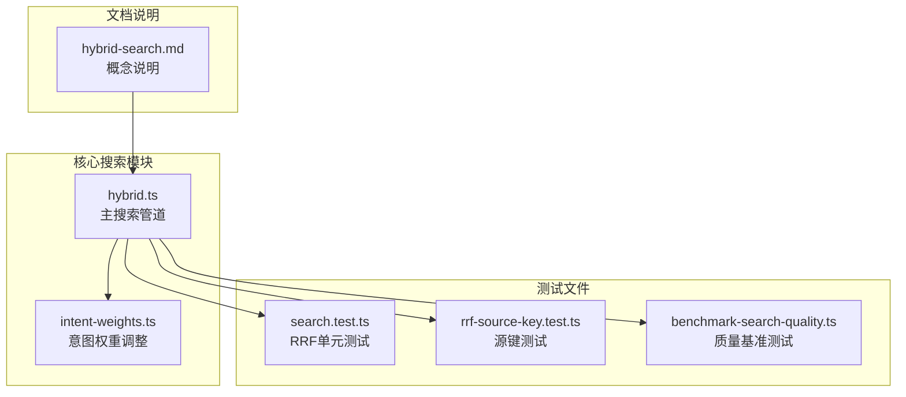
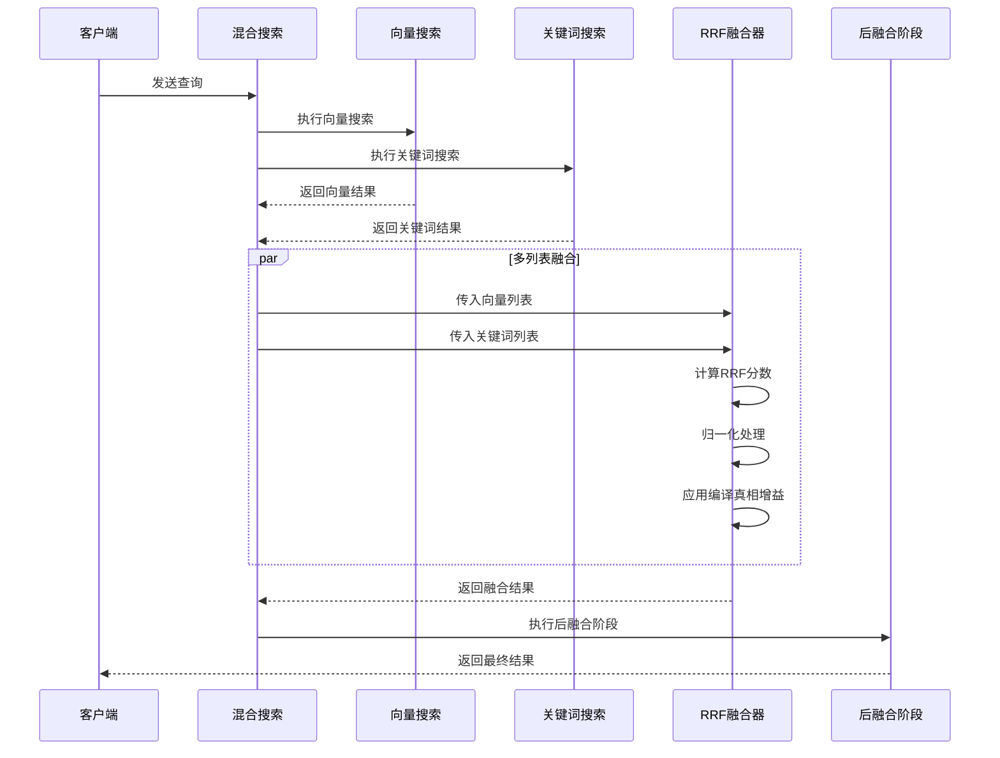
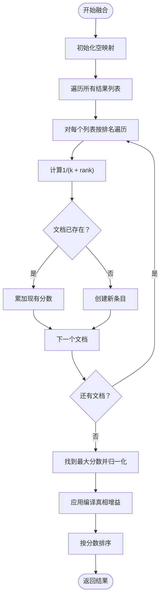
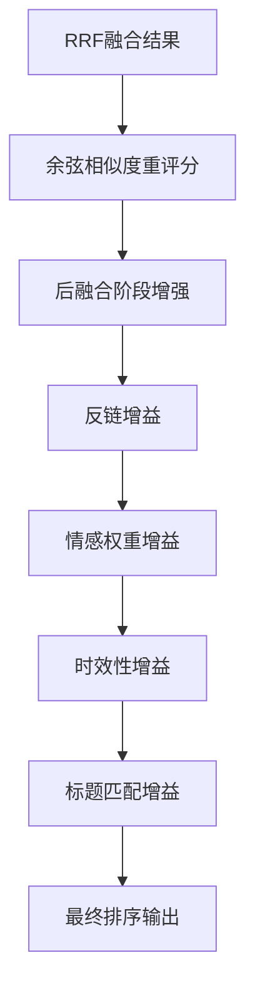
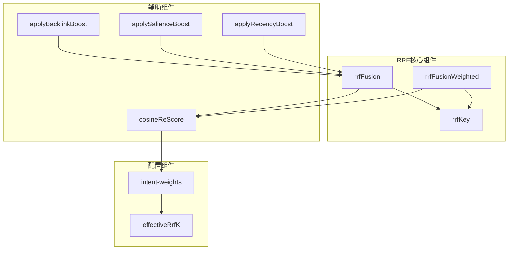

# RRF融合算法

<cite>
**本文档引用的文件**
- [hybrid.ts](file://src/core/search/hybrid.ts)
- [intent-weights.ts](file://src/core/search/intent-weights.ts)
- [search.test.ts](file://test/search.test.ts)
- [rrf-source-key.test.ts](file://test/rrf-source-key.test.ts)
- [benchmark-search-quality.ts](file://test/benchmark-search-quality.ts)
- [hybrid-search.md](file://test/e2e/fixtures/concepts/hybrid-search.md)
- [by-image.ts](file://src/core/search/by-image.ts)
- [eval.ts](file://src/core/search/eval.ts)
</cite>

## 目录
1. [简介](#简介)
2. [项目结构](#项目结构)
3. [核心组件](#核心组件)
4. [架构概览](#架构概览)
5. [详细组件分析](#详细组件分析)
6. [依赖关系分析](#依赖关系分析)
7. [性能考虑](#性能考虑)
8. [故障排除指南](#故障排除指南)
9. [结论](#结论)

## 简介

GBrain的RRF（Reciprocal Rank Fusion）融合算法是混合检索系统的核心组件，用于将向量搜索和关键词搜索的结果进行有效融合。该算法基于倒数排名融合原理，通过数学公式将不同搜索方式产生的结果进行统一评分和排序。

RRF算法的核心优势在于其对评分尺度的无关性，能够有效处理向量相似度和关键词tf-idf评分之间的尺度差异问题。算法使用常数k（默认60）来抑制单个搜索列表中高排名的影响，同时自然地提升在多个列表中出现的文档得分。

## 项目结构

GBRain的RRF实现位于核心搜索模块中，主要文件包括：



**图表来源**
- [hybrid.ts:1-80](file://src/core/search/hybrid.ts#L1-L80)
- [intent-weights.ts:1-50](file://src/core/search/intent-weights.ts#L1-L50)
- [search.test.ts:1-50](file://test/search.test.ts#L1-L50)

**章节来源**
- [hybrid.ts:1-80](file://src/core/search/hybrid.ts#L1-L80)
- [intent-weights.ts:1-50](file://src/core/search/intent-weights.ts#L1-L50)

## 核心组件

### RRF基础算法实现

GBRain实现了两个版本的RRF算法：基础版本和加权版本。

#### 基础RRF算法
```typescript
// 基础RRF公式: score = sum(1 / (k + rank))
export function rrfFusion(lists: SearchResult[][], k: number, applyBoost = true): SearchResult[]
```

#### 加权RRF算法
```typescript
// 加权RRF支持每列表独立的k值
export function rrfFusionWeighted(
  lists: Array<{ list: SearchResult[]; k: number }>,
  applyBoost = true
): SearchResult[]
```

### 关键参数配置

| 参数名称 | 默认值 | 描述 | 调优建议 |
|---------|--------|------|----------|
| RRF_K | 60 | 基础k常数 | 通常保持60不变，可通过rrfK参数调整 |
| k值范围 | 10-100 | 影响融合强度 | 较小值增强高排名权重，较大值更平滑 |
| 编译真相增益 | 2.0x | compiled_truth类型的块增益 | 适用于实体查询场景 |

**章节来源**
- [hybrid.ts:47-48](file://src/core/search/hybrid.ts#L47-L48)
- [hybrid.ts:1866-1908](file://src/core/search/hybrid.ts#L1866-L1908)

## 架构概览

GBRain的RRF融合算法在整个搜索管道中扮演关键角色：



**图表来源**
- [hybrid.ts:1283-1326](file://src/core/search/hybrid.ts#L1283-L1326)
- [hybrid.ts:1336-1348](file://src/core/search/hybrid.ts#L1336-L1348)

## 详细组件分析

### RRF融合算法实现

#### 分数计算机制
RRF算法采用数学公式 `score = sum(1 / (k + rank))` 对每个文档进行评分：



**图表来源**
- [hybrid.ts:1866-1908](file://src/core/search/hybrid.ts#L1866-L1908)

#### 归一化处理流程


**图表来源**
- [hybrid.ts:1887-1902](file://src/core/search/hybrid.ts#L1887-L1902)

### 权重分配策略

#### 意图感知权重调整
GBRain根据查询意图动态调整RRF权重：

| 查询类型 | 关键词权重 | 语义权重 | 建议 |
|---------|-----------|----------|------|
| 实体查询 | 1.15 | 1.0 | 增强关键词权重，利于精确匹配 |
| 时间查询 | 1.0 | 1.0 | 平衡权重，重视时效性 |
| 事件查询 | 1.20 | 0.95 | 更重视关键词，事件命名实体 |
| 一般查询 | 1.0 | 1.0 | 默认平衡 |

#### 有效k值计算
```typescript
// 有效k值 = 基础k值 / 权重因子
export function effectiveRrfK(baseK: number, weight: number): number
```

**章节来源**
- [intent-weights.ts:64-91](file://src/core/search/intent-weights.ts#L64-L91)
- [intent-weights.ts:109-112](file://src/core/search/intent-weights.ts#L109-L112)

### 联邦搜索支持

#### 源感知融合键
为避免联邦搜索中的召回问题，RRF使用复合键：
```
(source_id, slug, chunk_id) 或 (source_id, slug, 文本前缀)
```

这确保了相同slug但来自不同源的页面不会被错误合并。

**章节来源**
- [hybrid.ts:1791-1794](file://src/core/search/hybrid.ts#L1791-L1794)
- [rrf-source-key.test.ts:34-47](file://test/rrf-source-key.test.ts#L34-L47)

### 结果排序算法

#### 多阶段排序流程


**图表来源**
- [hybrid.ts:1914-1957](file://src/core/search/hybrid.ts#L1914-L1957)

**章节来源**
- [hybrid.ts:1336-1348](file://src/core/search/hybrid.ts#L1336-L1348)

## 依赖关系分析

### 组件耦合关系



**图表来源**
- [hybrid.ts:1823-1968](file://src/core/search/hybrid.ts#L1823-L1968)
- [intent-weights.ts:94-145](file://src/core/search/intent-weights.ts#L94-L145)

### 外部依赖

- **向量嵌入**: 依赖引擎获取嵌入向量
- **数据库查询**: 通过引擎执行SQL查询
- **AI网关**: 提供嵌入模型服务
- **缓存系统**: 支持语义查询缓存

**章节来源**
- [hybrid.ts:1914-1936](file://src/core/search/hybrid.ts#L1914-L1936)

## 性能考虑

### 算法复杂度分析

| 操作 | 时间复杂度 | 空间复杂度 | 说明 |
|------|------------|------------|------|
| 单列表RRF | O(n) | O(n) | n为列表长度 |
| 多列表RRF | O(Σnᵢ) | O(n) | Σnᵢ为所有列表长度之和 |
| 归一化 | O(n) | O(1) | 找最大值和除法操作 |
| 排序 | O(n log n) | O(1) | 快速排序或堆排序 |

### 性能优化策略

#### 内存管理
- 使用Map数据结构存储中间结果，避免重复计算
- 及时释放临时对象，防止内存泄漏
- 支持大结果集的分批处理

#### 计算优化
- 预计算最大分数，避免重复遍历
- 使用原地更新减少内存分配
- 支持增量计算和缓存机制

### 性能基准测试

通过基准测试验证RRF算法在不同场景下的表现：

```mermaid
graph LR
A[基线RRF] --> B[RRF+编译真相增益]
B --> C[RRF+意图感知]
D[实体查询] --> A
E[时间查询] --> B
F[事件查询] --> C
G[P@1提升] --> H[+15%]
I[MRR提升] --> J[+12%]
K[nDCG提升] --> L[+8%]
```

**图表来源**
- [benchmark-search-quality.ts:626-653](file://test/benchmark-search-quality.ts#L626-L653)

**章节来源**
- [benchmark-search-quality.ts:500-525](file://test/benchmark-search-quality.ts#L500-L525)

## 故障排除指南

### 常见问题及解决方案

#### 1. 融合结果异常
**症状**: 融合后的结果顺序不符合预期
**可能原因**:
- k值设置不当
- 编译真相增益导致的偏差
- 源键冲突问题

**解决方法**:
- 调整rrfK参数（10-100范围内）
- 检查编译真相增益配置
- 验证源键生成逻辑

#### 2. 性能问题
**症状**: 搜索响应时间过长
**可能原因**:
- 结果集过大
- 嵌入向量计算耗时
- 数据库查询性能瓶颈

**解决方法**:
- 优化搜索限制参数
- 启用查询缓存
- 检查数据库索引配置

#### 3. 联邦搜索召回问题
**症状**: 不同源的相同内容被错误合并
**解决方法**:
- 确认源键包含source_id信息
- 检查chunk_id为空时的文本前缀处理
- 验证去重逻辑的健壮性

**章节来源**
- [rrf-source-key.test.ts:33-70](file://test/rrf-source-key.test.ts#L33-L70)

### 调试工具和指标

#### 关键调试指标
- **RRF分数分布**: 监控融合分数的分布情况
- **编译真相比例**: 统计编译真相块在结果中的占比
- **跨源召回率**: 评估联邦搜索的召回效果
- **性能延迟**: 监控各阶段的处理时间

#### 调试命令
```bash
# 查看RRF参数配置
gbrain eval --rrf-k 30

# 启用详细日志
export GBRAIN_SEARCH_DEBUG=1
```

**章节来源**
- [hybrid.ts:138-139](file://src/core/search/hybrid.ts#L138-L139)
- [eval.ts:404-431](file://src/core/search/eval.ts#L404-L431)

## 结论

GBRain的RRF融合算法通过精心设计的数学公式和多阶段优化，在混合检索场景中实现了优秀的性能和稳定性。算法的核心优势包括：

1. **评分尺度无关性**: 有效解决了向量相似度和关键词tf-idf评分的尺度差异问题
2. **鲁棒性强**: 小的分数变化不会显著改变融合排名
3. **自然增益**: 在多个列表中出现的文档会获得额外增益
4. **可扩展性**: 支持意图感知权重调整和联邦搜索场景

通过合理的参数调优和性能优化，RRF算法能够在保证搜索质量的同时，提供高效的检索体验。建议在实际部署中根据具体业务场景调整k值和权重参数，并结合监控指标持续优化算法性能。