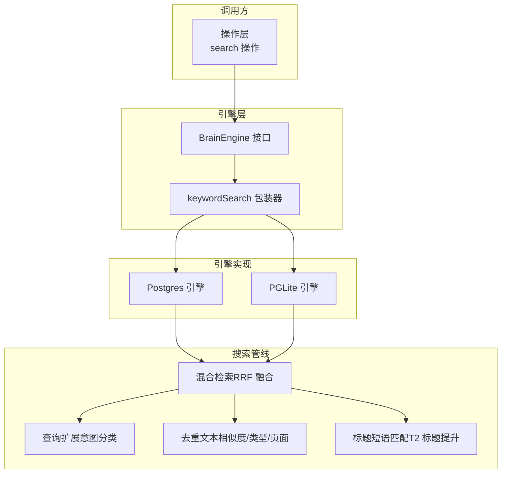
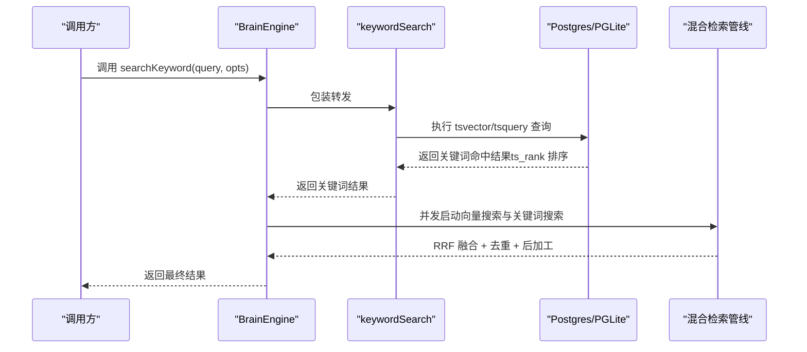
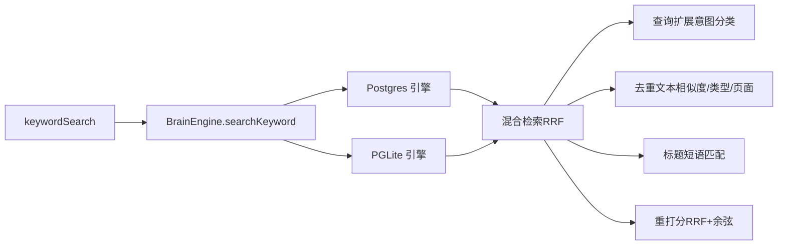

# 关键词搜索

<cite>
**本文引用的文件**
- [src/core/search/keyword.ts](file://src/core/search/keyword.ts)
- [src/core/engine.ts](file://src/core/engine.ts)
- [src/core/engines/postgres-engine.ts](file://src/core/engines/postgres-engine.ts)
- [src/core/engines/pglite-engine.ts](file://src/core/engines/pglite-engine.ts)
- [src/core/search/hybrid.ts](file://src/core/search/hybrid.ts)
- [src/core/search/expansion.ts](file://src/core/search/expansion.ts)
- [src/core/search/title-match.ts](file://src/core/search/title-match.ts)
- [src/core/search/dedup.ts](file://src/core/search/dedup.ts)
- [src/core/search/intent-weights.ts](file://src/core/search/intent-weights.ts)
- [src/core/search/query-intent.ts](file://src/core/search/query-intent.ts)
- [test/e2e/fixtures/concepts/hybrid-search.md](file://test/e2e/fixtures/concepts/hybrid-search.md)
- [test/pglite-engine.test.ts](file://test/pglite-engine.test.ts)
- [test/search-types-filter.test.ts](file://test/search-types-filter.test.ts)
- [test/postgres-engine.test.ts](file://test/postgres-engine.test.ts)
</cite>

## 目录
1. [简介](#简介)
2. [项目结构](#项目结构)
3. [核心组件](#核心组件)
4. [架构总览](#架构总览)
5. [详细组件分析](#详细组件分析)
6. [依赖分析](#依赖分析)
7. [性能考虑](#性能考虑)
8. [故障排查指南](#故障排查指南)
9. [结论](#结论)
10. [附录](#附录)

## 简介
本文件面向GBrain的关键词搜索子系统，聚焦于“基于PostgreSQL全文检索（tsvector/tsquery）的关键词匹配”能力，并说明其在混合检索中的定位与与向量搜索的互补关系。文档覆盖以下要点：
- 基于PostgreSQL的关键词索引与查询路径：tsvector字段、tsquery解析、ts_rank相关性评分与排序
- 分词与词项处理：英文分词器、CJK字符处理策略、大小写与标点规范化
- 文档频率与词项权重：通过ts_rank对命中位置、短语匹配、文档长度进行归一化
- 查询扩展与意图识别：零LLM意图分类驱动的权重调整与查询扩展
- 结果去重与后融合：按来源/文本相似度/类型/页面的多层去重与编译真相保障
- 配置项与性能参数：搜索限制、RRF常数、去重阈值、超时控制等
- 实际查询示例与回归测试参考

## 项目结构
关键词搜索位于核心引擎与搜索管线之间，对外提供统一的searchKeyword接口，内部根据运行环境选择Postgres或PGLite路径；同时作为混合检索的“关键词分支”，与向量搜索并行执行并通过RRF融合。

图示来源
- [src/core/search/keyword.ts](file://src/core/search/keyword.ts)
- [src/core/engine.ts](file://src/core/engine.ts)
- [src/core/engines/postgres-engine.ts](file://src/core/engines/postgres-engine.ts)
- [src/core/engines/pglite-engine.ts](file://src/core/engines/pglite-engine.ts)
- [src/core/search/hybrid.ts](file://src/core/search/hybrid.ts)
- [src/core/search/expansion.ts](file://src/core/search/expansion.ts)
- [src/core/search/dedup.ts](file://src/core/search/dedup.ts)
- [src/core/search/title-match.ts](file://src/core/search/title-match.ts)

章节来源
- [src/core/search/keyword.ts](file://src/core/search/keyword.ts)
- [src/core/engine.ts](file://src/core/engine.ts)

## 核心组件
- 关键词搜索包装器：将外部调用映射到引擎的searchKeyword方法，屏蔽底层差异。
- 混合检索管线：并行执行关键词与向量两条路径，使用RRF融合，随后进行去重与后加工（回溯、标题短语匹配、别名跳转等）。
- 查询扩展与意图识别：基于正则的零LLM意图分类，输出关键词/向量权重、建议细节、建议显著度与时效性、跨模态建议。
- 去重与结果保障：按来源/文本相似度/类型/页面的四层去重，并确保每页保留一条编译真相片段。
- 标题短语匹配：对命中标题短语的页面给予额外提升，避免弱体块命中导致的错判。
- 引擎适配：Postgres引擎直接走tsvector/tsquery；PGLite在无法使用FTS时回退到ILIKE子串扫描并以命中次数与位置信息近似ts_rank。

章节来源
- [src/core/search/keyword.ts](file://src/core/search/keyword.ts)
- [src/core/search/hybrid.ts](file://src/core/search/hybrid.ts)
- [src/core/search/expansion.ts](file://src/core/search/expansion.ts)
- [src/core/search/dedup.ts](file://src/core/search/dedup.ts)
- [src/core/search/title-match.ts](file://src/core/search/title-match.ts)

## 架构总览
关键词搜索在混合检索中承担“精确匹配与命名实体强召回”的角色，弥补向量搜索在词汇不一致场景下的不足。其典型流程如下：

图示来源
- [src/core/search/keyword.ts](file://src/core/search/keyword.ts)
- [src/core/engine.ts](file://src/core/engine.ts)
- [src/core/search/hybrid.ts](file://src/core/search/hybrid.ts)

## 详细组件分析

### 组件A：关键词搜索包装器与引擎适配
- 功能职责
  - 对外暴露统一的keywordSearch函数，内部委托给engine.searchKeyword。
  - 引擎侧在Postgres与PGLite上分别实现：Postgres直接使用tsvector/tsquery；PGLite在无法使用FTS时回退到ILIKE子串扫描并以命中次数与位置信息近似ts_rank。
- 关键实现要点
  - Postgres路径：利用content_chunks.search_vector（tsvector）与tsquery解析，返回按ts_rank降序的结果。
  - PGLite路径：当websearch_to_tsquery无法分词CJK时，采用ILIKE子串扫描，并以position/replace等算术近似排名，保证不同语言查询的可用性。
  - 两者均支持过滤条件（如语言、符号类型、时间范围）、偏移与限制、以及去重策略。
- 性能与稳定性
  - PGLite回退路径避免了空结果问题，且通过显式参数绑定与转义防止LIKE元字符逃逸。
  - 引擎层对搜索超时使用SET LOCAL隔离，避免污染连接池。

章节来源
- [src/core/search/keyword.ts](file://src/core/search/keyword.ts)
- [src/core/engines/pglite-engine.ts](file://src/core/engines/pglite-engine.ts)
- [test/pglite-engine.test.ts](file://test/pglite-engine.test.ts)
- [test/postgres-engine.test.ts](file://test/postgres-engine.test.ts)

### 组件B：混合检索与RRF融合
- 功能职责
  - 并行执行关键词与向量两条检索路径，使用RRF（Reciprocal Rank Fusion）融合，k默认为60。
  - 融合后进行去重与后加工（回溯、标题短语匹配、别名跳转、显著度/时效性/回链等元数据加权）。
- 关键实现要点
  - RRF公式：对每个候选文档，若出现在第i条列表中，则贡献1/(k + rank_i)，再求和。
  - 编译真相提升：对关键词分支，编译真相片段在RRF归一化后获得2倍权重。
  - 最终重打分：采用0.7×RRF + 0.3×余弦相似度的线性组合，使查询特定性更强。
  - 可观测性：提供onMeta回调输出融合过程的关键信息，便于评估与调试。
- 与向量搜索的互补
  - 关键词搜索擅长精确匹配与命名实体召回；向量搜索擅长语义近似匹配。二者结合可兼顾精度与召回。

章节来源
- [src/core/search/hybrid.ts](file://src/core/search/hybrid.ts)
- [test/e2e/fixtures/concepts/hybrid-search.md](file://test/e2e/fixtures/concepts/hybrid-search.md)

### 组件C：查询扩展与意图识别
- 功能职责
  - 基于正则的零LLM意图分类，输出意图（实体/时间/事件/通用）、建议细节（低/高）、建议显著度（off/on/strong）、建议时效性（off/on/strong），以及跨模态建议（text/image/both）。
  - 在混合检索中，意图权重用于调整关键词与向量在RRF中的贡献比例，并对精确匹配进行额外提升。
- 关键实现要点
  - 意图权重：实体类查询提高关键词权重；事件类查询适度提高关键词权重并轻微降低向量权重；时间类查询建议开启时效性。
  - 有效RRF k：根据列表权重动态调整k，使高权重列表对融合结果有更强的顶部影响力。
  - 精确匹配提升：当结果slug或标题与查询完全匹配时，按权重乘以额外因子，增强命名命中效果。
- 安全与健壮性
  - 查询扩展前对用户输入进行注入清洗，LLM输出进行白名单校验，避免危险内容进入后续搜索。

章节来源
- [src/core/search/expansion.ts](file://src/core/search/expansion.ts)
- [src/core/search/intent-weights.ts](file://src/core/search/intent-weights.ts)
- [src/core/search/query-intent.ts](file://src/core/search/query-intent.ts)

### 组件D：标题短语匹配与别名跳转
- 功能职责
  - 标题短语匹配：当查询是页面标题的连续词序列（或完全相等）时，对该页面给予额外提升，避免弱体块命中导致的错判。
  - 别名跳转：当查询与某页面声明的别名完全匹配时，确保该页面进入结果集（已存在则提升，不存在则注入）。
- 关键实现要点
  - 标题分词：支持Unicode字母/数字分割，CJK字符按连续字符视为单token，英文停用词不计入内容token门槛。
  - 别名解析：按源ID与slug复合键查找canonical_slug，确定唯一权威页面，避免跨源混淆。

章节来源
- [src/core/search/title-match.ts](file://src/core/search/title-match.ts)
- [src/core/search/hybrid.ts](file://src/core/search/hybrid.ts)

### 组件E：去重与结果保障
- 功能职责
  - 四层去重：按来源保留每页最高分的若干片段；基于词集合Jaccard相似度过滤高度重复片段；控制页面类型的占比上限；限制每页最多保留的片段数量。
  - 编译真相保障：若去重后某页无编译真相片段，则从原始候选集中挑选该页得分最高的编译真相片段进行替换。
- 关键实现要点
  - 多维去重：先按来源/分数筛选，再按文本相似度过滤，然后按类型多样性约束，最后按页面上限收束。
  - 兼容多源：页面键采用(source_id, slug)复合键，确保多源环境下不会误合并同名页面。

章节来源
- [src/core/search/dedup.ts](file://src/core/search/dedup.ts)

### 组件F：查询解析与分词处理
- 功能职责
  - 解析用户查询为PostgreSQL的tsquery，支持短语、布尔、通配、网络搜索语法等。
  - 规范化：小写化、去除多余空白、Unicode规范化；英文使用标准分词器；CJK字符按连续字符处理。
- 关键实现要点
  - 语言与符号过滤：支持按语言与符号类型过滤，提升相关性与准确性。
  - 时间过滤：支持afterDate等时间范围过滤，缩小搜索空间。
  - PGLite回退：当websearch_to_tsquery无法分词CJK时，采用ILIKE子串扫描并以position/replace近似排名。

章节来源
- [src/core/engines/pglite-engine.ts](file://src/core/engines/pglite-engine.ts)
- [src/core/engines/postgres-engine.ts](file://src/core/engines/postgres-engine.ts)
- [test/pglite-engine.test.ts](file://test/pglite-engine.test.ts)

### 组件G：相关性评分与排序机制
- 关键词分支（Postgres）
  - 使用tsvector与tsquery，返回ts_rank降序的结果；ts_rank综合了命中位置、短语匹配、文档长度等因素。
- 关键词分支（PGLite回退）
  - 采用ILIKE子串扫描，通过position/replace等算术近似ts_rank，优先命中更靠前且出现次数更多的片段。
- 向量分支
  - 使用余弦相似度，返回向量相似度降序的结果。
- RRF融合
  - 将关键词与向量两路结果按RRF公式融合，k默认60；随后进行去重与后加工。

章节来源
- [src/core/search/hybrid.ts](file://src/core/search/hybrid.ts)
- [src/core/engines/pglite-engine.ts](file://src/core/engines/pglite-engine.ts)
- [src/core/engines/postgres-engine.ts](file://src/core/engines/postgres-engine.ts)

### 组件H：配置选项与性能参数
- 搜索限制
  - MAX_SEARCH_LIMIT默认100，clampSearchLimit对传入limit进行安全裁剪。
- RRF常数
  - 默认k=60；可通过opts.rrfK覆盖；意图权重会动态调整各列表的有效k。
- 去重参数
  - 文本相似度阈值、类型占比上限、每页最大片段数、cosine相似度阈值等均可通过dedupOpts覆盖。
- 超时控制
  - 引擎层对搜索使用SET LOCAL隔离statement_timeout，避免污染连接池；CLI强制退出时限内完成。
- 查询嵌入预算
  - 对查询嵌入设置共享绝对截止时间与最小预算，确保健康嵌入不会被饥饿。

章节来源
- [src/core/engine.ts](file://src/core/engine.ts)
- [src/core/search/hybrid.ts](file://src/core/search/hybrid.ts)
- [test/postgres-engine.test.ts](file://test/postgres-engine.test.ts)

### 组件I：实际查询示例与验证
- 示例场景
  - 英文关键词命中：NovaMind等查询应返回公司/人物/概念等页面。
  - CJK子串命中：日文“晴れ”、韩文“한글”、中文“测试”等应返回对应语言页面。
  - 类型过滤：按types过滤仅返回指定类型（如person/company/concept）。
  - 不存在查询：返回空结果。
- 回归与质量
  - 通过端到端测试与基准测试评估precision@K与召回质量，确保混合检索在不同查询类型下稳定表现。

章节来源
- [test/pglite-engine.test.ts](file://test/pglite-engine.test.ts)
- [test/search-types-filter.test.ts](file://test/search-types-filter.test.ts)
- [test/e2e/fixtures/concepts/hybrid-search.md](file://test/e2e/fixtures/concepts/hybrid-search.md)

## 依赖分析
关键词搜索在混合检索中的依赖关系如下：

图示来源
- [src/core/search/keyword.ts](file://src/core/search/keyword.ts)
- [src/core/engine.ts](file://src/core/engine.ts)
- [src/core/search/hybrid.ts](file://src/core/search/hybrid.ts)
- [src/core/search/expansion.ts](file://src/core/search/expansion.ts)
- [src/core/search/dedup.ts](file://src/core/search/dedup.ts)
- [src/core/search/title-match.ts](file://src/core/search/title-match.ts)

章节来源
- [src/core/search/keyword.ts](file://src/core/search/keyword.ts)
- [src/core/search/hybrid.ts](file://src/core/search/hybrid.ts)

## 性能考虑
- 索引与查询
  - 使用tsvector列与Gin索引加速tsquery匹配；合理使用语言与符号过滤减少无关匹配。
- 去重成本
  - 文本相似度去重使用Jaccard近似，复杂度与结果规模成正比；可通过降低阈值或限制类型占比缓解。
- RRF融合
  - RRF对两个列表的贡献受k与rank影响，k越小对顶部排名越敏感；意图权重可动态调整k，平衡关键词与向量的主导地位。
- 超时与隔离
  - 引擎层对搜索使用SET LOCAL隔离statement_timeout，避免全局设置污染连接池；CLI强制退出时限内完成。

## 故障排查指南
- 关键词搜索无结果
  - 检查查询是否符合语言与符号过滤条件；确认tsvector是否正确建立。
  - 对于PGLite，确认是否触发了CJK回退路径（websearch_to_tsquery无法分词CJK）。
- 结果不符合预期
  - 检查意图权重与RRF k设置；确认是否启用了标题短语匹配与别名跳转。
  - 查看去重策略是否过度过滤（类型占比、每页上限等）。
- 超时或连接池污染
  - 确认引擎层对搜索使用了SET LOCAL隔离；检查statement_timeout设置是否过短。

章节来源
- [test/postgres-engine.test.ts](file://test/postgres-engine.test.ts)
- [src/core/engines/pglite-engine.ts](file://src/core/engines/pglite-engine.ts)

## 结论
GBrain的关键词搜索以PostgreSQL的tsvector/tsquery为核心，结合PGLite的回退路径，实现了跨语言、跨模态的一致检索体验。在混合检索中，关键词搜索通过精确匹配与命名实体召回，有效补充向量搜索在词汇不一致场景下的不足；配合意图识别、查询扩展、RRF融合与多层去重，形成高精度、高鲁棒性的检索体系。

## 附录
- 相关文档与概念
  - 混合检索与RRF融合的设计理念与实现细节参见混合检索概念文档。
- 测试与回归
  - 参考端到端测试与单元测试，验证不同语言、类型过滤、超时隔离等场景的行为一致性。

章节来源
- [test/e2e/fixtures/concepts/hybrid-search.md](file://test/e2e/fixtures/concepts/hybrid-search.md)
- [test/pglite-engine.test.ts](file://test/pglite-engine.test.ts)
- [test/search-types-filter.test.ts](file://test/search-types-filter.test.ts)
- [test/postgres-engine.test.ts](file://test/postgres-engine.test.ts)