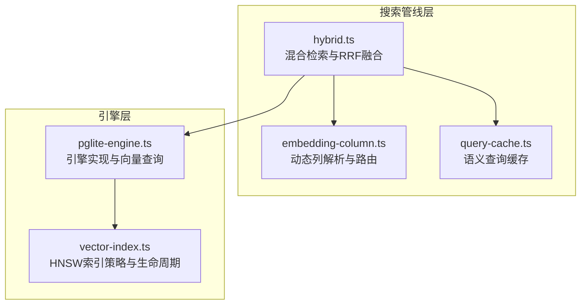
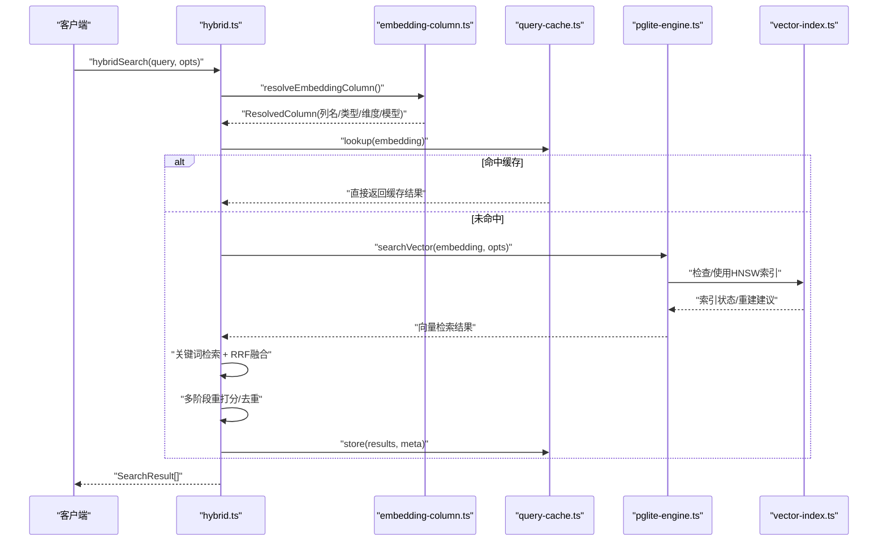
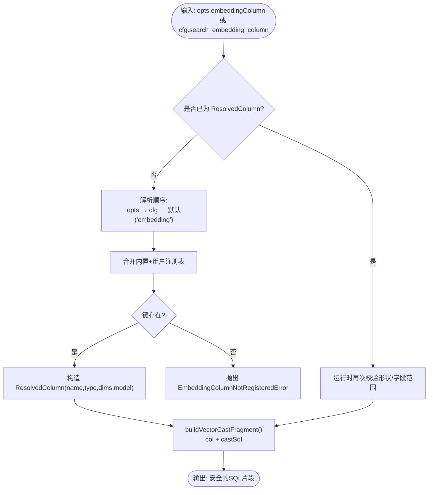
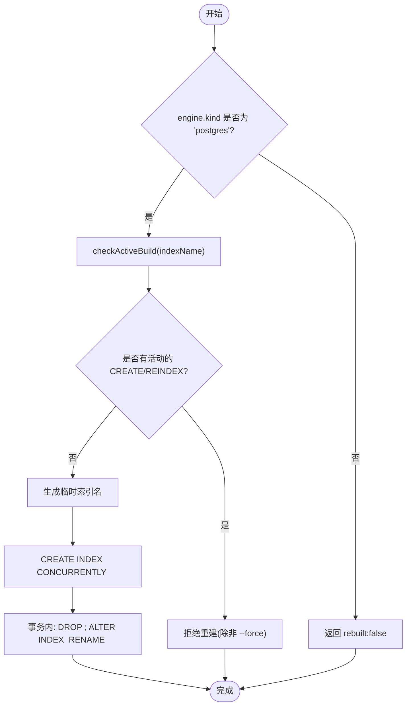
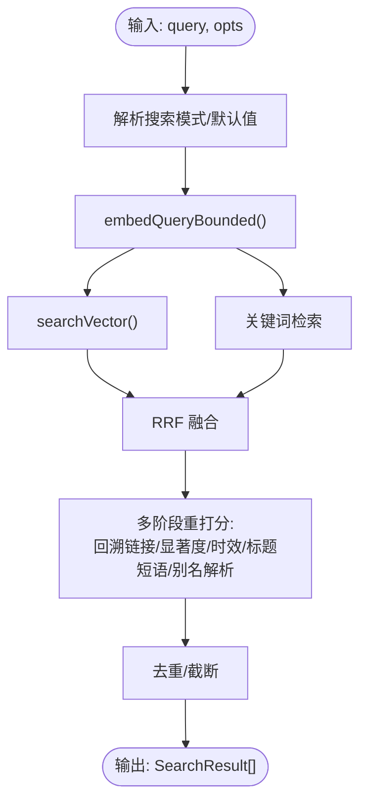
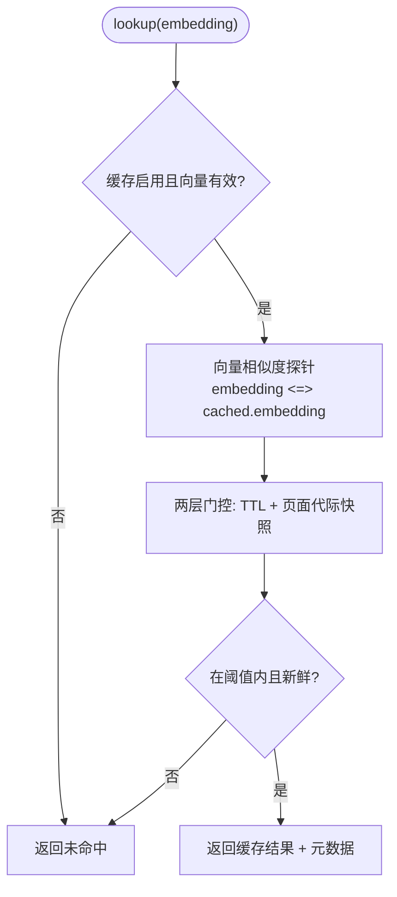
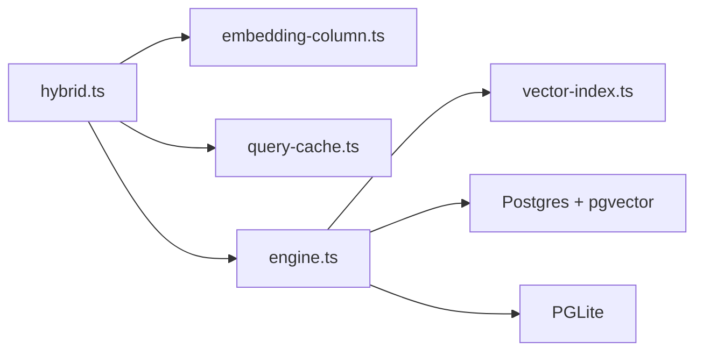

# 向量搜索

<cite>
**本文引用的文件**
- [vector-index.ts](file://src/core/vector-index.ts)
- [embedding-column.ts](file://src/core/search/embedding-column.ts)
- [hybrid.ts](file://src/core/search/hybrid.ts)
- [vector.ts](file://src/core/search/vector.ts)
- [query-cache.ts](file://src/core/search/query-cache.ts)
- [pglite-engine.ts](file://src/core/pglite-engine.ts)
- [embedding-column.serial.test.ts](file://test/search/embedding-column.serial.test.ts)
- [embedding-column-postgres.test.ts](file://test/e2e/embedding-column-postgres.test.ts)
- [vector-index-lifecycle.test.ts](file://test/vector-index-lifecycle.test.ts)
- [query-embed-deadline.test.ts](file://test/search/query-embed-deadline.test.ts)
- [searchvector-maxpool.test.ts](file://test/search/searchvector-maxpool.test.ts)
- [search-quality.test.ts](file://test/e2e/search-quality.test.ts)
- [hybrid-search.md](file://docs/guides/hybrid-search.md)
</cite>

## 目录
1. [简介](#简介)
2. [项目结构](#项目结构)
3. [核心组件](#核心组件)
4. [架构总览](#架构总览)
5. [详细组件分析](#详细组件分析)
6. [依赖关系分析](#依赖关系分析)
7. [性能考量](#性能考量)
8. [故障排查指南](#故障排查指南)
9. [结论](#结论)
10. [附录](#附录)

## 简介
本文件系统性阐述 GBrain 的向量搜索组件，重点围绕基于 pgvector 的 HNSW 近似最近邻（ANN）搜索实现，覆盖向量嵌入生成、索引构建与生命周期管理、查询优化、相似度计算、查询超时控制、性能调优策略，并说明其在混合检索中的角色与与其他搜索方式的协同机制。内容同时给出可操作的配置参数、索引维护流程与实际查询示例路径。

## 项目结构
向量搜索能力由“引擎层”和“搜索管线层”共同构成：
- 引擎层：负责 SQL 执行与向量查询的具体实现，支持 PGLite 与 Postgres 两种后端；在 Postgres 上启用 HNSW 索引以加速 ANN 搜索。
- 搜索管线层：提供混合检索（关键词 + 向量 + RRF 融合）、查询缓存、查询超时保护、多阶段重打分与去重等高级特性。

图示来源
- [hybrid.ts](file://src/core/search/hybrid.ts)
- [embedding-column.ts](file://src/core/search/embedding-column.ts)
- [query-cache.ts](file://src/core/search/query-cache.ts)
- [pglite-engine.ts](file://src/core/pglite-engine.ts)
- [vector-index.ts](file://src/core/vector-index.ts)

章节来源
- [hybrid.ts](file://src/core/search/hybrid.ts)
- [embedding-column.ts](file://src/core/search/embedding-column.ts)
- [query-cache.ts](file://src/core/search/query-cache.ts)
- [pglite-engine.ts](file://src/core/pglite-engine.ts)
- [vector-index.ts](file://src/core/vector-index.ts)

## 核心组件
- 嵌入列解析与路由：将用户请求映射到具体列（如 embedding、embedding_image、自定义列），并生成安全的 SQL 片段（含类型与维度信息）。
- HNSW 索引策略与生命周期：在 Postgres 上按维度上限自动选择是否启用 HNSW；提供重建、僵尸索引清理、进度监控等运维能力。
- 混合检索与 RRF 融合：将向量检索与关键词检索结果用 RRF 融合，再进行多阶段重打分与去重。
- 查询缓存：基于查询向量相似度命中缓存，避免重复执行昂贵的向量/关键词搜索。
- 查询超时控制：对查询嵌入阶段施加绝对时间限制，防止慢提供方阻塞整个搜索链路。
- 向量查询入口：统一的 vectorSearch/engine.searchVector 接口，屏蔽引擎差异。

章节来源
- [embedding-column.ts](file://src/core/search/embedding-column.ts)
- [vector-index.ts](file://src/core/vector-index.ts)
- [hybrid.ts](file://src/core/search/hybrid.ts)
- [query-cache.ts](file://src/core/search/query-cache.ts)
- [vector.ts](file://src/core/search/vector.ts)

## 架构总览
下图展示一次典型混合检索的调用序列，从查询文本到最终结果返回的关键步骤与参与模块：

图示来源
- [hybrid.ts](file://src/core/search/hybrid.ts)
- [embedding-column.ts](file://src/core/search/embedding-column.ts)
- [query-cache.ts](file://src/core/search/query-cache.ts)
- [pglite-engine.ts](file://src/core/pglite-engine.ts)
- [vector-index.ts](file://src/core/vector-index.ts)

## 详细组件分析

### 组件A：嵌入列解析与路由（embedding-column）
- 功能要点
  - 将字符串或描述符解析为 ResolvedColumn，确保标识符安全（正则校验、SQL 标识符转义）。
  - 支持内置列（embedding、embedding_image、embedding_multimodal）与用户自定义列注册表合并。
  - 生成 SQL 片段：列名（带引号）与查询向量的类型化 cast（$1::vector 或 $1::halfvec(N)）。
  - 提供 isCacheSafe 判定，确保只有默认 embedding 列且维度/模型匹配时才使用语义查询缓存。
- 安全与健壮性
  - 防注入：严格标识符正则 + 双引号转义。
  - 加载期校验：类型、维度、provider 格式校验，失败即抛出明确错误。
  - 引擎侧只接受已解析的 ResolvedColumn，杜绝裸字符串进入 SQL 构造。

图示来源
- [embedding-column.ts](file://src/core/search/embedding-column.ts)

章节来源
- [embedding-column.ts](file://src/core/search/embedding-column.ts)
- [embedding-column.serial.test.ts](file://test/search/embedding-column.serial.test.ts)

### 组件B：HNSW 索引策略与生命周期（vector-index）
- 功能要点
  - 维度上限：当向量维度 ≤ 2000 时启用 HNSW；超过则跳过 HNSW，保留精确扫描。
  - 生命周期管理：提供 dropAndRebuild（原子交换重建）、checkActiveBuild（并发冲突探测）、dropZombieIndexes（启动清理无效索引）、monitorBuild（进度监控）。
  - 自动维护：检测 Supabase 自动维护来源，避免重复重建。
- 关键接口
  - chunkEmbeddingIndexSql(dims)：根据维度生成索引 DDL。
  - dropAndRebuild(spec, opts)：Postgres 上原子重建。
  - dropZombieIndexes(...)：清理无效索引。
  - monitorBuild(...)：轮询进度。

图示来源
- [vector-index.ts](file://src/core/vector-index.ts)
- [vector-index-lifecycle.test.ts](file://test/vector-index-lifecycle.test.ts)

章节来源
- [vector-index.ts](file://src/core/vector-index.ts)
- [vector-index-lifecycle.test.ts](file://test/vector-index-lifecycle.test.ts)

### 组件C：混合检索与 RRF 融合（hybrid）
- 功能要点
  - 管线：关键词检索 + 向量检索 → RRF 融合 → 归一化 → 多阶段重打分（回溯链接、显著度、时效、标题短语、别名解析）→ 去重。
  - 查询超时：对查询嵌入施加绝对时间限制（默认 6 秒），并保留最小预算，保证健康嵌入不会被饥饿。
  - 查询缓存：基于查询向量相似度命中缓存，命中即绕过向量/关键词搜索。
  - 适配器：支持 per-call 模式选择、RRF K 常数覆盖、去重参数覆盖、可观测元数据回调。
- 相似度与排序
  - 向量相似度采用余弦距离（pgvector 内置），融合阶段使用 RRF 公式，后续再以混合权重进行二次重打分。

图示来源
- [hybrid.ts](file://src/core/search/hybrid.ts)

章节来源
- [hybrid.ts](file://src/core/search/hybrid.ts)
- [query-embed-deadline.test.ts](file://test/search/query-embed-deadline.test.ts)

### 组件D：查询缓存（query-cache）
- 功能要点
  - 存储：以查询文本 + 源 + knob 哈希为键，缓存结果与元数据；条目带 TTL。
  - 命中判定：查询向量与缓存中最接近的查询向量的余弦相似度需高于阈值（默认 0.92）。
  - 多源隔离：按 source_id 隔离不同脑实例的缓存。
  - 两层门控：除 TTL 外，还结合页面代际快照与最大代际标记进行一致性门控。
- 性能收益：对重复或近似重复查询可直接返回缓存，显著降低延迟与负载。

图示来源
- [query-cache.ts](file://src/core/search/query-cache.ts)

章节来源
- [query-cache.ts](file://src/core/search/query-cache.ts)

### 组件E：向量查询入口与引擎实现（vector + pglite-engine）
- 向量查询入口
  - vectorSearch(engine, embedding, opts) 直接委托给 engine.searchVector。
- 引擎实现要点（Postgres + pgvector）
  - 动态列路由：通过 normalizeEngineColumn/resolveEmbeddingColumn 获取列名与 cast。
  - HNSW 使用：在 Postgres 上利用 hnsw 索引加速向量比较；在 PGLite 上退化为精确扫描。
  - 结果重排：使用余弦相似度（1 - (a <=> b)）作为原始分数，后续经 RRF 与多阶段重打分。

章节来源
- [vector.ts](file://src/core/search/vector.ts)
- [pglite-engine.ts](file://src/core/pglite-engine.ts)

## 依赖关系分析
- 模块耦合
  - hybrid.ts 依赖 embedding.ts（嵌入）、embedding-column.ts（列解析）、query-cache.ts（缓存）、engine.ts（向量查询）。
  - embedding-column.ts 与引擎层解耦，仅在混合边界解析列，引擎内部不读取配置。
  - vector-index.ts 仅在 Postgres 生效，提供索引生命周期管理。
- 外部依赖
  - Postgres + pgvector：HNSW 索引、向量类型与余弦距离运算。
  - PGLite：兼容向量类型与查询，但不支持 HNSW，退化为精确扫描。

图示来源
- [hybrid.ts](file://src/core/search/hybrid.ts)
- [embedding-column.ts](file://src/core/search/embedding-column.ts)
- [query-cache.ts](file://src/core/search/query-cache.ts)
- [pglite-engine.ts](file://src/core/pglite-engine.ts)
- [vector-index.ts](file://src/core/vector-index.ts)

章节来源
- [hybrid.ts](file://src/core/search/hybrid.ts)
- [embedding-column.ts](file://src/core/search/embedding-column.ts)
- [query-cache.ts](file://src/core/search/query-cache.ts)
- [pglite-engine.ts](file://src/core/pglite-engine.ts)
- [vector-index.ts](file://src/core/vector-index.ts)

## 性能考量
- 索引选择与维度上限
  - 当维度 ≤ 2000 时启用 HNSW；超过则跳过 HNSW，保留精确扫描，避免 pgvector 限制导致的异常。
- HNSW 重建与维护
  - 使用原子交换重建，避免重建期间服务中断；并发冲突探测与僵尸索引清理提升稳定性。
- 查询超时与预算
  - 对查询嵌入施加绝对时间限制（默认 6 秒），并保留最小预算，确保健康嵌入不会被饥饿。
- 缓存命中率
  - 通过相似度阈值（默认 0.92）与 TTL 控制缓存命中质量与时效，减少重复计算。
- 多阶段重打分
  - 在 RRF 融合后引入回溯链接、显著度、时效、标题短语、别名解析等信号，提升排序稳健性与召回质量。

章节来源
- [vector-index.ts](file://src/core/vector-index.ts)
- [query-embed-deadline.test.ts](file://test/search/query-embed-deadline.test.ts)
- [query-cache.ts](file://src/core/search/query-cache.ts)
- [hybrid.ts](file://src/core/search/hybrid.ts)

## 故障排查指南
- HNSW 索引问题
  - 现象：索引无效或重建卡住。
  - 排查：使用 dropZombieIndexes 清理无效索引；使用 checkActiveBuild 检测是否存在活动的 CREATE/REINDEX；必要时使用 dropAndRebuild 原子重建。
- 维度不匹配
  - 现象：向量维度超过 2000 导致 HNSW 不可用。
  - 处理：确认嵌入维度与列定义一致；必要时切换到精确扫描路径。
- 查询超时
  - 现象：嵌入提供方响应缓慢导致整体超时。
  - 处理：调整环境变量 GBRAIN_QUERY_EMBED_TIMEOUT_MS；确保共享预算不会被前期工作耗尽。
- 缓存未命中
  - 现象：相似度阈值过高导致频繁未命中。
  - 处理：适当降低 similarity_threshold；检查 source_id 与 knob 哈希是否正确传递。
- 列解析错误
  - 现象：未知列名或非法标识符导致解析失败。
  - 处理：使用 getEmbeddingColumnRegistry 查看可用列；确保列名符合标识符规范。

章节来源
- [vector-index.ts](file://src/core/vector-index.ts)
- [embedding-column.ts](file://src/core/search/embedding-column.ts)
- [query-embed-deadline.test.ts](file://test/search/query-embed-deadline.test.ts)
- [query-cache.ts](file://src/core/search/query-cache.ts)
- [embedding-column.serial.test.ts](file://test/search/embedding-column.serial.test.ts)

## 结论
GBrain 的向量搜索以“动态列解析 + HNSW 索引 + 混合检索 + 查询缓存 + 超时保护”为核心，既满足大规模场景下的高效检索，又保持了跨引擎的一致行为与安全性。通过严格的维度上限、并发冲突探测与原子重建，以及多阶段重打分与缓存门控，系统在准确性、稳定性与性能之间取得良好平衡。

## 附录

### 配置参数与环境变量
- 查询嵌入超时（毫秒）
  - 环境变量：GBRAIN_QUERY_EMBED_TIMEOUT_MS
  - 默认：6000
  - 作用：限定查询嵌入阶段的绝对时间，防止慢提供方阻塞。
- 查询缓存
  - 键：search.cache.enabled、search.cache.similarity_threshold、search.cache.ttl_seconds
  - 默认：enabled=true、similarity_threshold≈0.92、ttl_seconds=3600
  - 作用：控制缓存开关、命中阈值与时效。
- HNSW 维度上限
  - 常量：PGVECTOR_HNSW_VECTOR_MAX_DIMS=2000
  - 作用：超过该维度时跳过 HNSW，保留精确扫描。

章节来源
- [query-embed-deadline.test.ts](file://test/search/query-embed-deadline.test.ts)
- [query-cache.ts](file://src/core/search/query-cache.ts)
- [vector-index.ts](file://src/core/vector-index.ts)

### 索引维护操作
- 原子重建
  - 步骤：检查活动构建 → 生成临时索引名 → 并发创建 → 事务内替换 → 完成。
  - 适用：Postgres；PGLite 返回 rebuilt:false。
- 僵尸索引清理
  - 步骤：扫描 indisvalid=false 的索引 → 排除活动构建 → 删除无效索引。
- 进度监控
  - 步骤：轮询 pg_stat_activity 与 pg_relation_size，输出耗时与大小。

章节来源
- [vector-index.ts](file://src/core/vector-index.ts)
- [vector-index-lifecycle.test.ts](file://test/vector-index-lifecycle.test.ts)

### 实际查询示例（路径）
- Postgres 向量查询与 HNSW 可见性
  - 示例路径：[embedding-column-postgres.test.ts](file://test/e2e/embedding-column-postgres.test.ts)
- 混合检索与细节级别
  - 示例路径：[search-quality.test.ts](file://test/e2e/search-quality.test.ts)
- 查询缓存命中与相似度
  - 示例路径：[query-cache.test.ts](file://test/query-cache.test.ts)
- 向量搜索边界池化与细节级别
  - 示例路径：[searchvector-maxpool.test.ts](file://test/search/searchvector-maxpool.test.ts)

章节来源
- [embedding-column-postgres.test.ts](file://test/e2e/embedding-column-postgres.test.ts)
- [search-quality.test.ts](file://test/e2e/search-quality.test.ts)
- [query-cache.test.ts](file://test/query-cache.test.ts)
- [searchvector-maxpool.test.ts](file://test/search/searchvector-maxpool.test.ts)

### 混合检索概念说明
- 混合检索将向量相似与关键词精确匹配结合，使用 RRF 融合两类结果，并在融合后进行多阶段重打分与去重，从而兼顾语义相关与关键词精确性。

章节来源
- [hybrid-search.md](file://docs/guides/hybrid-search.md)