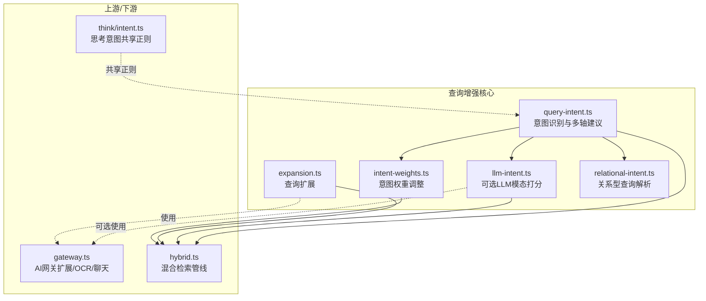
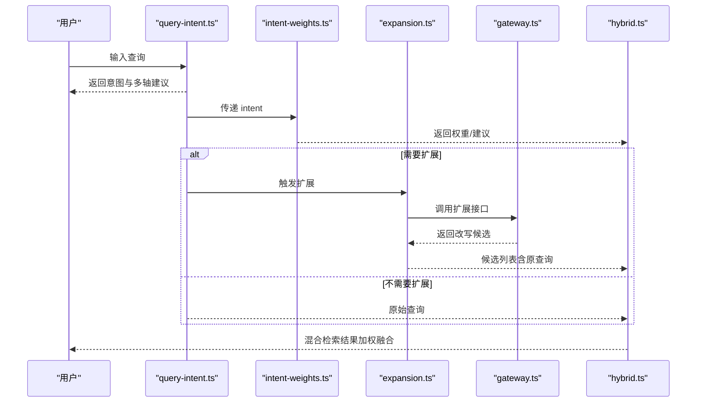
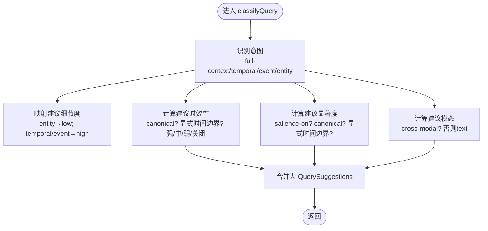
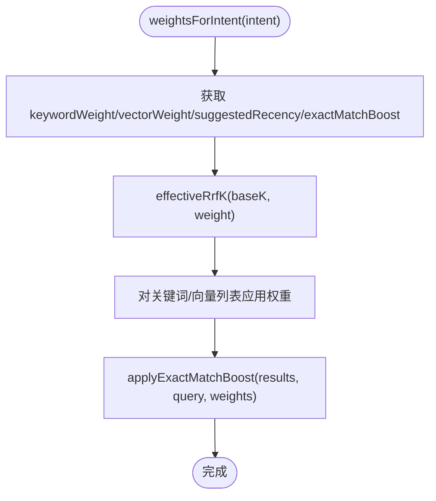
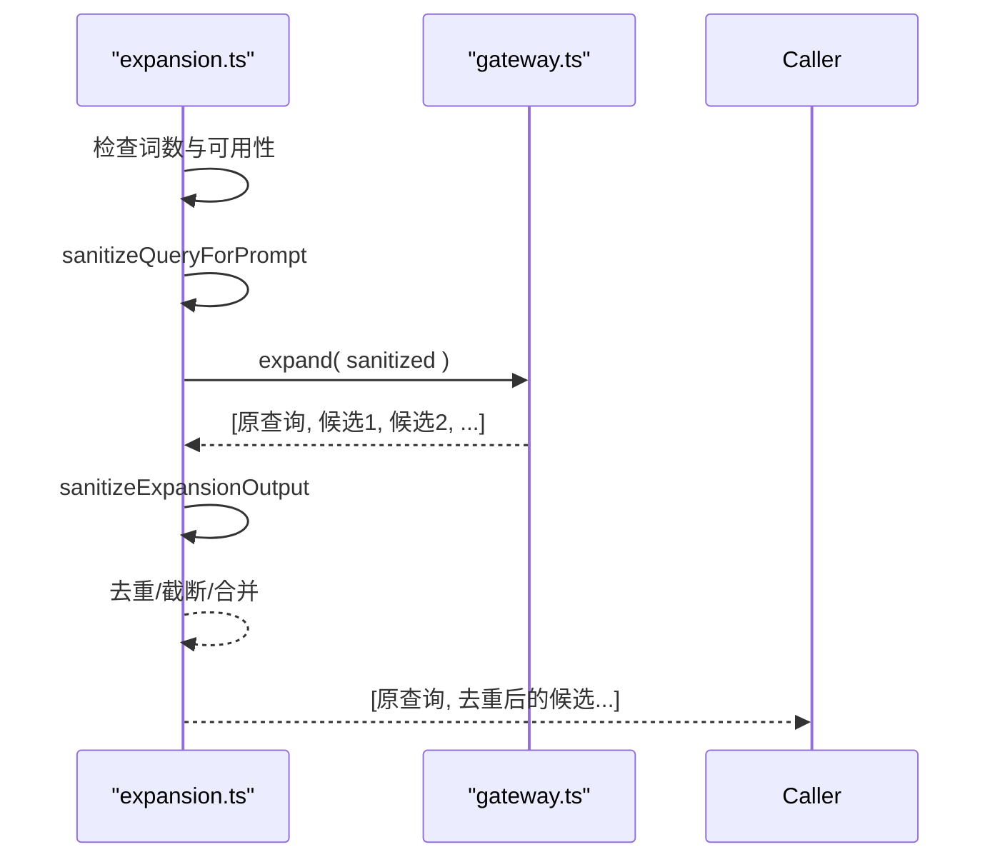
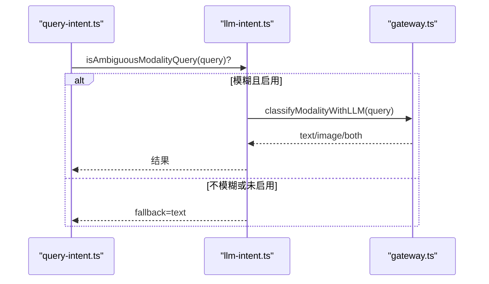
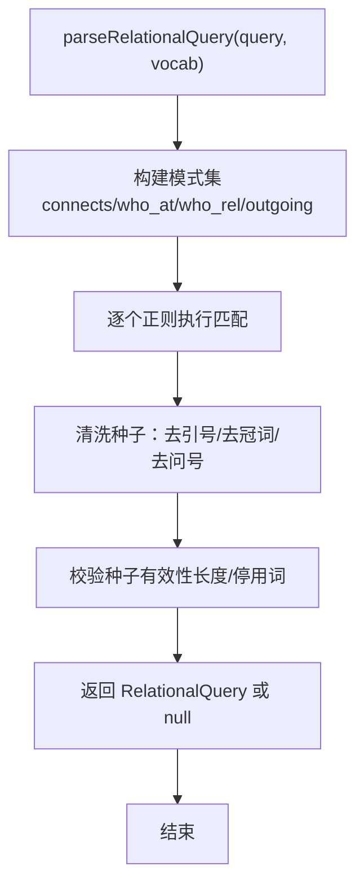
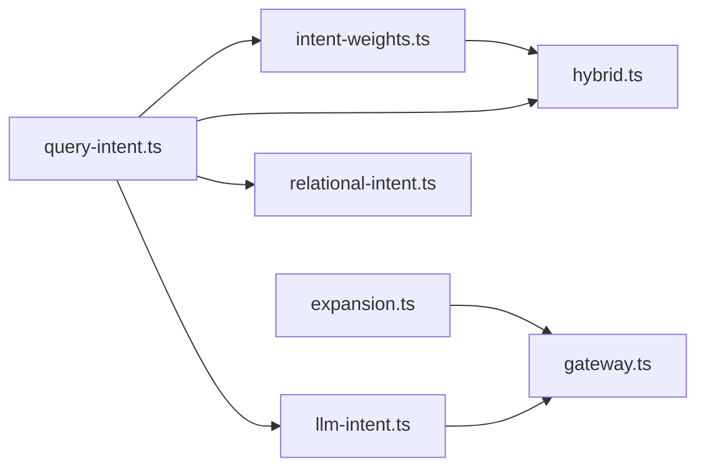

# 查询增强

<cite>
**本文引用的文件**
- [src/core/search/query-intent.ts](file://src/core/search/query-intent.ts)
- [src/core/search/intent-weights.ts](file://src/core/search/intent-weights.ts)
- [src/core/search/llm-intent.ts](file://src/core/search/llm-intent.ts)
- [src/core/search/expansion.ts](file://src/core/search/expansion.ts)
- [src/core/search/relational-intent.ts](file://src/core/search/relational-intent.ts)
- [src/core/think/intent.ts](file://src/core/think/intent.ts)
- [src/core/ai/gateway.ts](file://src/core/ai/gateway.ts)
- [test/query-intent.test.ts](file://test/query-intent.test.ts)
- [test/intent-weights.test.ts](file://test/intent-weights.test.ts)
- [test/llm-intent-escalation.test.ts](file://test/llm-intent-escalation.test.ts)
- [test/relational-intent.test.ts](file://test/relational-intent.test.ts)
- [test/search.test.ts](file://test/search.test.ts)
</cite>

## 目录
1. [简介](#简介)
2. [项目结构](#项目结构)
3. [核心组件](#核心组件)
4. [架构总览](#架构总览)
5. [详细组件分析](#详细组件分析)
6. [依赖关系分析](#依赖关系分析)
7. [性能考量](#性能考量)
8. [故障排查指南](#故障排查指南)
9. [结论](#结论)
10. [附录](#附录)

## 简介
本文件系统性阐述 GBrain 查询增强组件的设计与实现，覆盖以下关键能力：
- 查询意图识别：将用户查询归类到“实体/时间/事件/通用”四象限，并给出“建议细节度”“建议显著度”“建议时效性”“建议模态”等信号。
- 意图权重分配：基于意图对混合检索（关键词/向量）权重进行微调，以及对精确匹配结果进行打分增强。
- 查询扩展：在满足条件时通过网关调用 LLM 对查询进行多轮次改写，形成候选查询集合，提升召回质量。
- 上下文感知增强：结合显著度（情感权重+话题活跃度）、时效性（按前缀衰减的时间衰减）与跨模态（文本/图像/两者）路由，进一步提升相关性。
- 关系型查询解析：从自然语言中抽取“谁/何物/连接”等关系型语义，驱动图遍历召回。

这些能力共同作用，使搜索在不牺牲延迟的前提下，显著提升相关性与用户体验。

## 项目结构
查询增强相关代码主要位于 src/core/search 下，围绕“意图识别—权重调整—查询扩展—跨模态/关系解析”的链路组织；同时与 AI 网关（用于扩展与可选的 LLM 模态打分）及核心检索管线（hybrid.ts）协同工作。

图表来源
- [src/core/search/query-intent.ts:1-343](file://src/core/search/query-intent.ts#L1-L343)
- [src/core/search/intent-weights.ts:1-145](file://src/core/search/intent-weights.ts#L1-L145)
- [src/core/search/llm-intent.ts:1-81](file://src/core/search/llm-intent.ts#L1-L81)
- [src/core/search/expansion.ts:1-86](file://src/core/search/expansion.ts#L1-L86)
- [src/core/search/relational-intent.ts:1-244](file://src/core/search/relational-intent.ts#L1-L244)
- [src/core/ai/gateway.ts:2160-2208](file://src/core/ai/gateway.ts#L2160-L2208)
- [src/core/think/intent.ts:1-75](file://src/core/think/intent.ts#L1-L75)

章节来源
- [src/core/search/query-intent.ts:1-343](file://src/core/search/query-intent.ts#L1-L343)
- [src/core/search/intent-weights.ts:1-145](file://src/core/search/intent-weights.ts#L1-L145)
- [src/core/search/llm-intent.ts:1-81](file://src/core/search/llm-intent.ts#L1-L81)
- [src/core/search/expansion.ts:1-86](file://src/core/search/expansion.ts#L1-L86)
- [src/core/search/relational-intent.ts:1-244](file://src/core/search/relational-intent.ts#L1-L244)
- [src/core/ai/gateway.ts:2160-2208](file://src/core/ai/gateway.ts#L2160-L2208)
- [src/core/think/intent.ts:1-75](file://src/core/think/intent.ts#L1-L75)

## 核心组件
- 查询意图识别与多轴建议
  - 输出：intent、suggestedDetail、suggestedSalience、suggestedRecency、suggestedModality
  - 特点：正交轴设计，canonical 模式优先抑制时效性与显著度；显式时间边界可覆盖 canonical 胜出规则。
- 意图权重分配
  - 针对不同 intent 的关键词/向量权重、推荐的时效性倾向、精确匹配增强系数进行微调。
  - 仅作为默认建议，不会覆盖调用方明确传入的显式选项。
- 查询扩展
  - 在满足最小词数且网关可用时，调用网关生成 2–3 条改写后的候选查询，去重并限制数量。
  - 安全层：对输入与输出进行严格清洗与校验。
- LLM 模态打分（可选）
  - 面向模糊的跨模态查询，提供 text/image/both 的 LLM 打分，失败时回退。
- 关系型查询解析
  - 从自然语言中抽取“谁/何物/连接”等关系型语义，构建种子实体与边类型，支持 schema-pack 扩展。

章节来源
- [src/core/search/query-intent.ts:46-56](file://src/core/search/query-intent.ts#L46-L56)
- [src/core/search/intent-weights.ts:46-96](file://src/core/search/intent-weights.ts#L46-L96)
- [src/core/search/expansion.ts:57-85](file://src/core/search/expansion.ts#L57-L85)
- [src/core/search/llm-intent.ts:37-80](file://src/core/search/llm-intent.ts#L37-L80)
- [src/core/search/relational-intent.ts:36-47](file://src/core/search/relational-intent.ts#L36-L47)

## 架构总览
查询增强在混合检索中的位置如下：

图表来源
- [src/core/search/query-intent.ts:248-287](file://src/core/search/query-intent.ts#L248-L287)
- [src/core/search/intent-weights.ts:94-112](file://src/core/search/intent-weights.ts#L94-L112)
- [src/core/search/expansion.ts:57-85](file://src/core/search/expansion.ts#L57-L85)
- [src/core/ai/gateway.ts:2162-2208](file://src/core/ai/gateway.ts#L2162-L2208)
- [src/core/search/llm-intent.ts:37-68](file://src/core/search/llm-intent.ts#L37-L68)

## 详细组件分析

### 组件A：查询意图识别与多轴建议
- 设计要点
  - 四象限意图：entity/temporal/event/general，映射到“建议细节度”（低/高/未定义）。
  - 多轴建议：salience（显著度）与 recency（时效性）完全正交；canonical 模式通常抑制二者，除非存在显式时间边界。
  - 跨模态建议：保守默认 text；当查询明确指向视觉内容时建议 image。
- 决策流程
  - 先判定 full-context/temporal/event/entity，再根据 canonical/显式时间边界决定 recency/salience。
  - 最后独立判断 cross-modal 模式。
- 示例（来自测试）
  - “what’s going on with X” → recency/on, salience/on
  - “who is X” → recency/off, salience/off
  - “today’s news” → recency/strong, salience/off

图表来源
- [src/core/search/query-intent.ts:248-287](file://src/core/search/query-intent.ts#L248-L287)

章节来源
- [src/core/search/query-intent.ts:1-343](file://src/core/search/query-intent.ts#L1-L343)
- [test/query-intent.test.ts:15-157](file://test/query-intent.test.ts#L15-L157)

### 组件B：意图权重分配与精确匹配增强
- 设计要点
  - 针对 entity/temporal/event/general 提供关键词/向量权重、建议时效性、精确匹配增强系数。
  - 仅作为默认建议，若调用方已指定显式选项，则不覆盖。
  - 有效 k 计算：effectiveRrfK = baseK / weight，权重越高，对应列表的 k 越小，顶部排名贡献越强。
  - 精确匹配增强：对 slug/title 与查询精确匹配的结果乘以系数，并标注 attribution。
- 性能与稳定性
  - 权重倍数保守（最大 1.25），避免大幅颠倒排序。
  - applyExactMatchBoost 原地修改分数，避免额外拷贝。

图表来源
- [src/core/search/intent-weights.ts:94-144](file://src/core/search/intent-weights.ts#L94-L144)

章节来源
- [src/core/search/intent-weights.ts:1-145](file://src/core/search/intent-weights.ts#L1-L145)
- [test/intent-weights.test.ts:1-200](file://test/intent-weights.test.ts#L1-L200)

### 组件C：查询扩展（多查询改写）
- 设计要点
  - 仅在满足最小词数且网关可用时触发。
  - 输入清洗：截断、移除代码块/HTML标签、去除系统指令前缀等。
  - 输出清洗：过滤非字符串、去控制字符、去重、截断、最多返回 2 条改写（连同原查询）。
  - 安全边界：sanitizeQueryForPrompt 与 sanitizeExpansionOutput 双层防御。
- 与网关协作
  - gateway.expand 返回“原查询 + 改写候选”，扩展模块负责去重与上限控制。

图表来源
- [src/core/search/expansion.ts:57-85](file://src/core/search/expansion.ts#L57-L85)
- [src/core/ai/gateway.ts:2162-2208](file://src/core/ai/gateway.ts#L2162-L2208)

章节来源
- [src/core/search/expansion.ts:1-86](file://src/core/search/expansion.ts#L1-L86)
- [src/core/ai/gateway.ts:2160-2208](file://src/core/ai/gateway.ts#L2160-L2208)
- [test/search.test.ts:168-178](file://test/search.test.ts#L168-L178)

### 组件D：可选 LLM 模态打分（跨模态）
- 设计要点
  - 仅对“视觉名词 + 模糊指代”组合触发，且需开启配置开关。
  - 成功时返回 text/image/both；失败或异常均回退到 fallback。
  - 超时保护：AbortController + 短超时，确保不影响主流程。
- 与纯正则分类的关系
  - 正则分类处理 99% 的查询；LLM 打分仅用于模糊中间带，成本可控（约 0.0001/次）。

图表来源
- [src/core/search/query-intent.ts:305-314](file://src/core/search/query-intent.ts#L305-L314)
- [src/core/search/llm-intent.ts:37-80](file://src/core/search/llm-intent.ts#L37-L80)
- [src/core/ai/gateway.ts:2160-2208](file://src/core/ai/gateway.ts#L2160-L2208)

章节来源
- [src/core/search/llm-intent.ts:1-81](file://src/core/search/llm-intent.ts#L1-L81)
- [test/llm-intent-escalation.test.ts:1-200](file://test/llm-intent-escalation.test.ts#L1-L200)

### 组件E：关系型查询解析
- 设计要点
  - 从自然语言中抽取“谁/何物/连接”等关系型语义，构建种子实体与边类型。
  - 采用锚定正则与有限捕获，避免 ReDoS；种子清洗与停用词过滤保证精度。
  - 支持 schema-pack 扩展额外动词，但必须映射到已知边类型集合。
- 与检索管线的关系
  - 解析结果用于关系召回分支，保持与主检索的 bit-for-bit 可复现性。

图表来源
- [src/core/search/relational-intent.ts:222-243](file://src/core/search/relational-intent.ts#L222-L243)

章节来源
- [src/core/search/relational-intent.ts:1-244](file://src/core/search/relational-intent.ts#L1-L244)
- [test/relational-intent.test.ts:68-100](file://test/relational-intent.test.ts#L68-L100)

### 组件F：与思考意图（think/intent）的共享正则
- 设计要点
  - think 层的意图分类（temporal/knowledge_update/other）与 query-intent 的正则库共享底层模式，确保一致性。
  - think 分类器偏向“其他”以避免误触发轨迹注入，而 query-intent 更关注检索增强的实用信号。

章节来源
- [src/core/think/intent.ts:1-75](file://src/core/think/intent.ts#L1-L75)
- [src/core/search/query-intent.ts:1-30](file://src/core/search/query-intent.ts#L1-L30)

## 依赖关系分析
- 模块内聚与耦合
  - query-intent 为核心入口，被 intent-weights、llm-intent、relational-intent 间接依赖。
  - expansion 与 gateway 强耦合，但安全边界清晰（扩展模块负责清洗）。
  - llm-intent 仅在可选路径中使用，失败即回退，不破坏主流程。
- 外部依赖
  - AI 网关提供扩展与 OCR 能力；网关内部对扩展模型进行解析与调用。
- 循环依赖
  - 无循环依赖，各模块职责清晰。

图表来源
- [src/core/search/query-intent.ts:1-343](file://src/core/search/query-intent.ts#L1-L343)
- [src/core/search/intent-weights.ts:1-145](file://src/core/search/intent-weights.ts#L1-L145)
- [src/core/search/llm-intent.ts:1-81](file://src/core/search/llm-intent.ts#L1-L81)
- [src/core/search/expansion.ts:1-86](file://src/core/search/expansion.ts#L1-L86)
- [src/core/search/relational-intent.ts:1-244](file://src/core/search/relational-intent.ts#L1-L244)
- [src/core/ai/gateway.ts:2160-2208](file://src/core/ai/gateway.ts#L2160-L2208)

章节来源
- [src/core/search/query-intent.ts:1-343](file://src/core/search/query-intent.ts#L1-L343)
- [src/core/search/intent-weights.ts:1-145](file://src/core/search/intent-weights.ts#L1-L145)
- [src/core/search/llm-intent.ts:1-81](file://src/core/search/llm-intent.ts#L1-L81)
- [src/core/search/expansion.ts:1-86](file://src/core/search/expansion.ts#L1-L86)
- [src/core/search/relational-intent.ts:1-244](file://src/core/search/relational-intent.ts#L1-L244)
- [src/core/ai/gateway.ts:2160-2208](file://src/core/ai/gateway.ts#L2160-L2208)

## 性能考量
- 正则优先：所有意图识别与模式匹配均为纯正则，零 LLM 调用，延迟极低。
- 权重微调：权重调整保守（最大 1.25x），避免大范围重排，保持与历史行为一致。
- 扩展开销：仅在满足词数与可用性条件下触发，且输出经严格去重与上限控制。
- LLM 打分：仅在模糊场景触发，且超时短、失败回退，成本可控。
- 向量化相似度：测试覆盖高维向量与余弦相似度边界，保障检索稳定性。

## 故障排查指南
- 查询扩展未生效
  - 检查是否满足最小词数与网关可用性；确认网关扩展模型已正确配置。
  - 查看扩展输出清洗逻辑是否将候选过滤为空。
- LLM 模态打分未生效
  - 确认 isAmbiguousModalityQuery 是否命中；检查配置开关是否开启。
  - 若出现超时/解析错误，会自动回退到 fallback。
- 精确匹配增强未生效
  - 确认 exactMatchBoost 是否大于 1.0；检查 slug/title 清洗与匹配逻辑。
- 关系型查询解析未命中
  - 检查种子是否过长/为停用词；确认动词是否在已知边类型集合内。

章节来源
- [src/core/search/expansion.ts:57-85](file://src/core/search/expansion.ts#L57-L85)
- [src/core/search/llm-intent.ts:37-80](file://src/core/search/llm-intent.ts#L37-L80)
- [src/core/search/intent-weights.ts:124-144](file://src/core/search/intent-weights.ts#L124-L144)
- [src/core/search/relational-intent.ts:206-216](file://src/core/search/relational-intent.ts#L206-L216)

## 结论
查询增强通过“正则意图识别 + 意图权重 + 查询扩展 + 跨模态/关系解析”的组合拳，在不引入 LLM 的前提下，实现了对检索质量与用户体验的显著提升。其保守的权重调整与可选的 LLM 打分，既保证了稳定性，又保留了应对模糊场景的能力。配合严格的清洗与回退机制，整体方案具备良好的鲁棒性与可维护性。

## 附录

### A. 查询增强策略与配置参数速览
- 意图分类
  - intent：entity/temporal/event/general
  - suggestedDetail：low/high/undefined
  - suggestedSalience：off/on/strong
  - suggestedRecency：off/on/strong
  - suggestedModality：text/image/both
- 权重与增强
  - keywordWeight/vectorWeight：RRF 融合权重
  - suggestedRecency：当调用方未指定时的默认倾向
  - exactMatchBoost：精确匹配结果的分数增强系数
- 查询扩展
  - expandFn：可插拔的扩展函数，默认使用 gateway.expand
  - 最大候选数：2（连同原查询）
  - 最小词数：3
- LLM 模态打分
  - 开关：search.cross_modal.llm_intent
  - 超时：1 秒
  - 回退：text

章节来源
- [src/core/search/query-intent.ts:46-56](file://src/core/search/query-intent.ts#L46-L56)
- [src/core/search/intent-weights.ts:46-62](file://src/core/search/intent-weights.ts#L46-L62)
- [src/core/search/expansion.ts:16-18](file://src/core/search/expansion.ts#L16-L18)
- [src/core/search/llm-intent.ts:19-26](file://src/core/search/llm-intent.ts#L19-L26)

### B. 实际查询示例与预期行为
- “what’s going on with widget-co”
  - 建议：recency/on, salience/on
  - 影响：提升时效性权重与显著度权重
- “who is widget-ceo”
  - 建议：recency/off, salience/off
  - 影响：canonical 模式抑制二者
- “today’s news”
  - 建议：recency/strong, salience/off
  - 影响：强调最新性，不强调显著度
- “latest news on AI”
  - 建议：recency/on, salience/off
- “catch me up on acme”
  - 建议：recency/on, salience/on
- “remind me about acme”
  - 建议：recency/on, salience/on
- “history of acme corp”
  - 建议：recency/off, salience/off（canonical）
- “Foo::bar() returns null”
  - 建议：recency/off, salience/off（代码语法）

章节来源
- [test/query-intent.test.ts:15-157](file://test/query-intent.test.ts#L15-L157)