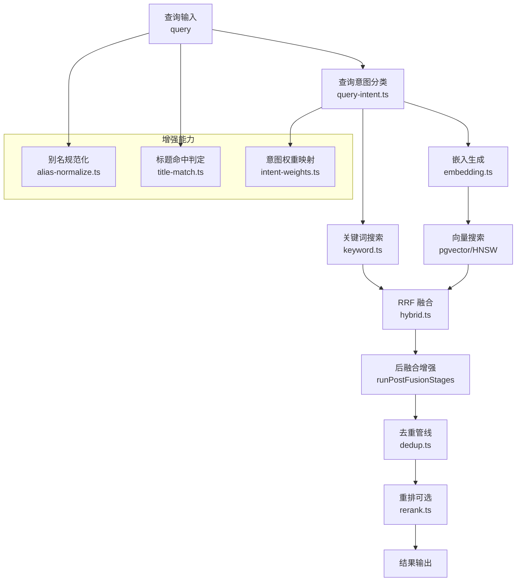
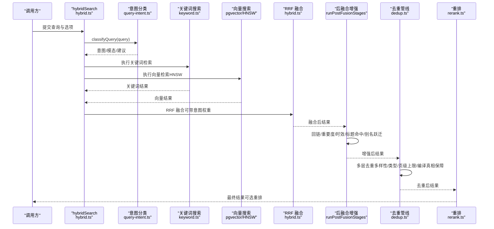
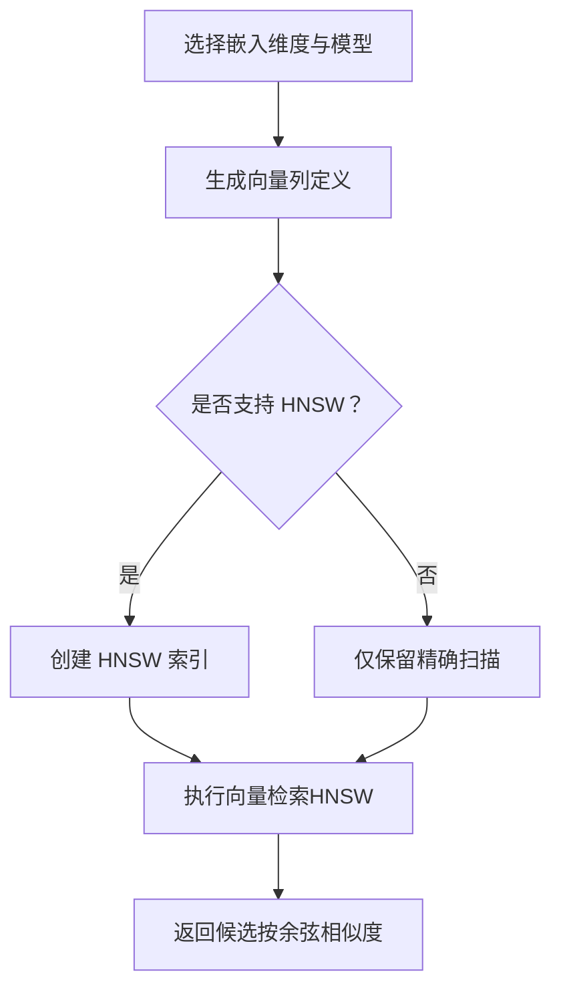
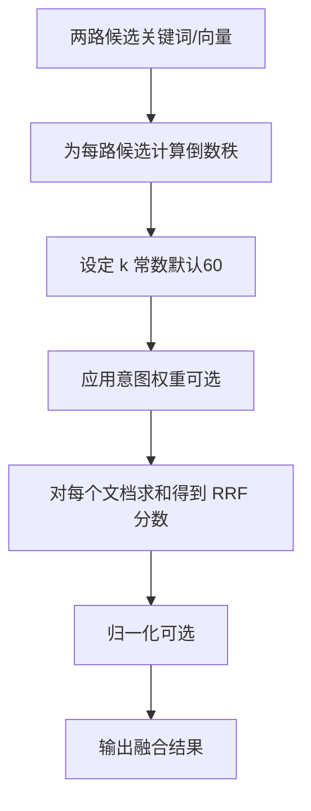
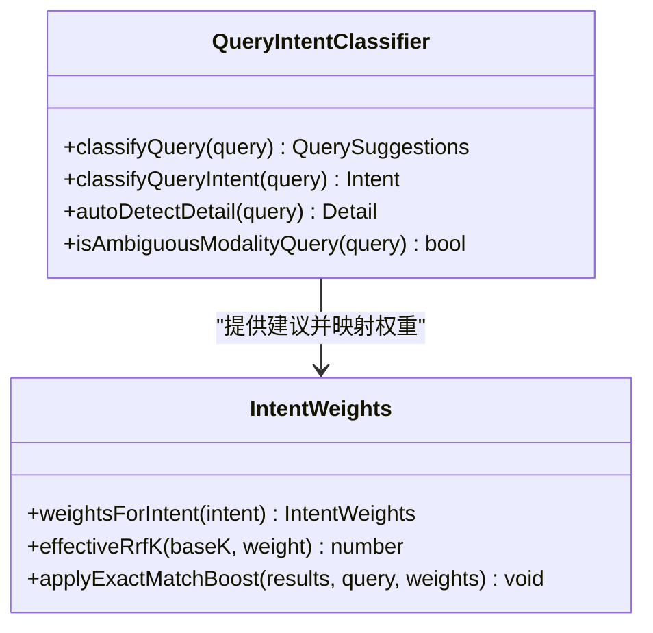
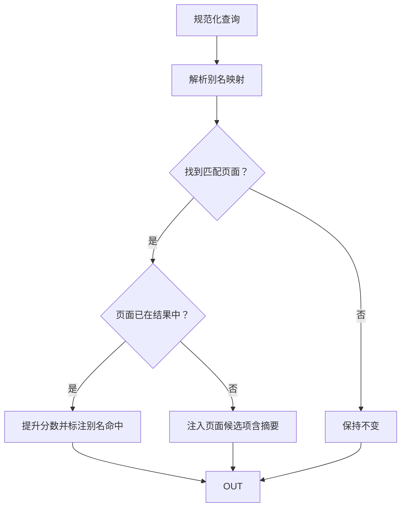
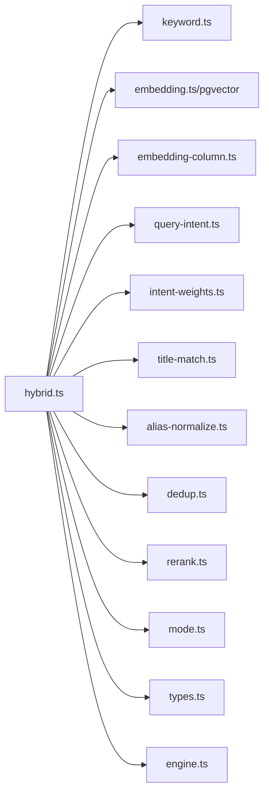

# 混合搜索引擎

<cite>
**本文引用的文件**
- [hybrid.ts](file://src/core/search/hybrid.ts)
- [keyword.ts](file://src/core/search/keyword.ts)
- [query-intent.ts](file://src/core/search/query-intent.ts)
- [intent-weights.ts](file://src/core/search/intent-weights.ts)
- [alias-normalize.ts](file://src/core/search/alias-normalize.ts)
- [title-match.ts](file://src/core/search/title-match.ts)
- [dedup.ts](file://src/core/search/dedup.ts)
- [rerank.ts](file://src/core/search/rerank.ts)
- [embedding-column.ts](file://src/core/search/embedding-column.ts)
- [mode.ts](file://src/core/search/mode.ts)
- [embedding.ts](file://src/core/embedding.ts)
- [engine.ts](file://src/core/engine.ts)
- [types.ts](file://src/core/types.ts)
- [hybrid-search.md](file://test/e2e/fixtures/concepts/hybrid-search.md)
- [query-intent.test.ts](file://test/query-intent.test.ts)
- [alias-normalize.test.ts](file://test/search/alias-normalize.test.ts)
- [alias-hop.test.ts](file://test/search/alias-hop.test.ts)
- [embedding-column-postgres.test.ts](file://test/e2e/embedding-column-postgres.test.ts)
- [rrf-source-key.test.ts](file://test/rrf-source-key.test.ts)
</cite>

## 目录
1. [简介](#简介)
2. [项目结构](#项目结构)
3. [核心组件](#核心组件)
4. [架构总览](#架构总览)
5. [详细组件分析](#详细组件分析)
6. [依赖关系分析](#依赖关系分析)
7. [性能考量](#性能考量)
8. [故障排查指南](#故障排查指南)
9. [结论](#结论)
10. [附录](#附录)

## 简介
本技术文档面向 GBrain 的混合搜索引擎，系统性阐述其“向量搜索（HNSW on pgvector）+ 关键词 BM25 搜索 + RRF 融合”的实现原理、增强能力（查询意图识别、意图权重、标题匹配、别名规范化/别名跃迁）与性能优化策略。文档同时提供配置项说明、调优参数建议、典型查询示例与最佳实践，帮助读者在不同业务场景下选择合适的检索模式并获得稳定、可解释且高性能的检索效果。

## 项目结构
混合搜索由多层模块协作完成：查询意图分类器负责语义与模态路由；向量与关键词两条召回链路分别产出候选；RRF 融合统一打分；后融合阶段叠加元数据增强（回链、重要度、时效、标题命中、别名跃迁）；去重与重排进一步提升质量；最终输出到调用方。

图示来源
- [hybrid.ts](file://src/core/search/hybrid.ts)
- [keyword.ts](file://src/core/search/keyword.ts)
- [query-intent.ts](file://src/core/search/query-intent.ts)
- [intent-weights.ts](file://src/core/search/intent-weights.ts)
- [alias-normalize.ts](file://src/core/search/alias-normalize.ts)
- [title-match.ts](file://src/core/search/title-match.ts)
- [dedup.ts](file://src/core/search/dedup.ts)
- [rerank.ts](file://src/core/search/rerank.ts)

章节来源
- [hybrid.ts](file://src/core/search/hybrid.ts)
- [keyword.ts](file://src/core/search/keyword.ts)
- [query-intent.ts](file://src/core/search/query-intent.ts)
- [intent-weights.ts](file://src/core/search/intent-weights.ts)
- [alias-normalize.ts](file://src/core/search/alias-normalize.ts)
- [title-match.ts](file://src/core/search/title-match.ts)
- [dedup.ts](file://src/core/search/dedup.ts)
- [rerank.ts](file://src/core/search/rerank.ts)

## 核心组件
- 查询意图识别与模态路由：基于正则规则对查询进行意图（实体/时间/事件/一般）与模态（文本/图像/两者）分类，并给出时效与重要度建议。
- 向量搜索：使用 pgvector 的 HNSW 索引进行近似最近邻检索，支持按维度与模型动态配置。
- 关键词搜索：基于 PostgreSQL tsquery 与 tsvector 索引，返回按相关性排序的结果。
- RRF 融合：对两个列表的排名进行融合，通过倒数秩公式综合两路信号。
- 后融合增强：回链、重要度、时效、标题命中、别名跃迁等元数据增强，严格受“底分门限”保护。
- 去重与重排：四层去重保障多样性与代表性；可选交叉编码器重排提升排序精度。
- 别名规范化与别名跃迁：确保写入与读取一致；当查询精确匹配别名时，保证目标页面进入结果集并适当提升。

章节来源
- [query-intent.ts](file://src/core/search/query-intent.ts)
- [intent-weights.ts](file://src/core/search/intent-weights.ts)
- [embedding-column.ts](file://src/core/search/embedding-column.ts)
- [hybrid.ts](file://src/core/search/hybrid.ts)
- [dedup.ts](file://src/core/search/dedup.ts)
- [rerank.ts](file://src/core/search/rerank.ts)
- [alias-normalize.ts](file://src/core/search/alias-normalize.ts)
- [title-match.ts](file://src/core/search/title-match.ts)

## 架构总览
混合搜索的整体流程如下：

图示来源
- [hybrid.ts](file://src/core/search/hybrid.ts)
- [keyword.ts](file://src/core/search/keyword.ts)
- [query-intent.ts](file://src/core/search/query-intent.ts)
- [intent-weights.ts](file://src/core/search/intent-weights.ts)
- [dedup.ts](file://src/core/search/dedup.ts)
- [rerank.ts](file://src/core/search/rerank.ts)

## 详细组件分析

### 向量搜索（HNSW on pgvector）
- 索引与列：根据嵌入维度与模型动态生成向量列与 HNSW 索引定义；部分高维模型不支持 HNSW，保留精确扫描路径。
- 搜索执行：通过引擎接口执行向量检索，返回按余弦相似度排序的候选。
- 维度与模型：测试覆盖了多种维度与模型组合，确保索引可见性与维度一致性检查。

图示来源
- [embedding-column.ts](file://src/core/search/embedding-column.ts)
- [embedding-column-postgres.test.ts](file://test/e2e/embedding-column-postgres.test.ts)

章节来源
- [embedding-column.ts](file://src/core/search/embedding-column.ts)
- [embedding.ts](file://src/core/embedding.ts)
- [embedding-column-postgres.test.ts](file://test/e2e/embedding-column-postgres.test.ts)

### 关键词 BM25 搜索
- 实现：直接委托引擎执行关键词检索，底层使用 PostgreSQL 的 tsquery 与 tsvector 索引。
- 排序：按相关性分数排序，作为 RRF 的另一路输入。

章节来源
- [keyword.ts](file://src/core/search/keyword.ts)

### RRF（Reciprocal Rank Fusion）融合
- 公式：对每个文档，计算各路列表中其排名的倒数之和；默认常数 k=60。
- 权重调整：根据查询意图对关键词/向量列表的贡献进行微调，使融合更贴合用户意图。
- 可配置：支持覆盖 k 常数与去重参数。

图示来源
- [hybrid.ts](file://src/core/search/hybrid.ts)
- [intent-weights.ts](file://src/core/search/intent-weights.ts)
- [rrf-source-key.test.ts](file://test/rrf-source-key.test.ts)

章节来源
- [hybrid.ts](file://src/core/search/hybrid.ts)
- [intent-weights.ts](file://src/core/search/intent-weights.ts)
- [rrf-source-key.test.ts](file://test/rrf-source-key.test.ts)

### 查询意图识别与意图权重
- 意图分类：实体/时间/事件/一般；独立于时效与重要度建议。
- 模态路由：文本/图像/两者；保守默认文本，显式视觉词汇触发图像或两者。
- 权重映射：针对不同意图对关键词/向量权重、建议时效、精确匹配加权进行微调，避免强行翻转排名。

图示来源
- [query-intent.ts](file://src/core/search/query-intent.ts)
- [intent-weights.ts](file://src/core/search/intent-weights.ts)

章节来源
- [query-intent.ts](file://src/core/search/query-intent.ts)
- [intent-weights.ts](file://src/core/search/intent-weights.ts)
- [query-intent.test.ts](file://test/query-intent.test.ts)

### 标题匹配与别名规范化/别名跃迁
- 标题匹配：判断查询是否为页面标题的连续词序列或完全相等，避免泛化内容误导置信度。
- 别名规范化：写入与读取共享同一套规范化规则，确保别名一致收敛。
- 别名跃迁：当查询精确匹配某个页面的别名时，若该页面已在结果中则提升分数，否则注入一条包含页面摘要的候选项。

图示来源
- [alias-normalize.ts](file://src/core/search/alias-normalize.ts)
- [alias-hop.test.ts](file://test/search/alias-hop.test.ts)

章节来源
- [title-match.ts](file://src/core/search/title-match.ts)
- [alias-normalize.ts](file://src/core/search/alias-normalize.ts)
- [alias-hop.test.ts](file://test/search/alias-hop.test.ts)
- [alias-normalize.test.ts](file://test/search/alias-normalize.test.ts)

### 后融合增强（元数据增强）
- 回链增强：基于回链数量对得分进行对数压缩加权，提升权威页面权重。
- 重要度增强：基于情感权重与摘取次数，对页面进行重要度加权。
- 时效增强：按前缀半衰期对页面进行时效加权，支持“强/一般”强度。
- 标题命中增强：当查询是页面标题的短语匹配时，对得分进行有限倍数提升。
- 别名解析增强：当结果页面是某个别名的权威版本时，追加小幅提升。
- 底分门限：上述增强均受“底分门限”保护，避免弱候选跃迁至前列。

章节来源
- [hybrid.ts](file://src/core/search/hybrid.ts)

### 去重与重排
- 去重四层：
  1) 按页保留每页最高分的若干块；
  2) 基于词集合 Jaccard 相似度过滤重复块；
  3) 控制页面类型占比；
  4) 限制每页最大块数。
- 编译真相保障：确保每页至少保留一个“编译真相”块。
- 重排：可选地对头部候选调用交叉编码器重排，失败时回退原顺序。

章节来源
- [dedup.ts](file://src/core/search/dedup.ts)
- [rerank.ts](file://src/core/search/rerank.ts)

## 依赖关系分析
混合搜索模块之间的依赖关系如下：

图示来源
- [hybrid.ts](file://src/core/search/hybrid.ts)
- [keyword.ts](file://src/core/search/keyword.ts)
- [query-intent.ts](file://src/core/search/query-intent.ts)
- [intent-weights.ts](file://src/core/search/intent-weights.ts)
- [alias-normalize.ts](file://src/core/search/alias-normalize.ts)
- [title-match.ts](file://src/core/search/title-match.ts)
- [dedup.ts](file://src/core/search/dedup.ts)
- [rerank.ts](file://src/core/search/rerank.ts)
- [embedding-column.ts](file://src/core/search/embedding-column.ts)
- [mode.ts](file://src/core/search/mode.ts)
- [types.ts](file://src/core/types.ts)
- [engine.ts](file://src/core/engine.ts)

章节来源
- [hybrid.ts](file://src/core/search/hybrid.ts)

## 性能考量
- 向量索引与模型
  - HNSW 索引显著降低向量检索延迟；高维模型可能不支持 HNSW，需降级为精确扫描。
  - 嵌入维度与模型应与下游任务与硬件能力匹配，避免过度消耗资源。
- RRF 参数
  - 默认 k=60；可通过意图权重映射将列表权重转换为有效 k，以平衡两路贡献。
  - 支持覆盖 k 与去重阈值，按业务需求微调。
- 并行与超时
  - 查询嵌入支持共享截止时间，避免缓存查找与内嵌之间互相挤占预算。
  - 重排失败时快速回退，保证整体可用性。
- 去重与重排
  - 去重四层在多样性与代表性间取得平衡；重排仅对头部生效，兼顾召回与排序精度。
- 模式与配置
  - 通过搜索模式（如 tokenmax/保守/均衡）控制意图权重、扩展、预算与重排开关。

章节来源
- [hybrid.ts](file://src/core/search/hybrid.ts)
- [intent-weights.ts](file://src/core/search/intent-weights.ts)
- [dedup.ts](file://src/core/search/dedup.ts)
- [rerank.ts](file://src/core/search/rerank.ts)
- [mode.ts](file://src/core/search/mode.ts)

## 故障排查指南
- HNSW 索引不可见
  - 检查向量列与索引定义是否正确生成；确认数据库中存在相应索引定义。
- 重排失败
  - 查看重排审计日志，定位错误原因（鉴权、网络、超时、速率限制等），系统会自动回退。
- 结果质量异常
  - 检查意图权重与 RRF k 是否合理；确认后融合增强（回链/重要度/时效/标题命中/别名跃迁）是否被正确应用。
- 别名未生效
  - 确认别名规范化规则一致；检查别名跃迁逻辑是否触发（查询长度、精确匹配等约束）。

章节来源
- [embedding-column-postgres.test.ts](file://test/e2e/embedding-column-postgres.test.ts)
- [rerank.ts](file://src/core/search/rerank.ts)
- [hybrid.ts](file://src/core/search/hybrid.ts)
- [alias-hop.test.ts](file://test/search/alias-hop.test.ts)

## 结论
GBrain 的混合搜索引擎通过“向量 + 关键词 + RRF”的组合，在语义与关键词层面互补，再以多维元数据增强与严格的去重/重排流程保障结果质量与多样性。查询意图识别与权重映射使得系统能够自适应不同类型的查询；别名规范化与跃迁机制弥补了同义词与名称差异带来的召回缺口。配合可调的 RRF 参数、模式配置与重排策略，可在不同场景下取得稳定、可解释且高效的检索效果。

## 附录

### 配置与调优要点
- 搜索模式（mode）
  - 通过模式选择默认的意图权重、扩展、预算与重排开关；本地可信调用方可覆盖。
- RRF 调整
  - 可覆盖 k 常数；意图权重会将列表权重映射为有效 k。
- 去重参数
  - 可调整余弦相似度阈值、类型占比上限、每页最大块数等。
- 重排
  - 控制是否启用、发送重排的头部规模与输出裁剪规模，以及超时与模型覆盖。
- 嵌入与索引
  - 根据维度与模型生成向量列与索引；关注 HNSW 支持情况与维度一致性检查。

章节来源
- [mode.ts](file://src/core/search/mode.ts)
- [hybrid.ts](file://src/core/search/hybrid.ts)
- [intent-weights.ts](file://src/core/search/intent-weights.ts)
- [dedup.ts](file://src/core/search/dedup.ts)
- [rerank.ts](file://src/core/search/rerank.ts)
- [embedding-column.ts](file://src/core/search/embedding-column.ts)

### 实际查询示例与预期行为
- “NovaMind”
  - 期望：返回人物、公司与交易相关页面，体现混合搜索对命名实体与语义的协同。
- “hybrid search”
  - 期望：概念类文档高分，体现关键词与语义共同驱动。
- “compiled truth”
  - 期望：确保每页至少保留“编译真相”块，提升事实性内容的可见性。

章节来源
- [hybrid-search.md](file://test/e2e/fixtures/concepts/hybrid-search.md)
- [dedup.ts](file://src/core/search/dedup.ts)