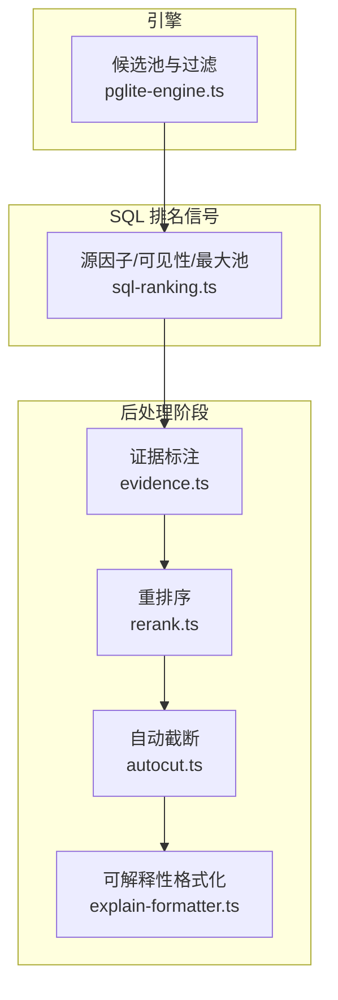
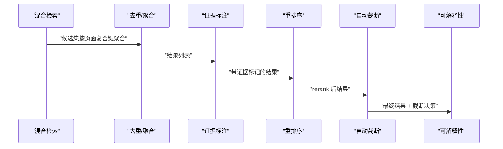
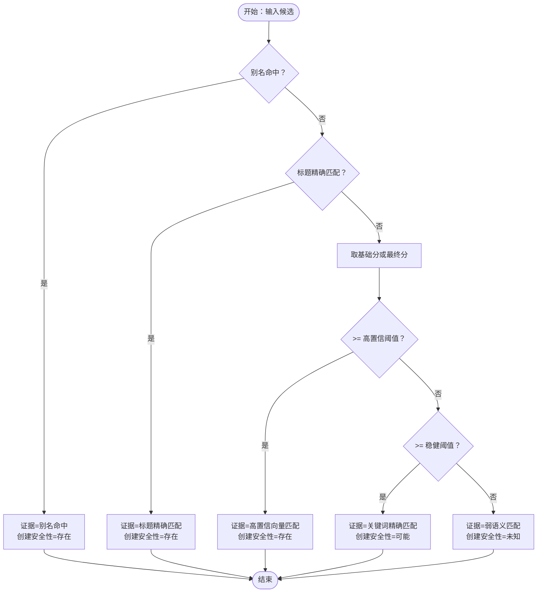
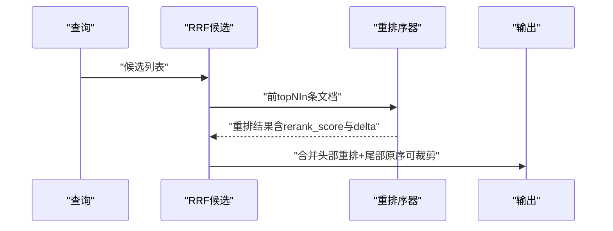
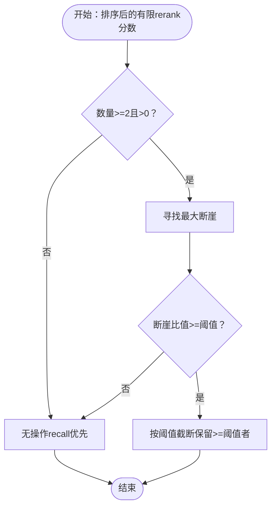
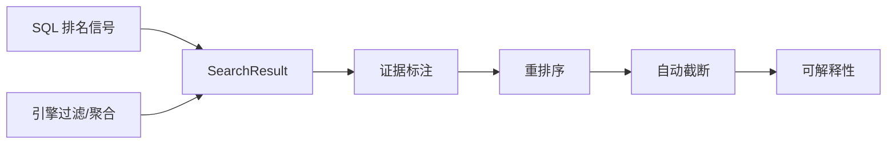

# 结果后处理

<cite>
**本文引用的文件**
- [src/core/search/evidence.ts](file://src/core/search/evidence.ts)
- [src/core/search/rerank.ts](file://src/core/search/rerank.ts)
- [src/core/search/sql-ranking.ts](file://src/core/search/sql-ranking.ts)
- [src/core/search/explain-formatter.ts](file://src/core/search/explain-formatter.ts)
- [src/core/search/autocut.ts](file://src/core/search/autocut.ts)
- [src/core/pglite-engine.ts](file://src/core/pglite-engine.ts)
- [test/search/evidence.test.ts](file://test/search/evidence.test.ts)
- [test/search/rerank.test.ts](file://test/search/rerank.test.ts)
- [test/search/explain-formatter.test.ts](file://test/search/explain-formatter.test.ts)
- [test/token-budget.test.ts](file://test/token-budget.test.ts)
</cite>

## 目录
1. [简介](#简介)
2. [项目结构](#项目结构)
3. [核心组件](#核心组件)
4. [架构总览](#架构总览)
5. [详细组件分析](#详细组件分析)
6. [依赖关系分析](#依赖关系分析)
7. [性能考量](#性能考量)
8. [故障排查指南](#故障排查指南)
9. [结论](#结论)
10. [附录](#附录)

## 简介
本文件聚焦于 GBrain 搜索与检索流水线中的“结果后处理”阶段，系统性阐述去重、重排序（rerank）、证据标注与可解释性输出、以及基于交叉编码器的自动截断（autocut）等关键技术。文档旨在帮助开发者与运营人员理解后处理如何在不牺牲召回的前提下提升搜索质量与多样性，并提供参数配置建议与实操示例。

## 项目结构
后处理能力主要由以下模块协同完成：
- 证据标注与安全决策：evidence.ts
- 重排序（rerank）：rerank.ts
- 可解释性格式化：explain-formatter.ts
- 自动截断（autocut）：autocut.ts
- 排名信号构建（SQL 层）：sql-ranking.ts
- 引擎侧候选池聚合与可见性过滤：pglite-engine.ts
- 测试用例覆盖上述模块的行为与边界条件

**图表来源**
- [src/core/search/evidence.ts:1-79](file://src/core/search/evidence.ts#L1-L79)
- [src/core/search/rerank.ts:1-139](file://src/core/search/rerank.ts#L1-L139)
- [src/core/search/autocut.ts:1-222](file://src/core/search/autocut.ts#L1-L222)
- [src/core/search/explain-formatter.ts:1-144](file://src/core/search/explain-formatter.ts#L1-L144)
- [src/core/search/sql-ranking.ts:1-293](file://src/core/search/sql-ranking.ts#L1-L293)
- [src/core/pglite-engine.ts:1869-1896](file://src/core/pglite-engine.ts#L1869-L1896)

**章节来源**
- [src/core/search/evidence.ts:1-79](file://src/core/search/evidence.ts#L1-L79)
- [src/core/search/rerank.ts:1-139](file://src/core/search/rerank.ts#L1-L139)
- [src/core/search/sql-ranking.ts:1-293](file://src/core/search/sql-ranking.ts#L1-L293)
- [src/core/search/explain-formatter.ts:1-144](file://src/core/search/explain-formatter.ts#L1-L144)
- [src/core/search/autocut.ts:1-222](file://src/core/search/autocut.ts#L1-L222)
- [src/core/pglite-engine.ts:1869-1896](file://src/core/pglite-engine.ts#L1869-L1896)

## 核心组件
- 证据标注与安全决策
  - 通过多级信号优先级确定“证据类型”，并据此推导“创建安全性”（存在/可能/未知），用于防止重复写入。
  - 关键阈值：高置信向量匹配阈值、稳健关键词匹配阈值。
- 重排序（rerank）
  - 对前 N 个候选调用交叉编码器进行重排，保留尾部原始顺序以维持召回；失败时降级回 RRF 顺序。
- 自动截断（autocut）
  - 基于 rerank 分数的最大断崖进行自适应截断，避免固定 K 导致的噪声与“20 vs 1”问题。
- 可解释性格式化
  - 将每个结果的得分归因链路可视化，包括基础分、各 Boost 项、会话抑制、rerank 排序变化等。
- SQL 排名信号
  - 构建源因子、可见性过滤、每页最大池化等 SQL 片段，确保跨引擎一致性与可审计性。

**章节来源**
- [src/core/search/evidence.ts:16-79](file://src/core/search/evidence.ts#L16-L79)
- [src/core/search/rerank.ts:10-139](file://src/core/search/rerank.ts#L10-L139)
- [src/core/search/autocut.ts:1-222](file://src/core/search/autocut.ts#L1-L222)
- [src/core/search/explain-formatter.ts:1-144](file://src/core/search/explain-formatter.ts#L1-L144)
- [src/core/search/sql-ranking.ts:1-293](file://src/core/search/sql-ranking.ts#L1-L293)

## 架构总览
后处理在混合检索完成后执行，顺序如下：
1) 去重（按页面复合键聚合，保留最佳块）
2) 证据标注（stampEvidence）
3) 重排序（applyReranker）
4) 自动截断（applyAutocut）
5) 可解释性输出（formatResultsExplain）

**图表来源**
- [src/core/search/evidence.ts:67-79](file://src/core/search/evidence.ts#L67-L79)
- [src/core/search/rerank.ts:58-139](file://src/core/search/rerank.ts#L58-L139)
- [src/core/search/autocut.ts:134-222](file://src/core/search/autocut.ts#L134-L222)
- [src/core/search/explain-formatter.ts:123-132](file://src/core/search/explain-formatter.ts#L123-L132)

## 详细组件分析

### 证据标注与创建安全性
- 证据优先级（最强信号优先）：别名命中 → 标题精确匹配 → 高置信向量匹配（高于阈值） → 稳健关键词匹配（高于阈值） → 弱语义匹配。
- 创建安全性映射：强证据（存在）/稳健证据（可能）/弱证据（未知）。
- 影响：Agent 依据“证据类型”而非原始分数做“是否已存在”的判断，避免重复写入。

**图表来源**
- [src/core/search/evidence.ts:45-65](file://src/core/search/evidence.ts#L45-L65)

**章节来源**
- [src/core/search/evidence.ts:16-79](file://src/core/search/evidence.ts#L16-L79)
- [test/search/evidence.test.ts:15-75](file://test/search/evidence.test.ts#L15-L75)

### 重排序（Rerank）
- 输入：查询文本、候选结果、重排序选项（启用开关、topNIn、topNOut、模型、超时）。
- 行为：
  - 仅对前 topNIn 条文档发送到 reranker，其余保持原 RRF 顺序。
  - 记录 rerank 分数与 reranker_delta（新旧排名差）。
  - 失败时记录审计日志并返回原始顺序（fail-open）。
- 输出：重排后的结果序列（可选截断至 topNOut）。

**图表来源**
- [src/core/search/rerank.ts:58-139](file://src/core/search/rerank.ts#L58-L139)

**章节来源**
- [src/core/search/rerank.ts:10-139](file://src/core/search/rerank.ts#L10-L139)
- [test/search/rerank.test.ts:179-217](file://test/search/rerank.test.ts#L179-L217)

### 自动截断（Autocut）
- 依据 rerank 分数的最大断崖进行自适应截断，避免固定 K 的噪声。
- 关键参数：jumpRatio（断崖比例阈值）、minKeep（最少保留数）。
- 行为：若无有效断崖或样本不足，则保持原序；否则保留高于截断阈值的所有结果。

**图表来源**
- [src/core/search/autocut.ts:134-222](file://src/core/search/autocut.ts#L134-L222)

**章节来源**
- [src/core/search/autocut.ts:23-99](file://src/core/search/autocut.ts#L23-L99)
- [src/core/search/autocut.ts:134-222](file://src/core/search/autocut.ts#L134-L222)

### 可解释性格式化
- 输出每条结果的得分归因链路：基础分、各 Boost 项、会话抑制、rerank 排名变化、rerank 分数等。
- 支持“autocut 摘要”前置显示，便于理解截断决策。

**章节来源**
- [src/core/search/explain-formatter.ts:1-144](file://src/core/search/explain-formatter.ts#L1-L144)
- [test/search/explain-formatter.test.ts:81-124](file://test/search/explain-formatter.test.ts#L81-L124)

### SQL 排名信号与可见性
- 源因子 CASE 表达式：按最长前缀匹配决定权重，支持 detail='high' 时禁用源因子。
- 可见性过滤：软删除、归档源、隔离封禁（quarantine）等。
- 每页最大池化：按 (source_id, slug) 聚合，保留最高分块，确保跨路径一致性。

**章节来源**
- [src/core/search/sql-ranking.ts:62-84](file://src/core/search/sql-ranking.ts#L62-L84)
- [src/core/search/sql-ranking.ts:151-156](file://src/core/search/sql-ranking.ts#L151-L156)
- [src/core/search/sql-ranking.ts:201-207](file://src/core/search/sql-ranking.ts#L201-L207)

### 引擎侧候选池与过滤
- 在内层 CTE 中应用可见性与时间范围过滤，确保 HNSW 候选池一致，从而稳定分页契约。
- 支持按 source_id 隔离，避免跨源干扰。

**章节来源**
- [src/core/pglite-engine.ts:1869-1896](file://src/core/pglite-engine.ts#L1869-L1896)

## 依赖关系分析
- 证据标注依赖 SearchResult 字段（如 base_score、alias_hit、title_match_boost 等）。
- 重排序依赖 rerank 网关（gateway.rerank），并在失败时回退。
- 自动截断依赖 rerank 分数，且与重排序结果耦合。
- 可解释性格式化依赖所有归因字段（boost_*、reranker_delta、rerank_score 等）。
- SQL 排名信号被引擎注入到检索查询中，影响候选池与排序稳定性。

**图表来源**
- [src/core/search/evidence.ts:29-79](file://src/core/search/evidence.ts#L29-L79)
- [src/core/search/rerank.ts:20-40](file://src/core/search/rerank.ts#L20-L40)
- [src/core/search/autocut.ts:23-47](file://src/core/search/autocut.ts#L23-L47)
- [src/core/search/explain-formatter.ts:31-104](file://src/core/search/explain-formatter.ts#L31-L104)
- [src/core/search/sql-ranking.ts:62-84](file://src/core/search/sql-ranking.ts#L62-L84)
- [src/core/pglite-engine.ts:1869-1896](file://src/core/pglite-engine.ts#L1869-L1896)

**章节来源**
- [src/core/search/evidence.ts:29-79](file://src/core/search/evidence.ts#L29-L79)
- [src/core/search/rerank.ts:20-40](file://src/core/search/rerank.ts#L20-L40)
- [src/core/search/autocut.ts:23-47](file://src/core/search/autocut.ts#L23-L47)
- [src/core/search/explain-formatter.ts:31-104](file://src/core/search/explain-formatter.ts#L31-L104)
- [src/core/search/sql-ranking.ts:62-84](file://src/core/search/sql-ranking.ts#L62-L84)
- [src/core/pglite-engine.ts:1869-1896](file://src/core/pglite-engine.ts#L1869-L1896)

## 性能考量
- 重排序仅对前 topNIn 条文档进行，避免全量 rerank 的开销；tail 保持原序，兼顾召回。
- 自动截断仅在具备有效 rerank 分数时生效，否则无额外计算。
- SQL 层在内层 CTE 应用过滤，减少候选池规模，提高 HNSW 效率。
- 可解释性格式化为纯内存计算，开销极低。

[本节为通用性能讨论，不直接分析具体文件]

## 故障排查指南
- 重排序失败
  - 现象：返回 RRF 原始顺序，同时记录审计日志。
  - 排查：检查网络/鉴权/超时/配额等错误原因；确认 rerank 模型可用性。
- 自动截断未生效
  - 现象：未发生截断或“无断崖”提示。
  - 排查：确认 reranker 是否成功产生分数；检查 jumpRatio 与 minKeep 设置。
- 证据标注异常
  - 现象：evidence/create_safety 不符合预期。
  - 排查：核对 base_score、alias_hit、title_match_boost 等字段是否正确注入。
- 可解释性输出为空或缺失
  - 现象：未显示 Boost 项或 rerank 信息。
  - 排查：确认是否在重排序后调用 explain-formatter；检查字段是否被下游清理。

**章节来源**
- [src/core/search/rerank.ts:85-101](file://src/core/search/rerank.ts#L85-L101)
- [src/core/search/autocut.ts:148-162](file://src/core/search/autocut.ts#L148-L162)
- [src/core/search/explain-formatter.ts:39-104](file://src/core/search/explain-formatter.ts#L39-L104)
- [test/search/evidence.test.ts:38-75](file://test/search/evidence.test.ts#L38-L75)
- [test/search/rerank.test.ts:179-217](file://test/search/rerank.test.ts#L179-L217)
- [test/search/explain-formatter.test.ts:81-124](file://test/search/explain-formatter.test.ts#L81-L124)

## 结论
后处理阶段通过“证据标注 + 重排序 + 自动截断 + 可解释性输出”的组合拳，在不牺牲召回的前提下显著提升了搜索结果的准确性与多样性。其设计强调鲁棒性（fail-open）、可解释性（归因链路）与可审计性（阈值与参数可配置）。配合 SQL 层的源因子与可见性控制，整体流水线在多源联邦场景下保持稳定与一致。

[本节为总结性内容，不直接分析具体文件]

## 附录

### 去重参数与策略
- 页面复合键：(source_id, slug)，确保不同来源同名页面不被误判为重复。
- 最大池化：按页面保留最高分块，避免“最佳块被截断”导致的页面代表性偏差。
- 引擎侧隔离：在内层 CTE 应用可见性与时间范围过滤，保证候选池一致。

**章节来源**
- [src/core/search/sql-ranking.ts:178-207](file://src/core/search/sql-ranking.ts#L178-L207)
- [src/core/pglite-engine.ts:1869-1896](file://src/core/pglite-engine.ts#L1869-L1896)

### 重排序策略与阈值
- 启用策略：模式包默认在 tokenmax 下启用，保守/平衡模式默认关闭。
- 参数建议：
  - topNIn：建议 20–50，兼顾质量与成本。
  - topNOut：默认 null（不裁剪），如需严格长度可设为合理上限。
  - timeoutMs：根据上游 SLA 设定（默认 5000ms）。
- 失败处理：严格 fail-open，不影响搜索可靠性。

**章节来源**
- [src/core/search/rerank.ts:15-18](file://src/core/search/rerank.ts#L15-L18)
- [src/core/search/rerank.ts:25-40](file://src/core/search/rerank.ts#L25-L40)
- [src/core/search/rerank.ts:58-139](file://src/core/search/rerank.ts#L58-L139)

### 证据标注与安全决策
- 阈值参考：
  - 高置信向量匹配：≥ 0.85
  - 稳健关键词匹配：≥ 0.60
- 安全决策：
  - 别名命中/标题精确匹配/高置信向量匹配 → 存在（禁止重复创建）
  - 关键词精确匹配 → 可能（更倾向更新）
  - 弱语义匹配 → 未知（需人工审阅）

**章节来源**
- [src/core/search/evidence.ts:40-65](file://src/core/search/evidence.ts#L40-L65)
- [test/search/evidence.test.ts:15-75](file://test/search/evidence.test.ts#L15-L75)

### 自动截断配置
- jumpRatio：断崖比例阈值，默认 0.20；可根据任务精度需求调整。
- minKeep：最少保留数，默认 1；确保至少返回一个答案。
- 生效条件：仅当 reranker 成功对≥2项给出有限分数时启用。

**章节来源**
- [src/core/search/autocut.ts:23-47](file://src/core/search/autocut.ts#L23-L47)
- [src/core/search/autocut.ts:86-99](file://src/core/search/autocut.ts#L86-L99)
- [src/core/search/autocut.ts:134-222](file://src/core/search/autocut.ts#L134-L222)

### 实际处理示例（流程示意）
- 步骤 1：混合检索生成候选
- 步骤 2：按 (source_id, slug) 聚合，保留最高分块
- 步骤 3：为每条结果标注 evidence 与 create_safety
- 步骤 4：对前 topNIn 条调用 rerank，记录 rerank_score 与 reranker_delta
- 步骤 5：基于 rerank 分数断崖进行自动截断
- 步骤 6：输出可解释性归因链路

**章节来源**
- [src/core/search/sql-ranking.ts:201-207](file://src/core/search/sql-ranking.ts#L201-L207)
- [src/core/search/evidence.ts:67-79](file://src/core/search/evidence.ts#L67-L79)
- [src/core/search/rerank.ts:58-139](file://src/core/search/rerank.ts#L58-L139)
- [src/core/search/autocut.ts:134-222](file://src/core/search/autocut.ts#L134-L222)
- [src/core/search/explain-formatter.ts:123-132](file://src/core/search/explain-formatter.ts#L123-L132)