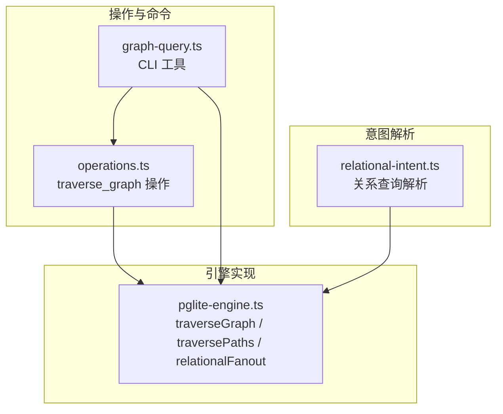
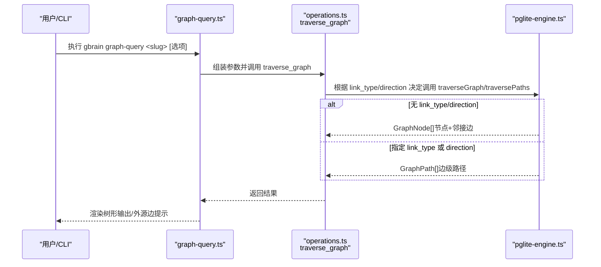
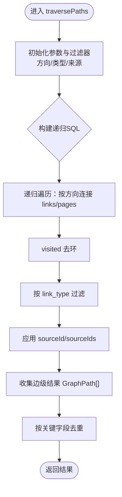
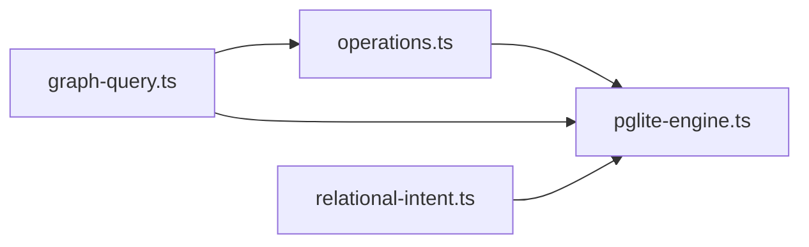

# 图遍历查询

<cite>
**本文引用的文件**
- [operations.ts](file://src/core/operations.ts)
- [pglite-engine.ts](file://src/core/pglite-engine.ts)
- [graph-query.ts](file://src/commands/graph-query.ts)
- [graph-query.test.ts](file://test/graph-query.test.ts)
- [pglite-engine.test.ts](file://test/pglite-engine.test.ts)
- [relational-intent.ts](file://src/core/search/relational-intent.ts)
- [relational-intent.test.ts](file://test/relational-intent.test.ts)
- [v0_36_frontier_cap.test.ts](file://test/regressions/v0_36_frontier_cap.test.ts)
</cite>

## 目录
1. [简介](#简介)
2. [项目结构](#项目结构)
3. [核心组件](#核心组件)
4. [架构总览](#架构总览)
5. [详细组件分析](#详细组件分析)
6. [依赖分析](#依赖分析)
7. [性能考量](#性能考量)
8. [故障排查指南](#故障排查指南)
9. [结论](#结论)
10. [附录：查询语法与最佳实践](#附录查询语法与最佳实践)

## 简介
本文件面向GBrain的“图遍历查询”子系统，系统性阐述基于链接图（link graph）的关系探索与路径查找机制，覆盖以下主题：
- 图遍历算法与递归深度控制
- 多跳关系探索与方向过滤（出边、入边、双向）
- 边类型过滤与来源隔离（source scope）
- 查询优化策略（前层截断、去重、索引利用）
- 复杂查询语法与意图解析（relational-intent）
- 结果渲染与CLI交互
- 实际查询示例、性能调优建议与常见模式最佳实践

## 项目结构
围绕图遍历查询的关键代码分布在如下模块：
- 操作入口与参数校验：operations.ts 中的 traverse_graph 操作
- 引擎实现：pglite-engine.ts 的 traverseGraph/traversePaths/relationalFanout
- 命令行工具：src/commands/graph-query.ts 及其测试 test/graph-query.test.ts
- 关系查询意图解析：src/core/search/relational-intent.ts 及其测试 test/relational-intent.test.ts
- 回归与边界测试：test/pglite-engine.test.ts、test/regressions/v0_36_frontiers_cap.test.ts

图表来源
- [operations.ts:2057-2089](file://src/core/operations.ts#L2057-L2089)
- [pglite-engine.ts:2735-2965](file://src/core/pglite-engine.ts#L2735-L2965)
- [graph-query.ts:130-189](file://src/commands/graph-query.ts#L130-L189)
- [relational-intent.ts:222-243](file://src/core/search/relational-intent.ts#L222-L243)

章节来源
- [operations.ts:2057-2089](file://src/core/operations.ts#L2057-L2089)
- [pglite-engine.ts:2735-2965](file://src/core/pglite-engine.ts#L2735-L2965)
- [graph-query.ts:130-189](file://src/commands/graph-query.ts#L130-L189)
- [relational-intent.ts:222-243](file://src/core/search/relational-intent.ts#L222-L243)

## 核心组件
- traverse_graph 操作：统一入口，负责参数校验、深度上限裁剪、来源隔离，并根据是否指定 link_type 或 direction 决定返回 GraphNode[] 还是 GraphPath[]。
- PGLiteEngine.traverseGraph：返回节点与邻接边集合，支持前层截断（frontierCap）以限制输出规模。
- PGLiteEngine.traversePaths：返回边级路径列表（GraphPath[]），支持方向过滤与边类型过滤，内置循环检测与去重。
- PGLiteEngine.relationalFanout：面向关系查询的扇出聚合，按 hop/edge_count/path 聚合并排序，支持 mentions 排除与来源隔离。
- graph-query CLI：封装 traverse_paths 的人类可读树形输出，支持 --include-foreign 与外源边计数提示。

章节来源
- [operations.ts:2057-2089](file://src/core/operations.ts#L2057-L2089)
- [pglite-engine.ts:2735-2965](file://src/core/pglite-engine.ts#L2735-L2965)
- [pglite-engine.ts:2967-3049](file://src/core/pglite-engine.ts#L2967-L3049)
- [graph-query.ts:130-189](file://src/commands/graph-query.ts#L130-L189)

## 架构总览
下图展示从命令到引擎再到SQL执行的整体流程，以及在不同方向与边类型过滤下的分支逻辑。

图表来源
- [graph-query.ts:130-189](file://src/commands/graph-query.ts#L130-L189)
- [operations.ts:2057-2089](file://src/core/operations.ts#L2057-L2089)
- [pglite-engine.ts:2735-2965](file://src/core/pglite-engine.ts#L2735-L2965)

## 详细组件分析

### 组件A：traverse_graph 操作与参数约束
- 参数与约束
  - slug：必填，起始页面标识
  - depth：默认5，最大10；超过上限会记录告警并裁剪
  - link_type：边类型过滤（每条边必须匹配）
  - direction：'in'/'out'/'both'，默认'out'
- 来源隔离：通过 sourceScopeOpts 将调用者可见的 sourceId/sourceIds 下推至引擎，防止跨源拓扑泄露
- 兼容性：未设置 link_type/direction 时返回 GraphNode[]；否则返回 GraphPath[] 以满足边级查询需求

章节来源
- [operations.ts:2057-2089](file://src/core/operations.ts#L2057-L2089)

### 组件B：PGLiteEngine.traversePaths（边级路径遍历）
- 功能要点
  - 支持 out/in/both 三种方向
  - per-edge link_type 过滤：仅跟随匹配类型的边
  - 循环检测：使用 visited 数组避免重复访问
  - 去重：按 from_slug|to_slug|link_type|depth 去重，保证每条边只出现一次
  - 来源隔离：在种子、步进与最终选择阶段均应用 sourceId/sourceIds 过滤
- 性能与安全
  - 递归深度受 depth 限制
  - 通过 visited 防止指数爆炸
  - 严格来源过滤避免越权访问

图表来源
- [pglite-engine.ts:2831-2965](file://src/core/pglite-engine.ts#L2831-L2965)

章节来源
- [pglite-engine.ts:2831-2965](file://src/core/pglite-engine.ts#L2831-L2965)

### 组件C：PGLiteEngine.traverseGraph（节点级遍历与前层截断）
- 功能要点
  - 返回 GraphNode[]，每个节点包含 slug/title/type/depth 与邻接边数组
  - 支持 frontierCap 前层截断：对每轮递归结果先 ORDER BY 再 LIMIT，稳定选择前 N 个节点
  - 循环检测与 visited 防护
  - 聚合去重：对邻接边进行 JSONB 去重
- 并发与稳定性
  - 测试覆盖并发调用独立受限的结果集
  - 保持数组形状，避免结构体字段泄漏

章节来源
- [pglite-engine.ts:2735-2829](file://src/core/pglite-engine.ts#L2735-L2829)
- [v0_36_frontier_cap.test.ts:79-134](file://test/regressions/v0_36_frontier_cap.test.ts#L79-L134)

### 组件D：relationalFanout（关系查询扇出聚合）
- 用途：面向关系查询（connects/intro/who_*）的高阶聚合，按 hop、边类型计数、路径等维度排序
- 特性
  - 支持 mentions 排除
  - 按种子来源隔离，确保跨源不越权
  - 输出包含 hop、edge_count、via_link_types、canonical_chunk_id 等元信息

章节来源
- [pglite-engine.ts:2967-3049](file://src/core/pglite-engine.ts#L2967-L3049)

### 组件E：graph-query CLI（树形渲染与外源边提示）
- 行为
  - 解析 --type/--depth/--direction/--include-foreign
  - 调用 traverse_paths 或 traverse_graph（当指定 link_type/direction）
  - 渲染树形边级输出
  - 当未包含外源边且未显式 --include-foreign 时，统计并提示隐藏的外源边数量
- 测试验证
  - 方向与类型过滤正确性
  - 外源边计数与提示文案
  - 不存在 slug 的兜底提示

章节来源
- [graph-query.ts:130-189](file://src/commands/graph-query.ts#L130-L189)
- [graph-query.test.ts:65-132](file://test/graph-query.test.ts#L65-L132)
- [graph-query.test.ts:135-207](file://test/graph-query.test.ts#L135-L207)

### 组件F：relational-intent（关系查询意图解析）
- 目标：从自然语言中识别“关系型查询”，提取种子实体、边类型与方向
- 模式
  - who_rel：谁对X做了什么（如 invested in/founded/advises/works at/attended）
  - who_at：谁在某组织从事某工作
  - connects：连接两个实体
  - intro：介绍/连接某人
- 安全与边界
  - 种子长度与停用词过滤
  - 仅允许已知 link_type，避免漂移
  - ReDoS 防护：限定种子捕获长度与锚点

章节来源
- [relational-intent.ts:222-243](file://src/core/search/relational-intent.ts#L222-L243)
- [relational-intent.test.ts:17-70](file://test/relational-intent.test.ts#L17-L70)
- [relational-intent.test.ts:117-136](file://test/relational-intent.test.ts#L117-L136)

## 依赖分析
- 模块耦合
  - operations.ts 作为薄薄的入口，依赖引擎方法与来源作用域
  - graph-query.ts 同时依赖本地引擎与远程 MCP（薄客户端场景）
  - relational-intent 与引擎解耦，纯解析模块
- 外部依赖
  - SQL 层：PostgreSQL/SQLite 兼容语法（PGLite）
  - 测试：Bun 测试框架与数据库初始化/清理

图表来源
- [operations.ts:2057-2089](file://src/core/operations.ts#L2057-L2089)
- [pglite-engine.ts:2735-2965](file://src/core/pglite-engine.ts#L2735-L2965)
- [graph-query.ts:130-189](file://src/commands/graph-query.ts#L130-L189)
- [relational-intent.ts:222-243](file://src/core/search/relational-intent.ts#L222-L243)

章节来源
- [operations.ts:2057-2089](file://src/core/operations.ts#L2057-L2089)
- [pglite-engine.ts:2735-2965](file://src/core/pglite-engine.ts#L2735-L2965)
- [graph-query.ts:130-189](file://src/commands/graph-query.ts#L130-L189)
- [relational-intent.ts:222-243](file://src/core/search/relational-intent.ts#L222-L243)

## 性能考量
- 递归深度与前层截断
  - depth 上限（默认5，最大10）限制递归层数，防止指数爆炸
  - frontierCap 对每层递归结果先排序再截断，稳定且可控地限制输出规模
- 循环检测与去重
  - visited 数组避免重复访问同一节点
  - traversePaths 对边级结果按关键字段去重
- 来源隔离
  - 在种子、步进与聚合阶段均应用 sourceId/sourceIds 过滤，减少无关数据扫描
- SQL 与索引利用
  - links/pages 表应具备必要的索引（例如 from_page_id/to_page_id/slug/source_id）
  - 使用递归CTE时，尽量配合 LIMIT 与 ORDER BY 以提升可预测性与稳定性
- 并发与一致性
  - 不同 cap 的并发调用相互独立，避免共享状态导致的“边界泄漏”

章节来源
- [operations.ts:2057-2089](file://src/core/operations.ts#L2057-L2089)
- [pglite-engine.ts:2761-2788](file://src/core/pglite-engine.ts#L2761-L2788)
- [pglite-engine.ts:2949-2964](file://src/core/pglite-engine.ts#L2949-L2964)
- [v0_36_frontier_cap.test.ts:79-134](file://test/regressions/v0_36_frontier_cap.test.ts#L79-L134)

## 故障排查指南
- “无边可查”
  - 确认 slug 存在且有链接
  - 若使用了 link_type/direction，检查该方向/类型是否存在
- “隐藏的外源边”
  - 默认跨源边会被隔离；若需查看，使用 --include-foreign
  - CLI 会在未包含外源边时提示隐藏数量
- “结果为空但存在跨源边”
  - 检查 sourceId/sourceIds 是否正确传入
  - 确认目标边两端的 source_id 设置
- “性能过慢或内存占用高”
  - 降低 depth 或启用 frontierCap
  - 优先使用 link_type 过滤缩小搜索空间
  - 确保数据库侧索引健全

章节来源
- [graph-query.ts:159-188](file://src/commands/graph-query.ts#L159-L188)
- [pglite-engine.test.ts:1175-1225](file://test/pglite-engine.test.ts#L1175-L1225)

## 结论
GBrain的图遍历查询体系通过“操作入口 + 引擎实现 + CLI/意图解析”的分层设计，在保证安全性（来源隔离）、可扩展性（方向/类型/来源过滤）与可维护性（去重/循环检测/前层截断）的同时，提供了灵活的关系探索能力。对于大规模图查询，建议结合 link_type 过滤、适度的 depth 与 frontierCap，以及合理的索引策略，以获得稳定且高效的查询体验。

## 附录：查询语法与最佳实践
- 基础语法
  - gbrain graph-query <slug> [--type <link_type>] [--depth <N>] [--direction in|out|both] [--include-foreign]
- 示例模式
  - 多跳关系：查询与某人共同参与会议的人（--type attended --depth 2）
  - 入边汇聚：查询在某公司工作的人员（--type works_at --direction in）
  - 出边展开：查询某人投资过的公司（--type invested_in --direction out）
  - 双向探索：查询介绍/连接某人的关系（--direction both）
- 最佳实践
  - 优先指定 link_type 缩小搜索空间
  - 控制 depth，避免过深导致的指数增长
  - 使用 --include-foreign 显式查看跨源边
  - 对高频查询启用 frontierCap 以稳定吞吐
  - 确保数据库索引覆盖 slug/source_id/link_type/from_page_id/to_page_id

章节来源
- [graph-query.ts:48-75](file://src/commands/graph-query.ts#L48-L75)
- [pglite-engine.test.ts:1175-1225](file://test/pglite-engine.test.ts#L1175-L1225)
- [relational-intent.ts:108-172](file://src/core/search/relational-intent.ts#L108-L172)