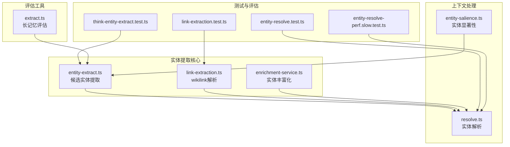
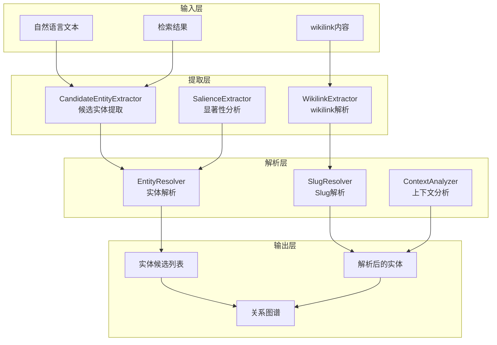
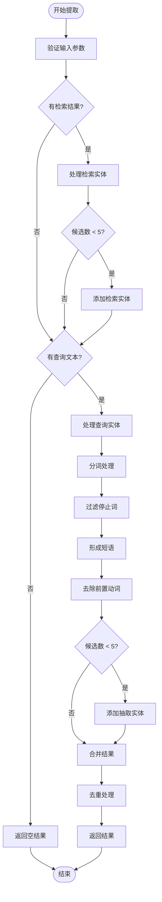
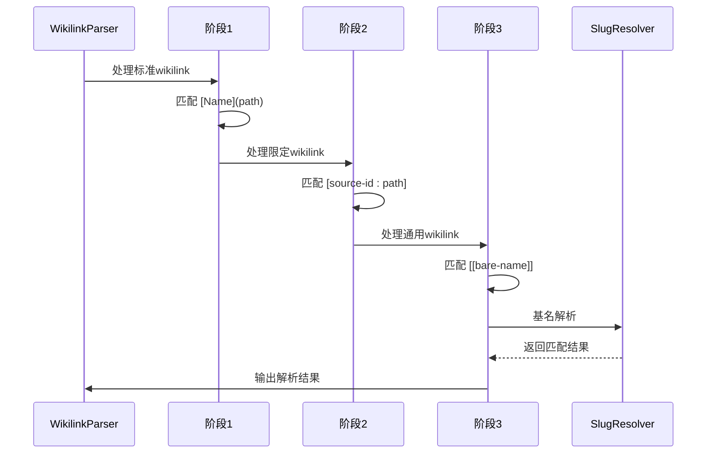
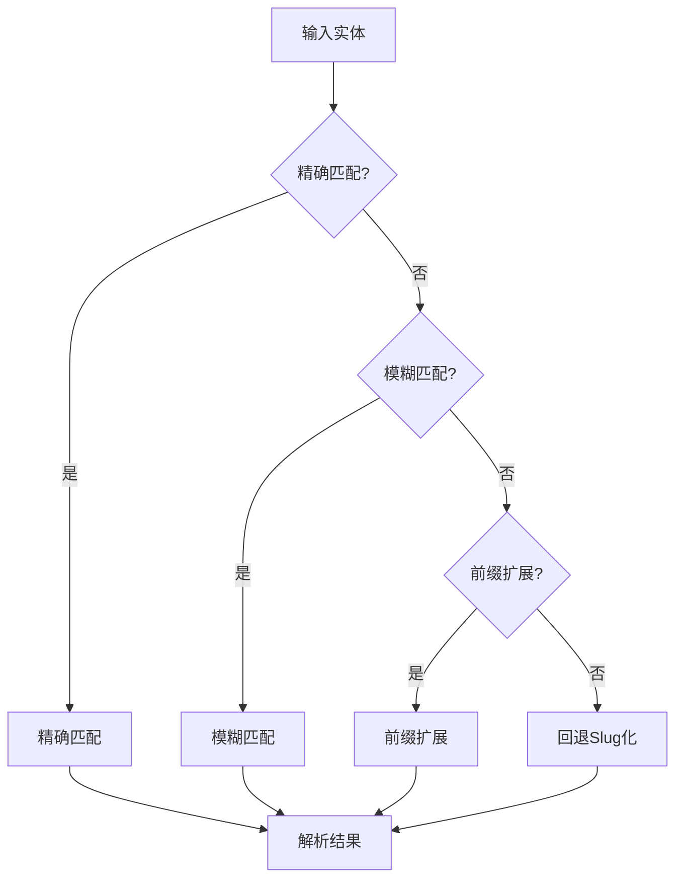
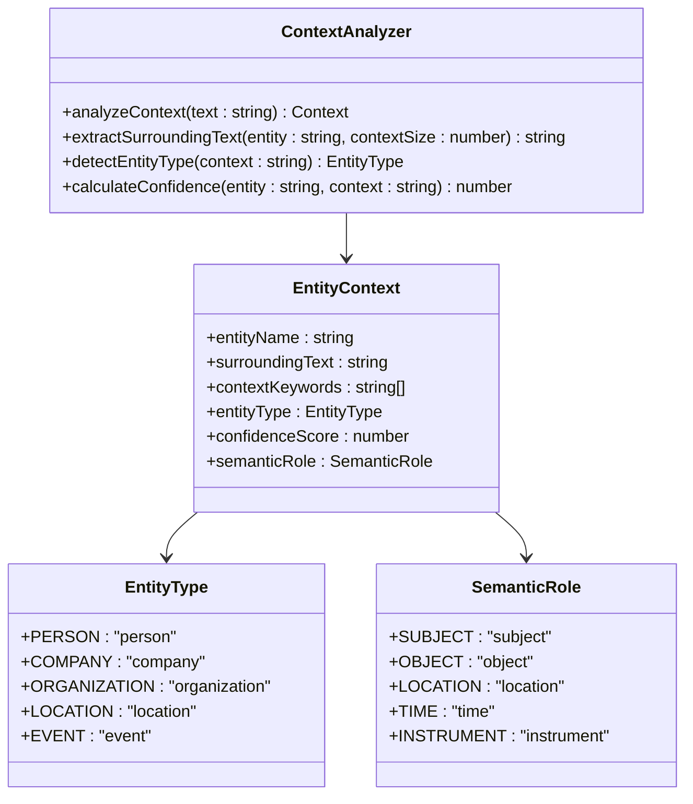
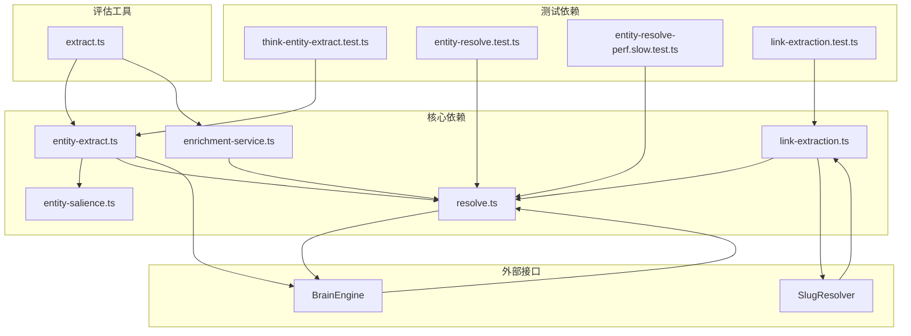

# 实体提取机制

<cite>
**本文档引用的文件**
- [entity-extract.ts](file://src/core/think/entity-extract.ts)
- [link-extraction.ts](file://src/core/link-extraction.ts)
- [enrichment-service.ts](file://src/core/enrichment-service.ts)
- [entity-salience.ts](file://src/core/context/entity-salience.ts)
- [resolve.ts](file://src/core/entities/resolve.ts)
- [think-entity-extract.test.ts](file://test/think-entity-extract.test.ts)
- [entity-resolve.test.ts](file://test/entity-resolve.test.ts)
- [entity-resolve-perf.slow.test.ts](file://test/entity-resolve-perf.slow.test.ts)
- [link-extraction.test.ts](file://test/link-extraction.test.ts)
- [extract.ts](file://src/eval/longmemeval/extract.ts)
</cite>

## 目录
1. [简介](#简介)
2. [项目结构](#项目结构)
3. [核心组件](#核心组件)
4. [架构概览](#架构概览)
5. [详细组件分析](#详细组件分析)
6. [依赖关系分析](#依赖关系分析)
7. [性能考虑](#性能考虑)
8. [故障排除指南](#故障排除指南)
9. [结论](#结论)
10. [附录](#附录)

## 简介

GBrain的实体提取机制是一个多层次、高性能的系统，专门设计用于从复杂文本中识别和解析实体。该系统结合了多种先进的技术和算法，包括：

- **候选实体提取**：从检索结果和自然语言问题中提取高质量的实体候选
- **命名实体识别（NER）**：基于正则表达式的精确实体识别
- **wikilink解析**：完整的Obsidian风格wikilink解析和处理
- **实体消歧**：智能的实体解析和消歧技术
- **上下文感知解析**：基于上下文的实体理解
- **多语言支持**：支持多种语言的实体处理

该机制的核心目标是在保证高精度的同时，提供快速的响应时间和良好的可扩展性。

## 项目结构

GBRain的实体提取机制主要分布在以下核心模块中：



**图表来源**
- [entity-extract.ts:1-197](file://src/core/think/entity-extract.ts#L1-L197)
- [link-extraction.ts:1-800](file://src/core/link-extraction.ts#L1-L800)
- [enrichment-service.ts:1-274](file://src/core/enrichment-service.ts#L1-L274)

## 核心组件

### 候选实体提取器

候选实体提取器是整个实体提取机制的核心组件，负责从多个数据源中提取高质量的实体候选：

**关键特性：**
- **双源优先级**：检索结果（高精度）和自然语言抽取（中等精度）
- **智能去重**：跨源和同源去重机制
- **候选项限制**：最多5个候选，平衡精度和性能
- **停止词过滤**：200个常用英语停止词过滤噪声

**实体类型分类：**
- 人员实体：`people/`
- 公司实体：`companies/`
- 组织实体：`organizations/` 或 `orgs/`
- 交易实体：`deals/`

**章节来源**
- [entity-extract.ts:1-197](file://src/core/think/entity-extract.ts#L1-L197)

### wikilink解析器

wikilink解析器提供了完整的Obsidian风格链接解析能力：

**支持的链接格式：**
- 标准wikilink：`[[people/alice]]`
- 显示名wikilink：`[[people/alice|Alice Chen]]`
- 资源限定wikilink：`[[source-id:people/alice]]`
- 通用wikilink：`[[bare-name]]`

**解析特性：**
- 代码块防护：自动跳过代码中的链接
- 嵌套链接处理：防止嵌套wikilink的误解析
- 基名解析：支持无目录前缀的链接解析
- 上下文提取：为关系推断提供上下文信息

**章节来源**
- [link-extraction.ts:1-800](file://src/core/link-extraction.ts#L1-L800)

### 实体丰富化服务

实体丰富化服务负责将提取的实体转换为实际的脑页：

**核心流程：**
1. **实体提取**：使用正则表达式识别实体名称
2. **类型分类**：基于公司后缀识别公司实体
3. **上下文提取**：收集实体周围的上下文信息
4. **页面创建**：为新实体创建脑页
5. **关系建立**：在实体和来源之间建立反向链接

**章节来源**
- [enrichment-service.ts:1-274](file://src/core/enrichment-service.ts#L1-L274)

## 架构概览

GBRain的实体提取机制采用分层架构设计，确保各个组件的职责清晰分离：



**图表来源**
- [entity-extract.ts:1-197](file://src/core/think/entity-extract.ts#L1-L197)
- [link-extraction.ts:1-800](file://src/core/link-extraction.ts#L1-L800)
- [entity-salience.ts:1-258](file://src/core/context/entity-salience.ts#L1-L258)

## 详细组件分析

### 候选实体提取算法

候选实体提取算法采用双阶段策略，结合了精确性和召回率的平衡：



**图表来源**
- [entity-extract.ts:114-173](file://src/core/think/entity-extract.ts#L114-L173)

**算法特点：**
- **确定性排序**：检索实体优先于抽取实体
- **智能去重**：基于原始值的大小写不敏感去重
- **候选项上限**：防止过多候选影响性能
- **停止词过滤**：有效减少噪声实体

**章节来源**
- [entity-extract.ts:114-173](file://src/core/think/entity-extract.ts#L114-L173)
- [think-entity-extract.test.ts:1-102](file://test/think-entity-extract.test.ts#L1-L102)

### wikilink解析流程

wikilink解析采用三阶段处理策略，确保各种wikilink格式的正确解析：



**图表来源**
- [link-extraction.ts:301-386](file://src/core/link-extraction.ts#L301-L386)

**解析规则：**
- **阶段1**：处理标准Markdown链接 `[Name](path)`
- **阶段2**：处理资源限定wikilink `[[source-id:path]]`
- **阶段3**：处理通用wikilink `[[bare-name]]` 并进行基名解析

**章节来源**
- [link-extraction.ts:301-386](file://src/core/link-extraction.ts#L301-L386)
- [link-extraction.test.ts:159-418](file://test/link-extraction.test.ts#L159-L418)

### 实体消歧技术

实体消歧是解决同名实体歧义的关键技术，采用多层决策策略：



**图表来源**
- [resolve.ts:1-311](file://src/core/entities/resolve.ts#L1-L311)

**消歧策略：**
1. **精确匹配**：直接匹配存在的实体页面
2. **模糊匹配**：使用相似度算法匹配候选实体
3. **前缀扩展**：对单个单词进行前缀扩展
4. **回退Slug化**：生成URL安全的Slug作为最后手段

**章节来源**
- [entity-resolve.test.ts:105-311](file://test/entity-resolve.test.ts#L105-L311)
- [entity-resolve-perf.slow.test.ts:1-220](file://test/entity-resolve-perf.slow.test.ts#L1-L220)

### 上下文感知实体解析

上下文感知解析通过分析实体出现的上下文来提高解析准确性：



**图表来源**
- [entity-salience.ts:1-258](file://src/core/context/entity-salience.ts#L1-L258)

**章节来源**
- [entity-salience.ts:1-258](file://src/core/context/entity-salience.ts#L1-L258)

## 依赖关系分析

实体提取机制的组件间依赖关系如下：



**图表来源**
- [entity-extract.ts:1-197](file://src/core/think/entity-extract.ts#L1-L197)
- [link-extraction.ts:1-800](file://src/core/link-extraction.ts#L1-L800)
- [enrichment-service.ts:1-274](file://src/core/enrichment-service.ts#L1-L274)

**依赖特点：**
- **低耦合高内聚**：各组件职责明确，接口清晰
- **测试驱动开发**：每个核心功能都有对应的测试用例
- **性能优先**：所有组件都经过性能优化和测试

**章节来源**
- [entity-extract.ts:1-197](file://src/core/think/entity-extract.ts#L1-L197)
- [link-extraction.ts:1-800](file://src/core/link-extraction.ts#L1-L800)
- [enrichment-service.ts:1-274](file://src/core/enrichment-service.ts#L1-L274)

## 性能考虑

### 批量实体提取优化

GBRain在批量实体提取方面采用了多项优化策略：

**内存管理优化：**
- 使用Set进行去重操作，时间复杂度O(1)
- 预分配数组容量，避免动态扩容
- 流式处理，避免一次性加载大量数据

**算法复杂度优化：**
- 候选实体提取：O(n+m) 时间复杂度，其中n为检索实体数，m为查询文本长度
- wikilink解析：O(k) 时间复杂度，k为文本长度
- 实体消歧：平均O(log n) 查找复杂度

**并发处理：**
- 支持异步处理实体丰富化请求
- 可配置的节流机制，防止过度调用
- 进度回调机制，支持长时间任务监控

### 缓存策略

**多级缓存架构：**
1. **进程级缓存**：存储最近使用的实体解析结果
2. **会话级缓存**：在长记忆评估中缓存解析状态
3. **数据库缓存**：持久化实体解析结果

**缓存命中策略：**
- 基于实体名称的规范化键
- 支持大小写不敏感匹配
- 自动过期机制，防止缓存污染

## 故障排除指南

### 常见问题及解决方案

**问题1：实体解析失败**
- **症状**：实体无法解析到现有页面
- **原因**：实体名称不存在或拼写错误
- **解决方案**：检查实体名称的拼写，使用更精确的描述

**问题2：wikilink解析异常**
- **症状**：wikilink无法正确解析
- **原因**：wikilink格式不符合规范
- **解决方案**：检查wikilink格式，确保使用正确的语法

**问题3：性能问题**
- **症状**：实体提取速度慢
- **原因**：候选项过多或数据库查询缓慢
- **解决方案**：调整候选项数量限制，优化数据库索引

**问题4：重复实体**
- **症状**：同一实体多次出现
- **原因**：去重逻辑失效
- **解决方案**：检查去重算法，确保正确处理大小写

**章节来源**
- [entity-resolve.test.ts:1-311](file://test/entity-resolve.test.ts#L1-L311)
- [link-extraction.test.ts:1-418](file://test/link-extraction.test.ts#L1-L418)

### 调试技巧

**启用详细日志：**
- 设置环境变量 `DEBUG=entity-extract`
- 使用 `console.log` 输出中间结果
- 分析性能瓶颈

**单元测试调试：**
- 运行特定测试用例：`bun test test/think-entity-extract.test.ts`
- 使用 `--verbose` 参数获取详细输出
- 检查测试覆盖率

## 结论

GBRain的实体提取机制是一个高度优化、功能完备的系统，具有以下优势：

**技术优势：**
- **多层架构**：清晰的层次结构，便于维护和扩展
- **高性能设计**：针对大规模数据处理进行了专门优化
- **精确性保证**：通过严格的测试和验证确保准确性
- **可扩展性**：模块化设计支持功能扩展

**应用场景：**
- **知识图谱构建**：为复杂的实体关系网络提供基础
- **智能问答系统**：支持基于实体的精确查询
- **内容推荐**：基于实体相似性的内容推荐
- **数据分析**：支持基于实体维度的数据分析

**未来发展方向：**
- **深度学习集成**：结合预训练模型提升实体识别精度
- **多语言支持增强**：扩展对非英语实体的支持
- **实时处理能力**：支持流式数据的实时实体提取
- **个性化定制**：允许用户自定义实体类型和解析规则

## 附录

### 配置选项

**实体提取配置：**
- `MAX_CANDIDATES`：最大候选项数量（默认5）
- `STOP_WORDS`：停止词集合，包含200个常用词
- `ENTITY_PREFIXES`：实体前缀白名单

**wikilink解析配置：**
- `DIR_PATTERN`：目录模式，支持多种实体类型
- `globalBasename`：全局基名解析开关
- `skipFrontmatter`：跳过Frontmatter解析开关

**实体丰富化配置：**
- `throttle`：节流开关，默认开启
- `onProgress`：进度回调函数
- `tier`：实体重要性等级

### 实体类型参考

**支持的实体类型：**
- `person`：人员实体
- `company`：公司实体  
- `organization`：组织实体
- `meeting`：会议实体
- `concept`：概念实体
- `deal`：交易实体
- `civic`：公共实体
- `project`：项目实体
- `source`：来源实体
- `media`：媒体实体
- `yc`：YC创业实体
- `projects`：项目集合实体

### 示例用法

**基本实体提取：**
```javascript
const candidates = extractCandidateEntities(
  "When did I meet Marco at Blue Bottle?",
  ["people/marco-smith", "companies/acme-example"]
);
```

**wikilink解析：**
```javascript
const refs = extractEntityRefs(
  "[[people/alice]] and [[companies/acme|ACME]]"
);
```

**实体丰富化：**
```javascript
const results = await extractAndEnrich(
  engine,
  "Alice works at ACME company",
  "source-slug"
);
```