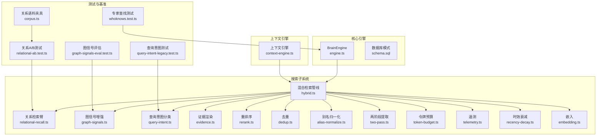
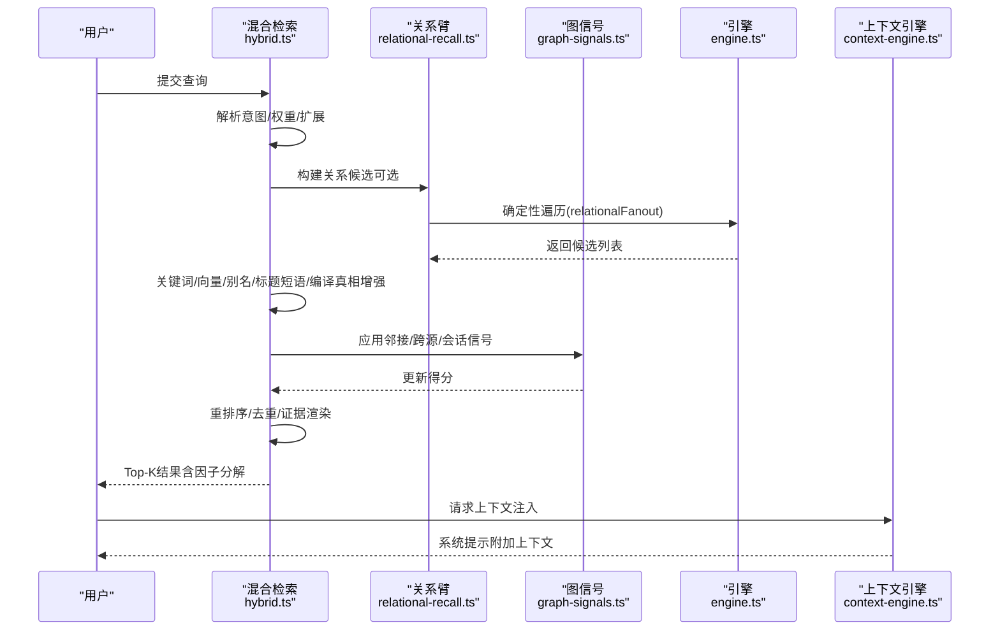
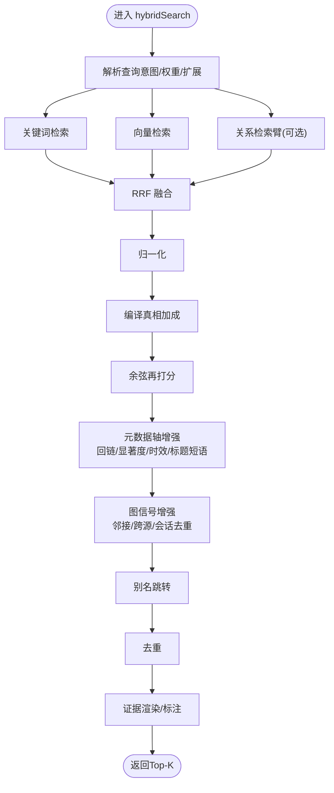
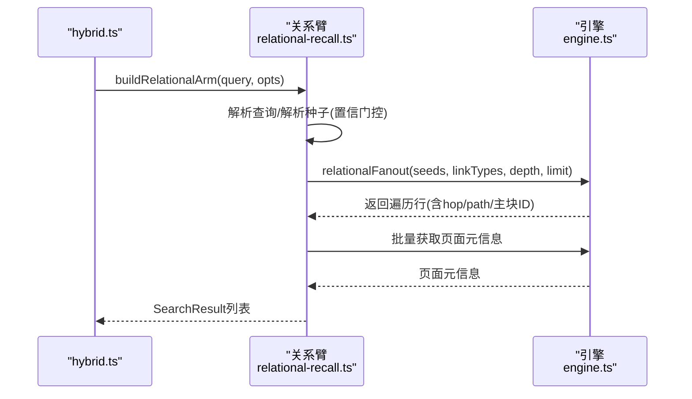
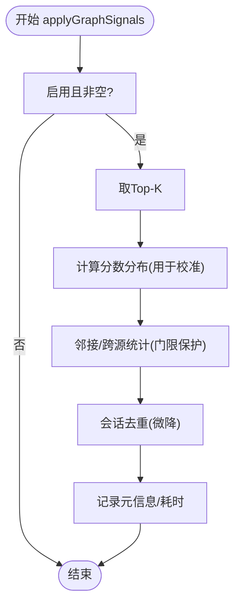
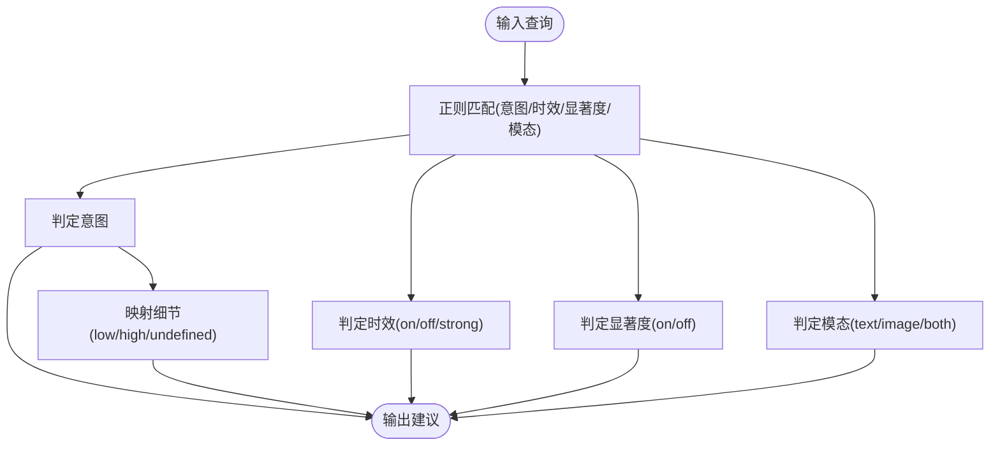
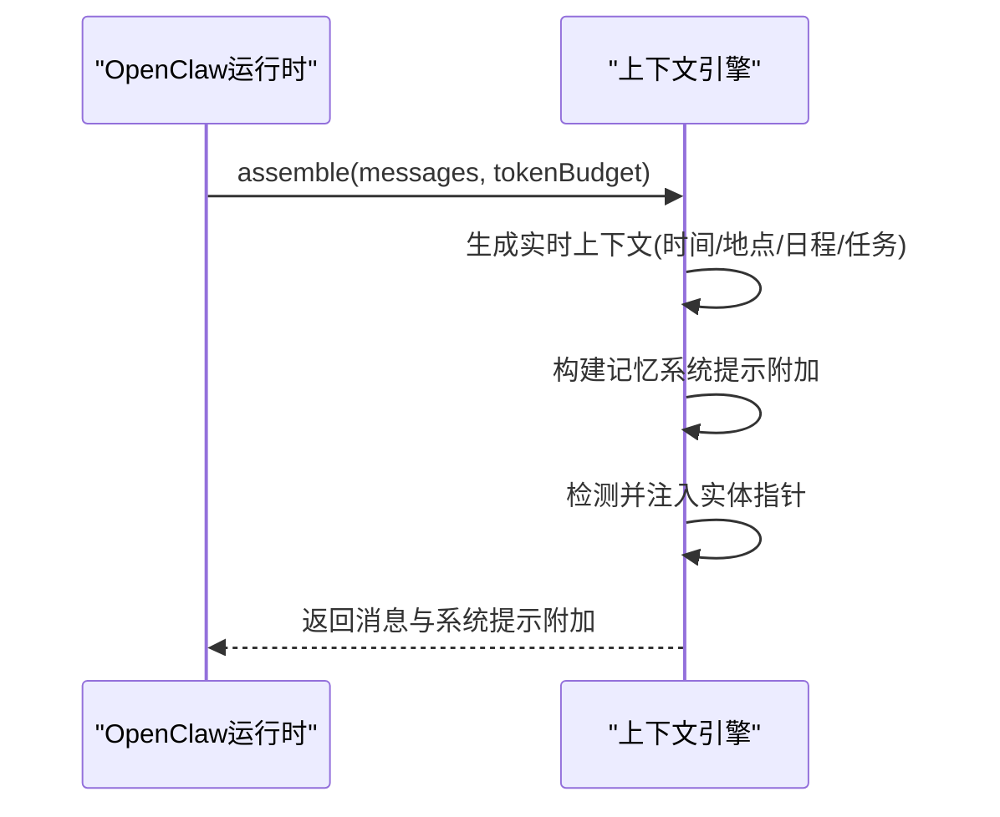
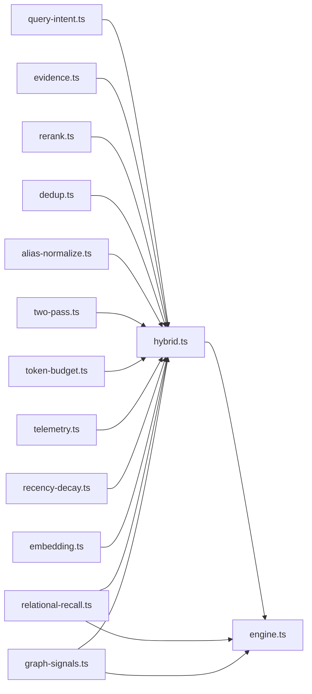

# 知识发现与推理

<cite>
**本文引用的文件**
- [hybrid.ts](file://src/core/search/hybrid.ts)
- [relational-recall.ts](file://src/core/search/relational-recall.ts)
- [graph-signals.ts](file://src/core/search/graph-signals.ts)
- [query-intent.ts](file://src/core/search/query-intent.ts)
- [engine.ts](file://src/core/engine.ts)
- [context-engine.ts](file://src/core/context-engine.ts)
- [relational-ab.test.ts](file://test/relational-ab.test.ts)
- [graph-signals-eval.test.ts](file://test/e2e/graph-signals-eval.test.ts)
- [query-intent-legacy.test.ts](file://test/query-intent-legacy.test.ts)
- [gbrain-base.yaml](file://src/core/schema-pack/base/gbrain-base.yaml)
- [gbrain-recommended.yaml](file://src/core/schema-pack/base/gbrain-recommended.yaml)
- [whoknows.test.ts](file://test/e2e/whoknows.test.ts)
- [evidence.ts](file://src/core/search/evidence.ts)
- [intent-weights.ts](file://src/core/search/intent-weights.ts)
- [dedup.ts](file://src/core/search/dedup.ts)
- [alias-normalize.ts](file://src/core/search/alias-normalize.ts)
- [two-pass.ts](file://src/core/search/two-pass.ts)
- [token-budget.ts](file://src/core/search/token-budget.ts)
- [telemetry.ts](file://src/core/search/telemetry.ts)
- [recency-decay.ts](file://src/core/search/recency-decay.ts)
- [rerank.ts](file://src/core/search/rerank.ts)
- [embedding.ts](file://src/core/embedding.ts)
- [schema.sql](file://src/schema.sql)
- [pglite-engine.ts](file://src/core/pglite-engine.ts)
- [import-file.ts](file://src/core/import-file.ts)
- [hybrid.ts（测试夹具）](file://test/fixtures/retrieval-quality/relational/corpus.ts)
</cite>

## 目录
1. [引言](#引言)
2. [项目结构](#项目结构)
3. [核心组件](#核心组件)
4. [架构总览](#架构总览)
5. [详细组件分析](#详细组件分析)
6. [依赖关系分析](#依赖关系分析)
7. [性能考量](#性能考量)
8. [故障排查指南](#故障排查指南)
9. [结论](#结论)
10. [附录](#附录)

## 引言
本文件面向GBrain的知识发现与推理系统，聚焦于“基于图谱的关系推理、隐式知识挖掘与智能推荐”的综合技术文档。内容覆盖：
- 基于图谱的类型化边检索（关系推理）
- 上下文感知的知识发现与模式识别
- 隐式知识挖掘与证据聚合
- 智能推荐与洞察生成流程
- 推理规则定义、证据聚合与结论验证的算法实现
- 实际应用场景、推理链路示例与结果解释方法

## 项目结构
GBrain采用模块化分层设计：核心引擎负责数据模型与操作；搜索子系统提供混合检索与后融合增强；上下文引擎注入确定性上下文；测试用例与基准评估确保质量与回归。

图表来源
- [engine.ts](file://src/core/engine.ts)
- [hybrid.ts](file://src/core/search/hybrid.ts)
- [relational-recall.ts](file://src/core/search/relational-recall.ts)
- [graph-signals.ts](file://src/core/search/graph-signals.ts)
- [query-intent.ts](file://src/core/search/query-intent.ts)
- [context-engine.ts](file://src/core/context-engine.ts)
- [relational-ab.test.ts](file://test/relational-ab.test.ts)
- [graph-signals-eval.test.ts](file://test/e2e/graph-signals-eval.test.ts)
- [query-intent-legacy.test.ts](file://test/query-intent-legacy.test.ts)
- [whoknows.test.ts](file://test/e2e/whoknows.test.ts)
- [corpus.ts](file://test/fixtures/retrieval-quality/relational/corpus.ts)

章节来源
- [engine.ts](file://src/core/engine.ts)
- [hybrid.ts](file://src/core/search/hybrid.ts)
- [context-engine.ts](file://src/core/context-engine.ts)

## 核心组件
- 搜索主干（混合检索与后融合）：关键词+向量+关系+图信号四臂融合，支持精确匹配、标题短语、别名跳转、元数据轴（回链、显著度、时效）等多维增强，并在去重前进行重排序与证据标注。
- 关系检索臂：解析关系型查询，按源内确定性遍历，产出候选并强化页面真实主块。
- 图信号增强：基于邻接统计、跨源邻接与会话去重，保守放大/微调排名。
- 查询意图分类：一次性正则扫描，输出意图、细节、显著度、时效与模态建议。
- 上下文引擎：确定性注入时间、地点、日程、任务等上下文，避免“时间漂移”问题。
- 推荐与洞察：结合salience/recency/title/alias/graph信号，形成可解释的Top-K与因子分解。

章节来源
- [hybrid.ts](file://src/core/search/hybrid.ts)
- [relational-recall.ts](file://src/core/search/relational-recall.ts)
- [graph-signals.ts](file://src/core/search/graph-signals.ts)
- [query-intent.ts](file://src/core/search/query-intent.ts)
- [context-engine.ts](file://src/core/context-engine.ts)

## 架构总览
GBrain以BrainEngine为中心，统一抽象Postgres与PGLite，提供页面、链接、事实、轨迹、清单等能力。搜索子系统在hybrid.ts中编排，关系臂与图信号作为后融合增强，贯穿意图分类、证据渲染、重排序与去重。

图表来源
- [hybrid.ts](file://src/core/search/hybrid.ts)
- [relational-recall.ts](file://src/core/search/relational-recall.ts)
- [graph-signals.ts](file://src/core/search/graph-signals.ts)
- [engine.ts](file://src/core/engine.ts)
- [context-engine.ts](file://src/core/context-engine.ts)

## 详细组件分析

### 组件A：混合检索与后融合（hybrid.ts）
- 管线阶段
  - 关键词/向量双通道，RRF融合，归一化，编译真相加成，余弦再打分，去重。
  - 后融合阶段：回链、显著度、时效、标题短语、图信号、别名解析，逐级门限保护。
- 关键特性
  - floor-ratio门限：限制元数据三轴（回链/显著度/时效）对低分页的提升幅度，防止弱页跃迁。
  - 标题短语与别名跳转：在不破坏语义的前提下，补充命名实体与同义词覆盖。
  - 图信号：邻接/跨源/会话去重三类保守信号，失败开路不中断。
  - 可观测性：缓存写入节流、元信息回调、遥测记录。
- 性能要点
  - 查询嵌入超时与预算共享，避免慢提供方阻塞。
  - 多阶段并行与批处理（如邻接统计），减少往返。

图表来源
- [hybrid.ts](file://src/core/search/hybrid.ts)
- [graph-signals.ts](file://src/core/search/graph-signals.ts)
- [relational-recall.ts](file://src/core/search/relational-recall.ts)

章节来源
- [hybrid.ts](file://src/core/search/hybrid.ts)
- [graph-signals.ts](file://src/core/search/graph-signals.ts)
- [relational-recall.ts](file://src/core/search/relational-recall.ts)

### 组件B：关系检索臂（relational-recall.ts）
- 功能定位：将关系型查询解析为类型化边候选，作为第四RRF臂参与竞争。
- 流程
  - 解析查询（种子、方向、关系类型）、按源解析种子（置信门控）、确定性遍历、批量水化为SearchResult。
- 容错策略：失败开路，审计写入，不影响主检索热路径。
- 联邦支持：在多源脑中，按源解析种子并分别遍历，避免跨边界边。

图表来源
- [relational-recall.ts](file://src/core/search/relational-recall.ts)
- [engine.ts](file://src/core/engine.ts)

章节来源
- [relational-recall.ts](file://src/core/search/relational-recall.ts)
- [relational-ab.test.ts](file://test/relational-ab.test.ts)
- [corpus.ts](file://test/fixtures/retrieval-quality/relational/corpus.ts)

### 组件C：图信号增强（graph-signals.ts）
- 三类信号
  - 邻接（同一集合内入链≥2，小幅提升）
  - 跨源邻接（来自≥2不同源，更大提升）
  - 会话去重（同一会话前缀多条命中，仅保留最高分，其余微降）
- 保守幅度与门限继承：与floor-ratio门限一致，防止弱页跃迁。
- 失败开路：SQL异常不中断，仅写入审计事件。

图表来源
- [graph-signals.ts](file://src/core/search/graph-signals.ts)

章节来源
- [graph-signals.ts](file://src/core/search/graph-signals.ts)
- [graph-signals-eval.test.ts](file://test/e2e/graph-signals-eval.test.ts)

### 组件D：查询意图分类（query-intent.ts）
- 单次正则扫描，输出意图、细节、显著度、时效与模态建议。
- 决策规则
  - 意图优先级：全量上下文 > 时间型 > 事件 > 实体 > 一般
  - 显著度与时效正交：权威答案倾向关闭时效/显著度，除非显式时间边界
  - 模态：仅当明确视觉名词时触发图像模态，否则默认文本
- 兼容性：保留v0.29.0意图类型映射与自动细节检测。

图表来源
- [query-intent.ts](file://src/core/search/query-intent.ts)
- [query-intent-legacy.test.ts](file://test/query-intent-legacy.test.ts)

章节来源
- [query-intent.ts](file://src/core/search/query-intent.ts)
- [query-intent-legacy.test.ts](file://test/query-intent-legacy.test.ts)

### 组件E：上下文引擎（context-engine.ts）
- 在OpenClaw插件中，确定性注入时间、地点、日程、任务等上下文，避免“时间漂移”。
- 支持Retrieval Reflex实体指针注入，零LLM调用，失败开路。

图表来源
- [context-engine.ts](file://src/core/context-engine.ts)

章节来源
- [context-engine.ts](file://src/core/context-engine.ts)

### 组件F：证据聚合与结论验证（evidence.ts + hybrid.ts）
- 证据渲染：对候选块进行长度控制、空项过滤、文本净化与来源标注。
- 结论验证：通过显著度、时效、标题短语、别名解析等信号，形成可解释的Top-K与因子分解，便于人工复核与LLM校验。

章节来源
- [evidence.ts](file://src/core/search/evidence.ts)
- [hybrid.ts](file://src/core/search/hybrid.ts)

## 依赖关系分析
- 搜索子系统依赖BrainEngine提供的页面、链接、邻接、回链、显著度、有效日期、别名解析等能力。
- 关系臂依赖引擎的relationalFanout与页面水化接口。
- 图信号依赖引擎的邻接统计接口。
- 查询意图分类独立于数据库，但影响搜索权重与后融合策略。
- 上下文引擎与搜索解耦，通过系统提示附加方式集成。

图表来源
- [hybrid.ts](file://src/core/search/hybrid.ts)
- [relational-recall.ts](file://src/core/search/relational-recall.ts)
- [graph-signals.ts](file://src/core/search/graph-signals.ts)
- [engine.ts](file://src/core/engine.ts)

章节来源
- [hybrid.ts](file://src/core/search/hybrid.ts)
- [engine.ts](file://src/core/engine.ts)

## 性能考量
- 嵌入与预算：查询嵌入设置绝对截止时间与最小预算，避免慢提供方拖垮整体。
- 门限保护：floor-ratio门限限制元数据三轴对低分页的提升，防止长尾跃迁。
- 并行与批处理：邻接统计、别名解析、页面水化等采用批处理与并行策略。
- 缓存写入节流：搜索缓存写入注册后台清理器，避免挂起。
- 令牌预算与两阶段：先估算再展开，避免超预算。

## 故障排查指南
- 关系检索臂失败：检查解析种子是否置信度过低或表缺失，查看最近失败审计事件。
- 图信号失败：关注邻接统计SQL异常与门限设置，确认Top-K大小与门限阈值。
- 搜索超时：检查嵌入提供方响应与deadline配置，适当放宽或切换模型。
- 结果不可解释：开启--explain查看各阶段因子（回链/显著度/时效/标题短语/图信号/别名解析）。

章节来源
- [relational-recall.ts](file://src/core/search/relational-recall.ts)
- [graph-signals.ts](file://src/core/search/graph-signals.ts)
- [hybrid.ts](file://src/core/search/hybrid.ts)

## 结论
GBrain通过“关系检索臂 + 图信号增强 + 多维元数据轴”的组合，实现了对隐式知识与关系线索的稳健挖掘；结合上下文引擎与证据渲染，形成可解释、可校验、可扩展的智能推荐与洞察生成体系。测试与基准覆盖确保了在复杂场景下的召回与稳定性。

## 附录

### 实际应用场景与推理链路示例
- 场景A：关系推理
  - 输入：“某公司投资了哪些人”
  - 链路：解析查询→解析种子→确定性遍历→候选水化→RRF融合→图信号→Top-K
  - 结果解释：展示“公司→投资”关系路径与候选页面，标注关系边类型与层级
- 场景B：上下文感知
  - 输入：“今天会议要点”
  - 链路：意图分类→时效/显著度建议→元数据轴增强→Top-K
  - 结果解释：强调当日日程与高显著度页面，避免历史干扰
- 场景C：专家推荐
  - 输入：“某主题专家”
  - 链路：页面/事实/轨迹→显著度/时效/回链→Top-K与因子分解
  - 结果解释：每个候选的专家度量、时效因子、显著度因子与得分来源

章节来源
- [relational-ab.test.ts](file://test/relational-ab.test.ts)
- [graph-signals-eval.test.ts](file://test/e2e/graph-signals-eval.test.ts)
- [whoknows.test.ts](file://test/e2e/whoknows.test.ts)
- [query-intent-legacy.test.ts](file://test/query-intent-legacy.test.ts)

### 推理规则与证据聚合要点
- 规则定义
  - 关系臂：类型化边+深度+上限，失败开路
  - 图信号：邻接≥2、跨源≥2、会话去重，保守幅度
  - 元数据轴：回链、显著度、时效，floor-ratio门限
- 证据聚合
  - 渲染长度控制、空项过滤、来源标注
  - 结论验证：因子分解与可解释性输出

章节来源
- [relational-recall.ts](file://src/core/search/relational-recall.ts)
- [graph-signals.ts](file://src/core/search/graph-signals.ts)
- [hybrid.ts](file://src/core/search/hybrid.ts)
- [evidence.ts](file://src/core/search/evidence.ts)