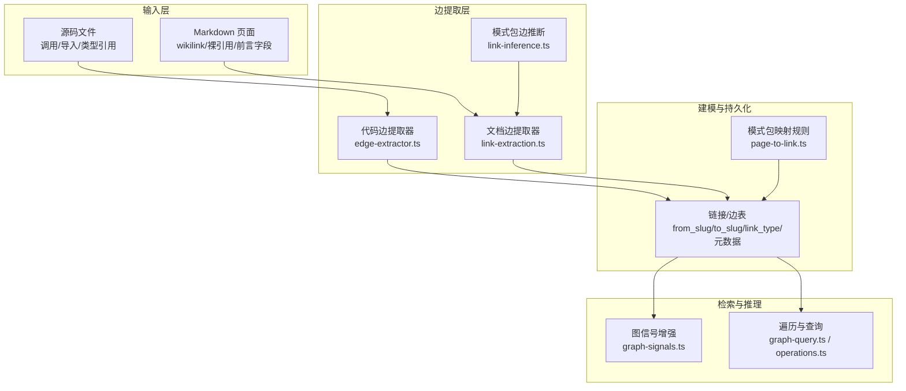
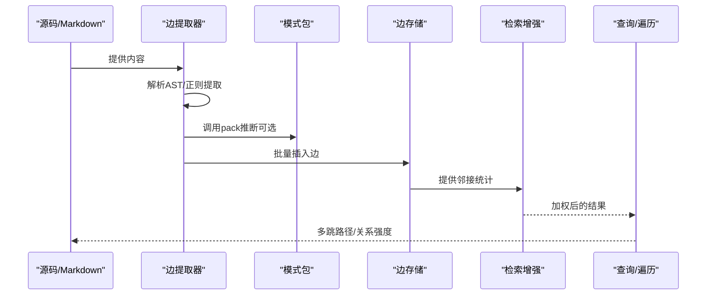
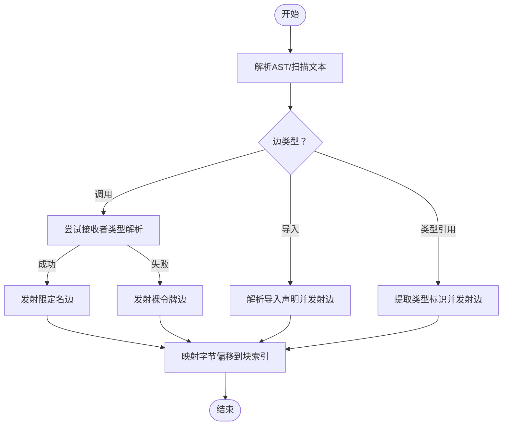
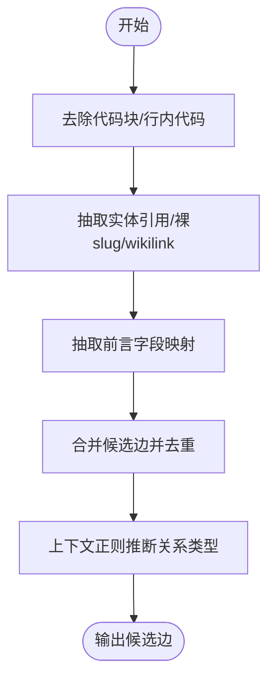
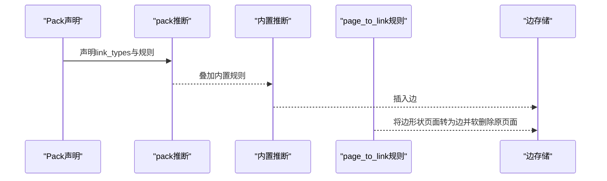
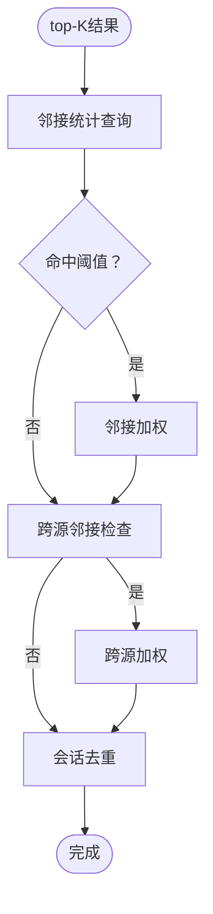
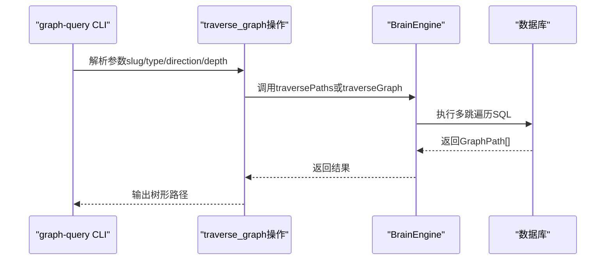
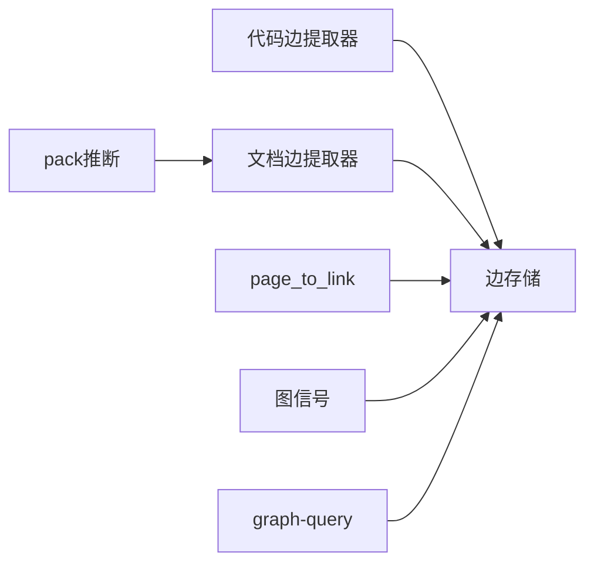

# 类型化边创建

<cite>
**本文引用的文件**
- [edge-extractor.ts](file://src/core/chunkers/edge-extractor.ts)
- [link-extraction.ts](file://src/core/link-extraction.ts)
- [link-inference.ts](file://src/core/schema-pack/link-inference.ts)
- [page-to-link.ts](file://src/core/schema-pack/page-to-link.ts)
- [graph-signals.ts](file://src/core/search/graph-signals.ts)
- [graph-query.ts](file://src/commands/graph-query.ts)
- [operations.ts](file://src/core/operations.ts)
- [manifest-v1.ts](file://src/core/schema-pack/manifest-v1.ts)
- [pglite-engine.ts](file://src/core/pglite-engine.ts)
- [traverse-graph-dedup.test.ts](file://test/traverse-graph-dedup.test.ts)
- [graph-signals-engine.test.ts](file://test/e2e/graph-signals-engine.test.ts)
</cite>

## 目录
1. [引言](#引言)
2. [项目结构](#项目结构)
3. [核心组件](#核心组件)
4. [架构总览](#架构总览)
5. [详细组件分析](#详细组件分析)
6. [依赖分析](#依赖分析)
7. [性能考虑](#性能考虑)
8. [故障排查指南](#故障排查指南)
9. [结论](#结论)
10. [附录](#附录)

## 引言
本技术文档围绕 GBrain 的“类型化边创建”系统，系统性阐述边类型的定义与分类、实体间关系的自动识别与建模流程、边权重与关系强度评估、多跳关系推理机制、边的生命周期与动态更新策略、一致性保障，以及边查询语法、关系过滤与路径分析的实际应用示例。目标是帮助读者从零理解并高效使用该系统。

## 项目结构
与“类型化边创建”直接相关的核心模块包括：
- 代码边提取：从源码中抽取调用、导入、类型引用等结构性边（符号级）。
- 文档边提取：从 Markdown 内容中抽取实体链接、语义关系类型推断、前言字段映射等。
- 模式包（Schema Pack）：定义页面类型、边类型、推断规则、映射规则等，支撑可插拔的关系建模。
- 图信号与检索增强：基于邻接统计、跨源邻接、会话去重等信号对检索结果进行加权与去抖。
- 查询与遍历：CLI 与操作接口提供按类型与方向的多跳遍历与路径输出。
- 数据模型：统一的边结构（来源/目标、类型、元数据、来源标识、解析状态）。

图表来源
- [edge-extractor.ts:1-556](file://src/core/chunkers/edge-extractor.ts#L1-L556)
- [link-extraction.ts:1-800](file://src/core/link-extraction.ts#L1-L800)
- [link-inference.ts:1-119](file://src/core/schema-pack/link-inference.ts#L1-L119)
- [page-to-link.ts:1-240](file://src/core/schema-pack/page-to-link.ts#L1-L240)
- [graph-signals.ts:1-419](file://src/core/search/graph-signals.ts#L1-L419)
- [graph-query.ts:1-220](file://src/commands/graph-query.ts#L1-L220)
- [operations.ts:2050-2249](file://src/core/operations.ts#L2050-L2249)

章节来源
- [edge-extractor.ts:1-556](file://src/core/chunkers/edge-extractor.ts#L1-L556)
- [link-extraction.ts:1-800](file://src/core/link-extraction.ts#L1-L800)
- [link-inference.ts:1-119](file://src/core/schema-pack/link-inference.ts#L1-L119)
- [page-to-link.ts:1-240](file://src/core/schema-pack/page-to-link.ts#L1-L240)
- [graph-signals.ts:1-419](file://src/core/search/graph-signals.ts#L1-L419)
- [graph-query.ts:1-220](file://src/commands/graph-query.ts#L1-L220)
- [operations.ts:2050-2249](file://src/core/operations.ts#L2050-L2249)

## 核心组件
- 代码边提取器：在多种语言树下提取调用、导入、类型引用三类边，支持接收者类型解析以生成带限定符的符号名，提升下游匹配精度。
- 文档边提取器：从 Markdown 中抽取实体引用、裸 slug 引用、wikilink（含 qualified/unqualified/generic），并基于上下文正则推断关系类型；支持前言字段到边的映射。
- 模式包边推断：在内置规则之外，允许用户通过 pack 声明边类型与推断规则（正则/页面类型绑定），并与内置规则叠加。
- 模式包映射规则：将“边形状”的页面转换为真实边记录，并软删除原页面，确保原子性与幂等性。
- 图信号增强：基于邻接统计、跨源邻接、会话去重对检索结果进行保守加权与去抖。
- 遍历与查询：提供 CLI 与操作接口，支持按类型与方向的多跳遍历，输出路径树形结构。

章节来源
- [edge-extractor.ts:38-65](file://src/core/chunkers/edge-extractor.ts#L38-L65)
- [link-extraction.ts:35-77](file://src/core/link-extraction.ts#L35-L77)
- [link-inference.ts:55-97](file://src/core/schema-pack/link-inference.ts#L55-L97)
- [page-to-link.ts:31-43](file://src/core/schema-pack/page-to-link.ts#L31-L43)
- [graph-signals.ts:52-67](file://src/core/search/graph-signals.ts#L52-L67)
- [graph-query.ts:22-29](file://src/commands/graph-query.ts#L22-L29)

## 架构总览
类型化边创建系统由“输入—提取—建模—存储—检索—推理—查询”闭环构成。输入包括源码与 Markdown；提取阶段产出符号边与文档边；建模阶段结合模式包规则与内置规则确定边类型；存储阶段写入统一的 links 表；检索阶段通过图信号增强与遍历查询提供多跳路径与关系强度评估。

图表来源
- [edge-extractor.ts:1-556](file://src/core/chunkers/edge-extractor.ts#L1-L556)
- [link-extraction.ts:465-577](file://src/core/link-extraction.ts#L465-L577)
- [link-inference.ts:55-97](file://src/core/schema-pack/link-inference.ts#L55-L97)
- [graph-signals.ts:289-419](file://src/core/search/graph-signals.ts#L289-L419)
- [operations.ts:2057-2089](file://src/core/operations.ts#L2057-L2089)

## 详细组件分析

### 组件A：代码边提取器（符号级边）
- 功能要点
  - 支持调用边、导入边、类型引用边三类。
  - 在 JS/TS/TSX + Python 上启用接收者类型解析，生成如“类::方法”或“模块::函数”的限定名，降低歧义。
  - 使用受控深度的祖先扫描，避免过深遍历导致的性能问题。
  - 将字节偏移映射到嵌套分块的最内层块，确保调用点定位精确。
- 关键复杂度
  - 遍历树的复杂度与节点数线性相关；限定最大祖先深度与受控扫描范围，避免退化。
- 错误处理
  - 解析失败或无法定位接收者时回退到裸令牌形式，保持稳健性。
- 性能影响
  - 仅在支持的语言上启用接收者解析；对其他语言保持基础行为，平衡覆盖度与成本。

图表来源
- [edge-extractor.ts:170-346](file://src/core/chunkers/edge-extractor.ts#L170-L346)
- [edge-extractor.ts:348-525](file://src/core/chunkers/edge-extractor.ts#L348-L525)
- [edge-extractor.ts:527-556](file://src/core/chunkers/edge-extractor.ts#L527-L556)

章节来源
- [edge-extractor.ts:1-556](file://src/core/chunkers/edge-extractor.ts#L1-L556)

### 组件B：文档边提取器（内容级边）
- 功能要点
  - 抽取 Markdown 实体引用、裸 slug 引用、wikilink（含 qualified/unqualified/generic）。
  - 基于上下文正则推断关系类型（如 founded、invested_in、advises、works_at、mentions 等），并支持页面角色先验（如作者身份对关系类型的偏向）。
  - 支持前言字段到边的映射，统一不同来源的边生成。
  - 对候选边进行去重与上下文截取，确保稳定性与可审计性。
- 关键复杂度
  - 正则匹配与上下文窗口截取为线性成本；整体复杂度与内容长度线性相关。
- 错误处理
  - 对不合规的 wikilink、外部链接、非法编码进行过滤与安全处理。
- 性能影响
  - 通过预掩码与两阶段扫描减少重复匹配；上下文截取采用安全函数避免异常。

图表来源
- [link-extraction.ts:301-386](file://src/core/link-extraction.ts#L301-L386)
- [link-extraction.ts:465-577](file://src/core/link-extraction.ts#L465-L577)
- [link-extraction.ts:694-724](file://src/core/link-extraction.ts#L694-L724)

章节来源
- [link-extraction.ts:1-800](file://src/core/link-extraction.ts#L1-L800)

### 组件C：模式包边推断与映射
- 功能要点
  - pack 可声明 link_types 与推断规则（正则/页面类型绑定），与内置规则叠加，pack 声明优先。
  - 支持 frontmatter 字段到 link_type 的映射，覆盖多页面类型场景。
  - page_to_link 规则将“边形状”的页面转换为真实边记录，软删除原页面，保证原子性与幂等性。
- 关键复杂度
  - 正则推断受预算保护，避免 ReDoS；映射规则按规则集顺序执行，复杂度与规则数量线性相关。
- 错误处理
  - 解析失败或循环自指等情况记录为未解析项，不影响其他规则执行。
- 性能影响
  - 映射规则批量插入，软删除幂等，整体开销可控。

图表来源
- [link-inference.ts:55-97](file://src/core/schema-pack/link-inference.ts#L55-L97)
- [page-to-link.ts:117-240](file://src/core/schema-pack/page-to-link.ts#L117-L240)
- [manifest-v1.ts:39-43](file://src/core/schema-pack/manifest-v1.ts#L39-L43)

章节来源
- [link-inference.ts:1-119](file://src/core/schema-pack/link-inference.ts#L1-L119)
- [page-to-link.ts:1-240](file://src/core/schema-pack/page-to-link.ts#L1-L240)
- [manifest-v1.ts:320-388](file://src/core/schema-pack/manifest-v1.ts#L320-L388)

### 组件D：图信号与关系强度评估
- 功能要点
  - 邻接增强：若某结果被≥2个其他 top-K 结果指向，则给予小幅加权。
  - 跨源邻接：若某结果来自≥2个不同源的外部链接，则给予稍大加权。
  - 会话去重：同一会话前缀下的多个结果，除最高分外其余降权，避免弱结果稀释强结果。
  - 失败开路：引擎错误时返回原始结果，保证可用性。
- 关键复杂度
  - SQL 查询与一次 Map 分组，复杂度与 top-K 成线性关系。
- 错误处理
  - 失败审计写入，便于诊断与统计。

图表来源
- [graph-signals.ts:289-419](file://src/core/search/graph-signals.ts#L289-L419)

章节来源
- [graph-signals.ts:1-419](file://src/core/search/graph-signals.ts#L1-L419)

### 组件E：遍历与查询（多跳关系推理）
- 功能要点
  - 支持按类型与方向的多跳遍历，返回 GraphPath 列表，便于渲染树形结构。
  - 默认深度上限防止指数爆炸；支持薄客户端远程调用。
  - 提供 CLI 工具 graph-query，支持类型过滤、方向控制、包含/隐藏跨源边等。
- 关键复杂度
  - 遍历深度受控，复杂度与边数与深度成近似多项式关系。
- 错误处理
  - 远程薄客户端路径通过 MCP 客户端封装，异常可解包并提示。

图表来源
- [graph-query.ts:130-189](file://src/commands/graph-query.ts#L130-L189)
- [operations.ts:2057-2089](file://src/core/operations.ts#L2057-L2089)

章节来源
- [graph-query.ts:1-220](file://src/commands/graph-query.ts#L1-L220)
- [operations.ts:2050-2249](file://src/core/operations.ts#L2050-L2249)

## 依赖分析
- 组件耦合
  - 代码边提取器与文档边提取器分别面向不同输入源，共同向边存储写入，耦合度低。
  - 模式包推断与映射规则作为“建模层”，对提取器与存储层均无直接依赖，通过契约（边类型、上下文）交互。
  - 图信号增强依赖存储层提供的邻接统计能力，形成“读取—增强—再读取”的反馈链。
- 外部依赖
  - MCP 客户端用于薄客户端远程调用。
  - 测试用例覆盖遍历去重、邻接统计等关键行为，保障一致性。

图表来源
- [edge-extractor.ts:1-556](file://src/core/chunkers/edge-extractor.ts#L1-L556)
- [link-extraction.ts:1-800](file://src/core/link-extraction.ts#L1-L800)
- [link-inference.ts:1-119](file://src/core/schema-pack/link-inference.ts#L1-L119)
- [page-to-link.ts:1-240](file://src/core/schema-pack/page-to-link.ts#L1-L240)
- [graph-signals.ts:1-419](file://src/core/search/graph-signals.ts#L1-L419)
- [graph-query.ts:1-220](file://src/commands/graph-query.ts#L1-L220)

章节来源
- [traverse-graph-dedup.test.ts:86-106](file://test/traverse-graph-dedup.test.ts#L86-L106)
- [graph-signals-engine.test.ts:67-134](file://test/e2e/graph-signals-engine.test.ts#L67-L134)

## 性能考虑
- 深度限制：遍历深度上限与正则预算保护有效抑制指数级扩展。
- 去抖与加权：邻接与跨源加权采用保守幅度，避免极端重排；会话去重在高密度会话场景下显著改善体验。
- 并发与批处理：映射规则批量插入与软删除，减少事务开销。
- I/O 与内存：邻接查询与 Map 分组复杂度与 top-K 成线性关系，适合大规模检索场景。

## 故障排查指南
- 遍历无结果
  - 检查是否设置了类型过滤或方向限制；确认根节点存在且有边。
  - 若隐藏了跨源边，可通过 CLI 参数显式包含。
- 邻接加权无效
  - 确认 top-K 数量与阈值设置；检查引擎邻接查询是否报错（失败开路会返回原始结果）。
- pack 推断未生效
  - 确认 pack 声明的 link_type 名称与规则顺序；注意 pack 声明优先于内置规则。
- 映射规则未执行
  - 检查 page_to_link 规则的 resolver 是否能解析出源/目标 slug；关注循环自指与解析失败的未解析列表。

章节来源
- [graph-query.ts:86-128](file://src/commands/graph-query.ts#L86-L128)
- [graph-signals.ts:332-349](file://src/core/search/graph-signals.ts#L332-L349)
- [page-to-link.ts:152-215](file://src/core/schema-pack/page-to-link.ts#L152-L215)

## 结论
类型化边创建系统通过“符号级 + 内容级 + pack 驱动”的多源融合策略，实现了高覆盖率、可扩展、可审计的关系建模。借助受控深度、正则预算、邻接统计与会话去重等机制，在保证性能的同时提升了检索质量与推理可靠性。配合 CLI 与操作接口，用户可以灵活地进行多跳关系探索与路径分析。

## 附录

### 边类型定义与分类
- 代码边：calls、imports、references（限定名/裸令牌）。
- 文档边：基于上下文推断的语义关系类型（如 founded、invested_in、advises、works_at、mentions 等）。
- pack 边：由 pack 声明的 link_types 与推断规则生成，可覆盖内置规则。

章节来源
- [edge-extractor.ts:58-65](file://src/core/chunkers/edge-extractor.ts#L58-L65)
- [link-extraction.ts:694-724](file://src/core/link-extraction.ts#L694-L724)
- [link-inference.ts:32-35](file://src/core/schema-pack/link-inference.ts#L32-L35)

### 实体间关系自动识别与建模
- 自动识别：AST/正则抽取 + pack 推断 + 页面角色先验。
- 建模：统一写入 links 表，支持前言字段映射与 page_to_link 规则转换。

章节来源
- [link-extraction.ts:465-577](file://src/core/link-extraction.ts#L465-L577)
- [page-to-link.ts:117-240](file://src/core/schema-pack/page-to-link.ts#L117-L240)

### 边权重计算与关系强度评估
- 邻接增强：同集合内入边 ≥2 即加权。
- 跨源邻接：来自 ≥2 不同源即加权。
- 会话去重：同一会话前缀下非最高分降权。
- 失败开路：引擎错误时返回原始结果，保证可用性。

章节来源
- [graph-signals.ts:52-67](file://src/core/search/graph-signals.ts#L52-L67)
- [graph-signals.ts:289-419](file://src/core/search/graph-signals.ts#L289-L419)

### 多跳关系推理机制
- 遍历深度上限与方向/类型过滤，输出 GraphPath 树形结构。
- thin-client 场景通过 MCP 客户端远程调用，参数与结果格式一致。

章节来源
- [operations.ts:2057-2089](file://src/core/operations.ts#L2057-L2089)
- [graph-query.ts:130-189](file://src/commands/graph-query.ts#L130-L189)

### 边的生命周期管理与动态更新
- 创建：批量插入 links 表（ON CONFLICT DO NOTHING）。
- 软删除：page_to_link 规则在插入后软删除原页面，确保原子性。
- 一致性：未解析项记录在 per-page 结果中，便于重试与审计。

章节来源
- [page-to-link.ts:152-215](file://src/core/schema-pack/page-to-link.ts#L152-L215)

### 边查询语法、关系过滤与路径分析示例
- CLI 示例
  - 按类型与方向多跳遍历：graph-query <slug> --type <link_type> --direction <in|out|both> --depth <N>
  - 包含跨源边：graph-query <slug> --include-foreign
- 操作接口
  - traverse_graph 操作支持 slug、depth、link_type、direction 参数，返回 GraphPath[] 或历史的 GraphNode[]（当未指定类型/方向时）。

章节来源
- [graph-query.ts:8-75](file://src/commands/graph-query.ts#L8-L75)
- [operations.ts:2057-2089](file://src/core/operations.ts#L2057-L2089)

### 数据模型与结构
- 边记录字段：from_slug、to_slug、link_type、context、link_source、from_source_id、to_source_id、edge_metadata、resolved 等。
- 存储与访问：统一通过 BrainEngine 的 addLinksBatch 与 traversePaths 等接口进行读写。

章节来源
- [pglite-engine.ts:5648-5659](file://src/core/pglite-engine.ts#L5648-L5659)