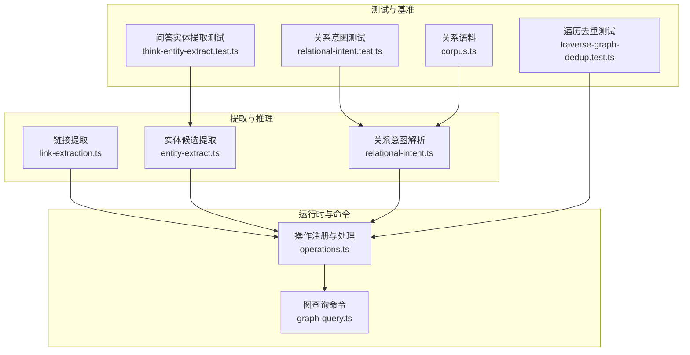
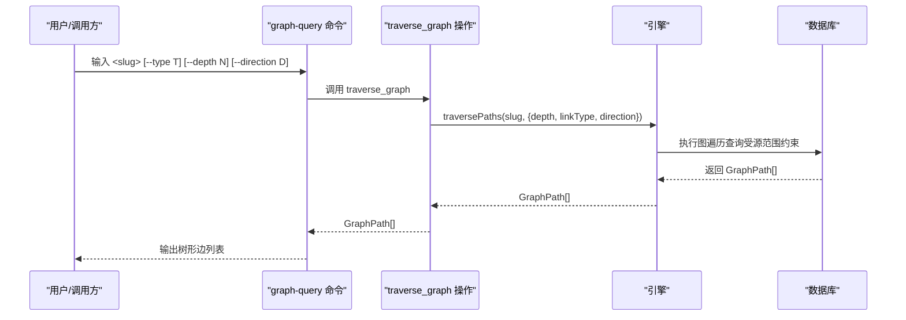
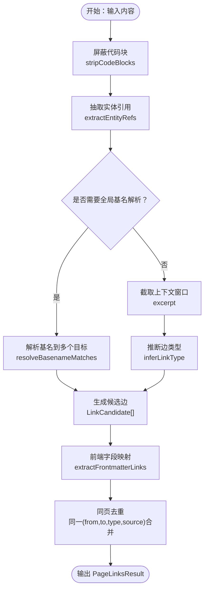
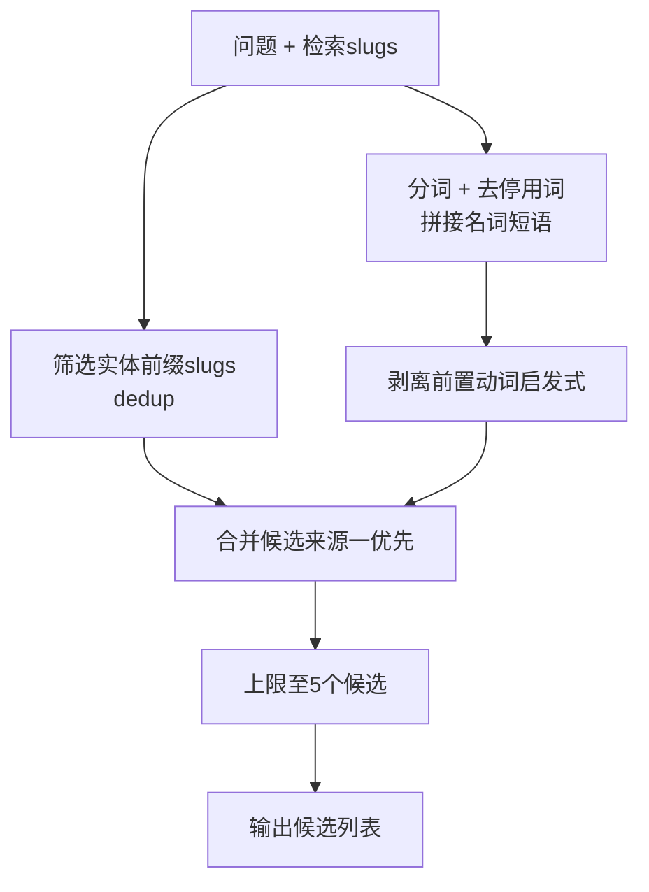
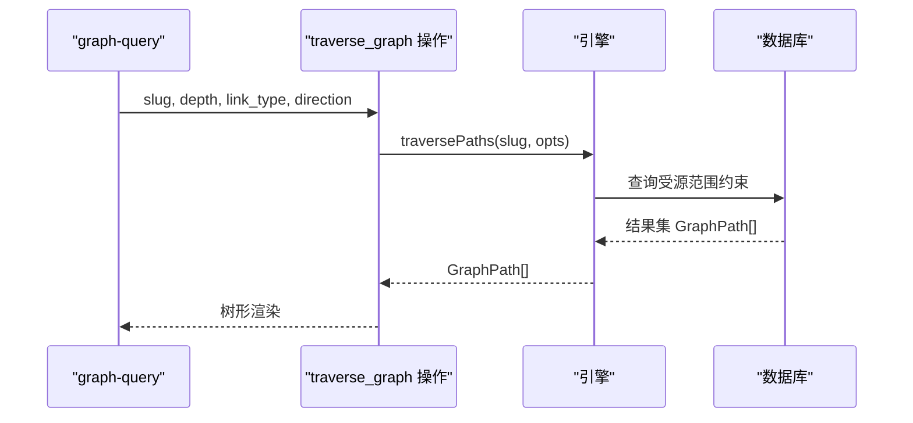
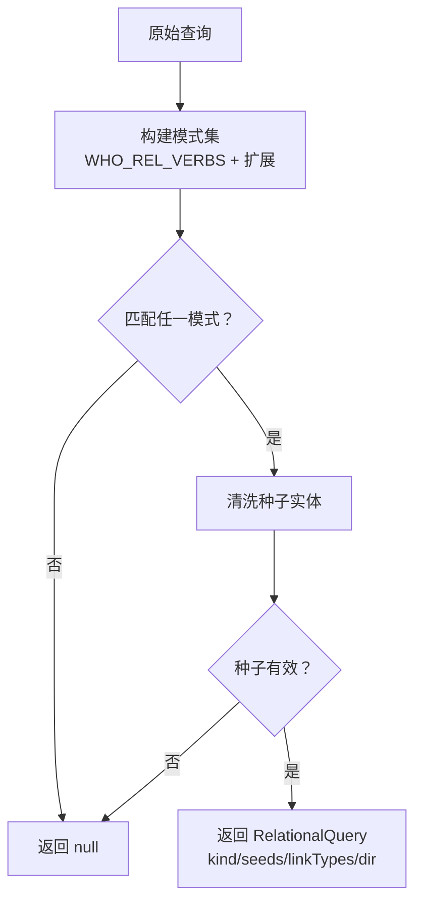
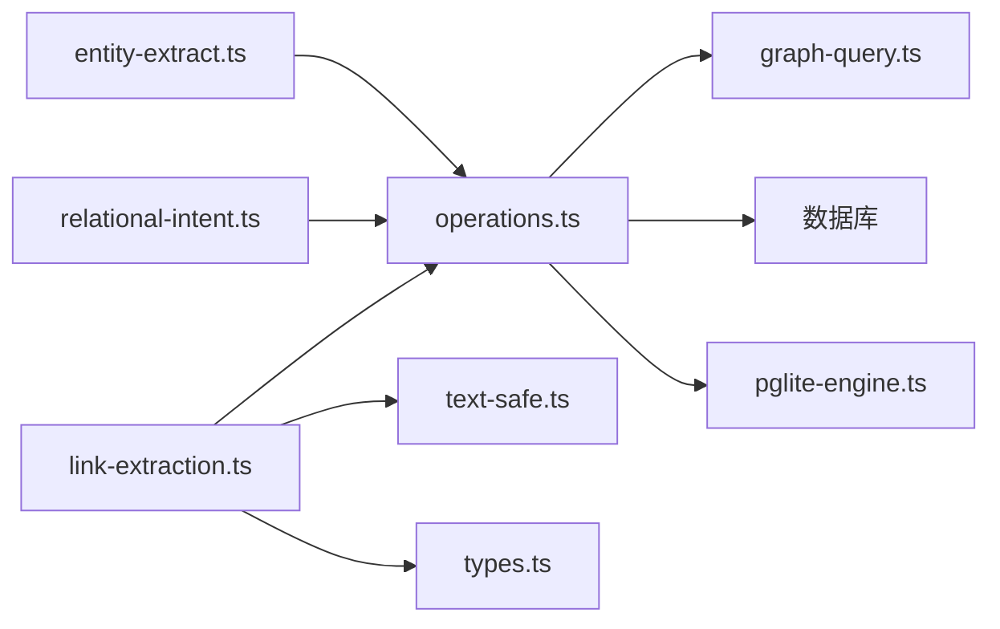

# 自连接知识图谱

<cite>
**本文引用的文件**
- [link-extraction.ts](file://src/core/link-extraction.ts)
- [entity-extract.ts](file://src/core/think/entity-extract.ts)
- [operations.ts](file://src/core/operations.ts)
- [graph-query.ts](file://src/commands/graph-query.ts)
- [relational-intent.ts](file://src/core/search/relational-intent.ts)
- [traverse-graph-dedup.test.ts](file://test/traverse-graph-dedup.test.ts)
- [relational-intent.test.ts](file://test/relational-intent.test.ts)
- [think-entity-extract.test.ts](file://test/think-entity-extract.test.ts)
- [corpus.ts](file://test/fixtures/retrieval-quality/relational/corpus.ts)
- [pglite-engine.ts](file://src/core/pglite-engine.ts)
</cite>

## 目录
1. [简介](#简介)
2. [项目结构](#项目结构)
3. [核心组件](#核心组件)
4. [架构总览](#架构总览)
5. [详细组件分析](#详细组件分析)
6. [依赖分析](#依赖分析)
7. [性能考量](#性能考量)
8. [故障排查指南](#故障排查指南)
9. [结论](#结论)
10. [附录](#附录)

## 简介
本技术文档面向“自连接知识图谱”系统，聚焦以下能力与机制：
- 实体提取：从问题与检索结果中抽取候选实体，支持“已存在页面”与“问答文本”两类来源。
- 类型化边创建：基于上下文正则推断边类型（如投资、创办、任职、顾问等），并支持前端字段映射生成入边。
- Wikilink 解析与自动链接：解析 Obsidian 风格与 Markdown 链接，支持全局基名解析与来源限定。
- 图遍历查询：CLI 与操作接口支持按边类型与方向过滤的多跳遍历，输出树形结构。
- 多跳关系探索与知识发现：通过关系意图解析与类型化边召回，实现“谁投资了某公司”“谁在某公司工作”等深层关系探索。
- 边类型定义与关系推理：统一的边类型集合与优先级规则，确保检索与查询一致性。

## 项目结构
围绕知识图谱的核心代码主要分布在以下模块：
- 链接与实体提取：src/core/link-extraction.ts
- 实体候选提取（问答场景）：src/core/think/entity-extract.ts
- 操作与命令：src/core/operations.ts、src/commands/graph-query.ts
- 关系意图解析：src/core/search/relational-intent.ts
- 测试用例与基准数据：test/* 与 test/fixtures/retrieval-quality/relational/*

图表来源
- [link-extraction.ts:1-120](file://src/core/link-extraction.ts#L1-L120)
- [entity-extract.ts:1-60](file://src/core/think/entity-extract.ts#L1-L60)
- [operations.ts:2057-2089](file://src/core/operations.ts#L2057-L2089)
- [graph-query.ts:1-60](file://src/commands/graph-query.ts#L1-L60)
- [relational-intent.ts:1-60](file://src/core/search/relational-intent.ts#L1-L60)

章节来源
- [link-extraction.ts:1-120](file://src/core/link-extraction.ts#L1-L120)
- [entity-extract.ts:1-60](file://src/core/think/entity-extract.ts#L1-L60)
- [operations.ts:2057-2089](file://src/core/operations.ts#L2057-L2089)
- [graph-query.ts:1-60](file://src/commands/graph-query.ts#L1-L60)
- [relational-intent.ts:1-60](file://src/core/search/relational-intent.ts#L1-L60)

## 核心组件
- 链接与实体提取器：负责从内容中抽取实体引用、推断边类型、处理前端字段映射与全局基名解析。
- 实体候选提取器：在问答/轨迹路由场景下，从问题与检索结果中提取高置信度候选实体。
- 操作与命令：提供 traverse_graph 操作与 graph-query 命令，支持按边类型与方向过滤的多跳遍历。
- 关系意图解析：将自然语言问题解析为可执行的关系查询计划（种子实体、边类型、方向）。

章节来源
- [link-extraction.ts:465-577](file://src/core/link-extraction.ts#L465-L577)
- [entity-extract.ts:114-173](file://src/core/think/entity-extract.ts#L114-L173)
- [operations.ts:2057-2089](file://src/core/operations.ts#L2057-L2089)
- [relational-intent.ts:222-243](file://src/core/search/relational-intent.ts#L222-L243)

## 架构总览
系统以“内容→实体与边→图存储→查询与检索”的链路为核心，结合关系意图解析实现“关系型”知识发现。

图表来源
- [graph-query.ts:130-189](file://src/commands/graph-query.ts#L130-L189)
- [operations.ts:2057-2089](file://src/core/operations.ts#L2057-L2089)

## 详细组件分析

### 组件A：实体提取与类型化边创建
- 实体引用提取：支持 Markdown 链接与 Obsidian 风格 wikilink，含来源限定与通用基名解析路径；对代码块内的路径进行屏蔽，避免误匹配。
- 边类型推断：基于上下文正则（创办、投资、顾问、就职等）与页面角色先验（个人/公司/概念页），确定边类型优先级。
- 前端字段映射：将 YAML 前端字段映射为入边或出边，方向与目录提示由映射表统一管理。
- 全局基名解析：当开启全局基名模式且解析器支持时，将裸 wikilink 文本解析到具体 slug 并标注来源与类型。

图表来源
- [link-extraction.ts:301-386](file://src/core/link-extraction.ts#L301-L386)
- [link-extraction.ts:465-577](file://src/core/link-extraction.ts#L465-L577)
- [link-extraction.ts:594-724](file://src/core/link-extraction.ts#L594-L724)

章节来源
- [link-extraction.ts:301-386](file://src/core/link-extraction.ts#L301-L386)
- [link-extraction.ts:465-577](file://src/core/link-extraction.ts#L465-L577)
- [link-extraction.ts:594-724](file://src/core/link-extraction.ts#L594-L724)

### 组件B：问答场景下的实体候选提取
- 来源一：检索返回的实体前缀页面（people/companies/deals 等），高置信度。
- 来源二：对问题进行分词与停用词过滤，拼接名词短语作为候选；对以动词开头的短语做启发式剥离。
- 上限控制：最多 5 个候选，避免轨迹调用开销过大。

图表来源
- [entity-extract.ts:114-173](file://src/core/think/entity-extract.ts#L114-L173)

章节来源
- [entity-extract.ts:114-173](file://src/core/think/entity-extract.ts#L114-L173)
- [think-entity-extract.test.ts:30-65](file://test/think-entity-extract.test.ts#L30-L65)

### 组件C：图遍历查询与多跳关系探索
- 深度限制：默认深度 5，最大 10，防止指数爆炸。
- 过滤条件：支持按边类型与方向过滤，返回 GraphPath[]。
- 安全范围：遵循调用方源范围，避免跨源拓扑泄露。
- CLI 行为：graph-query 命令支持 --type/--depth/--direction/--include-foreign，输出树形边列表，并在隐藏跨源边时给出提示。

图表来源
- [graph-query.ts:130-189](file://src/commands/graph-query.ts#L130-L189)
- [operations.ts:2057-2089](file://src/core/operations.ts#L2057-L2089)

章节来源
- [operations.ts:2057-2089](file://src/core/operations.ts#L2057-L2089)
- [graph-query.ts:130-189](file://src/commands/graph-query.ts#L130-L189)
- [traverse-graph-dedup.test.ts:86-106](file://test/traverse-graph-dedup.test.ts#L86-L106)

### 组件D：关系意图解析与知识发现
- 问题归类：who_rel/who_at/connects/intro 四类关系模式，优先匹配更具体的模式。
- 种子实体清洗：去除冠词、引号、末尾问号，长度与停用词校验。
- 方言扩展：schema-pack 可扩展额外动词到已知边类型集合，保证查询与实际写入一致。
- 基准语料：提供“词汇不可见”的关系问答语料，用于评估关系召回质量。

图表来源
- [relational-intent.ts:116-183](file://src/core/search/relational-intent.ts#L116-L183)
- [relational-intent.ts:222-243](file://src/core/search/relational-intent.ts#L222-L243)

章节来源
- [relational-intent.ts:36-83](file://src/core/search/relational-intent.ts#L36-L83)
- [relational-intent.ts:206-216](file://src/core/search/relational-intent.ts#L206-L216)
- [relational-intent.test.ts:68-136](file://test/relational-intent.test.ts#L68-L136)
- [corpus.ts:1-25](file://test/fixtures/retrieval-quality/relational/corpus.ts#L1-L25)

### 组件E：边类型定义与关系推理
- 已知边类型集合：founded、invested_in、advises、works_at、attended、yc_partner、led_round、mentions、image_of、discussed_in、source、related_to、wikilink_basename。
- 推理优先级：创办 > 投资 > 顾问 > 就职 > 角色先验 > mentions。
- 页面角色先验：针对 person→company 的 outbound 链接，若页面自述角色（投资者/顾问/员工）明确，则偏向对应边类型。

章节来源
- [relational-intent.ts:69-83](file://src/core/search/relational-intent.ts#L69-L83)
- [link-extraction.ts:694-724](file://src/core/link-extraction.ts#L694-L724)

## 依赖分析
- link-extraction.ts 依赖 text-safe.ts（确保 UTF-16 边界安全）、types.ts（PageType 等类型）。
- operations.ts 提供 traverse_graph 操作，封装引擎 traversePaths，并注入源范围与深度限制。
- graph-query.ts 作为 CLI 包装，调用 traverse_graph 或直接访问引擎，打印树形边列表。
- relational-intent.ts 与 link-extraction.ts 的 KNOWN_LINK_TYPES 保持一致，避免查询漂移。
- pglite-engine.ts 提供图边记录的结构化映射，便于序列化与插入。

图表来源
- [link-extraction.ts:14-16](file://src/core/link-extraction.ts#L14-L16)
- [operations.ts:2057-2089](file://src/core/operations.ts#L2057-L2089)
- [graph-query.ts:17-21](file://src/commands/graph-query.ts#L17-L21)
- [relational-intent.ts:69-83](file://src/core/search/relational-intent.ts#L69-L83)
- [pglite-engine.ts:5648-5659](file://src/core/pglite-engine.ts#L5648-L5659)

章节来源
- [link-extraction.ts:14-16](file://src/core/link-extraction.ts#L14-L16)
- [operations.ts:2057-2089](file://src/core/operations.ts#L2057-L2089)
- [graph-query.ts:17-21](file://src/commands/graph-query.ts#L17-L21)
- [relational-intent.ts:69-83](file://src/core/search/relational-intent.ts#L69-L83)
- [pglite-engine.ts:5648-5659](file://src/core/pglite-engine.ts#L5648-L5659)

## 性能考量
- 遍历深度上限：默认 5，最大 10，避免指数级膨胀导致内存/CPU飙升。
- 同页去重：同一 (fromSlug, targetSlug, linkType, linkSource) 合并，减少重复候选。
- 正则模式优化：种子捕获长度受限（1–80），锚点与非回溯设计，避免 ReDoS。
- 代码屏蔽：在提取前屏蔽代码块与内联代码，降低误匹配成本。
- 限制候选数量：问答场景最多 5 个候选，平衡延迟与效果。

章节来源
- [operations.ts:2050-2055](file://src/core/operations.ts#L2050-L2055)
- [link-extraction.ts:568-577](file://src/core/link-extraction.ts#L568-L577)
- [relational-intent.ts:102-104](file://src/core/search/relational-intent.ts#L102-L104)
- [link-extraction.ts:171-199](file://src/core/link-extraction.ts#L171-L199)
- [entity-extract.ts:100](file://src/core/think/entity-extract.ts#L100)

## 故障排查指南
- 遍历无结果但存在跨源边：使用 --include-foreign 查看被隐藏的跨源边数量。
- 重复边问题：同页去重策略会保留首次出现的候选，检查是否存在同一 (from,to,type,source) 的重复条目。
- 关系意图未命中：确认问题是否满足邻接要求（如“who invested TIME in learning Rust”不会被识别为“who invested in …”）。
- 未知边类型：schema-pack 扩展的动词必须映射到已知边类型集合，否则会在加载时抛错。

章节来源
- [graph-query.ts:159-188](file://src/commands/graph-query.ts#L159-L188)
- [link-extraction.ts:568-577](file://src/core/link-extraction.ts#L568-L577)
- [relational-intent.ts:206-216](file://src/core/search/relational-intent.ts#L206-L216)
- [relational-intent.test.ts:72-93](file://test/relational-intent.test.ts#L72-L93)

## 结论
该自连接知识图谱系统通过“实体与边提取—类型化推理—图遍历—关系意图解析”的闭环，实现了从结构化内容到可查询关系图谱的能力。其优势在于：
- 明确的边类型集合与优先级，确保检索与查询一致性；
- 支持跨源范围约束与深度限制，兼顾安全性与性能；
- 通过关系意图解析与类型化边召回，显著提升“词汇不可见”的关系问答质量；
- CLI 与操作接口统一，便于开发者与用户进行多跳探索与知识发现。

## 附录

### 图查询示例
- 查找与 Alice 参加过会议的人（多跳）：gbrain graph-query people/alice --type attended --depth 2
- 查找在 Acme 就职的人：gbrain graph-query companies/acme --type works_at --direction in
- 仅显示一级连接：gbrain graph-query people/bob --depth 1
- 包含跨源边：gbrain graph-query people/bob --include-foreign

章节来源
- [graph-query.ts:65-74](file://src/commands/graph-query.ts#L65-L74)