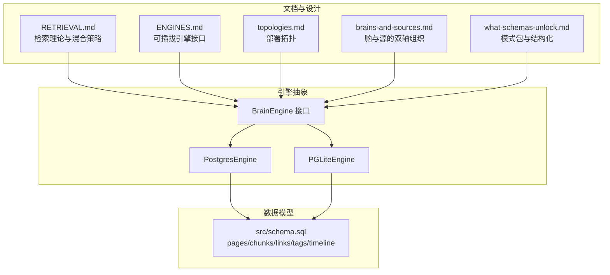
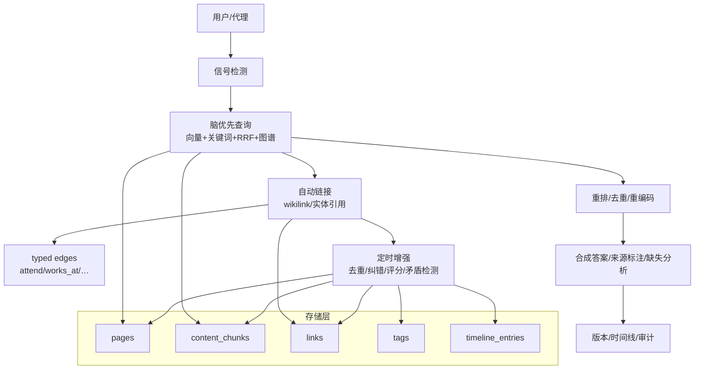
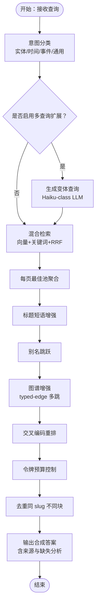
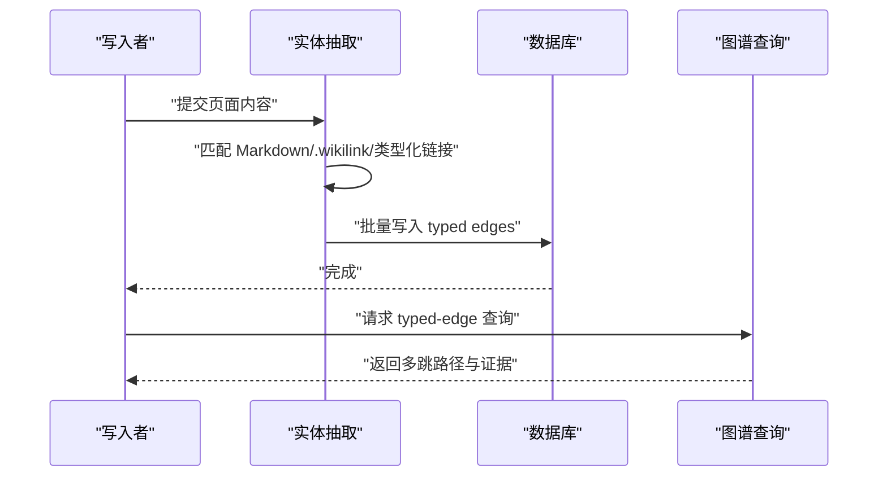
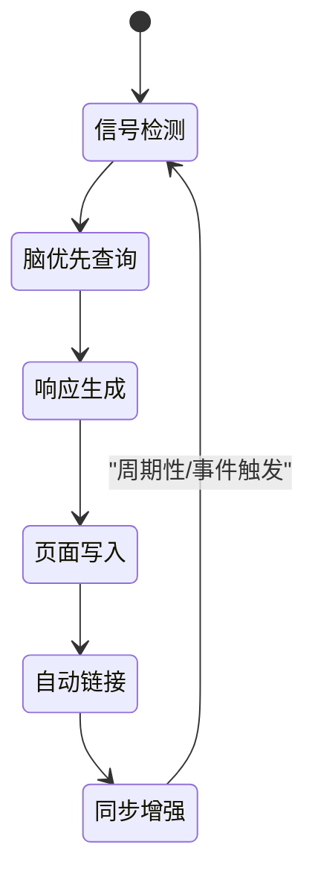
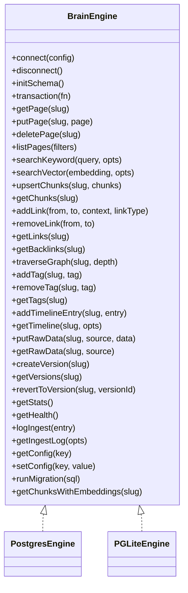
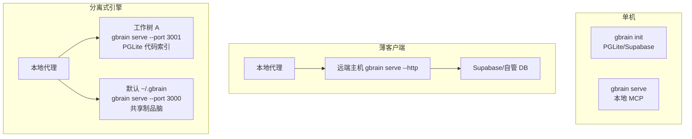
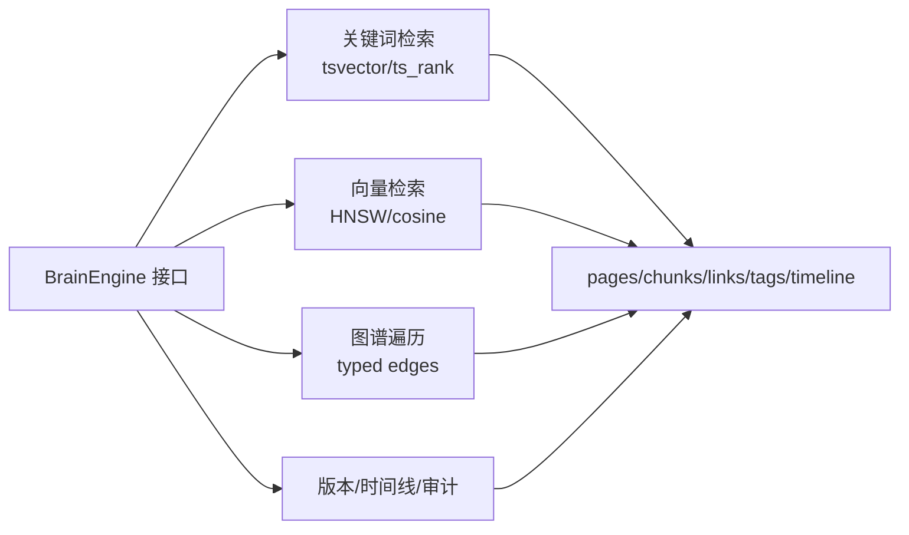

# 项目概述

<cite>
**本文档引用的文件**
- [README.md](file://README.md)
- [docs/architecture/RETRIEVAL.md](file://docs/architecture/RETRIEVAL.md)
- [docs/architecture/topologies.md](file://docs/architecture/topologies.md)
- [docs/architecture/brains-and-sources.md](file://docs/architecture/brains-and-sources.md)
- [docs/ENGINES.md](file://docs/ENGINES.md)
- [docs/what-schemas-unlock.md](file://docs/what-schemas-unlock.md)
- [src/schema.sql](file://src/schema.sql)
</cite>

## 目录
1. [简介](#简介)
2. [项目结构](#项目结构)
3. [核心组件](#核心组件)
4. [架构总览](#架构总览)
5. [详细组件分析](#详细组件分析)
6. [依赖关系分析](#依赖关系分析)
7. [性能考量](#性能考量)
8. [故障排查指南](#故障排查指南)
9. [结论](#结论)
10. [附录](#附录)

## 简介
GBrain 是一个“个人知识大脑”系统，其使命是让每个 AI 代理都拥有一个“脑层”，在检索之外提供“合成答案”。它通过“混合检索 + 自链接知识图谱 + 24/7 自主循环”的三位一体，实现从“页面列表”到“可执行答案”的跃迁：  
- 混合检索：向量（语义相似）+ 关键词（精确匹配）+ RRF 融合 + 图谱遍历，给出“合成答案”与“证据来源”，而非简单页面列表。  
- 自链接知识图谱：每页写入时自动抽取实体引用并建立“已出席/就职于/投资于/创办/顾问”等类型化边，无需 LLM，图谱随写入而增长。  
- 24/7 自主循环：信号检测、脑优先查询、自动链接、定时增强（去重、纠错、评分、矛盾检测、任务准备），保持知识库持续新鲜。

GBrain 的核心价值主张在于：  
- 以“合成答案 + 来源标注 + 缺失分析”替代“页面列表”，显著提升决策效率与可信度。  
- 以“零 LLM 成本的自动实体抽取 + 类型化边”构建自组织知识图谱，解决“关系检索”难题。  
- 以“脑优先查询 + 代理驱动”的闭环，让知识在你睡觉时也在为你工作。

## 项目结构
GBrain 的工程采用“文档驱动 + 可插拔引擎 + 多拓扑部署”的组织方式：  
- 文档层：RETRIEVAL、ENGINES、topologies、brains-and-sources 等文档定义了检索理论、引擎抽象、部署拓扑与知识组织轴。  
- 引擎层：统一的 BrainEngine 接口屏蔽存储差异，支持 PostgresEngine 与 PGLiteEngine 并可扩展。  
- 数据层：以 pages/chunks/links/tags/timeline 等表为核心，配合索引与触发器，支撑检索、图谱与时间线。  
- 部署层：单机、跨机薄客户端、按工作树拆分的“分离式引擎”三种拓扑，满足不同规模与团队协作需求。

图表来源
- [docs/architecture/RETRIEVAL.md:1-166](file://docs/architecture/RETRIEVAL.md#L1-L166)
- [docs/ENGINES.md:24-91](file://docs/ENGINES.md#L24-L91)
- [docs/architecture/topologies.md:1-404](file://docs/architecture/topologies.md#L1-L404)
- [docs/architecture/brains-and-sources.md:1-243](file://docs/architecture/brains-and-sources.md#L1-L243)
- [docs/what-schemas-unlock.md:1-178](file://docs/what-schemas-unlock.md#L1-L178)
- [src/schema.sql:1-800](file://src/schema.sql#L1-L800)

章节来源
- [docs/architecture/RETRIEVAL.md:1-166](file://docs/architecture/RETRIEVAL.md#L1-L166)
- [docs/ENGINES.md:1-235](file://docs/ENGINES.md#L1-L235)
- [docs/architecture/topologies.md:1-404](file://docs/architecture/topologies.md#L1-L404)
- [docs/architecture/brains-and-sources.md:1-243](file://docs/architecture/brains-and-sources.md#L1-L243)
- [docs/what-schemas-unlock.md:1-178](file://docs/what-schemas-unlock.md#L1-L178)
- [src/schema.sql:1-800](file://src/schema.sql#L1-L800)

## 核心组件
- 检索与合成层  
  - 混合检索：向量（HNSW + pgvector）、关键词（BM25 + tsvector）、RRF 融合、源因子重排、意图感知重写、别名跳跃、标题短语增强、证据与创建安全提示。  
  - 合成答案：在检索结果上进行跨块最佳池聚合、去重、重排与交叉编码重排后，输出带来源标注与缺失分析的答案。  
- 自链接知识图谱  
  - 写入即抽取：标准 Markdown 链接、Obsidian wikilink、类型化链接块，三类正则匹配，批量写入 typed edges；启发式推断类型（如 attended/works_at 等）。  
  - 图遍历：typed-edge 回溯与多跳查询，弥补向量/关键词无法捕捉的事实链路。  
- 24/7 自主循环  
  - 信号检测（消息/想法/待办/链接）→ 脑优先查询（本地向量/关键词/图谱）→ 页面写入与自动链接 → 定时增强（去重、纠错、评分、矛盾检测、任务准备）。  
- 可插拔引擎  
  - 统一 BrainEngine 接口，屏蔽底层存储差异；PostgresEngine（Supabase/自管）与 PGLiteEngine（零配置嵌入）并存，支持双向迁移。  
- 模式包与结构化  
  - 通过 schema pack 声明页面类型、链接谓词、事实抽取规则与专家路由，使“无结构笔记”演进为“可查询的知识图谱”。

章节来源
- [README.md:253-268](file://README.md#L253-L268)
- [docs/architecture/RETRIEVAL.md:1-166](file://docs/architecture/RETRIEVAL.md#L1-L166)
- [docs/ENGINES.md:24-91](file://docs/ENGINES.md#L24-L91)
- [docs/what-schemas-unlock.md:1-178](file://docs/what-schemas-unlock.md#L1-L178)

## 架构总览
下图展示了 GBrain 的系统边界与关键交互：  
- 输入：消息/捕获/Webhook/技能调用  
- 处理：信号检测、脑优先检索、自动链接、定时增强  
- 输出：合成答案、图谱查询、版本回溯、审计日志  
- 存储：pages/chunks/links/tags/timeline 等核心表，索引与触发器保障检索与一致性

图表来源
- [README.md:238-251](file://README.md#L238-L251)
- [docs/architecture/RETRIEVAL.md:1-166](file://docs/architecture/RETRIEVAL.md#L1-L166)
- [src/schema.sql:85-547](file://src/schema.sql#L85-L547)

章节来源
- [README.md:238-251](file://README.md#L238-L251)
- [docs/architecture/RETRIEVAL.md:1-166](file://docs/architecture/RETRIEVAL.md#L1-L166)
- [src/schema.sql:85-547](file://src/schema.sql#L85-L547)

## 详细组件分析

### 混合检索与合成答案（向量+关键词+RRF+图谱）
- 检索四策略协同：向量（语义相似）、关键词（精确匹配）、RRF（无全局加权投票）、图谱（类型化边遍历）。  
- named-thing 检索：每页最佳池、标题短语增强、别名跳跃、证据与创建安全提示，确保“命名实体”检索稳健。  
- 合成答案：在检索结果上进行跨块最佳池聚合、去重、重排与交叉编码重排后，输出带来源标注与缺失分析的答案。  
- 图谱增强：对任意种子节点进行 typed-edge 多跳遍历，补足向量/关键词无法覆盖的关系链。

图表来源
- [docs/architecture/RETRIEVAL.md:95-146](file://docs/architecture/RETRIEVAL.md#L95-L146)

章节来源
- [docs/architecture/RETRIEVAL.md:1-166](file://docs/architecture/RETRIEVAL.md#L1-L166)

### 自链接知识图谱（零 LLM 的实体抽取与类型化边）
- 实体抽取：标准 Markdown 链接、Obsidian wikilink、类型化链接块三类正则，批量写入 edges。  
- 类型化边：启发式推断（attended/works_at/invested_in/founded/advises 等），支持手动/工具/前端字段派生的边共存与可追溯。  
- 图遍历：基于 typed edges 的多跳查询，用于“关系型问题”（如“本季度 Bob 投资了什么？”）。  
- Obsidian 兼容：可选全局 basename 解析，提升 wikilink 解析覆盖率。

图表来源
- [docs/architecture/RETRIEVAL.md:35-45](file://docs/architecture/RETRIEVAL.md#L35-L45)
- [src/schema.sql:434-500](file://src/schema.sql#L434-L500)

章节来源
- [docs/architecture/RETRIEVAL.md:35-45](file://docs/architecture/RETRIEVAL.md#L35-L45)
- [src/schema.sql:434-500](file://src/schema.sql#L434-L500)

### 24/7 自主循环（信号→检索→响应→写入→自动链接→同步）
- 信号检测：捕获想法、实体提及、时间敏感待办、名称、链接。  
- 脑优先查询：在任何外部 API 调用前，先查本地脑，成本最低、速度最快、最贴身。  
- 自动链接：每页写入即触发 wikilink 解析与新实体/页面桩的创建，图谱持续增长。  
- 定时增强：去重人员页、修复引用、评分显著性、发现矛盾、准备次日任务。  
- 循环边界：由 Autopilot 驱动，结合 Cron 与作业队列，保证在你睡眠时知识库持续新鲜。

图表来源
- [README.md:238-251](file://README.md#L238-L251)

章节来源
- [README.md:238-251](file://README.md#L238-L251)

### 可插拔引擎（BrainEngine）
- 统一接口：生命周期、页面 CRUD、搜索（关键词/向量）、块管理、链接/标签/时间线/原始数据/版本/健康统计/迁移方法等。  
- 两种实现：PostgresEngine（Supabase/自管，生产级）与 PGLiteEngine（零配置嵌入，适合起步）。  
- 迁移：双向导出导入，保留 pages/chunks/embeddings/links/tags/timeline 等全量数据。

图表来源
- [docs/ENGINES.md:24-91](file://docs/ENGINES.md#L24-L91)

章节来源
- [docs/ENGINES.md:1-235](file://docs/ENGINES.md#L1-L235)

### 模式包与结构化（Schema Packs）
- 作用：声明页面类型、链接谓词、事实抽取规则与专家路由，使“无结构笔记”演进为“可查询的知识图谱”。  
- 能力：whoknows/find_experts/graph-query 等结构化能力基于类型与链接谓词生效。  
- 可演化：支持 agent 协作编目，原子锁、审计日志、跨进程失效与回滚。  
- 场景解锁：Founder Ops、研究脑、法律脑、团队脑等七种杀手级用例。

图表来源
- [docs/what-schemas-unlock.md:106-130](file://docs/what-schemas-unlock.md#L106-L130)

章节来源
- [docs/what-schemas-unlock.md:1-178](file://docs/what-schemas-unlock.md#L1-L178)

### 部署拓扑（单机/薄客户端/分离式引擎）
- 单脑拓扑：单机本地 DB（PGLite 或 Supabase），所有命令直接操作本地。  
- 薄客户端拓扑：代理在本地仅消费远端主机上的脑，HTTP MCP + OAuth，主机负责所有检索/嵌入/索引。  
- 分离式引擎拓扑：按工作树拆分代码索引（本地 PGLite），制品共享远程脑（或另一台主机），MCP 别名路由区分用途。

图表来源
- [docs/architecture/topologies.md:38-394](file://docs/architecture/topologies.md#L38-L394)

章节来源
- [docs/architecture/topologies.md:1-404](file://docs/architecture/topologies.md#L1-L404)

## 依赖关系分析
- 检索层依赖：向量索引（HNSW）、全文索引（tsvector/GIN）、触发器（search_vector）、图谱（links 表 + typed edges）。  
- 引擎层依赖：BrainEngine 将检索/图谱/版本/健康等能力抽象为统一接口，具体实现依赖 Postgres/PGLite 的 SQL 能力。  
- 部署层依赖：薄客户端与分离式引擎通过 MCP 与 OAuth 通信，拓扑选择取决于规模与隔离需求。  
- 模式包依赖：类型/谓词/抽取规则影响检索路由、专家排序与图谱遍历，变更通过原子锁与审计日志保障。

图表来源
- [docs/ENGINES.md:105-132](file://docs/ENGINES.md#L105-L132)
- [src/schema.sql:85-547](file://src/schema.sql#L85-L547)

章节来源
- [docs/ENGINES.md:105-132](file://docs/ENGINES.md#L105-L132)
- [src/schema.sql:85-547](file://src/schema.sql#L85-L547)

## 性能考量
- 检索性能：HNSW 向量索引 + BM25 全文索引 + RRF 融合 + 每页最佳池聚合，兼顾召回与相关性；别名跳跃与标题短语增强降低“命名实体”漏检。  
- 图谱性能：typed edges + 递归 CTE（Postgres）或深度跟踪循环（PGLite），在种子节点上进行多跳遍历；建议合理设置深度与过滤条件。  
- 存储与并发：PostgresEngine 支持连接池与并发访问；PGLiteEngine 为单进程，适合本地起步。  
- 成本控制：可关闭重排器、禁用多查询扩展、限制令牌预算，平衡质量与成本。  
- 索引与触发器：search_vector 触发器与多类索引（GIN/HNSW/pg_trgm）显著提升检索效率。

## 故障排查指南
- 嵌入维度不匹配：运行 doctor 指令，按提示修复配置或执行检索升级。  
- 同步超时：采用 per-source 循环 + 超时保护，利用断点续跑与锁自愈机制。  
- 图谱链接丢失（Supabase）：检查批量写入重试与连接自愈配置，关注断连审计日志。  
- reindex 清空自动标签：v0.41.37 起标签对齐改为只增不减，需重新导入并使用 reindex 重建。  
- 大脑同步卡顿：开启 trace 定位卡住文件，必要时禁用 schema-pack 正则或停止服务端再同步。  
- Windows 迁移失败（DNS 解析）：v0.41.37 采用内联迁移，避免子进程 spawn 导致的 DNS 错误。  

章节来源
- [README.md:290-410](file://README.md#L290-L410)

## 结论
GBrain 通过“混合检索 + 自链接知识图谱 + 24/7 自主循环”，将个人知识系统从“页面列表”升级为“合成答案 + 结构化推理 + 持续增强”。其可插拔引擎与多拓扑部署，既满足起步阶段的零运维需求，也支持企业级的规模化与隔离要求。借助模式包，知识从“无结构笔记”演进为“可查询的知识图谱”，真正成为战略性的“脑层”。

## 附录
- 实际使用场景与工作流示例（来自 README）：  
  - 会前准备：输入“明天与 Alice 的会议需要了解什么？”→ 输出“Alice 在 Acme 工作，你们上次沟通在 4 月 22 日，目前有三个悬而未决事项，并提醒你可能遗漏邮件/Slack 中的更新”。  
  - 代理集成：通过 MCP 将 GBrain 作为记忆层接入 Claude Code/Cursor/Hermes/OpenClaw，实现“脑优先查询 + 合成答案 + 来源标注”。  
  - 团队知识：将多个团队脑挂载到同一工作区，按“脑/源”双轴路由，实现跨团队联邦查询与结构化编目。

章节来源
- [README.md:22-64](file://README.md#L22-L64)
- [docs/architecture/topologies.md:1-404](file://docs/architecture/topologies.md#L1-L404)
- [docs/architecture/brains-and-sources.md:1-243](file://docs/architecture/brains-and-sources.md#L1-L243)