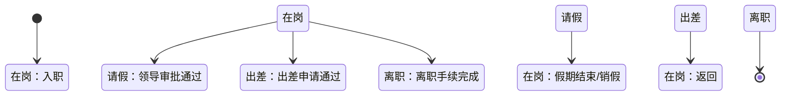

# 实体-状态设计法（四问设计法）

## 核心哲学

系统存在的本质目的是**跨越时间与空间传递信息**。数据是原始符号，信息是有意义、能影响决策的解读结果。系统里存储的所有数据，归根结底是在记录和传递**某个实体在某个时刻的状态快照**。

设计系统时，不要从"用户要什么功能"出发，而要从"**我要管理哪些实体、它们的哪些状态需要通过什么流程传递给谁**"出发。功能只是状态变更的实现手段。

---

## 适用场景

触发本技能的典型场景（满足任一即应用）：

- 用户提出新系统/新模块的设计需求
- 用户描述业务需求，需要做需求分析
- 用户讨论数据库表结构设计
- 用户讨论 API 接口设计
- 用户评审现有系统设计是否合理
- 用户说"帮我分析一下这个需求"/"这个模块该怎么设计"
- 用户提到"实体""状态""信息传递""状态机""领域建模"

---

## 四问设计法工作流

按以下步骤顺序执行，每步产出明确中间物，环环相扣。

### 第一步：信息流扫描（前置步骤）

在识别实体之前，先回答一个问题：**信息从谁流向谁？**

1. 画出信息流图（文字描述即可）：

```
[信息产生者] → [信息经过/处理者] → [信息消费者] → [决策依赖者]
```

2. 检查是否存在"信息断头路"：
   - 数据存了但没人用？
   - 有人需要决策但拿不到信息？
   - 信息传递链上有断裂？

3. 输出：一段话描述核心信息流 + 识别出的关键断点。

---

### 第二问：实体是什么？（实体识别）

从业务描述中提取核心实体。

**方法**：
1. 从需求描述中提取所有**名词** → 候选实体列表
2. 用两个标准筛选真正的核心实体：
   - 能否用名词清晰描述？
   - 它是否有多种**业务状态**？（只有一种状态的"实体"可能是属性，而非核心实体）

**检验标准**：如果找出的实体画不出状态流转图，说明你对它的理解还不够清晰。

**警示**：区分"表象实体"与"本质实体"——
- 表象：请假单（表单/流程载体）
- 本质：人的工作状态（真正要管理的实体）
- 问自己：用户发起这个操作，真正想改变的实体状态是什么？

**输出**：核心实体清单（3-8 个），每个附带一句话定义 + 实体间关系简述。

```
输出格式：
| 实体 | 定义 | 与其他实体的关系 |
|------|------|------------------|
| 员工 | 组织内的人员 | 拥有工作状态；关联资产 |
| 采购单 | 一次采购需求的记录 | 关联供应商、物料；变更库存状态 |
```

---

### 第三问：实体有多少种状态？（状态建模）

对第二步识别出的每个核心实体，穷举其所有可能的业务状态。

**方法**：
1. 对每个实体列出所有状态值（6-15 个为佳）
2. 区分"业务状态"与"系统状态"：
   - 业务状态：请假、在岗、出差 → 业务人员理解的概念
   - 系统状态：已保存、已删除 → 纯技术状态，不是设计重点
3. 确认每种状态有明确的业务含义

**输出**：每个实体的状态枚举表。

```
输出格式：
实体【员工】
| 状态 | 业务含义 | 进入条件 | 退出条件 |
|------|---------|---------|---------|
| 在岗 | 正常工作 | 入职/销假 | 请假/出差/离职 |
| 请假 | 暂时不在岗 | 请假审批通过 | 假期结束/销假 |
| 出差 | 因公外出 | 出差申请通过 | 返回 |
| 离职 | 劳动关系终止 | 离职手续完成 | —（终态） |
```

---

### 第四问：状态通过什么流程更新？（流程映射）

画出每个实体的**状态流转图**。

**方法**：
1. 用 Mermaid `stateDiagram-v2` 语法画状态机图
2. 每条边上标注：**谁（角色/系统）** + **什么动作（C-U-D 操作）** 触发了这次状态变更
3. 检查：
   - 每个状态都有入口和出口（终态除外）？
   - 每条流转边都有明确的触发者？
   - 是否存在"死状态"（有入无出）→ 业务闭环缺失
   - 是否存在"黑洞状态"（有出无入）→ 没有入口流程

**输出**：每个核心实体的 Mermaid 状态机图。



---

### 第五问：功能如何实现？（功能推导）

从状态流转图**反向推导**需要的功能和接口。

**方法**：
1. 状态机图上的每条边 = 至少一个功能/接口
2. 对每条边问：用户通过什么界面/接口触发这个状态变更？

**输出**：功能-状态映射表。

```
输出格式：
| 功能/接口 | 对应的状态变更 | 触发者 | 所属模块 |
|-----------|--------------|--------|---------|
| 提交请假申请 | 员工状态 在岗→待审批 | 员工 | 考勤模块 |
| 审批请假 | 员工状态 待审批→请假 | 领导 | 审批模块 |
| 销假 | 员工状态 请假→在岗 | 员工/HR | 考勤模块 |
| 查询在岗人员 | （读取状态） | 全员 | 通讯录模块 |
```

**验证规则**：如果有一个功能找不到对应的状态变更，问自己：这个功能真的需要吗？

---

### 第六步：设计验证（自检）

在提交设计方案之前，完成以下自检。任一项不通过都意味着设计需要修正。

```
设计自检清单：
- [ ] 所有核心实体都画出了完整的状态机图
- [ ] 状态机图中没有"死状态"（有入无出的中间态）
- [ ] 状态机图中没有"黑洞状态"（有出无入的中间态）
- [ ] 每个功能都能映射到某个实体的状态变更
- [ ] 信息流闭环完整：谁产生信息 → 谁消费信息 → 谁的决策依赖此信息
- [ ] 没有"信息断头路"：存储的数据都有人消费
- [ ] 区分了表象实体与本质实体（没有把表单当作核心实体）
- [ ] 状态命名使用业务语言（不是技术术语）
- [ ] 每个状态都有明确的业务含义和进入/退出条件
- [ ] 状态流转的触发者（人/系统/事件）都已明确
```

---

## 快速参考：模式速查

### 三种调用深度

| 模式 | 适用场景 | 执行步骤 | 预计耗时 |
|------|---------|---------|---------|
| **轻量** | 需求快速评审、方案初筛 | 第二步 + 第三步 | 15min |
| **标准** | 完整模块设计 | 第一步 → 第六步 全部 | 1-2h |
| **深度** | 现有系统重构诊断 | 标准模式 + 反模式对照 | 2-4h |

根据用户当前场景，自动选择最合适的深度并向用户确认。

### 关键思维转换口诀

> 看到"用户说要XX功能" → 翻译成"用户想改变XX实体的XX状态，让XX人知道这个信息"

> 看到"加一个字段就行" → 警惕：是不是遗漏了一个新实体或新状态？

> 看到功能列表很长 → 反问：状态机图有多复杂？不成比例说明过度设计。

---

## 补充资源

- 详细输出模板，参见 [templates.md](templates.md)
- 常见反模式与诊断方法，参见 [anti-patterns.md](anti-patterns.md)
- 完整设计案例（请假系统、采购系统），参见 [examples.md](examples.md)
