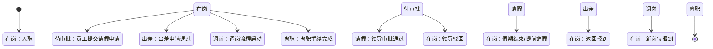
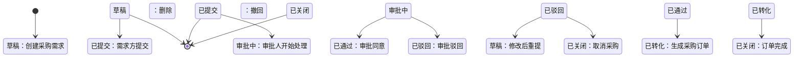

# 完整设计案例

以下两个案例演示了"四问设计法"从需求到设计的完整推演过程。

---

## 案例一：请假系统

### 需求描述

> "员工需要请假时，填写请假单，提交给领导审批。领导审批通过后，员工就可以休假了。HR需要知道谁在请假，用于核算考勤和工资。"

### 第一步：信息流扫描

```
[员工] ──请假信息──→ [领导] ──审批决策──→ [HR] ──考勤核算──→ [财务]
  │                     │
  └──工作状态变更──→ [同事/团队]
```

### 第二问：实体是什么？

| 实体 | 定义 | 关系 |
|------|------|------|
| 员工 | 组织内人员 | 核心实体，被管理对象 |
| 假期额度 | 员工可用的假期余额 | 关联员工，随请假扣减 |

> **关键判断**：请假单是什么？它不是核心实体——它是"员工工作状态"从"在岗"变为"请假"的**流程载体**。核心实体是**员工**。

### 第三问：员工有多少种状态？

| 状态 | 业务含义 | 进入条件 | 退出条件 |
|------|---------|---------|---------|
| 在岗 | 正常工作 | 入职/销假/返回 | 请假/出差/调岗/离职 |
| 待审批 | 请假申请已提交，等待审批 | 提交请假申请 | 审批通过/驳回 |
| 请假 | 审批通过，处于休假中 | 审批通过 | 假期结束/提前销假 |
| 出差 | 因公外出 | 出差申请通过 | 返回 |
| 调岗 | 岗位变动中 | 调岗流程中 | 到新岗位报到 |
| 离职 | 劳动关系终止 | 离职手续完成 | —（终态） |

### 第四问：状态流转图



### 第五问：功能推导

| 功能 | 状态变更 | 触发者 | 所属模块 |
|------|---------|--------|---------|
| 提交请假申请 | 在岗 → 待审批 | 员工 | 考勤模块 |
| 审批通过 | 待审批 → 请假 | 领导 | 审批模块 |
| 审批驳回 | 待审批 → 在岗 | 领导 | 审批模块 |
| 销假 | 请假 → 在岗 | 员工/HR | 考勤模块 |
| 扣减假期额度 | （关联：假期额度余额减少） | 系统自动 | 考勤模块 |
| 查询在岗人员 | （读取状态） | 全员 | 通讯录模块 |
| 考勤统计 | （聚合状态） | HR | 报表模块 |

### 设计要点

- **请假单**本身不是核心实体，它的 CRUD 只是改变"员工工作状态"的手段
- 只要员工的工作状态能从"在岗"变为"请假"且可追溯，用表单、邮件、语音都只是实现方式不同
- **假期额度**是独立实体，因为"请假"和"额度扣减"是两个独立的生命周期（可能请假被驳回但额度已预扣？→需要补偿机制）

---

## 案例二：采购系统

### 需求描述

> "需求部门提出采购需求，经审批后由采购部门向供应商下单。供应商发货后，仓库验收入库，财务付款。"

### 第一步：信息流扫描

```
[需求方] ──采购需求──→ [审批人] ──审批决策──→ [采购员] ──采购订单──→ [供应商]
                                                      │
                              ┌───────────────────────┘
                              ↓
[供应商] ──发货信息──→ [仓库] ──验收结果──→ [财务] ──付款信息──→ [供应商]
                │                      │
                └──入库信息──→ [库存系统]  └──付款状态──→ [需求方]
```

### 第二问：实体是什么？

| 实体 | 定义 | 关系 |
|------|------|------|
| 采购需求 | 一次采购需要的规格说明 | 被审批对象；关联物料 |
| 采购订单 | 向供应商发出的正式采购指令 | 由采购需求转化而来；关联供应商 |
| 物料/商品 | 被采购的物品 | 被采购订单引用；影响库存 |
| 供应商 | 提供物料的组织 | 被采购订单关联；有合作状态 |

> **关键判断**：采购系统真正管理的实体远不止"采购单"一个。至少四个核心实体，各有自己的状态生命周期。

### 第三问：状态建模

**实体1：采购需求**

| 状态 | 业务含义 |
|------|---------|
| 草稿 | 需求方正在编辑 |
| 已提交 | 等待审批 |
| 审批中 | 审批人正在处理 |
| 已通过 | 审批同意，可以下单 |
| 已驳回 | 审批未通过 |
| 已转化 | 已生成采购订单 |
| 已关闭 | 不再处理 |

**实体2：采购订单**

| 状态 | 业务含义 |
|------|---------|
| 待发送 | 已生成，未发给供应商 |
| 已发送 | 已发给供应商 |
| 已确认 | 供应商确认接单 |
| 部分到货 | 供应商部分发货 |
| 已完成 | 全部到货且验收 |
| 异常 | 发货/验收出现问题 |
| 已取消 | 订单取消 |

**实体3：供应商**

| 状态 | 业务含义 |
|------|---------|
| 潜在 | 初步接触 |
| 认证中 | 资质审核中 |
| 合格 | 可以合作 |
| 合作中 | 有进行中的订单 |
| 冻结 | 暂停合作 |
| 黑名单 | 不再合作 |

**实体4：物料/商品**

| 状态 | 业务含义 |
|------|---------|
| 在途 | 已发货未入库 |
| 在库 | 已验收在仓库 |
| 已领用 | 被领取使用 |
| 退货中 | 退货流程中 |
| 已报废 | 不再可用 |

### 第四问：状态流转图（采购需求为例）



### 第五问：功能推导（采购需求相关）

| 功能 | 状态变更 | 触发者 |
|------|---------|--------|
| 创建采购需求 | → 草稿 | 需求方 |
| 提交审批 | 草稿 → 已提交 | 需求方 |
| 开始审批 | 已提交 → 审批中 | 审批人 |
| 审批通过 | 审批中 → 已通过 | 审批人 |
| 审批驳回 | 审批中 → 已驳回 | 审批人 |
| 修改后重提 | 已驳回 → 草稿 | 需求方 |
| 生成采购订单 | 已通过 → 已转化 | 采购员 |
| 关闭需求 | 已转化 → 已关闭 | 系统自动 |

### 设计要点

- 四个实体各有独立状态机，但它们之间存在**状态联动**：
  - 采购需求"已转化" ↔ 采购订单"待发送"（因果关系）
  - 采购订单"已完成" ↔ 物料"在库"（状态传导）
  - 供应商"冻结" → 采购订单"已取消"（异常传播）
- 设计时要明确画出这些**跨实体的状态联动规则**，这是系统复杂度的核心来源
