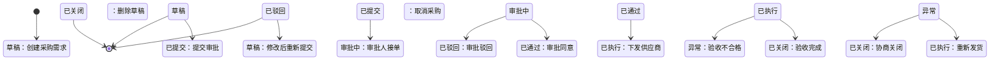

# 输出模板参考

## 模板一：实体-状态矩阵表

全局视图，一览所有核心实体及其状态。

```markdown
## 实体-状态矩阵

| 实体 | 状态列表（生命周期顺序） | 终态 | 关联实体 |
|------|------------------------|------|---------|
| 员工 | 待入职 → 在岗 ↔ 请假/出差 → 离职 | 离职 | 部门、资产 |
| 采购单 | 草稿 → 已提交 → 审批中 → 已通过/已驳回 → 已执行 → 已关闭 | 已关闭/已驳回 | 供应商、物料 |
| 客户 | 潜在 → 签约 → 活跃 ↔ 沉默 → 流失 | 流失 | 合同、订单 |
| 合同 | 草稿 → 待签署 → 生效中 → 到期/终止 | 到期/终止 | 客户、订单 |
```

## 模板二：状态流转图（Mermaid）

每个核心实体一张图。下面是一个标准示例：



## 模板三：功能-状态映射表

从状态机推导出的功能模块。

```markdown
## 功能-状态映射

### 采购模块

| 功能 | 接口/页面 | 对应状态变更 | 触发角色 | 前置条件 |
|------|----------|-------------|---------|---------|
| 创建采购单 | POST /purchase | → 草稿 | 需求方 | — |
| 提交采购单 | PUT /purchase/:id/submit | 草稿 → 已提交 | 需求方 | 采购单状态=草稿 |
| 审批同意 | PUT /purchase/:id/approve | 审批中 → 已通过 | 审批人 | 采购单状态=审批中 |
| 审批驳回 | PUT /purchase/:id/reject | 审批中 → 已驳回 | 审批人 | 采购单状态=审批中 |
| 下发供应商 | PUT /purchase/:id/dispatch | 已通过 → 已执行 | 采购员 | 采购单状态=已通过 |
| 验收完成 | PUT /purchase/:id/complete | 已执行 → 已关闭 | 验收人 | 采购单状态=已执行 |
| 查看采购单列表 | GET /purchases | （读取状态） | 相关人员 | — |
| 采购统计报表 | GET /purchases/report | （聚合状态） | 管理者 | — |
```

## 模板四：信息流图（文字版）

描述信息如何在系统中流动。

```markdown
## 核心信息流

### 采购信息流

[需求方] ──采购需求──→ [审批人] ──审批决策──→ [采购员] ──采购订单──→ [供应商]
                                │
                                └──审批结果──→ [需求方]（反馈）
                                
[验收人] ──验收结果──→ [财务] ──付款信息──→ [供应商]
    │
    └──验收结果──→ [采购员]（入库通知）
```

## 模板五：设计文档骨架

完整设计方案的推荐结构：

```markdown
# [模块名] 设计方案

## 1. 信息流分析
（谁产生信息、流向谁、谁消费、谁决策）

## 2. 核心实体
| 实体 | 定义 | 关系 |
|------|------|------|
| ... | ... | ... |

## 3. 实体状态模型
（每个实体的状态枚举表 + 状态机图）

## 4. 状态流转与流程
（每个实体的状态机图，含触发者标注）

## 5. 功能模块推导
（功能-状态映射表）

## 6. 接口设计
（从功能推导出的 API 列表）

## 7. 数据模型
（从实体和状态推导出的表结构）

## 8. 设计自检结果
（第六步检查清单，逐项勾选）
```
