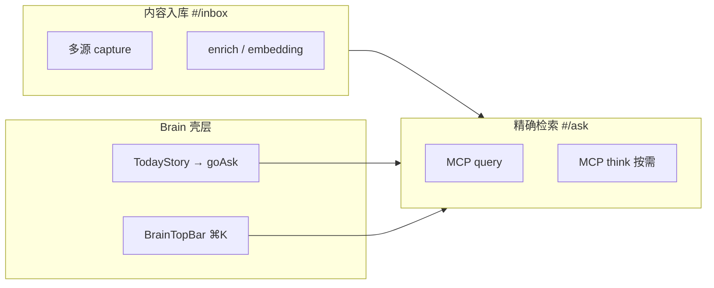

# GBrain「精确检索」实现对照评估

> 对照基准：`admin/docs/前端案例/03.GBrain _ 项目案例_精确检索.mhtml`（案例站 `#/ask`）  
> 实现代码：`admin/src/pages/brain/Ask.tsx`、`admin/src/components/brain/PipelineSteps.tsx`  
> 生成日期：2026-07-10

---

## 总览结论

**骨架已对齐案例目标态约 75–80%**：双栏布局、预设问题、检索栈、来源卡、按需合成、hash 深链、测试覆盖均已落地。

与案例的差异主要在两类：

1. **有意取舍**（更诚实、更 fork-safe）：管道逐步耗时用示意而非伪造；消融改为静态说明；`think` 按需触发以控制成本。
2. **尚未补齐**（案例有、实现还没有）：消融数值网格、来源步骤归因、结构化时间线答复、页头 BrainBench 指标与 Why? 教育按钮。

---

## 逐项对照表

| 维度 | 案例 MHTML 目标 | 当前实现 | 状态 |
|------|----------------|----------|------|
| **1. 整体布局** | `max-w-[1400px]` + 7/5 双栏 | `brain-page` + `lg:grid-cols-12` 7/5 | ✅ 已对齐 |
| **页头** | `// 提问 · ASK` + 衬线大标题 + P@5 49.1% + Why? | `PageHeader` 工作台 + 简短 subtitle | ⚠️ 部分 |
| **预设问题** | 6 条 chip + textarea +「重跑」 | 6 条 chip + input +「检索」 | ✅ 功能等价 |
| **隐私合规** | 案例含真人名（Yelena 等） | 占位符 `alice-example` / `a-company` | ✅ 实现更好 |
| **2. 检索流程** | 点预设 → 自动跑完整管道 | `navigateToQuery` + hash `?q=` 自动 `query` | ✅ 已对齐 |
| **重跑同 query** | rotate-ccw「重跑」 | 同 URL 再点预设会 force rerun | ✅ 已覆盖 |
| **端到端耗时** | ~2440ms（逐步相加） | `totalMs` 前端实测往返 | ✅ 更诚实 |
| **3. 答案生成** | 第 12 步自动 synthesis | `query` 后手动「让 GBrain 综合作答」→ `think` | ⚠️ 架构不同、更合理 |
| **答复形态** | 时间线叙事（演变路径 · 按时间） | `thinkResult.answer` 纯文本 + citations chips | ⚠️ 弱于案例 |
| **4. 来源引用** | 路径 + **94%** + 摘要 + **步骤归因** | slug + `type` Badge + `score` + snippet | ⚠️ 缺归因 |
| **5. 分类标签** | 沙箱 Badge、步骤名、消融格 | `type`/`score` Badge、gaps/模型脚注 | ⚠️ 部分 |
| **6. 检索栈** | sticky + 12 步 + **逐步 ms** + 入→出 | sticky + 12 步 + 可展开 + **仅 totalMs 真实** | ⚠️ 结构对齐、数据诚实 |
| **12 步定义** | vector×3、cosine re-score、4层 dedup、synthesis | 意图/缓存/扩展/嵌入/向量/关键词/关系/RRF/精排/autocut/预算/组装 | ⚠️ 命名不同，更贴 `src/core/search/*` |
| **7. 消融分析** | P@5 网格（全跑 49.1% vs 关 typed-link 22.1%…） | 静态说明卡 +「非本次查询实时消融」免责声明 | ⚠️ 叙事有、数据无 |
| **Why? 按钮** | `data-why-topic` 上下文百科 | 无（见 `WHY_BUTTON_PLAN.zh.md`） | ❌ |
| **8. 系统集成** | 顶栏 ⌘K、今日动态跳转、沙箱模式 | `BrainTopBar` ⌘K→`/ask`；`TodayStory`→`goAsk()` | ✅ 壳层已有 |
| **MCP 契约** | 案例为静态 demo | `query` + `think` 真实调用 | ✅ 实现更强 |
| **测试** | `data-testid` 钩子 | Vitest：预设/hash/来源/空态/错误/think | ✅ 实现更强 |

**图例**：✅ 已对齐 / 实现更好 · ⚠️ 部分对齐 · ❌ 未实现

---

## 分块细评

### 1）布局与 UI 组件结构

**已实现**

- 左 7 / 右 5 双栏：`lg:col-span-7`（合成答案 + 来源 + 说明卡）+ `lg:col-span-5`（sticky 检索栈）
- 预设问题区：`// 预设问题 · 点一条立刻检索` + 6 条 chip
- 小屏单栏堆叠，比案例更适配移动端

**尚未对齐**

| 案例 | 当前实现 |
|------|----------|
| `textarea` 多行展示当前 query | 单行 `input` |
| `// 提问 · ASK` 大标题 + BrainBench P@5 | 通用 `PageHeader` |
| 沙箱 Badge 在页头重复显示 | 无页面级沙箱标识 |

**相关文件**：`admin/src/pages/brain/Ask.tsx` L108–290

---

### 2）检索工作流程与处理机制

**已实现**

```
用户输入 / 点预设
    → navigateToQuery → hash #/ask?q=...
    → runQuery → MCP query({ query, limit: 20 })
    → setResults + setTotalMs（前端实测）
    → [可选] runThink → MCP think({ question })
```

- hash `?q=` 深链 + `hashchange` 自动检索
- 预设一键触发
- 同 URL 强制重跑（再次点同一条预设）

**架构差异（实现更务实）**

| 案例 | 当前实现 |
|------|----------|
| 检索 + 合成一步完成（第 12 步 answer synthesis） | `query` 与 `think` 分离，按需触发 |
| 每次查询隐含 LLM 成本 | 明示「会额外调用一次模型综合作答（有成本）」 |

**相关文件**：`admin/src/pages/brain/Ask.tsx` L34–68、L86–103

---

### 3）结果展示方式

#### 来源卡（检索结果）

| 字段 | 案例 | 当前实现 |
|------|------|----------|
| 路径 | `font-mono` slug | ✅ `r.slug` |
| 相关度 | `94%` 百分比 | `score.toFixed(3)` 原始分 |
| 类型 | 隐含于路径 | ✅ `type` Badge |
| 摘要 | 一行人类可读 | ✅ snippet / excerpt / text |
| 步骤归因 | `↑ 来自步骤：compiled_truth boost` | ❌ 无 |

#### 合成答案（think）

| 字段 | 案例 | 当前实现 |
|------|------|----------|
| 形态 | 时间线叙事（演变路径 · 按时间） | 自由文本 `thinkResult.answer` |
| 引用 | 带来源摘要的小卡 | slug chip 列表 |
| 元数据 | — | gaps / modelUsed / pagesGathered / warnings |

**相关文件**：`admin/src/pages/brain/Ask.tsx` L159–261

---

### 4）分类标记系统

| 标记类型 | 案例 | 当前实现 |
|----------|------|----------|
| 沙箱模式 | 顶栏 + 侧栏 pulse Badge | 壳层有，Ask 页无 |
| 结果类型 | 路径前缀隐含 | `type` Badge |
| 相关度 | 百分比 accent | `score` Badge |
| 管道步骤 | 完成态 accent 圆点 | ✅ `PipelineSteps` |
| 消融格子 | 全跑高亮 / 其余 canvas | 仅文字说明卡 |
| think 缺口 | — | `gaps` amber Badge |

---

### 5）检索栈分析功能

#### 案例 12 步（MHTML 实测）

| 步 | 名称 | 耗时 | 入→出 |
|----|------|------|-------|
| 1 | intent 识别 | 180ms | raw query → intent + flags |
| 2 | multi-query expansion | 420ms | 1 → 3 queries |
| 3 | vector search × 3 | 310ms | 3 queries → 30 candidates |
| 4 | keyword tsvector | 85ms | raw query → 12 candidates |
| 5 | RRF fusion | 12ms | 42 → fused ranking |
| 6 | cosine re-score | 45ms | top-20 → re-scored |
| 7 | compiled_truth boost | 8ms | ×2.0 |
| 8 | backlink boost | 22ms | 高入度页加权 |
| 9 | graph traversal | 140ms | top-5 seeds → +6 neighbors |
| 10 | 4 层 dedup | 18ms | 26 → 11 unique |
| 11 | LLM rerank | 680ms | 11 → top-5 |
| 12 | answer synthesis | 520ms | top-5 → answer + sources |

**总耗时 ~2440ms**（案例为 demo 数据，逐步相加）

#### 当前实现 12 步（`PipelineSteps.tsx`）

| 步 | 名称 | 说明 |
|----|------|------|
| 1 | 意图识别 | intent weighting |
| 2 | 缓存查询 | query cache |
| 3 | 多查询扩展 | expansion |
| 4 | 向量嵌入 | embedding |
| 5 | 向量召回 | vector recall |
| 6 | 关键词召回 | BM25 / tsvector |
| 7 | 关系召回 | relational / typed-link |
| 8 | RRF 融合 | K=60 |
| 9 | 精排 | rerank |
| 10 | 自动截断 | autocut |
| 11 | Token 预算 | token budget |
| 12 | 组装结果 | assemble SearchResult |

**口径差异**：实现版更贴近 `src/core/search/*` 模块划分；案例版把 cosine re-score、dedup、synthesis 单列，叙事更偏产品 demo。两者都是 12 步，但**不是逐步一一对应**。

#### 数据诚实性（实现优于案例）

```
MCP query 只返回 SearchResult[]，不返回逐步计时或候选数。
唯一真实的数字是 totalMs（前端实测端到端往返耗时）。
逐步名称/描述/入→出 是管道结构说明，非实时数据。
```

- ✅ sticky 右栏
- ✅ 可点击展开步骤描述（chevron）
- ✅ 底部免责声明
- ✅ `data-testid="step-N"`
- ❌ 逐步 ms（需改上游或 Tier2 端点透出 meta）

**相关文件**：`admin/src/components/brain/PipelineSteps.tsx`

---

### 6）消融分析功能

#### 案例（静态 BrainBench 快照）

| 配置 | P@5 |
|------|-----|
| 全跑 | **49.1%** |
| typed-link 关掉 | 22.1% |
| compiled_truth 关掉 | 38.4% |
| RRF 关掉 | 41.2% |
| source boost 关掉 | 44.7% |

附带 `data-why-topic` 教育按钮（typed-link precision、source-aware SQL boost 等）。

#### 当前实现

- `// 为什么多算子叠加` 静态说明卡
- 明确标注：「效果量化来自离线 BrainBench 基准评测（`gbrain eval`），**非本次查询实时消融**」
- ❌ 无 P@5 数值网格
- ❌ 无 Why? 按钮（规划见 `admin/docs/WHY_BUTTON_PLAN.zh.md`）

**评价**：实现在诚实性上优于案例（避免误导为 live ablation）；在教学/营销冲击力上弱于案例。

---

### 7）与其他系统模块的集成关系



| 集成点 | 状态 | 说明 |
|--------|------|------|
| MCP `query` | ✅ | `callMcp('query', { query, limit: 20 })` |
| MCP `think` | ✅ | 按需 `callMcp('think', { question })` |
| hash `#/ask?q=` | ✅ | `parseHash` + `hashchange` |
| `BrainTopBar` ⌘K | ✅ | 跳转 `/ask?q=...` |
| `TodayStory` | ✅ | `goAsk()` + 静态 `ASK_ANSWER` 叙事 |
| 知识网络 `#/graph` | — | 管道第 7 步关系召回，无页面内跳转 |
| 整理沉淀 `#/synthesize` | — | `think` 同类，无互跳 |
| `query` meta telemetry | ❌ | fork-safe 未改 `src/` |

---

### 8）案例有、实现未列出的功能

| 功能 | 当前状态 | 建议优先级 |
|------|----------|-----------|
| 消融 P@5 静态网格 | ❌ | P1 — 纯 UI，无后端 |
| 来源「步骤归因」 | ❌ | P3 — 需 meta 或启发式 |
| Why? 教育弹层 | ❌ | 见 `WHY_BUTTON_PLAN.zh.md` |
| 页头 BrainBench 指标 | ❌ | P1 — 静态文案 |
| textarea +「重跑」按钮 | ❌ | P2 — 体验 polish |
| 分数显示为百分比 | ❌ | P1 — `score * 100` |
| 预设 chip 激活高亮 | ❌ | P2 |
| Onboarding `data-guide` | ❌ | P4 |
| `prose-paper` 长答案排版 | ❌ | P2 |

---

## 架构决策评价

| 实现选择 | 评价 |
|----------|------|
| `query` 与 `think` 分离 | ✅ 正确：成本可控、契约清晰 |
| 管道不伪造逐步 ms | ✅ 正确：避免误导；案例数字是 demo |
| 消融标注「离线评测」 | ✅ 正确：符合 `gbrain eval` 实际 |
| 预设问题隐私占位符 | ✅ 正确：符合仓库 Privacy 规则 |
| 不改 `src/` 拿 meta | ✅ fork-safe；代价是步骤归因做不了 |
| 12 步与案例不完全同构 | ⚠️ 可接受，需在文档说明口径 |

---

## 测试覆盖

`admin/src/pages/brain/__tests__/Ask.page.test.tsx` 已覆盖：

| 用例 | 状态 |
|------|------|
| PageHeader 标题渲染 | ✅ |
| 输入框 / 检索按钮 / 空输入禁用 | ✅ |
| 管道初始不显示 | ✅ |
| 预设 chip 渲染 | ✅ |
| 点击预设写入 hash `?q=` | ✅ |
| 检索后来源卡 title/type/score | ✅ |
| 无结果空态 | ✅ |
| query 错误态 | ✅ |
| think 按钮与答案渲染 | ✅ |

案例仅有 `data-testid` 钩子，无对应自动化测试。

---

## 后续打磨优先级

### P1 — 低成本、高感知（约 1–2h）

1. 来源 `score` 旁加 `(score*100).toFixed(0)%` 用户向展示
2. 静态消融网格（写死 BrainBench 数 +「离线基准」脚注，复用现有免责声明）
3. 页头 subtitle 加 `BrainBench P@5` 一行

### P2 — 体验对齐案例（约半天）

4. query 区改 `textarea` + 独立「重跑」按钮
5. `think` citations 展开为带来源摘要的小卡
6. 预设 chip 高亮当前选中项

### P3 — 需后端或启发式

7. 来源步骤归因：不改 `src/` 时用 `type` + `score` 做弱归因并标注「启发式」
8. 或 Tier2 薄转发 `/admin/api/query` 透出 `meta`（需改 `serve-http.ts` + `CUSTOM.md`）

---

## 一句话总结

实现已将精准检索从「单输入框 + chunk 列表」推进到**可生产的双栏可解释检索页**：真实 `query`/`think`、预设引导、诚实管道、成本可控的合成答案。整体**比案例更适合真实 admin**，但在**教学/demo 冲击力**（消融数字、步骤归因、叙事化答复）上仍弱于 MHTML 案例。

若目标是「案例级演示」，优先补 P1 静态消融 + 百分比 + 页头指标；若目标是「日常可用」，当前架构（query/think 分离 + 诚实管道）已经正确，不必为逐步 ms 去改上游。

---

## 相关文档

| 文档 | 关系 |
|------|------|
| `admin/docs/前端案例/03.GBrain _ 项目案例_精确检索.mhtml` | 对照基准（案例站快照） |
| `admin/docs/FRONTEND_PLAN.zh.md` | 整体前端方案，`#/ask` 为 P3/P4 优先级 |
| `admin/docs/WHY_BUTTON_PLAN.zh.md` | Why? 按钮落地规划 |
| `admin/docs/TYPE-MIRROR-CHECKLIST.md` | `QueryResult` / `ThinkResult` 类型镜像核对 |
| `admin/src/pages/brain/today-static.ts` | 今日动态 typed-link 叙事静态数据 |
