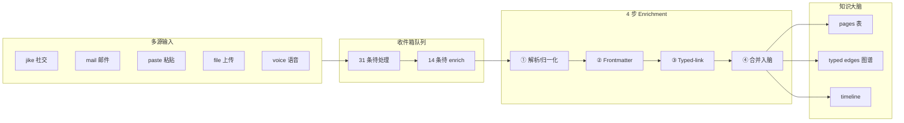
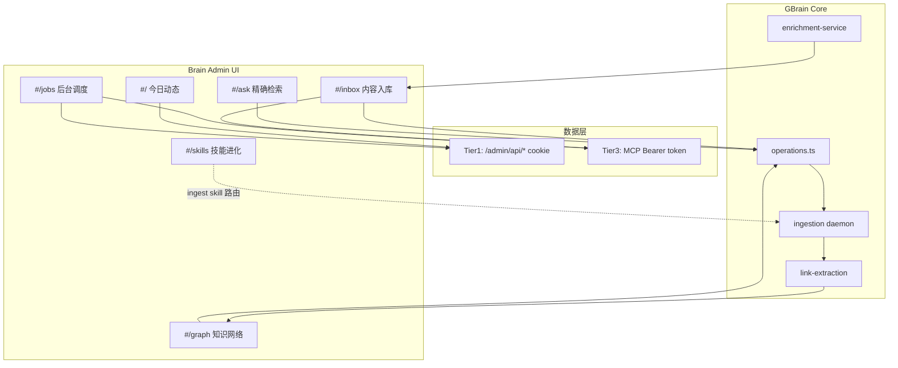

# GBrain「内容入库」页面技术分析

> 来源：`admin/docs/前端案例/02.GBrain _ 项目案例_内容入库.mhtml`（beyondata.com FF-GBrain 项目案例 `#/inbox`）  
> 快照日期：2026-06-27  
> 文档用途：对齐 admin Brain 表层 `#/inbox` 的目标 UX 与后端能力映射

---

## 概述

该 MHTML 快照来自 [beyondata.com FF-GBrain 项目案例](https://beyondata.com/projects/gbrain-wiki#/inbox)（路由 `#/inbox`），是面向教学的**高保真交互原型**，并非当前 `admin/` 仓库里已落地的实现。它展示的是 GBrain「多源信号 → 收件箱队列 → 结构化 enrichment → 并入知识图谱」的完整操作台愿景。

---

## 一、设计意图

页面要解决的，不是「把文件存进数据库」，而是**可审计的内容治理工作台**：

| 目标 | 体现 |
|------|------|
| 多源归集 | jike / mail / paste / file / voice 等渠道统一进收件箱 |
| 人机协同 | 31 条待处理、14 条待 enrich；用户可批量触发或逐条审查 |
| 过程透明 | 右侧 RAW vs ENRICHED 对比 + typed-link 证据链 |
| 成本可控 | T1/T2/T3 分级；typed-link 用正则而非 LLM |
| 沙箱安全 | 顶栏与侧栏「沙箱」标识，区分演示/实线环境 |

副标题写得很清楚：**混合来源 · 自动 enrichment 4 步流水线 · 选中右侧可看 raw vs enriched diff**。这是「运营台」心智，不是简单文件列表。

---

## 二、整体布局与 UI 组件结构

### 2.1 全局 Shell（与 8 页 Brain 表层共用）

```
┌─────────────────────────────────────────────────────────────┐
│ 侧边栏 240px          │ 顶栏 h-16                          │
│ · Logo + 品牌         │ · 面包屑 FF-GBrain / 内容入库       │
│ · 分组导航            │ · 搜索框 (⌘K)                       │
│ · 沙箱/实线 切换      │ · 沙箱状态点 · 帮助 · GitHub        │
├───────────────────────┼─────────────────────────────────────┤
│ 工作台                │ 主内容区 max-w-[1400px]              │
│  ├ 今日动态           │                                     │
│  ├ 内容入库 ← 激活    │                                     │
│  └ 精确检索           │                                     │
│ 知识网络              │                                     │
│ 后台引擎              │                                     │
│ 行业参考              │                                     │
└───────────────────────┴─────────────────────────────────────┘
```

**技术栈（案例侧）**：Astro + React island（`CaseMockup`）+ Tailwind + CSS 变量 token + Lucide 图标。  
**仓库落地规划**：见 `admin/docs/FRONTEND_PLAN.zh.md` — 保持 Vite SPA，视觉 1:1 搬运 token 与组件。

### 2.2 页面内组件树（`data-page="inbox"`）

| 区域 | 组件职责 | 关键 class / testid |
|------|----------|---------------------|
| **PageHeader** | kicker `// 收件箱 · INBOX`、大标题「31 条待处理」、说明文案、沙箱 Badge | `type-display`, `type-mono-tiny` |
| **批量工具栏** | 全选待 enrich、触发 enrichment、丢弃、流水线说明 | `inbox-select-all`, `inbox-trigger-enrichment` |
| **主从分栏** | `lg:grid-cols-12`：左 5 列列表 + 右 7 列详情 | `lg:col-span-5` / `lg:col-span-7` |
| **InboxItemCard** | 可点击卡片：源图标、时间、摘要、状态 Badge、tier | `inbox-item-in-00N` |
| **DetailPanel** | 标题、元信息、原文摘要、enrichment 输出区 | `inbox-detail-panel` |
| **DiffViewer** | RAW / ENRICHED 双栏 `<pre>` 对比 | `enrichment-output` |
| **TypedLinkList** | 三元组边 + 证据引文 | `typed-link-extraction` |
| **Why? 教育按钮** | 解释设计决策（非功能） | `data-why-topic` |

选中态：卡片 `border-accent bg-accent-soft/40`（如 `in-006`）。

---

## 三、内容入库工作流程与处理机制

### 3.1 端到端流程



### 3.2 状态机（从 Badge 推断）

| 状态标签 | 语义色 | 含义 |
|----------|--------|------|
| **待 frontmatter** | 灰 `bg-deep` | 缺 YAML 元数据，停在流水线早期 |
| **待 typed-link** | 青 `bg-accent-soft` | 已有正文/frontmatter，待关系抽取 |
| **合并中…** | 琥珀 `bg-amber/15` | 异步写入进行中 |
| **已合并** | 绿 `bg-ok/15` | 已落盘，可供检索/图谱消费 |

状态与 tier（T1/T2/T3）**正交**：状态描述流水线进度，tier 描述实体重要性与后续 enrich 深度。

### 3.3 与 GBrain 后端的对应关系

| 案例概念 | 仓库实现 |
|----------|----------|
| 文件投递收件箱 | `src/core/ingestion/sources/inbox-folder.ts`（监听 `~/.gbrain/inbox/`） |
| 入库事件记录 | MCP `log_ingest` / `get_ingest_log`（`operations.ts`） |
| 页面写入 | `put_page` + `import-file` 管道 |
| 关系抽取 | `src/core/link-extraction.ts`（`inferLinkType`, frontmatter → typed edges） |
| 外部 API enrich | `docs/guides/enrichment-pipeline.md`（7 步实体 enrich，与 inbox 4 步是不同粒度） |
| ingest 编排 | `skills/ingest/SKILL.md`（路由到 meeting / media / idea 等子技能） |

**注意**：案例里的「4 步 inbox enrichment」是**入库结构化流水线**（frontmatter → typed-link → merge）；`enrichment-pipeline.md` 的 7 步是**实体画像 enrich**（外部 API 查人/公司）。两者在真实系统里会串联，但 UI 上 inbox 页主要展示前者。

---

## 四、数据展示方式

### 4.1 左侧收件箱列表

每条卡片结构：

```
[源图标]  SOURCE_TYPE          HH:MM
         两行摘要 preview (line-clamp-2)
         [状态 Badge]                    tier TN
```

**源类型与图标映射**：

| source | 图标 | 案例内容 |
|--------|------|----------|
| `jike` | message-square | 社交动态转录 |
| `mail` | mail | 邮件 / 投资人资料 |
| `paste` | file-text | 剪贴板文本 |
| `file` | file | `.md` 上传（含大小） |
| `voice` | mic | 语音备忘 |

列表 `max-h-[72vh] overflow-y-auto`，适合高频 triage。

### 4.2 右侧详情面板（选中 `in-006` 示例）

三层信息：

1. **元数据层**  
   `// in-006 · MAIL` · 标题 · `ingested 11:45 · tier T2` · 状态 Badge

2. **原文预览层**  
   邮件正文片段（用户可读上下文）

3. **Enrichment 输出层**（`data-testid="enrichment-output"`）  
   - 标题：`ENRICHMENT 输出 · 4 步流水线已完成`  
   - **RAW**：无 frontmatter 的纯 Markdown  
   - **ENRICHED**：带 YAML frontmatter、`[[wikilink]]`、timeline 注释

**ENRICHED 示例结构**（从快照解码）：

```yaml
---
type: person
role: investor
organization: acme-ventures
tags: [vc, dev-tools]
backlinks: [organizations/acme-ventures, ...]
---
# Yelena Liu
A 轮投资人 [[organizations/acme-ventures|Acme Ventures]] ...
<!-- timeline -->
- 2026-05-07: 由 inbox item in-006 创建
```

这正是 GBrain「页面即真相 + 图谱自连接」的产品叙事：**人看到的是 enriched 页，机器消费的是 typed edges**。

---

## 五、分类标记系统

### 5.1 处理状态（流水线维度）

见 §3.2 状态表。颜色遵循 `admin/DESIGN.md` 语义色：琥珀=入库进行中、绿=通过、青=待行动。

### 5.2 Tier T1 / T2 / T3（重要性维度）

对齐 `docs/guides/enrichment-pipeline.md` 与 `GBRAIN_SKILLPACK.md`：

| Tier | API 开销 | 典型实体 | 案例分布 |
|------|----------|----------|----------|
| **T1** | 10–15 次/实体 | 核心人脉、投资组合公司 | 已合并的 jike/file/voice |
| **T2** | 3–5 次 | 偶发互动、知名外部人 | mail、部分 jike |
| **T3** | 1–2 次 | 轻量提及、粘贴片段 | 待 frontmatter 的 paste |

Tier 决定后续是否跑完整外部 enrich，也影响用户在列表里的优先级判断。

### 5.3 沙箱 / 实线

侧栏底部 `沙箱 | 实线` 双按钮切换。顶栏脉冲点 + `沙箱` Badge 表示当前在演示模式，避免误操作生产 brain。

---

## 六、4 步 Enrichment 流水线

工具栏文案：**enrichment 4 步流水线 · Why?**  
Tooltip：**为什么 enrichment 是 4 步串行 · 不是一次 LLM 总结？**

从状态标签 + 详情输出，可还原 4 步为：

| 步 | 名称 | 产出 | 失败态 |
|----|------|------|--------|
| 1 | **解析归一化** | 结构化正文、源类型、时间戳 | 卡在队列 |
| 2 | **Frontmatter 生成** | `type/role/tags/backlinks` YAML | `待 frontmatter` |
| 3 | **Typed-link 抽取** | wikilink + 动词正则边 | `待 typed-link` |
| 4 | **合并入脑** | `put_page`、图谱边、timeline | `合并中…` → `已合并` |

**设计哲学**（Why? 按钮强调的）：

- **可审计**：每步可单独检查，而非黑盒 LLM 一次吐完  
- **确定性优先**：typed-link 用英文动词正则，零 LLM token  
- **可重跑**：RAW 保留，enriched 可再生成  

与 `link-extraction.ts` 中 `inferLinkType` 的优先级一致：`founded > invested_in > advises > works_at > mentions`。

---

## 七、Typed-link 提取与图谱构建

### 7.1 详情区展示格式

```
people/yelena-liu  --works_at-->  organizations/acme-ventures
                                  "investor at Acme Ventures"
people/yelena-liu  --invested_in--> companies/linear
                                  "Led Series A in ... including Linear"
people/yelena-liu  --advises-->    concepts/early-stage
```

每条边带**证据引文**（italic 右侧），满足「可反驳、可追溯」。

### 7.2 与引擎实现的映射

| UI 展示 | 引擎 |
|---------|------|
| `--works_at-->` | `WORKS_AT_RE` + frontmatter `company:` 字段（v0.13） |
| `--invested_in-->` | `INVESTED_IN_RE` + schema-pack 动词表 |
| `--advises-->` | `ADVISES_RE` / `ADVISOR_ROLE_RE` |
| wikilink `[[slug\|label]]` | `ENTITY_REF_RE` + `put_page` 后自动 link 钩子 |
| 关系检索 | `relational-intent.ts` 动词库 → `traverse_graph` |

案例标注 **「4 个英文动词正则零 LLM」**，与生产代码方向一致：先用规则抽边，LLM 只用于 frontmatter/摘要等高价值、低频次步骤。

### 7.3 图谱消费路径

```
inbox enrichment → typed edges → #/graph 可视化
                              → #/ask 关系召回 (relationalRetrieval)
                              → find_experts / traverse_graph
```

v0.13 起 YAML frontmatter 字段（`company:`, `investors:`, `attendees:` 等）会自动投影为 typed graph edges，inbox 页的 ENRICHED 预览正是这一能力的 UI 化。

---

## 八、与其他系统模块的集成



| 模块 | 集成方式 |
|------|----------|
| **今日动态** | `today-static.ts` 有「Inbox · 自动归集」叙事；cron/信号检测持续喂收件箱 |
| **精确检索** | enrich 后的 chunk + embedding 进入 hybrid search；关系边进入 relational recall |
| **知识网络** | typed-link 直接成为 `#/graph` 节点边 |
| **后台调度** | 批量 enrich / embed / sync 以 job 形式运行；`合并中…` 对应 job 进度 |
| **技能进化** | `ingest` skill 路由各源；enrich skill 定义 tier 策略 |
| **MCP 契约** | `list_pages`, `get_ingest_log`, `log_ingest`, `put_page`, `file_list`（`FRONTEND_PLAN.zh.md` Tier3 映射） |

---

## 九、与当前 `admin` 实现的差距

当前 `admin/src/pages/brain/Inbox.tsx` 仅为 **MVP 读列表**：

- 数据源：`useMcp('list_pages', { limit: 50 })`
- 展示：简单表格（slug / type / title / updated_at）
- 无主从分栏、无 enrichment diff、无 typed-link 列表

| 案例能力 | 当前状态 |
|----------|----------|
| 主从分栏 + 详情 diff | ❌ 未实现 |
| 多源图标 + 状态 Badge | ❌ 仅 `type` Badge |
| 批量 enrich / 全选 | ❌ |
| 4 步流水线 UI | ❌（`PipelineSteps` 仅在 `#/ask` 用于 12 步检索） |
| typed-link 证据列表 | ❌ |
| `get_ingest_log` 真实收件箱 | ❌ 用的是 `list_pages` |

`FRONTEND_PLAN.zh.md` 将其排在 P4 优先级，定位为「列表+表单，打通写路径」。

---

## 十、用户体验评估

### 10.1 优点

1. **心智模型清晰**：「收件箱 → 审查 → 合并」类比邮件客户端，学习成本低。  
2. **信任感强**：RAW/ENRICHED 并排 + 边证据引文，降低「AI 乱改」焦虑。  
3. **批量 + 单条兼顾**：14 条待 enrich 可全选触发，也可点 `in-006` 细看。  
4. **信息密度适中**：左栏卡片一屏 10+ 条；右栏 `max-h-[200px]` 滚动 pre，不撑爆布局。  
5. **教育性设计**：Why? 按钮把「4 步串行 vs 一次 LLM」讲透，适合培训场景。  
6. **语义色一致**：状态/tier/沙箱各有颜色语义，符合 `DESIGN.md`「颜色有意义」原则。

### 10.2 风险与改进建议

| 问题 | 建议 |
|------|------|
| 31 条列表无筛选/排序 | 加按源类型、状态、tier 过滤 |
| 无多选 checkbox（仅「全选待 enrich」） | 卡片左侧加 checkbox，支持部分选中 |
| 详情区无「编辑后合并」 | 加 inline 编辑 ENRICHED 再提交 |
| `合并中…` 无进度 | 对接 `get_job_progress` 或步骤指示器 |
| 丢弃无确认 | 二次确认 + 软删除/归档 |
| 搜索框 readonly | 实装跨 page/concept 搜索或跳转 `#/ask` |
| T3 条目可能永远堆积 | 自动降级合并或「低优先级静默合并」策略 |

### 10.3 总体评价

这是一个**生产级知识运营台**的高保真蓝图：把 GBrain 区别于普通 RAG 的关键——**结构化入库、typed graph、可审计 enrichment**——全部可视化。技术上与仓库的 `inbox-folder`、`link-extraction`、`log_ingest`、schema-pack 边类型高度同构；差距主要在 admin 前端的**交互层与 ingest 队列数据契约**尚未接通。

---

## 相关文档

| 文档 | 说明 |
|------|------|
| `admin/docs/前端案例/02.GBrain _ 项目案例_内容入库.mhtml` | 案例快照源文件 |
| `admin/docs/FRONTEND_PLAN.zh.md` | 8 页 Brain 表层落地规划与 API Tier 策略 |
| `admin/DESIGN.md` | Brain 表层设计 token 与组件约定 |
| `docs/guides/enrichment-pipeline.md` | 实体 enrich 7 步流水线（与 inbox 4 步不同粒度） |
| `skills/ingest/SKILL.md` | ingest 路由与 Iron Law 回链 |
| `src/core/link-extraction.ts` | typed-link / frontmatter 边抽取实现 |

---

*文档生成自案例 MHTML 逆向分析与仓库代码对照，供 `#/inbox` 前端实现与后端契约设计参考。*
