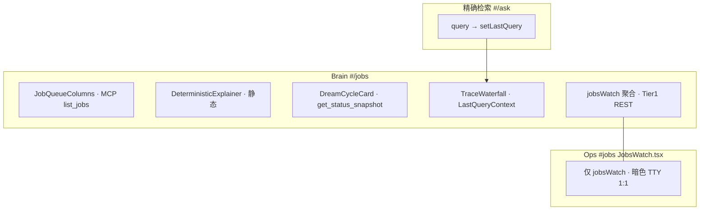
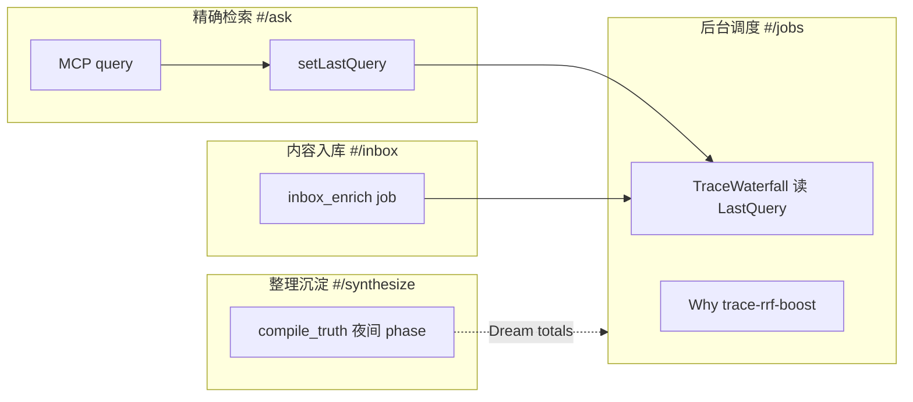

# GBrain「后台调度」实现对照评估

> 对照基准：`admin/docs/前端案例/06.GBrain _ 项目案例_后台调度.mhtml`（案例站 `#/jobs`）  
> 实现代码：`admin/src/pages/brain/Jobs.tsx`、`JobQueueColumns.tsx`、`DeterministicExplainer.tsx`、`DreamCycleCard.tsx`、`TraceWaterfall.tsx`  
> 后端契约：`src/commands/jobs-watch.ts`（`readSnapshot`）、`src/core/operations.ts`（`list_jobs` / `submit_job` / `get_status_snapshot`）、`src/core/cycle.ts`（`ALL_PHASES`）  
> 生成日期：2026-07-11

---

## 总览结论

**骨架已对齐案例目标态约 80–85%**：三栏任务队列、确定性对比卡、Dream Cycle 卡、Trace Waterfall、Why? 教育按钮、真实 MCP/REST 双通道均已落地。

与案例的差异主要在两类：

1. **有意取舍**（更诚实、更可运维）：确定性任务不做可点击 demo；Trace 不伪造逐步 ms；Dream Cycle 不硬编码「9 phase」与 cron；聚合运维面板（队列健康 / 按类型 / 错误聚类 / 预算）案例未展示但实现已接。
2. **尚未 polish**（案例有、实现还没有）：页头组合大标题 + CPU 图标、运行中 job 的 shell/subagent 通道标签、Dream phase 耗时 chip、Trace 逐步实测 ms、确定性任务交互式触发演示。

| 维度 | 对齐度 | 一句话 |
|------|--------|--------|
| 三栏队列（待处理/运行中/已完成） | ~85% | 结构对齐；实现接 live MCP + 取消/重试/Drawer |
| 确定性任务对比 | ~70% | 数字同源 Why 面板；案例可触发 demo，实现静态基准 |
| Dream Cycle | ~75% | 真实 snapshot + 触发；案例简化 9 phase + cron + chip |
| Trace Waterfall | ~65% | 共享总 ms；案例 12 span 逐步 ms，实现示意权重 |
| 聚合运维（jobs/watch） | 实现更强 | 案例无；实现 1s 轮询四块 SRE 面板 |
| Why? 按钮 | ✅ | minions-queue / dream-cycle / trace-rrf-boost |
| 测试 | 实现更强 | Vitest 三栏/Dream/静态基准/Trace 空态 |

**图例**：✅ 已对齐 / 实现更好 · ⚠️ 部分对齐 · ❌ 未实现

---

## 先澄清：这页在做什么

案例 MHTML 的 `#/jobs` 定义的是 **后台引擎可观测 + 架构教育页**，不是传统 CRUD 任务管理器：

> Minions 三栏队列 → 确定性 minion vs sub-agent 对比 → Dream Cycle 夜间维护摘要 → 最近一次 ask 的 Trace Waterfall

**不是** Ops 暗色 `#jobs`（`JobsWatch.tsx`，TTY `gbrain jobs watch` 1:1 浏览器版）。Brain `#/jobs` 在案例叙事之上额外接了 **`GET /admin/api/jobs/watch`** 聚合数据（队列健康、24h 按类型、错误聚类、预算账户）。

数据通道分工（见 `admin/docs/FRONTEND_PLAN.zh.md`）：

| 通道 | 用途 |
|------|------|
| **Tier1 REST** | `api.jobsWatch()` → 聚合快照（1s 轮询） |
| **Tier3 MCP** | `list_jobs` / `cancel_job` / `retry_job` / `submit_job` / `get_status_snapshot` → 逐条明细与 Dream 触发 |

---

## 逐项对照表

| 维度 | 案例 MHTML 目标 | 当前实现 | 状态 |
|------|----------------|----------|------|
| **1. 整体布局** | `max-w-[1400px]` 单栏堆叠 | `brain-page-wide` 同宽语义 | ✅ 已对齐 |
| **页头 kicker** | `// 引擎 · 任务监控` | `后台调度`（PageHeader kicker） | ⚠️ 部分 |
| **页头 title** | `Minions 队列 + Dream Cycle + Trace Waterfall` + CPU 26px | `任务队列` 衬线标题 | ⚠️ 部分 |
| **页头副标题** | 运行实况 + 753ms vs 10s+ + Why?×2 | minion 快照 + 同对比 + Why?×2 | ✅ 已对齐 |
| **页头沙箱 Badge** | 脉冲「沙箱」 | 无页面级（壳层/顶栏可能有） | ⚠️ 部分 |
| **2. 三栏队列** | 待处理 5 / 运行中 3 / 已完成 142（今日） | MCP 轮询 + 终态合并最多 20 条 | ⚠️ 结构对齐、计数口径不同 |
| **队列卡片** | slug + shell/subagent 标签 + depth | slug 推断 + depth + 实时 elapsed | ⚠️ 缺执行通道标签 |
| **队列操作** | 无 | 取消 / 重试 / Drawer 详情 | ✅ 实现更强 |
| **3. 确定性对比** | 可点击「触发」→ 753ms ✓ | 静态「示意基准」+ 免责声明 | ⚠️ 叙事有、交互无 |
| **对比数字** | Naive 10200ms vs Minions 753ms | `WHY_TOPICS['minions-queue'].comparison` 同源 | ✅ 数字一致 |
| **4. Dream Cycle** | 9 phase + cron `0 3 * * *` + phase chip 耗时 | `get_status_snapshot` 动态 totals + 真实触发 | ⚠️ 部分 |
| **Dream 文案** | 5 条人类可读摘要 + 下次预定时间 | totals 键值原样 +「非固定 cron」 | ⚠️ 部分 |
| **5. Trace Waterfall** | 预置 ask + 12 span **逐步 ms** | `LastQueryContext` 总 ms + **示意权重** | ⚠️ 结构对齐、数据诚实 |
| **Trace 步骤名** | `intent.classify`、`rrf.fuse K=60`… | 中文 12 步（`RETRIEVAL_STEPS`） | ⚠️ 命名不同，更贴模块 |
| **Trace 空态** | 始终有 demo 数据 | 未 ask 时引导去 `#/ask` | ⚠️ 案例为教学快照 |
| **6. Why? 按钮** | `minions-queue` / `dream-cycle` / `trace-rrf-boost` | `WhyButton` + `WhyProvider` | ✅ 已对齐 |
| **7. 队列健康聚合** | 案例无 | waiting/active/stalled/lease_pressure | ✅ 实现更强 |
| **8. 按类型 24h** | 案例无 | by_type 表格 | ✅ 实现更强 |
| **9. 错误聚类** | 案例无 | top_errors + Badge | ✅ 实现更强 |
| **10. 预算账户** | 案例无 | budget_owners 表格 | ✅ 实现更强 |
| **MCP / REST** | 静态 HTML | live 双通道 | ✅ 实现更强 |
| **测试** | `data-testid` 钩子 | Vitest 队列/Dream/基准/Trace | ✅ 实现更强 |

---

## 分块细评

### 1）整体布局与 UI 组件结构

#### 案例设计意图

- **壳层**：240px 侧栏（分组：工作台 / 知识网络 / **后台引擎** / 行业参考）+ 顶栏（⌘K 搜索、沙箱 Badge、帮助、GitHub）
- **内容区**：`max-w-[1400px] px-6 py-8`，`data-page="jobs"`
- **页头**：
  - Kicker：`// 引擎 · 任务监控`
  - 大标题：`Minions 队列 + Dream Cycle + Trace Waterfall` + CPU 图标
  - 副标题：后台引擎运行实况 · deterministic task 753ms vs sub-agent 10s+ · Why?×2
- **主内容顺序**：三栏队列 → 双列（Deterministic + Dream）→ Trace 全宽

#### 当前实现

```
PageHeader（后台调度 / 任务队列）
  → JobQueueColumns（三栏）
  → grid md:2（DeterministicExplainer + DreamCycleCard）
  → TraceWaterfall
  → 队列健康 StatCard×4
  → 按类型 table
  → [可选] 错误聚类
  → [可选] 预算账户
```

**已实现**

- 案例主叙事四块全部存在且顺序一致
- Why? 三 topic 与案例 `data-why-topic` 对齐
- 聚合运维区为**有意增强**（案例未展示）

**尚未对齐**

| 案例 | 当前实现 |
|------|----------|
| 组合大标题强调三大模块 | 通用「任务队列」 |
| CPU 26px 图标在 title 内 | PageHeader 无模块图标 |
| 页头重复沙箱 Badge | 无页面级沙箱标识 |
| 仅案例四层，无底部 SRE 面板 | 底部四块聚合表/卡 |

**相关文件**：`admin/src/pages/brain/Jobs.tsx` L33–147

---

### 2）后台任务队列：三态管理机制

#### 案例（静态 demo）

| 栏 | 计数 | 示例 job | 二级信息 |
|----|------|----------|----------|
| 待处理 | 5 | `extract-typed-links` | `pages/in-013`、入队时刻 |
| 运行中 | 3 | `synthesize-page` | `4100ms` pulse、`concepts/dream-cycle · subagent`、`depth=1` |
| 已完成 | 142（今日） | `synthesize-batch` | 耗时 + `ok`，仅展示 3 条 |

#### 当前实现

```typescript
// JobQueueColumns.tsx
list_jobs({ status: 'waiting', limit: 20 })   // 3s 轮询
list_jobs({ status: 'active', limit: 20 })    // 2s 轮询
fetchTerminalJobs()                           // completed+failed+dead，5s，合并排序取 20
```

**状态机（后端）**

```
waiting → active → completed | failed | dead | cancelled
嵌套：depth > 0 表示 parent 提交的子 job（minion_jobs.parent_job_id）
```

**已实现**

- 三栏 Kanban 结构与案例一致
- 运行中卡片 1s 本地 tick 显示实时 elapsed（案例为静态 ms）
- `targetLabel()` 从 payload 猜 slug（不瞎编）
- 取消（waiting/active）、重试（failed/dead）、Drawer 展示 payload/result/error

**尚未对齐**

| 案例 | 当前实现 |
|------|----------|
| 已完成栏头「142（今日）」 | 仅当前列表 length，无今日聚合 |
| 副标题 `· shell` / `· subagent` | 未展示执行通道 |
| 卡片一行摘要含耗时+状态 | 终态 Badge + 完成时刻 · duration |
| 纯展示 | 可操作（更好） |

**相关文件**：`admin/src/components/brain/JobQueueColumns.tsx`  
**后端**：`src/core/operations.ts` `list_jobs` / `cancel_job` / `retry_job`；`src/core/minions/queue.ts`

---

### 3）确定性任务执行演示与性能对比

#### 案例

```
// DETERMINISTIC TASK · 触发演示
page-rank for 17,234 nodes
[触发] → 753ms ✓

Naive 估算 10200ms（sub-agent gateway · 经常超时）
Minions cached 753ms（13× faster · $0 token vs sub-agent gateway）
```

设计意图：用 **PageRank 重算** 等纯图/SQL 任务，演示 minion 确定性 handler 相对 sub-agent 对话编排的数量级优势。

#### 当前实现

```typescript
// DeterministicExplainer.tsx — 刻意静态
// 无 page-rank 触发 op；随意触发重算违背「确定性任务不应被随意触发」
// 数字复用 WHY_TOPICS['minions-queue'].comparison
```

| 字段 | 案例 | 当前实现 |
|------|------|----------|
| 标题 | `page-rank for 17,234 nodes` | Why topic 标题 |
| 交互 | `data-testid="trigger-deterministic"` 可点击 | 无按钮 |
| 耗时展示 | 触发后 `753ms ✓` | 对比格静态文案 |
| 标签 | `触发演示` | `示意基准（非实时触发）` |

**753ms vs 10s+ 的技术含义**

| 指标 | 含义 | 来源 |
|------|------|------|
| ~753ms | 典型确定性 minion（SQL/图算法/shell）wall-clock 量级 | `why-topics.ts` 教学基准 |
| 10s+ / 10200ms | 同等任务走 sub-agent（多轮 LLM 规划→工具）下界 | 同上 |
| $0 token | handler 白名单路径默认不过 completion | `brain-allowlist.ts` |
| 13× | 案例心算展示倍数 | demo 文案 |

**不是** Jobs 页实时 KPI；是 **`minions-queue` Why topic 的架构论证**。

**评价**：实现诚实性优于案例（不伪造触发 API）；案例教学冲击力更强。

**相关文件**：`admin/src/components/brain/DeterministicExplainer.tsx`、`admin/src/lib/why-topics.ts` L189–211

---

### 4）Dream Cycle：配置与执行状态监控

#### 案例

- 标题：`// DREAM CYCLE · 9 phase`，cron `0 3 * * *`
- 上次：今 03:14 · 12min
- 人类可读摘要：extract 47 typed-link、synthesize 12 compiled_truth、patterns 3 stale、orphans 5、purge 0
- **9 个 phase chip**（hover：lint 380ms … synthesize 380000ms）
- 按钮：`立即触发 · 下次预定 明 03:14`

#### 当前实现

```typescript
// DreamCycleCard.tsx
useMcp('get_status_snapshot')  → cycle.last_full（最近一次完成的 autopilot-cycle job）
callMcp('submit_job', { name: 'autopilot-cycle', data: {} })  // 手动触发
```

**后端真相**（`src/core/cycle.ts`）

- `ALL_PHASES` 实际 **20+** 项（lint → backlinks → sync → synthesize → extract → extract_facts → … → purge）
- 部分 phase 按 pack/config **门控**（如 extract_atoms、skillopt）
- 调度：**autopilot 按 source 扇出**，非案例所示固定 cron `0 3 * * *`
- handler：`worker.register('autopilot-cycle', …)`，超时 30min（`handler-timeouts.ts`）

| 维度 | 案例 | 当前实现 |
|------|------|----------|
| Phase 数量叙事 | 固定「9 phase」 | 动态 `Object.entries(totals)`，不假设固定数 |
| Cron 展示 | `0 3 * * *` | 文案「非固定 cron」 |
| Phase 耗时 chip | 9 个 ok chip + title ms | ❌ snapshot 未暴露逐步耗时 |
| 下次运行 | 「明 03:14」 | ❌ |
| 手动触发 | UI 按钮 | ✅ 真实 `submit_job` + 确认对话框 |
| totals 摘要 | 5 条固定中文 | 键值原样渲染 |

**评价**：实现数据真实、phase 数诚实；案例为简化产品故事（9 phase + cron + chip）。

**相关文件**：`admin/src/components/brain/DreamCycleCard.tsx`；`src/commands/status.ts` `buildCycleSnapshot`

---

### 5）Trace Waterfall：性能分析功能及实现原理

#### 案例（理想态 distributed tracing）

- 查询：`"我什么时候开始关注 typed-link 这个想法的？"`
- 总 **2538ms**，**12 spans**，每步右侧 **实测 ms**
- 步骤名偏底层：`intent.classify`、`query.expand (haiku)`、`search.vector × 3 (HNSW)`、`rrf.fuse K=60`、`compose.sonnet (stream)`…
- SPAN DETAIL：kind / start (+620ms) / duration (120ms)

#### 案例 12 span（MHTML 摘录）

| # | 名称 | 耗时 |
|---|------|------|
| 1 | intent.classify | 240ms |
| 2 | query.expand (haiku) | 380ms |
| 3 | search.vector × 3 (HNSW) | 120ms |
| 4 | search.keyword (tsvector) | 38ms |
| 5 | rrf.fuse K=60 | 22ms |
| 6 | compiled_truth × 2.0 | 6ms |
| 7 | backlink boost | 18ms |
| 8 | graph.traverse depth=2 (CTE) | 64ms |
| 9 | source-aware SQL boost | 14ms |
| 10 | dedup 4-layer | 9ms |
| 11 | rerank.haiku top-12 → top-5 | 380ms |
| 12 | compose.sonnet (stream) | 1280ms |

#### 当前实现 12 步（`RETRIEVAL_STEPS` + `TraceWaterfall.tsx`）

| # | 名称 | 宽度来源 |
|---|------|----------|
| 1 | 意图识别 | WATERFALL_WEIGHTS 示意 |
| 2 | 缓存查询 | 同上 |
| 3 | 多查询扩展 | 同上 |
| 4 | 向量嵌入 | 同上 |
| 5 | 向量召回 | 同上 |
| 6 | 关键词召回 | 同上 |
| 7 | 关系召回 | 同上 |
| 8 | RRF 融合 | 同上 |
| 9 | 精排 | 同上 |
| 10 | 自动截断 | 同上 |
| 11 | Token 预算 | 同上 |
| 12 | 组装结果 | 同上 |

**数据流**

```
#/ask  runQuery → callMcp('query') → setLastQuery({ query, totalMs, resultCount })
#/jobs TraceWaterfall → useLastQuery() 读取（纯内存，刷新即失）
```

**原理说明**

```
MCP query 只返回 SearchResult[]，不返回逐步计时或 span 树。
唯一实测：totalMs（Ask 页前端 wall-clock）+ resultCount。
各步宽度 = WATERFALL_WEIGHTS 示意占比；kind（llm/db/cpu）为结构分类。
点击步骤 → SPAN DETAIL 展示 desc / in / out / 是否烧 token（非本次计费）。
```

**口径差异**：案例步骤含 `compose.sonnet`（合成/作答）；实现 12 步对齐 **检索管道**（到 assemble SearchResult），与 `#/ask` 右侧 `PipelineSteps` 共享定义——**不含 think 合成步**（Ask 页 `think` 为按需分离调用）。

**已实现**

- 8+4 栅格（步骤列表 + 详情面板）
- Why? `trace-rrf-boost`
- 空态引导去 `#/ask`
- 底部免责声明

**尚未对齐**

- ❌ 逐步 ms（需上游 `query` meta 或独立 trace op）
- ❌ 案例底层 span 命名（实现用中文教育标签）
- ⚠️ 案例预置 demo；实现依赖用户先 ask

**相关文件**：`admin/src/components/brain/TraceWaterfall.tsx`、`admin/src/lib/retrieval-steps.ts`、`admin/src/lib/LastQueryContext.tsx`

---

### 6）与 `Jobs.tsx` 编排及 Ops 面的关系



| 表面对象 | 路由 | 数据源 | 定位 |
|----------|------|--------|------|
| Brain 后台调度 | `#/jobs` | REST + MCP | 叙事 + 可操作队列 + 教育 |
| Ops Jobs Watch | `#jobs` | REST only | 运维 cockpit，与 TTY 1:1 |

**相关文件**：`admin/src/pages/brain/Jobs.tsx`；`admin/src/pages/JobsWatch.tsx`；`src/commands/jobs-watch.ts`

---

### 7）后台任务类型及处理逻辑

#### 案例 job 名（教学用，与 handler 注册名不完全一致）

| 案例 name | 语义 | 仓库近似 handler |
|-----------|------|------------------|
| `extract-typed-links` | 抽 typed-link 边 | `extract`（cycle phase） |
| `embed-stale-chunks` | 嵌入过期 chunk | `embed` / `embed-backfill` |
| `frontmatter-guard` | frontmatter 校验 | skill/CLI 概念，非独立 minion 名 |
| `rebuild-backlinks` | 重建反向链接 | `backlinks` |
| `summarize-section` | 段落摘要 | 无同名 handler（可能 subagent 任务） |
| `synthesize-page` | 单页综合 | `synthesize` + `subagent` |
| `page-rank-recompute` | 图 PageRank | `shell` 类确定性任务 |
| `synthesize-batch` | 批量综合 | `synthesize` 变体 |

#### 仓库真实注册（摘录 `src/commands/jobs.ts`）

`sync`, `embed`, `lint`, `extract`, `backlinks`, `autopilot-cycle`, `subagent`, `shell`, `ingest_capture`, `inbox_enrich`, `embed-backfill`, `orphans`, `purge`, `synthesize`, `patterns`, `consolidate`, …

**两条执行通道**

| 通道 | 特征 | 案例 UI |
|------|------|---------|
| **确定性 handler / shell** | 白名单、DB 持久化、~百 ms 级、$0 token 默认 | subtitle 标注 `shell` |
| **subagent** | LLM 多轮编排、秒~分钟级、token 成本 | subtitle 标注 `subagent` |

实现 **未在 JobCard 暴露** 通道标签——运维需看 job.name + payload 或 Drawer。

---

### 8）聚合运维面板（实现有、案例无）

`Jobs.tsx` 通过 `api.jobsWatch()` 1s 轮询 `readSnapshot()`，与 TTY `gbrain jobs watch` **同形状**：

| 面板 | 字段 | 说明 |
|------|------|------|
| 队列健康 | waiting / active / stalled / lease_pressure_1h | 租约压力颜色：0 绿 / ≥100 红 |
| 按类型（24h） | name, total, completed, failed, dead | 各 job 类型吞吐 |
| 错误聚类 | cluster + count | `clusterErrors()` 对 24h failed/dead |
| 预算账户 | owner_id, remaining_cents, total_spent_cents | 带 `--budget-usd` 的父 job |

**评价**：实现 **SRE 深度超过案例**；案例聚焦产品叙事，省略运维尾部。

**相关文件**：`admin/src/pages/brain/Jobs.tsx` L64–146；`src/commands/jobs-watch.ts`

---

### 9）案例有、实现未列出的功能

| 功能 | 当前状态 | 建议优先级 |
|------|----------|-----------|
| 确定性任务可点击触发 demo | ❌ 故意不做 | P4 — 除非新增安全 op |
| 运行中 job shell/subagent 标签 | ❌ | P2 — 启发式从 name/data |
| Dream phase 耗时 chip | ❌ | P3 — 需扩展 snapshot |
| Dream cron / 下次预定时间 | ❌ | P3 — 需调度 API |
| Trace 逐步 ms | ❌ | P3 — 需 `query` trace meta |
| 页头组合大标题 + CPU 图标 | ❌ | P1 — 纯 UI |
| 已完成「今日 N」聚合计数 | ❌ | P2 — MCP 或 REST 扩展 |
| 案例 span 底层命名 | ❌ | P4 — 与 RETRIEVAL_STEPS 二选一 |
| Trace 预置 demo（无 ask 也有数据） | ❌ | P4 — 与诚实策略冲突 |

---

## 架构决策评价

| 实现选择 | 评价 |
|----------|------|
| 三栏走 MCP、聚合走 REST | ✅ 正确：明细需 admin op；聚合与 TTY 1:1 |
| 确定性对比不做可触发 demo | ✅ 正确：无 page-rank op，避免误导 |
| Trace 不伪造逐步 ms | ✅ 正确：与 Ask PipelineSteps 同一诚实策略 |
| Dream 不硬编码 9 phase | ✅ 正确：`ALL_PHASES` 20+ 且门控 |
| 取消/重试 + Drawer | ✅ 正确：案例缺运维操作，实现补齐 |
| 底部 jobs/watch 四面板 | ✅ 正确：Brain 页兼 SRE 视图 |
| 任务名案例化 vs handler 真名 | ⚠️ 文档需说明：案例为教学命名 |
| Trace 依赖 Ask 先查询 | ⚠️ 可接受；空态已引导 |

---

## 测试覆盖

`admin/src/pages/brain/__tests__/Jobs.page.test.tsx` 已覆盖：

| 用例 | 状态 |
|------|------|
| 三栏渲染 waiting/active/done 真实 job 名 | ✅ |
| slug 副标题（pages/in-013） | ✅ |
| depth=1 nested 展示 | ✅ |
| 取消 → `cancel_job` | ✅ |
| 重试 → `retry_job` | ✅ |
| Dream 上次运行 + totals | ✅ |
| Dream 立即触发 → `submit_job autopilot-cycle` | ✅ |
| Deterministic 静态免责声明 | ✅ |
| Trace 无 LastQueryProvider 时空态 | ✅ |

案例仅有 `data-testid="trigger-deterministic"`、`span-s1`…`trace-waterfall` 等钩子，无对应自动化测试。

---

## 后续打磨优先级

### P1 — 低成本、高感知（约 1–2h）

1. 页头改为案例式组合标题（保留 subtitle 与 Why?）
2. PageHeader title 旁加 CPU 图标（lucide-cpu）
3. 副标题「753ms vs 10s+」与 Deterministic 卡视觉统一

### P2 — 体验对齐案例（约半天）

4. JobCard 增加执行通道标签（`subagent` / `shell` / `handler` 启发式）
5. 已完成栏头可选展示今日 completed 计数（REST 或 MCP 扩展）
6. Trace：有 lastQuery 时在总 ms 旁显示「12 步示意」与案例一致的文案密度

### P3 — 需后端或 fork 上游

7. `query` 返回可选 `trace_spans[]`（或 `GET /admin/api/query/trace`）
8. `get_status_snapshot.cycle.last_full.phases[].duration_ms` + 调度 hint
9. `list_jobs` 返回 `execution_lane` 字段（worker 写入）

### P4 — 演示向（与诚实策略权衡）

10. 沙箱模式下 Trace 预置 demo span（标注「演示数据」）
11. 确定性卡可选「模拟触发」动画（不调用真实 op）

---

## 与其他 Brain 页面的集成



| 集成点 | 状态 | 说明 |
|--------|------|------|
| Ask → Trace | ✅ | `LastQueryProvider`（`App.tsx` 包裹） |
| Inbox enrich job | ✅ | 队列可见 `inbox_enrich` |
| Dream synthesize phase | ✅ | totals 可能含 synthesize 计数 |
| Today 动态 | — | 无直接跳转 `#/jobs` |
| Graph | — | page-rank 叙事仅在确定性对比文案 |

---

## 一句话总结

实现已将后台调度从 Ops 暗色 `#jobs` 扩展为 **Brain 向可叙事 + 可运维页**：真实三栏队列（可操作）、诚实静态基准、live Dream Cycle、跨页 Trace 总耗时，并额外接入 **jobs/watch 四块 SRE 聚合**。整体 **比案例更适合真实联调与日常运维**，但在 **教学/demo 冲击力**（可触发确定性 demo、Trace 逐步 ms、Dream 9 phase chip、cron 叙事）上仍弱于 MHTML 案例。

若目标是「案例级演示」，优先 P1 页头 + P4 标注 demo 的 Trace；若目标是「生产可用」，当前架构（双通道 + 诚实 trace + 不伪造 page-rank）已经正确，逐步 ms 应等上游 telemetry 就绪再补。

---

## 相关文档

| 文档 | 关系 |
|------|------|
| `admin/docs/前端案例/06.GBrain _ 项目案例_后台调度.mhtml` | 对照基准（案例站快照） |
| `admin/docs/ASK_PAGE_COMPARISON.zh.md` | Trace 12 步口径、query 诚实性、LastQuery 来源 |
| `admin/docs/FRONTEND_PLAN.zh.md` | `#/jobs` P2 优先级、Tier1+Tier3 分工 |
| `admin/docs/WHY_BUTTON_PLAN.zh.md` | minions-queue / dream-cycle / trace-rrf-boost 落点 |
| `admin/docs/TYPE-MIRROR-CHECKLIST.md` | `JobsWatchSnapshot` / `MinionJobRow` 镜像 |
| `admin/docs/INBOX_API.zh.md` | inbox_enrich / ingest_capture job 联调 |
| `src/core/cycle.ts` | `ALL_PHASES` 权威列表 |
| `src/commands/jobs-watch.ts` | 聚合快照与 TTY 1:1 |
