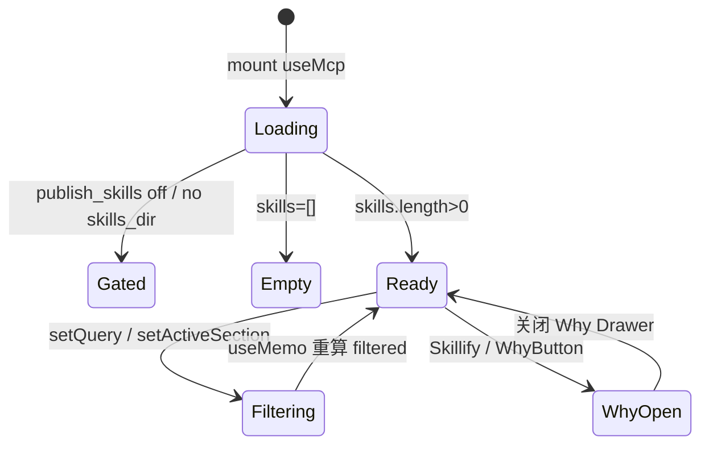

# GBrain「技能进化」实现对照评估

> 对照基准：`admin/docs/前端案例/07.GBrain _ 项目案例_技能进化.mhtml`（案例站 `#/skills`）  
> 实现代码：`admin/src/pages/brain/Skills.tsx`  
> 后端契约：`src/core/skill-catalog.ts`（`list_skills` / `get_skill`）、`src/core/skill-trigger-index.ts`  
> Skillify 源文：`skills/skillify/SKILL.md`、`src/commands/skillify.ts`  
> 生成日期：2026-07-11

---

## 总览结论

**骨架已对齐案例目标态约 65–70%**：Brain 壳层、`#/skills` 路由、搜索 + 分类 pill + 卡片网格、Skillify/Why 教育链路、live MCP `list_skills`、Vitest 覆盖均已落地。

与案例的差异主要在两类：

1. **有意增强**（比静态 demo 更可用）：真实 MCP 目录、工具 scope 可用性（`usable_tools` / `unavailable_tools`）、`mutating` / `writes_pages` Badge、`mcp.publish_skills` 门控友好降级。
2. **尚未 polish**（案例有、实现还没有）：页头动态统计 + Wrench 图标、页头沙箱 Badge、3 列网格、分类色点/badge、`last run` / `checklist N/11` 运维字段、`get_skill` 详情抽屉、skillpack / advisor 集成。

**重要澄清**：本页是 **Skill 目录浏览 + Skillify 教育入口**，不是 skillify CLI 的执行台。案例中的 `last run` 与 `checklist 11/11` 均为**教学 mock**；后端 `list_skills` 当前不返回这些字段。`FRONTEND_PLAN.zh.md` §3.2 规划的「版本时间线 + diff」尚未实现。

| 维度 | 对齐度 | 一句话 |
|------|--------|--------|
| 整体布局与导航 | ~85% | 同一 Brain 壳 + 搜索/过滤/网格 |
| 分类与展示 | ~75% | 7 类顺序一致；缺色点、3 列、section badge |
| 技能详情 | ~40% | 案例卡片内嵌 last run + checklist；实现偏 triggers/tools |
| 搜索过滤 | ~90% | 逻辑等价，UI 细节不同 |
| Skillify | ~80% | 均打开 Why 面板；按钮位置/样式不同 |
| 真实 MCP | 实现更强 | live `list_skills`；案例 42 条静态 |
| 测试 | 实现更强 | Vitest 8 条；案例仅 data-testid 钩子 |

**图例**：✅ 已对齐 / 实现更好 · ⚠️ 部分对齐 · ❌ 未实现 / 不适用

---

## 先澄清：这页在做什么

案例 MHTML 的 `#/skills` 定义的是 **Skill 进化目录 + 健康度仪表盘（demo 态）**：

> 展示 host 上全部 skill（42 个）→ 按 RESOLVER 七类分区 → 每张卡显示 **last run** + **checklist 完成度** + **trigger 短语** → 点 Skillify 理解 11 项 checklist 为何是 permanent fix

**不是** 在 UI 里执行 `gbrain skillify`、也不是 skillpack CI 报告页。Skillify 按钮与 Why? 一样，打开 **`skillify-permanent-fix`** 教育 Drawer。

与 `#/jobs`（后台调度）、`#/ask`（检索管道）的分工：本页只读 skill **元数据目录**，不写 brain、不跑 job。

---

## 逐项对照表

| 维度 | 案例 MHTML 目标 | 当前实现 | 状态 |
|------|----------------|----------|------|
| **1. 整体布局** | `max-w-[1400px]` + 页头 + 工具栏 + 3 列网格 | `brain-page-wide` + `PageHeader` + 2 列网格 | ⚠️ 部分 |
| **页头** | `// 技能库 · SKILLS` + `42 个 skill · 11 项 checklist 全绿` + Wrench 26px | `PageHeader`「技能进化」+「技能」+ 副标题 | ⚠️ 部分 |
| **页头沙箱 Badge** | 脉冲「沙箱」标识 | 无（侧栏/顶栏全局可能有） | ⚠️ 部分 |
| **2. 七类分类** | ingest/enrich/brain-ops/research/publish/ops/meta + 色点 | 同序 `PREFERRED_SECTION_ORDER`；pill 无色点 | ⚠️ 部分 |
| **分类计数** | pill 内 `(7)` 等 | pill + 汇总行 `N 个 skill · M 个分类` | ✅ 已对齐 |
| **3. 卡片字段** | name / section badge / desc / last run / checklist / trigger 行 | name / section 文本 / desc / trigger pills / 工具可用性 | ⚠️ 部分 |
| **last run** | 13:42、持续在线、12:00 CI 等 mock | 无 | ❌ |
| **checklist N/11** | 11/11 或 10/11 mock | 无 | ❌ |
| **mutating / writes** | 未展示 | `Badge` amber/coral | ✅ 实现更好 |
| **工具可用性** | 未展示 | `工具 X/Y 可用` + 受限计数 | ✅ 实现更强 |
| **4. 搜索** | 名/描述/trigger；`data-testid=skills-search` | 同逻辑；无 testid | ✅ 功能对齐 |
| **5. Skillify 按钮** | 工具栏右侧 accent 实心 + Sparkles | `PageHeader.right` 描边 + CircleHelp | ⚠️ 部分 |
| **Why? topic** | `skillify-permanent-fix` | `WhyButton` + `why-topics.ts` 同 topic | ✅ 已对齐 |
| **6. get_skill 详情** | 无（卡片不可点） | 无 | ❌ 均未做 |
| **skillpack / advisor** | 未展示 | 未接 MCP | ❌ FRONTEND_PLAN 已列 |
| **7. MCP 契约** | 静态 HTML | live `list_skills` + 门控空态 | ✅ 实现更强 |
| **8. 测试** | data-testid 钩子 | Vitest 8 条 | ✅ 实现更强 |
| **卡片点击 / Drawer** | 无 | 无 | ✅ 设计一致（均未做） |

---

## 分块细评

### 1）整体布局与 UI 组件结构

#### 案例设计意图

- **壳层**：240px 侧栏（分组：工作台 / 知识网络 / 后台引擎 / 行业参考）+ 顶栏（⌘K、帮助、GitHub）
- **内容区**：`max-w-[1400px] px-6 py-8`，`data-page="skills"`
- **页头**：
  - Kicker：`// 技能库 · SKILLS`
  - 大标题：`42 个 skill · 11 项 checklist 全绿` + Wrench 26px
  - 副标题：v0.28.x · 7 分类 · SKILL.md + tests + routing-eval + Why?
  - 右侧：沙箱 Badge（脉冲点）
- **工具栏**（单行 `rounded-lg border`）：
  - 左：带 Search 图标的输入框
  - 中：分类 pill（all + 7 类，带色点）
  - 右：`Skillify` 主按钮（`data-testid="skillify-button"`）
- **主网格**：`sm:grid-cols-2 lg:grid-cols-3`，`data-testid="skills-grid"`

#### 已实现

- 容器：`brain-page-wide` → `max-width: var(--max-width-brain-xwide)`（对齐 1400px 意图）
- 组件：`PageHeader`、`AsyncState`、`Badge`、`WhyButton`、`WhyProvider`
- 工具栏：搜索 + 分类 pill（`role="group" aria-label="按分类过滤"`）
- 网格：`grid-cols-1 sm:grid-cols-2 gap-3`

#### 尚未对齐

| 案例 | 当前实现 |
|------|----------|
| h1 含动态 skill 数 + checklist 叙事 | 静态标题「技能」 |
| Wrench 26px 在页头 | 仅侧栏 nav 图标 |
| 页头沙箱 Badge | 无 |
| 搜索 + pill + Skillify 同一 bordered 容器 | 搜索/pill 与 Skillify 分属不同区块 |
| `lg:grid-cols-3` | 最多 2 列 |
| 卡片 `p-4 rounded-md bg-elevated hover:border-emphasis` | `p-5 rounded-xl bg-surface` 无 hover |
| `data-testid`：skills-search / skills-grid / skillify-button | 无 testid |

**相关文件**：`admin/src/pages/brain/Skills.tsx` L43–164

#### 组件映射

| 案例元素 | 仓库组件 / 模块 |
|----------|----------------|
| 侧栏 `#/skills` | `BrainLayout` + `routes.ts` `BRAIN_ROUTES` |
| 页头 | `PageHeader` |
| Why? / Skillify 教育 | `WhyButton` + `WhyProvider` + `why-topics.ts` |
| 加载/空/错 | `AsyncState` |
| mutating / writes | `Badge`（案例未用） |
| section 色标 | 案例内联 CSS 变量 | 实现为灰色 uppercase 文本 |
| Skill 卡片 | **未抽取**，内联于 `Skills.tsx` |
| 详情抽屉 | 无 | `Drawer` 组件存在但未引用 |

---

### 2）技能分类和展示机制

#### 七类 RESOLVER 分区

案例与实现共用同一展示顺序（实现显式常量）：

```ts
// admin/src/pages/brain/Skills.tsx
const PREFERRED_SECTION_ORDER = [
  'ingest', 'enrich', 'brain-ops', 'research', 'publish', 'ops', 'meta',
];
```

| 分类 | 案例数量 | 色 token（案例 pill / badge） | 代表 skill |
|------|----------|------------------------------|------------|
| ingest | 7 | `--color-accent` | ingest, idea-ingest, meeting-ingestion, migrate… |
| enrich | 7 | `--color-amber` | enrich, article-enrichment, signal-detector… |
| brain-ops | 5 | `--color-node-synthesis` | brain-ops, query, maintain, cron-scheduler… |
| research | 7 | `--color-coral` | perplexity-research, briefing, cross-modal-review… |
| publish | 5 | `--color-node-source` | publish, brain-pdf, reports… |
| ops | 7 | `--color-node-entity` | setup, smoke-test, webhook-transforms… |
| meta | 4 | `--color-node-recent` | skillify, skill-creator, skillpack-check… |

#### 后端 section 解析

`list_skills` 的 `section` 来自 `skills/RESOLVER.md` 分区标签；若无 RESOLVER 条目则回退 `Auto-registered (from skill frontmatter)`（`skill-trigger-index.ts` `FRONTMATTER_SECTION`）。`skill-catalog.ts` `buildTriggerMap` 优先 RESOLVER 分区名 over frontmatter 合成标签。

`list_skills` op 支持服务端 `section` 参数过滤；**前端当前纯客户端 filter**，未把 pill 选择下推到 MCP。

#### UI 差异

- **案例**：filter pill 左侧 1.5px **色点**；卡片右上角 **section badge**（border + 文字同色）。
- **实现**：pill 仅 accent 高亮/ muted；卡片 section 为单独一行 uppercase muted 文本，无 per-section 色。

---

### 3）技能详情展示

#### 案例卡片信息架构

```
┌─────────────────────────────────────┐
│ skill-name              [INGEST]    │  ← 名 + section 彩色 badge
│ 描述 line-clamp-3                   │
│ last run    │ checklist             │  ← 2×2 mono grid
│ 13:42       │ 11/11                 │
│ trigger · phrase1 / phrase2         │  ← 单行截断
└─────────────────────────────────────┘
```

**last run 语义（全部为 demo mock，非 API）：**

| 类型 | 示例 |
|------|------|
| 当日时间 | `13:42`、`10:55` |
| 相对日期 | `昨 22:00`、`周日 18:00` |
| 持续状态 | `持续在线`、`持续` |
| CI / 安装 | `12:00 CI`、`首次安装`、`0.28.5 升级` |

**checklist：** 多数 `11/11`；故意不完整示例：`archive-crawler 10/11`、`citation-fixer 10/11`、`soul-audit 10/11`——教学「并非全绿」。

**trigger：** 统一前缀 `trigger ·`，多短语 `/` 分隔，单行 `truncate`。

#### 当前实现卡片信息架构

```
┌─────────────────────────────────────┐
│ skill-name          [mutating][writes] │
│ INGEST (muted uppercase)            │
│ 描述 line-clamp-3                   │
│ [trigger pill] × min(4, n)          │
│ 工具 1/3 可用 · 2 个受限             │
└─────────────────────────────────────┘
```

**实现独有、案例没有：**

- `mutating` / `writes_pages` → `Badge tone="amber"|"coral"`
- `usable_tools.length / tools.length`；`unavailable_tools` 受限提示（MCP scope 交叉校验，`skill-catalog.ts` `crossReferenceTools`）

**案例有、实现没有：**

- `last_run`
- `checklist` 完成度（N/11）
- section 彩色 badge
- trigger 单行 `trigger · a / b` 格式

**详情层：** 案例与实现均 **不支持点击卡片**。后端已有 `get_skill`（返回 SKILL.md 正文 + allowlisted frontmatter），前端与 FRONTEND_PLAN 规划的「展开版本、diff」均未接。

#### SkillEntry 类型（admin mirror）

```ts
// admin/src/lib/op-types.ts — MIRROR OF skill-catalog.ts
interface SkillEntry {
  name: string;
  description: string;
  section: string;
  triggers: string[];
  tools: string[];
  usable_tools: string[];
  unavailable_tools: string[];
  writes_pages: boolean;
  mutating: boolean;
}
```

无 `last_run`、`checklist_score` 等扩展字段。

---

### 4）搜索和过滤功能

#### 案例

- Placeholder：`搜索 skill 名 / 描述 / trigger…`
- `data-testid="skills-search"`
- 分类 pill：`all (42)` + 7 类，**互斥单选**
- 搜索 + 分类 + Skillify 在同一 bordered 工具栏

#### 当前实现

```ts
// admin/src/pages/brain/Skills.tsx — 纯前端 filter
const hay = `${s.name} ${s.description} ${(s.triggers ?? []).join(' ')}`.toLowerCase();
return hay.includes(q);
```

| 能力 | 案例 | 实现 |
|------|------|------|
| 名 / 描述 / trigger 子串搜索 | ✅ | ✅ |
| 分类 pill 过滤 | ✅ | ✅ |
| 结果计数 | 隐含在 pill `(N)` | `N 个 skill · M 个分类` 或 `filtered/total` |
| URL hash 持久化 filter | ❌ | ❌ |
| 服务端 `section` 参数 | — | op 支持，前端未用 |

无匹配时：案例与实现均显示「无匹配」类空态（实现：`无匹配技能。`）。

---

### 5）Skillify 功能及其作用机制

#### UI 层（案例 = 实现）

两者 **均不执行** skillify CLI / 不发起写 op。点击 Skillify 或 inline Why? → 打开同一 topic：

| 项 | 内容 |
|----|------|
| topic id | `skillify-permanent-fix` |
| 标题 | 为什么 Skillify 是 11 项 checklist · 不是一个文件？ |
| 要点 | 永久修复须进仓库；`gbrain skillify check` 三态 verdict；与 `mcp.publish_skills` / skillpack-check 闭环 |
| 源码引用 | `skills/skillify/SKILL.md`、`skills/skillpack-check/SKILL.md`、`src/commands/skillify.ts` |

**相关文件**：`admin/src/lib/why-topics.ts` L257–272；`admin/docs/WHY_BUTTON_PLAN.zh.md` § topic 11

#### 真实 Skillify 机制（不在本页 UI 执行）

`skills/skillify/SKILL.md` 定义 **11 项 checklist**：

1. SKILL.md  
2. Code（确定性脚本，如适用）  
3. Cross-modal eval（v1.1 信息性，不 gate skillpack-check）  
4. Unit tests  
5. Integration tests  
6. LLM evals  
7. Resolver trigger（`skills/RESOLVER.md`）  
8. Resolver eval（routing-eval）  
9. Scope 声明  
10. E2E  
11. Brain filing（若 writes pages）

CLI：`gbrain skillify check` → properly skilled / close / needs skillify。Skillpack 级：`skillpack-check` skill + `gbrain skillpack check`。

案例页头大标题「11 项 checklist 全绿」是对 **整个 skillpack 健康叙事** 的压缩表达，非单次 API 返回值。

#### UI 差异

| 项 | 案例 | 实现 |
|----|------|------|
| 按钮位置 | 工具栏 `ml-auto` | `PageHeader.right` |
| 样式 | `bg-accent` 实心 + Sparkles 13px | 描边 + `CircleHelp` 14px |
| 页头叙事 | h1 含 checklist 全绿 | subtitle 一句 + inline `WhyButton` |
| testid | `skillify-button` | 无 |

---

### 6）与实际代码中 Skills 相关组件的对应关系

```
BrainLayout (#/skills nav)
    └── App.tsx renderBrainPage → Skills.tsx
            ├── useMcp('list_skills')     ← mcp-client / Tier3
            ├── PageHeader                ← components/brain/PageHeader.tsx
            ├── WhyButton / useWhy        ← WhyButton.tsx + WhyProvider.tsx
            ├── AsyncState                ← loading / error / empty
            ├── Badge                     ← mutating / writes（案例无）
            └── 内联 skill 卡片           ← 无 SkillCard.tsx 抽取

后端：
    operations.ts list_skills / get_skill
        └── skill-catalog.ts
                ├── loadOrDeriveManifest
                ├── buildTriggerMap ← skill-trigger-index.ts
                └── parseSkillFrontmatter ← skill-frontmatter.ts
```

| FRONTEND_PLAN 规划 | 状态 |
|-------------------|------|
| `list_skills` | ✅ 已接 |
| `get_skill` 详情 | ❌ 未接 |
| `list_brain_skillpack` | ❌ 未接 |
| `advisor` 建议 | ❌ 未接 |
| 版本时间线 + diff | ❌ 未接 |

---

### 7）页面交互逻辑和状态管理



| 状态 | 存储 | 案例 | 实现 |
|------|------|------|------|
| skills 列表 | — | 42 条静态 | `useMcp` → `list_skills` |
| `query` | `useState('')` | ✅ | ✅ |
| `activeSection` | `useState('all')` | ✅ | ✅ |
| `selectedSkill` | — | ❌ | ❌ |
| filter URL 同步 | — | ❌ | ❌ |
| 卡片 hover | `hover:border-emphasis` | ✅ | ❌ |
| 卡片 click | 无 | 无 | 无 |

**门控降级（实现独有）：** 当 `mcp.publish_skills` 未开启或 skills 目录不可用时，显示配置指引（`gbrain config set mcp.publish_skills true` 等），而非裸 MCP 错误。

**相关文件**：`admin/src/lib/useMcp.ts`；`Skills.tsx` L38–39 gated 检测

---

### 8）功能差异和 UI 差异汇总

#### 功能

| 功能 | 案例 | 实现 | 备注 |
|------|------|------|------|
| 技能列表 | 42 静态 | live `list_skills` | 数量随 skills 目录变化 |
| 七类 + all 过滤 | ✅ | ✅ | |
| 搜索 | ✅ | ✅ | |
| last run | ✅ mock | ❌ | 需新数据源 / op |
| checklist N/11 | ✅ mock | ❌ | 可接 `skillify check` JSON |
| 工具 scope 可视化 | ❌ | ✅ | MCP 真实约束 |
| mutating / writes | ❌ | ✅ | |
| get_skill 全文 | ❌ | ❌ | 后端有 |
| skillpack / advisor | ❌ | ❌ | 规划已列 |
| Skillify 执行 | ❌ | ❌ | 仅 Why 教育 |

#### UI

| 元素 | 案例 | 实现 |
|------|------|------|
| 标题统计 | `42 个 skill · 11 项 checklist 全绿` | 「技能」+ 副标题 |
| Wrench 页头图标 | 26px | 无 |
| 沙箱 Badge | 页头 | 无 |
| 网格列数 | 3 @ lg | 2 @ sm |
| 分类 pill | 色点 + `rounded-md` | `rounded-full` 无色点 |
| Section | 右上彩色 badge | 灰色文本行 |
| Trigger | 单行 mono | ≤4 个 accent pill |
| Skillify | 实心 accent | 描边 secondary |

---

### 9）案例有、评估未单独列出的功能

1. **赋范空间课例壳**：面包屑、`CaseExitBridge`、查看引导/添加助教（MHTML 外层，非 admin SPA）
2. **固定 42 skill 完整目录快照**：含 archive-crawler、webhook-transforms 等 fork 特有 skill 的 demo 文案
3. **checklist 故意非全绿**：10/11 卡片用于教学 skillpack 债务
4. **last run 多样化文案**：「持续在线」「12:00 CI」等运维叙事
5. **侧栏沙箱/在线 toggle**：案例侧栏底部
6. **Onboarding root**：`data-onboarding-root`（案例有钩子，admin 未接）
7. **页头「从真实 GBrain v0.28.x」版本锚点**：静态营销 copy

---

## 架构决策评价

| 实现选择 | 评价 |
|----------|------|
| `list_skills` MCP 只读目录 | ✅ 正确：fork-safe，不碰 `src/` |
| 客户端 filter 而非服务端 `section` | ✅ 可接受：skill 数量级小；可后续优化 |
| 展示 tools 可用性而非 mock last run | ✅ 诚实：反映 MCP scope 真实约束 |
| Skillify 仅 Why 教育、不嵌 CLI | ✅ 与案例一致；执行 belong CLI/agent |
| 无 get_skill Drawer | ⚠️ 可接受 MVP；FRONTEND_PLAN 下一步 |
| 省略 checklist / last run | ⚠️ 与案例叙事 gap 大；需后端字段或 CLI 包装 |
| 单文件 Skills.tsx、无 SkillCard 抽取 | ✅ MVP 合理； polish 时可抽组件 |

---

## 用户体验评估

### 做得好的

1. **真实目录**：连上 MCP 即见当前 brain host 实际暴露的 skill，非硬编码 42 条。
2. **工具可用性**：Agent 部署时常遇 scope 不足；`1/3 可用 · 2 个受限` 比 mock last run 更 actionable。
3. **门控友好**：publish 未开时给 copy-paste 修复命令，符合 ops 面板预期。
4. **Skillify 叙事**：Why 面板把 meta skill 与 11 项 checklist 讲清楚，对齐产品「进化」主题。
5. **测试**：搜索、分类、工具栏 Skillify、空态均有 Vitest。

### 可改进

1. **健康度不可见**：用户看不到案例强调的 checklist / last run，「进化」感弱。
2. **视觉密度**：2 列 + 大卡片 vs 案例 3 列紧凑网格，同屏信息量更少。
3. **分类辨识度**：无色点/badge，七类在视觉上不够一眼分区。
4. **无详情**：无法在本页读 SKILL.md 摘要或跳 resolver。
5. **与 advisor / skillpack-check 断层**：高 leverage 动作在 advisor op，本页未集成。

### 角色适用性

| 用户 | 本页价值 |
|------|----------|
| Agent 运维者 | 高 — 看 expose 了哪些 skill、工具是否可用 |
| Skill 作者 | 中 — 缺 checklist 分数与 get_skill |
| 课例/demo 观众 | 中 — 案例 mock 叙事更完整；live 版更真实但 less 戏剧化 |
| CI 工程师 | 低 — 应跑 `skillpack-check` / `gbrain skillify check`，非本页 |

---

## 测试覆盖

`admin/src/pages/brain/__tests__/Skills.page.test.tsx` 已覆盖：

| 用例 | 状态 |
|------|------|
| 渲染两个 skill 卡片 | ✅ |
| 汇总行 skill 数与分类数 | ✅ |
| 按名称搜索过滤 | ✅ |
| 按 trigger 搜索过滤 | ✅ |
| 无匹配空态 | ✅ |
| 分类 pill 含计数 | ✅ |
| 点击 meta pill 过滤 | ✅ |
| 工具 usable/total 与受限数 | ✅ |
| Skillify 打开 Why 面板 | ✅ |

案例仅有 `data-testid="skills-search"` / `skills-grid` / `skillify-button`，无自动化测试。

---

## 八项关注点在本页的归属

| # | 主题 | 本页案例 | 本页仓库 | 备注 |
|---|------|----------|----------|------|
| 1 | 布局/UI | ✅ 核心 | ⚠️ ~85% | 缺 3 列、页头统计、沙箱 Badge |
| 2 | 分类展示 | ✅ 7 类 + 色 | ⚠️ ~75% | 顺序对齐，视觉未对齐 |
| 3 | 技能详情 | last run + checklist | triggers + tools | 后端字段 gap |
| 4 | 搜索过滤 | ✅ | ✅ ~90% | |
| 5 | Skillify | Why 教育 | ✅ 同 topic | 均不执行 CLI |
| 6 | 组件对应 | 内联卡片 | Skills.tsx 单文件 | 无 SkillCard/Drawer |
| 7 | 状态管理 | 本地 filter | ✅ 同模式 | 无 URL 同步 |
| 8 | 功能/UI 差异 | mock 运维字段 | live MCP 增强 | 见 §8 汇总 |

---

## 后续打磨优先级

### P1 — 视觉对齐（约 1–2h，无后端改动）

1. 工具栏合一：搜索 + pill + Skillify 放入同一 `rounded-lg border` 容器（对齐案例）
2. 分类 pill 色点 + 卡片 section 彩色 badge（复用 `tailwind.css` node/accent/amber token）
3. 网格 `lg:grid-cols-3`；卡片 `hover:border-emphasis`
4. 页头：Wrench 图标 + 动态 `{skills.length} 个 skill · {sections.length} 个分类`
5. 补 `data-testid`：skills-search / skills-grid / skillify-button

### P2 — 详情层（约 2–4h，仅前端 + 已有 get_skill）

6. 抽取 `SkillCard`；点击 → `Drawer` + `useMcp('get_skill', { name })` 展示 SKILL.md 摘要
7. trigger 展示模式切换：pill（现） vs 案例单行 `trigger · …`（可并存）

### P3 — 健康度 live 化（需后端或 CLI 包装，admin 边界外须记 CUSTOM.md）

8. 新 op 或 admin 允许的最小 serve-http 区块：返回 per-skill `skillify check` 分数 → 卡片 `N/11`
9. last run：需定义数据源（request log / skillopt config / minion 遥测）——案例值为 mock，不可直接抄
10. 集成 `list_brain_skillpack` + advisor 只读建议（FRONTEND_PLAN §4.2）

### P4 — 文档

11. `FRONTEND_PLAN.zh.md` §3.2 技能进化：补充当前 MVP 范围 vs 版本时间线规划

---

## 相关文件索引

| 文件 | 职责 |
|------|------|
| `admin/src/pages/brain/Skills.tsx` | 页面主实现 |
| `admin/src/pages/brain/__tests__/Skills.page.test.tsx` | 页面测试 |
| `admin/src/lib/op-types.ts` | `SkillEntry` / `ListSkillsResult` mirror |
| `admin/src/lib/useMcp.ts` | Tier3 声明式调用 |
| `admin/src/lib/why-topics.ts` | `skillify-permanent-fix` 内容 |
| `admin/src/components/brain/PageHeader.tsx` | 页头 |
| `admin/src/components/brain/Badge.tsx` | mutating / writes |
| `admin/src/components/brain/Drawer.tsx` | 详情层可复用（未接） |
| `admin/src/routes.ts` | `#/skills` 路由与侧栏 |
| `src/core/skill-catalog.ts` | list_skills / get_skill 实现 |
| `src/core/skill-trigger-index.ts` | RESOLVER section + triggers |
| `skills/skillify/SKILL.md` | 11 项 checklist 定义 |
| `admin/docs/WHY_BUTTON_PLAN.zh.md` | Why topic 11 规划 |
| `admin/docs/FRONTEND_PLAN.zh.md` | 前端总规划 §技能进化 |
| `admin/docs/前端案例/07.GBrain _ 项目案例_技能进化.mhtml` | 案例基准 |

---

## 结论

`07.GBrain _ 项目案例_技能进化.mhtml` 定义的是 **Skill 目录 + skillpack 健康度叙事（demo 态）**：42 张卡片、七色分类、last run 与 checklist 让用户感知「技能在运行且在进化」。

仓库 `Skills.tsx` 在 **Brain 壳层、搜索过滤、七类分区、Skillify/Why 教育、live MCP 目录** 上与案例**骨架对齐**，并在 **工具 scope、mutating/writes、门控降级、Vitest** 方面**超出静态 demo**。

与案例的**最大 gap** 不是布局，而是 **`last_run` / `checklist N/11` 在后端 `list_skills` 中不存在**（案例为 mock），以及 **`get_skill` 详情、skillpack/advisor、版本时间线** 仍停留在规划阶段。优先 P1 视觉对齐可快速提升「像案例」；P2/P3 需明确 health 数据源后再做 live 化。
