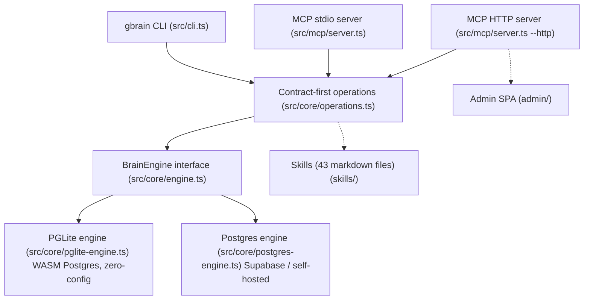

GBrain's architecture is built on a few load-bearing design decisions: a **contract-first operations layer** that generates both CLI and MCP surfaces from a single source, a **dual-engine storage abstraction** that swaps between embedded PGLite and hosted Postgres, and a **fail-closed trust boundary** between local CLI callers and remote MCP clients.

## High-level architecture

The [ingest pipeline](/openwiki/workflows/ingest-pipeline.md) feeds data into both engines through the same `BrainEngine` interface, the [search and retrieval](/openwiki/workflows/search-retrieval.md) stack queries it, and the [dream cycle](/openwiki/workflows/dream-cycle.md) orchestrates overnight maintenance across both engine types.

## Two engines, one contract

GBrain ships two storage backends behind a single `BrainEngine` interface ([`src/core/engine.ts`](/src/core/engine.ts), ~105k lines of interface + types). The factory at [`src/core/engine-factory.ts`](/src/core/engine-factory.ts) dynamically imports the configured engine.

| Engine | File | When to use |
|--------|------|-------------|
| **PGLite** | [`src/core/pglite-engine.ts`](/src/core/pglite-engine.ts) (~279k) | Personal brains up to ~50K pages. Embedded Postgres 17.5 via WASM. Zero config, no Docker, 2-second init. |
| **Postgres** | [`src/core/postgres-engine.ts`](/src/core/postgres-engine.ts) (~306k) | Shared / large / multi-machine deployments. pgvector + Supabase or self-hosted. Pool-based connection management. |

### Engine parity invariant

Both engines implement every method in the `BrainEngine` interface. A new method or SQL shape must land in **both** engines simultaneously, verified by [`test/e2e/engine-parity.test.ts`](/test/e2e/engine-parity.test.ts). Bootstrap probes in both engines detect forward-referenced columns/indexes from schema migrations that have not run yet — the probe set adds missing columns before the schema SQL replays, closing an upgrade-wedge bug class.

Key parity concerns:
- **JSONB encoding**: `JSON.stringify()` into `::jsonb` double-encodes in Postgres.js but not in PGLite. The codebase uses `executeRawJsonb` and `sql.json()` instead. Guarded by `scripts/check-jsonb-pattern.sh`.
- **Batch operations**: Both engines use `jsonb_to_recordset` for batch inserts (links, timeline entries, takes) to avoid the 65535-parameter limit.
- **Search SQL**: Both engines share `src/core/search/sql-ranking.ts` for source-aware ranking and hard-exclude visibility clauses.

## Contract-first operations

[`src/core/operations.ts`](/src/core/operations.ts) (~284k) defines ~113 shared operations as the single source of truth. Each operation carries:

- **`schema`** — JSON Schema for input validation
- **`scope`** — `'read'` | `'write'` | `'admin'`
- **`localOnly`** — when `true`, the operation is refused over HTTP (e.g., `sync_brain`, `file_upload`, `file_list`)
- **`handler`** — async function receiving `(input, engine, ctx)`
- **`cliHints`** — CLI-specific aliases and argument mapping

Both the CLI ([`src/cli.ts`](/src/cli.ts)) and MCP server ([`src/mcp/server.ts`](/src/mcp/server.ts)) are generated from this single contract. The CLI parses argv, maps to operation, validates schema, and calls handler. The MCP server exposes each operation as an MCP tool over stdio or HTTP.

### Trust boundary

The `OperationContext.remote` field is the load-bearing trust discriminator:

- **Local CLI** sets `remote: false` — full filesystem access, shell jobs, admin operations.
- **MCP server** sets `remote: true` — confined to the brain database, no filesystem escape.

Four trust-boundary call sites use **fail-closed** semantics (`ctx.remote === false` for trusted-only, `ctx.remote !== false` for untrust-unless-explicit-false):

1. `put_page` — subagent write fence via `enforceSubagentSlugFence`
2. `file_upload` — tightens filesystem confinement
3. `submit_job` — protected names (`shell`, `synthesize`, etc.) refused for remote
4. `auto-link` — skipped when `remote=true && !trustedWorkspace`

This closes the class of bugs where an HTTP MCP read+write OAuth token could submit `shell` jobs.

### Source isolation

`sourceScopeOpts(ctx)` encodes the read precedence ladder: federated array (`ctx.auth.allowedSources`) > scalar (`ctx.sourceId`) > nothing. Every read-side op handler routes through it so a source-bound OAuth client cannot see neighboring sources via `search`, `query`, `list_pages`, `get_page`, or any other read path.

## MCP server

The MCP server at [`src/mcp/server.ts`](/src/mcp/server.ts) exposes two transport modes:

- **stdio** (`@modelcontextprotocol/sdk` `StdioServerTransport`) — for Claude Code, Cursor, Windsurf. All callers marked `remote=true`.
- **HTTP** (Express) — for Claude Desktop, Cowork, Perplexity, ChatGPT. Adds OAuth 2.1 with DCR-style client registration, scope-gated access (`read` / `write` / `admin`), bearer token auth, CORS whitelist, and dual-bucket rate limiting.

Both transports share [`src/mcp/dispatch.ts`](/src/mcp/dispatch.ts) for tool call dispatch.

## Skill system

GBrain ships 43 curated skills as markdown files in [`skills/`](/skills/). Skills are tool-agnostic (work with both CLI and plugin contexts) and cover signal capture, ingestion, enrichment, querying, brain ops, citation fixing, daily task management, cron scheduling, reports, voice, and migrations. Routing lives in [`skills/RESOLVER.md`](/skills/RESOLVER.md).

Skills follow a two-layer pattern: thin router in `RESOLVER.md`, fat detail on demand — the same pattern used by `CLAUDE.md` / `AGENTS.md` with their reference map.

## Configuration

Configuration resolves through multiple tiers ([`src/core/config.ts`](/src/core/config.ts), ~52k):

- Per-call flags → environment variables → per-source DB keys → brain-wide DB keys → `gbrain.yml` → `~/.gbrain/config.json` → defaults

The brain repo root `gbrain.yml` controls storage tiering (`db_tracked` / `db_only` paths), schema pack selection, and other brain-wide settings.

## Migrations

Schema DDL lives in the `MIGRATIONS` array in [`src/core/migrate.ts`](/src/core/migrate.ts) (~294k). Key invariants:

- `CREATE INDEX CONCURRENTLY` needs `transaction: false` and pre-drop of invalid remnants on Postgres; plain `CREATE INDEX` on PGLite via `sqlFor.pglite`
- Version numbering is sequential; the fork's custom migrations must not collide with upstream version numbers (see [CUSTOM.md](/CUSTOM.md) merge rules)
- Forward-reference probes run BEFORE schema replay to handle columns/indexes added by unapplied migrations

## Design decisions

### Atomic write-through

[`src/core/write-through.ts`](/src/core/write-through.ts) implements `writePageThrough` — the shared disk write path for `put_page`, `brainstorm`, and `lsd --save`. Uses **temp-sibling + rename** so a crash or concurrent `gbrain sync` can never read a half-written `.md` file.

### CLI exit discipline

[`src/core/cli-force-exit.ts`](/src/core/cli-force-exit.ts) is the single owner of one-shot CLI exit and teardown. It drains background-work sinks (facts, last-retrieved, search cache, eval captures, volunteer events) in explicit priority order, computes a deadline from sink count rather than a fixed value, and uses a gbrain-owned exit verdict channel because PGLite's Emscripten runtime scribbles its own status into `process.exitCode`.

### Background work sinks

Five sinks drain at teardown ([`src/core/background-work.ts`](/src/core/background-work.ts)):
1. Facts queue (order 0 — aborts hung Haiku via internalAbort)
2. Last-retrieved timestamps (order 1)
3. Search cache writes (order 2)
4. Eval captures (order 3)
5. Volunteer events (order 4)

Drains in explicit `(order, name)` order. One sink's failure never blocks the others or the disconnect.

## Related pages

- [Ingest Pipeline](/openwiki/workflows/ingest-pipeline.md) — how data enters the brain through the engine layer
- [Search and Retrieval](/openwiki/workflows/search-retrieval.md) — the retrieval stack built on the engine
- [Dream Cycle](/openwiki/workflows/dream-cycle.md) — autonomous maintenance that uses the engine
- [Testing and Operations](/openwiki/operations/testing.md) — how the architecture is verified
