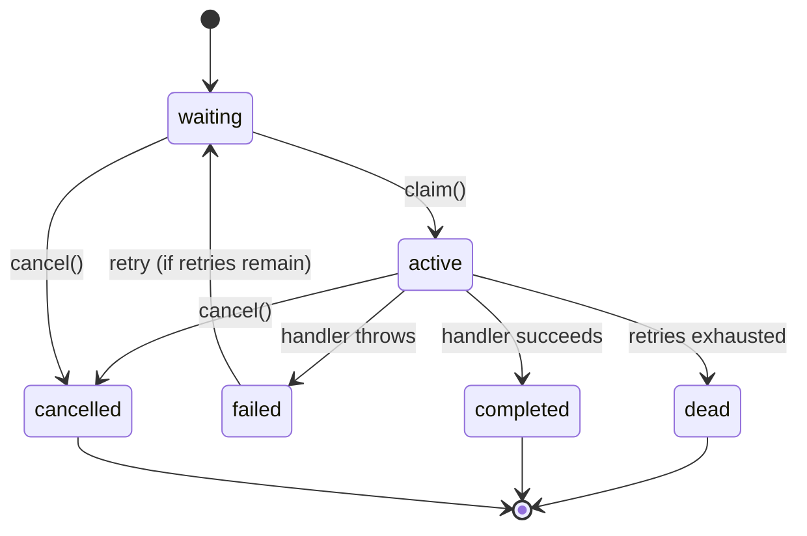

The dream cycle is what turns GBrain from a searchable knowledge base into an autonomous brain. It runs overnight (or continuously in autopilot mode), processing ingested content through a pipeline of enrichment phases. The [ingest pipeline](/openwiki/workflows/ingest-pipeline.md) provides the raw material; the [search and retrieval](/openwiki/workflows/search-retrieval.md) pipeline benefits from the enriched signals.

## The cycle pipeline

The dream cycle is defined in [`src/core/cycle.ts`](/src/core/cycle.ts) and called from three entry points:

- `gbrain dream` — one-shot CLI
- `gbrain autopilot` — daemon, scheduled on an interval
- Minions `autopilot-cycle` handler — durable queue with retry and observability

All three converge on `runCycle()`, so there is one source of truth for what "overnight maintenance" means.

### Phase descriptions

| Phase | Scope | What it does |
|-------|-------|-------------|
| **lint --fix** | Filesystem | Fixes markdown formatting issues in `.md` files. No DB access. |
| **backlinks --fix** | Filesystem | Updates wikilink backlinks in markdown. No DB access. |
| **sync** | Source | Picks up filesystem changes from phases 1+2, syncs to DB. Requires lock. |
| **synthesize** | Source | Converts transcripts into pages via LLM synthesis. |
| **extract** | Source | Extracts links and timeline entries from newly imported pages. |
| **extract_facts** | Source | Reconciles the facts fence — extracts structured claims via Haiku LLM. |
| **extract_atoms** | Source | Pack-gated: extracts atomic observations from transcripts/articles. |
| **resolve_symbol_edges** | Source | Resolves code symbol edges (code graph). |
| **patterns** | Source | Cross-session theme detection. Must run after extract so graph state is fresh. |
| **synthesize_concepts** | Global | Pack-gated: aggregates atoms into concept pages via Sonnet. |
| **recompute_emotional_weight** | Source | Updates emotional/salience weights for pages. |
| **consolidate** | Source | Clusters facts into take proposals. |
| **propose_takes** | Source | LLM scans markdown prose, proposes gradeable claims to a review queue. |
| **grade_takes** | Source | Walks unresolved takes, retrieves evidence, asks a judge model to verdict them. Auto-resolve OFF by default. |
| **calibration_profile** | Source | Aggregates resolved takes into narrative pattern statements and active bias tags. Voice-gated. |
| **conversation_facts_backfill** | Source | Opt-in: bulk fact extraction for long-form conversation pages. |
| **enrich_thin** | Source | Opt-in: develops stub pages via brain-internal grounded synthesis. |
| **skillopt** | Source | Opt-in: self-evolving skills. Walks skills with stale benchmarks. Cost-capped per-skill and per-brain. |
| **embed --stale** | Source | Re-embeds pages with stale vector embeddings. Requires lock. |
| **orphans** | Source | Read-only report of orphaned pages with no inbound links. |
| **schema-suggest** | Global | Passive schema pack suggestions. |
| **purge** | Global | Hard-deletes pages past the 72-hour soft-delete recovery window. |

### Coordination

- **Postgres**: A row in `gbrain_cycle_locks` with a 30-minute TTL, refreshed between phases. Works through PgBouncer transaction pooling.
- **PGLite**: A file lock at `~/.gbrain/cycle.lock` with the same 30-minute TTL semantics.
- **Lock-skip**: Filesystem-only or read-only phases (lint, backlinks, orphans) skip lock acquisition. Only DB-write phases (sync, extract, embed) trigger it.

## Minions job queue

The Minions system ([`src/core/minions/`](/src/core/minions/)) is a BullMQ-shaped, Postgres-native job queue that provides durable background execution:

| Component | File | Purpose |
|-----------|------|---------|
| **Queue** | [`src/core/minions/queue.ts`](/src/core/minions/queue.ts) | Job CRUD, state machine, dependency graph, callbacks |
| **Supervisor** | [`src/core/minions/supervisor.ts`](/src/core/minions/supervisor.ts) | Worker lifecycle, lock-renewal heartbeat, stall detection, cascade termination |
| **Worker** | [`src/core/minions/worker.ts`](/src/core/minions/worker.ts) | Shell worker (subprocess) and Subagent worker (LLM tool loops with two-phase persistence) |

### Job types

- **Shell jobs** — runs a shell command, captures output, with audit trail
- **Subagent jobs** — LLM tool loops that survive crashes via two-phase `pending` to `done` persistence
- **Child jobs** — cascading timeouts, parent completion dependencies
- **Rate leases** — token-bucket rate limiting for outbound providers
- **Attachments** — S3/Supabase storage for job artifacts

### Job state machine

### Protected job names

Remote MCP callers are refused for protected job names: `shell`, `synthesize`, `patterns`, `consolidate`. This closes the HTTP MCP shell-job RCE class where a read+write OAuth token could submit `shell` jobs.

## The overnight compound effect

The dream cycle's value compounds over time:

1. **Night 1**: Facts are extracted from pages, links are built, stale vectors are re-embedded
2. **Night N**: Cross-session patterns emerge, takes are proposed and graded, contradictions are detected
3. **Night N+1**: `gbrain think` returns richer answers because: salience scores are calibrated, contradictions are flagged, gap analysis is informed by what the brain does and does not know

This is why the README says "I wake up smarter than when I went to bed."

## Related pages

- [Architecture Overview](/openwiki/architecture/overview.md) — the engine layer the dream cycle uses
- [Ingest Pipeline](/openwiki/workflows/ingest-pipeline.md) — how data enters the brain that the dream cycle processes
- [Search and Retrieval](/openwiki/workflows/search-retrieval.md) — how enrichment signals improve search quality
- [Testing and Operations](/openwiki/operations/testing.md) — how to test and operate the dream cycle
