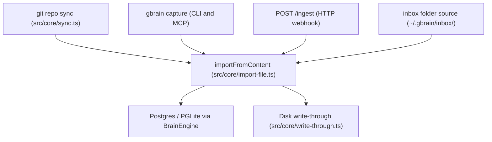
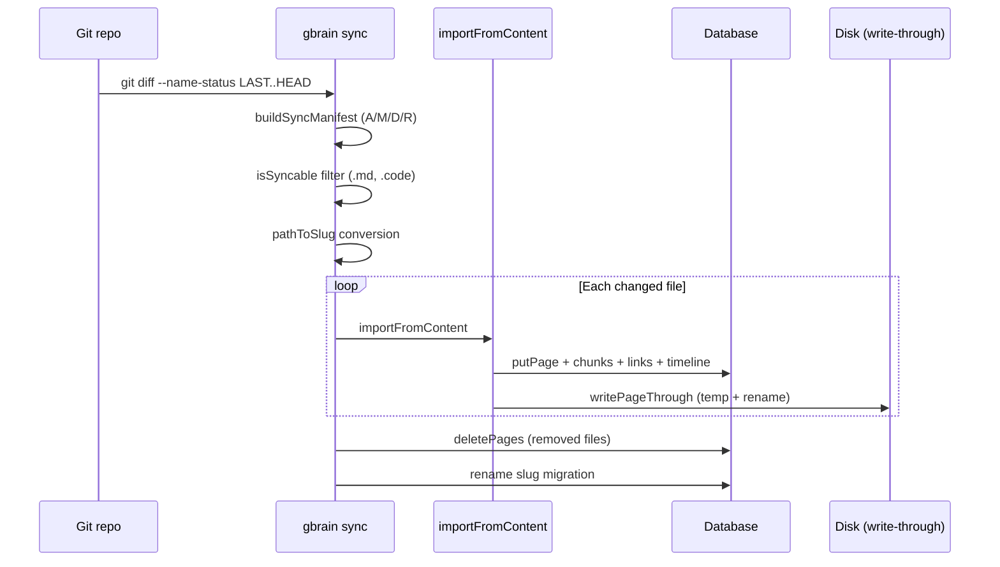

The [architecture](/openwiki/architecture/overview.md) provides the foundation, but the ingest pipeline is what makes the brain. GBrain has multiple paths for getting data in — git-based file sync, direct `capture` commands, webhook ingestion, and folder-based inbox monitoring. All paths converge on a single unified import pipeline.

## Data entry paths



All paths flow through `importFromContent` in [`src/core/import-file.ts`](/src/core/import-file.ts), the unified write path shared by `put_page`, file sync, code import, and every other write surface. The [dream cycle](/openwiki/workflows/dream-cycle.md) later enriches this content.

## The import pipeline

```
Content -> Size guard -> parseMarkdown -> Trust-boundary stripping -> Guardrails hooks
-> Content-Sanity gate -> Hash compute -> Chunk -> Embed -> Transactional DB write + Disk write-through
```

### Stage details

| Stage | Source | What it does |
|-------|--------|-------------|
| **Size guard** | `import-file.ts` | UTF-8 byte count over `MAX_FILE_SIZE` triggers reject. Protects remote callers from accidentally consuming embedding budget. |
| **parseMarkdown** | [`src/core/markdown.ts`](/src/core/markdown.ts) | gray-matter parses YAML frontmatter and body. Strips frontmatter tags from stored `pages.frontmatter` (tags live in the `tags` table). |
| **Frontmatter inference** | [`src/core/frontmatter-inference.ts`](/src/core/frontmatter-inference.ts) | When a file has no frontmatter: infers `type` from directory structure (e.g., `people/` to `person`), `date` from filename, `title` from the first `#` heading. Deterministic, zero LLM. |
| **Trust boundary** | `import-file.ts` | When `ctx.remote !== false`: strips `quarantine`, `content_flag`, `embed_skip` (gate-owned markers, fail-closed). |
| **Guardrails** | [`src/core/guardrails.ts`](/src/core/guardrails.ts) | Vendor-neutral observe-only hooks. OSS defaults to zero registered guardrails (fail-open). |
| **Content-Sanity gate** | [`src/core/content-sanity.ts`](/src/core/content-sanity.ts) | Junk-pattern detection and operator-literal detection. Three tiers: kill-switch bypass / hard-block throw / soft-block `embed_skip`. |
| **Hash** | `computeContentHash` | Deterministic content hash for dedup at the sync layer. |
| **Chunk** | [`src/core/chunkers/`](/src/core/chunkers/) | See chunking below. |
| **Embed** | [`src/core/embedding.ts`](/src/core/embedding.ts) | 1536-dimension vectors via 16+ provider recipes (OpenAI, Voyage, Ollama, etc.). |
| **Write** | `put_page` via engine | Transactional: page version to page row to tags to chunks to links to timeline, all within an advisory lock. |

### Tag reconciliation

Tag reconciliation during import is **add-only**: `addTag` is idempotent (`ON CONFLICT DO NOTHING`). Removing a tag from frontmatter does NOT remove it from the database — this is intentional, as enrichment-added tags (auto-tag, dream synthesize, signal-detector) would be silently wiped on re-import otherwise.

## Chunking

GBrain uses a **3-tier chunking strategy** in [`src/core/chunkers/`](/src/core/chunkers/):

| Tier | Strategy | Use case |
|------|----------|----------|
| **Recursive** | Separator-based splitting (headings, paragraphs, sentences) | Default for markdown pages |
| **Semantic (code)** | Tree-sitter AST-based chunking for 30+ languages | Code files imported via sync |
| **LLM-guided** | LLM-suggested chunk boundaries | High-value pages, opt-in |

Code chunking uses 37 tree-sitter grammar WASMs (embedded in [`src/assets/wasm/`](/src/assets/wasm/)) for language-aware splitting. SQL gets special treatment via `tree-sitter-sql` with DDL symbol extraction (table, view, function, index names). Fenced code blocks within markdown are extracted as separate chunks with `chunk_source: 'fenced_code'`.

The embedding signature system detects stale embeddings: when chunker version bumps or embedding model changes, `pages.embedding_signature` is compared against the current signature, and mismatched pages are re-embedded by the dream cycle.

## Sync

[`src/core/sync.ts`](/src/core/sync.ts) keeps the brain's database in sync with its git-backed markdown repository:



### Sync invariants

- **System of record**: Git is the source of truth. The database mirrors it.
- **Incremental**: Only files changed since the last sync bookmark are processed.
- **Delete safety**: Soft-deletes (`deleted_at`) with a 72-hour recovery window before hard purge in the dream cycle.
- **Sync failure ledger**: [`src/core/sync-failure-ledger.ts`](/src/core/sync-failure-ledger.ts) tracks per-file failures with a 3-state machine (`open` to `acknowledged` / `auto_skipped`). After 3 consecutive failures (configurable), a file is auto-skipped so it does not wedge the sync bookmark.
- **Storage tiering**: `db_tracked` paths are version-controlled in git; `db_only` paths exist only in the database and are `.gitignore`'d. `gbrain export --restore-only` can repopulate missing `db_only` files from the DB.

## Write-through

Every page write uses the shared `writePageThrough` helper ([`src/core/write-through.ts`](/src/core/write-through.ts)):

1. Write to a **temp sibling** file (same directory, atomic within the filesystem)
2. **Rename** atomically to the target path

This guarantees a crash or concurrent `gbrain sync` never reads a half-written `.md` file.

The [search and retrieval](/openwiki/workflows/search-retrieval.md) pipeline consumes the indexed content produced by this pipeline.

## Related pages

- [Architecture Overview](/openwiki/architecture/overview.md) — the engine layer this pipeline is built on
- [Search and Retrieval](/openwiki/workflows/search-retrieval.md) — how indexed content is consumed
- [Dream Cycle](/openwiki/workflows/dream-cycle.md) — how the dream cycle processes ingested data
