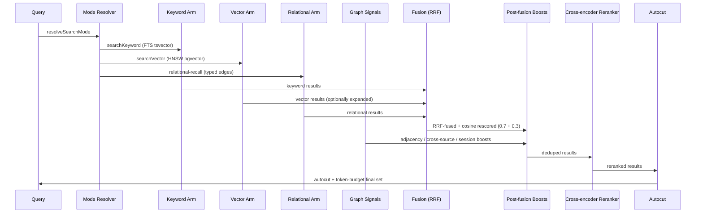
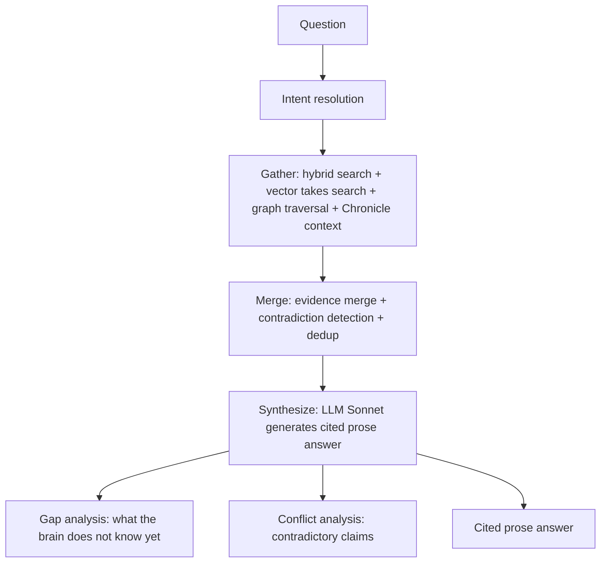

GBrain's retrieval stack is the technical core of the project. It combines four recall arms (vector, keyword, relational, graph signals) into a single fused ranking, then applies post-fusion boosts, cross-encoder reranking, and adaptive cutoff to produce the final result set. The [ingest pipeline](/openwiki/workflows/ingest-pipeline.md) produces the indexed content this pipeline queries.

## The hybrid search pipeline

The full pipeline in [`src/core/search/hybrid.ts`](/src/core/search/hybrid.ts) has 14 stages:



### Recall arms

| Arm | Source | Method |
|-----|--------|--------|
| **Keyword** | `searchKeyword` | PostgreSQL `tsvector` / `tsquery` full-text search with configurable language stemming. Source-aware ranking via `DEFAULT_SOURCE_BOOSTS` (curated content like `originals/`, `concepts/` outranks bulk content like `chat/`). |
| **Vector** | `searchVector` | pgvector HNSW similarity search. Uses a **per-page max-pool CTE** (`buildBestPerPagePoolCte`) so a page surfaces on its strongest chunk, not losing to a neighbor on one weak chunk. Multi-query expansion via Haiku (up to 3 variants in `tokenmax` mode). |
| **Relational** | `relational-recall` | Typed edge traversal (`works_at`, `invested_in`, `founded`, etc.) for structured queries like "who works at Acme?" — answers vector search alone cannot reach. |
| **Graph signals** | `graph-signals.ts` | Post-fusion multiplicative boosts: adjacency (+5% when linked from 2+ other top results), cross-source (+10% when corroborated across team brains), session demote (-5% for chatty sessions). Floor-ratio gate prevents weak pages from being boosted past strong ones. |

### RRF fusion

Reciprocal Rank Fusion with `k=60`:
```
RRF score = sum of (1 / (60 + rank_in_list))
```
Results are then cosine re-scored: `0.7 * rrf + 0.3 * cosine`.

### Search modes

Three named modes bundle cost/quality knobs into a single config key ([`src/core/search/mode.ts`](/src/core/search/mode.ts)):

| Knob | conservative | **balanced** (default) | tokenmax |
|------|-------------|------------------------|----------|
| tokenBudget | 4,000 | 12,000 | off |
| expansion (LLM) | false | false | **true** |
| relationalRetrieval | false | true | true |
| reranker | false | true | true |
| graph_signals | false | true | true |
| searchLimit | 10 | 25 | 50 |

### Post-fusion boosts

Applied after RRF fusion, in order ([`src/core/search/hybrid.ts`](/src/core/search/hybrid.ts)):

1. **Backlink boost** — pages with more inbound links score higher
2. **Salience boost** — time-weighted emotional/importance signals
3. **Recency boost** — newer pages score higher
4. **Exact match boost** — title-phrase match (`isTitlePhraseMatch`) boosts the matching page
5. **Graph adjacency boost** — see graph signals above
6. **Cross-source boost** — corroboration from other team brains
7. **Session demote** — demotes redundant pages from the same chat session
8. **Compiled truth boost** — 2.0x multiplier for `compiled_truth` chunks

Each boost stamps its own field on `SearchResult` so `gbrain search --explain` displays per-stage attribution.

### Reranker

The cross-encoder reranker ([`src/core/search/rerank.ts`](/src/core/search/rerank.ts)) re-scores the top candidates using a neural model. Default in `balanced` and `tokenmax` modes: **ZeroEntropy `zerank-2`** hosted. A local `llama-server-reranker` recipe (Qwen3-Reranker) is also available for fully-local deployments. Fail-open: if the reranker fails, results are returned in their pre-rerank order.

### Autocut

[`src/core/search/autocut.ts`](/src/core/search/autocut.ts) detects the score cliff where results drop from strong to weak, then trims everything below it. Combined with the token budget enforcer, this keeps results tight and relevant without a hard limit.

## Retrieval Reflex

The [architecture overview](/openwiki/architecture/overview.md) describes the trust boundary; the **Retrieval Reflex** ([`src/core/context-engine.ts`](/src/core/context-engine.ts)) is the layer that proactively injects relevant brain context into every agent turn — before the agent even asks:

1. **Extract candidates** — zero-LLM extraction of capitalized entity runs and `@handles` from the current and recent turns
2. **Resolve to pointers** — alias arm (`resolveAliases`) plus exact title/slug-suffix arm, with per-arm confidence scoring
3. **Inject pointers** — the resolved pointers are appended to the agent's context as a "Live Context" block

The reflex is configurable via `retrieval_reflex` (default ON), `retrieval_reflex_max_pointers`, and `retrieval_reflex_window_turns`. PGLite brains use a Unix-socket IPC protocol ([`src/core/context/resolve-ipc.ts`](/src/core/context/resolve-ipc.ts)) so the reflex can resolve through the single connection `gbrain serve` holds (a second opener would hit the exclusive lock).

The `gbrain watch` command ([`src/commands/watch.ts`](/src/commands/watch.ts)) provides a push-transport variant: it reads agent turns from stdin and streams volunteer-context pointers to stdout per turn.

## The `think` command

`gbrain think` (and the `think` / `query` MCP ops) is the synthesis layer that separates GBrain from a pure search engine. Instead of returning a list of pages, it composes a **synthesized answer with citations and gap analysis**:



Key security properties:
- `--save`/`--take` are disabled for remote MCP callers (trust boundary)
- Calibration profile can optionally inject anti-bias rewriting rules
- Trajectory injection is sanitized via `INJECTION_PATTERNS`

The [dream cycle](/openwiki/workflows/dream-cycle.md) feeds back enrichment signals (salience, recency scores, contradiction detection) that improve search quality over time.

## Source-aware ranking

Both search arms apply source-tier boosting at the SQL layer:

| Tier | Prefixes | Boost |
|------|----------|-------|
| Curated | `originals/`, `concepts/`, `writing/` | 1.3 to 1.5x |
| Entity | `people/`, `companies/`, `deals/` | 1.2x |
| Neutral | (default) | 1.0x |
| Bulk | `daily/`, `media/x/` | 0.7 to 0.8x |
| Chat | `<fork>/chat/` | 0.5x |
| Archive | `archive/` | 0.5x (demoted, not excluded) |

Hard-exclude prefixes (`test/`, `attachments/`, `.raw/`) filter at retrieval time, not post-rank. Both gates are configurable via `GBRAIN_SOURCE_BOOST` and `GBRAIN_SEARCH_EXCLUDE` env vars.

## Related pages

- [Architecture Overview](/openwiki/architecture/overview.md) — the engine layer this retrieval stack is built on
- [Ingest Pipeline](/openwiki/workflows/ingest-pipeline.md) — how indexed content is produced
- [Dream Cycle](/openwiki/workflows/dream-cycle.md) — how enrichment signals feed back into search quality
